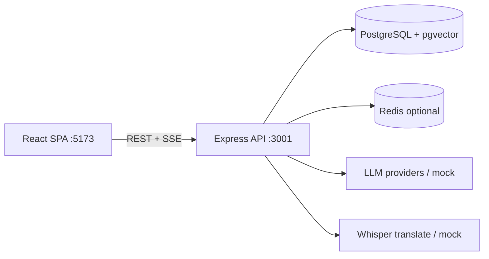

# MeetingMind AI

LLM-powered meeting intelligence: capture meetings, produce an **English transcript** (including Bengali / mixed speech via Whisper translations), and ask grounded questions in **meeting chat**.

**Primary product loop**

**Sign in → workspace → create meeting (Google Meet optional) → record or upload → Translate & Transcribe → read/download transcript → meeting chat**

Primary navigation: **Meetings** + **Settings**. Tasks, dashboard, insights, reports, knowledge, workspace chat, and search remain as **backend APIs** with frontend routes that soft-redirect to Meetings.

**Version:** v0.7.3 · **License:** Private

---

## Screenshots

| Placeholder           | Suggested capture                                           |
| --------------------- | ----------------------------------------------------------- |
| _Meeting list_        | `/workspaces/{id}/meetings`                                 |
| _Record & upload_     | Meeting detail → Record & upload (screen recorder + upload) |
| _Transcript_          | Transcript tab with download                                |
| _Meeting chat_        | Chat tab with grounded answer                               |
| _Settings / Calendar_ | Connect Google Calendar & Meet                              |

See [`docs/demo/portfolio-screenshot-guide.md`](./docs/demo/portfolio-screenshot-guide.md).

---

## Architecture



Canonical write-up: [`docs/system-architecture.md`](./docs/system-architecture.md).

---

## Features

### Live (primary UX)

- Email/password auth, Google Sign-In (+ mock), JWT + httpOnly refresh cookies
- Workspaces, invitations, members, Settings
- Meetings CRUD; Google Calendar connect; Meet link on create
- Screen/tab recorder with **mic + tab audio mix**; audio/video upload
- **Translate & Transcribe** (default Whisper **translate** → English)
- Transcript document view + `.txt` / `.md` download
- Meeting-scoped RAG chat (SSE) with citations / corpus fallback
- In-app notifications + preferences
- Background AI pipeline (summary, decisions, risks, action items) — server-side

### Soft-hidden (APIs + UI code; not in nav)

Tasks Kanban, dashboard, insights, semantic search, workspace chat, weekly reports, knowledge base — routes redirect to Meetings.

### Partial / stubs

Platform imports without client transcript → 501; Deepgram stub; live meeting bots stub; Voyage embeddings not configured; malware scan noop; email via Resend only when `EMAIL_API_KEY` set.

Inventory: [`docs/feature-inventory.md`](./docs/feature-inventory.md).

---

## Tech Stack

| Layer    | Technologies                                                                                   |
| -------- | ---------------------------------------------------------------------------------------------- |
| Frontend | React 19, TypeScript, Vite, React Router, TanStack Query, Axios, Tailwind, Shadcn UI, Zod, RHF |
| Backend  | Node.js, Express 5, TypeScript, Prisma, JWT, bcrypt                                            |
| AI       | OpenAI / Anthropic / Gemini / mock; LangGraph multi-agent optional                             |
| Speech   | OpenAI Whisper translations (default); mock provider                                           |
| RAG      | pgvector, chunking, hybrid vector + FTS, RRF                                                   |
| Jobs     | BullMQ + Redis (optional with `AI_USE_MOCK`)                                                   |
| DB       | PostgreSQL 16 + pgvector                                                                       |
| Ops      | Docker Compose, Pino, Husky, ESLint, Prettier                                                  |
| Tests    | Vitest (frontend), Jest + Supertest (backend)                                                  |

---

## Folder Structure

```
meetingmind-ai/
├── frontend/          # React SPA (Meetings + Settings nav)
├── backend/           # Express API, Prisma, agents, RAG, prompts/
├── docs/              # Architecture, API, inventory, audits
├── career/            # Portfolio notes (non-runtime)
├── docker-compose.yml # postgres, redis, backend, frontend
├── .env.example
├── package.json       # concurrently + husky (not npm workspaces)
└── README.md
```

Details: [`docs/project-structure.md`](./docs/project-structure.md).

---

## Installation

### Prerequisites

- Node.js 22+, npm 10+
- Docker & Docker Compose (recommended for Postgres/Redis)

### Setup

```bash
cp .env.example .env
# Set JWT_* secrets (≥ 32 chars). For local AI without keys: AI_USE_MOCK=true

npm install
cd frontend && npm install && cd ..
cd backend && npm install && cd ..

docker compose up postgres redis -d

cd backend
npx prisma generate
npx prisma migrate dev
cd ..

npm run dev
```

- Frontend: http://localhost:5173
- API: http://localhost:3001 · Health: http://localhost:3001/health

---

## Environment Variables

Full list: [`.env.example`](./.env.example). Important keys:

| Variable                                                  | Purpose                                            |
| --------------------------------------------------------- | -------------------------------------------------- |
| `DATABASE_URL`                                            | PostgreSQL                                         |
| `JWT_ACCESS_SECRET` / `JWT_REFRESH_SECRET`                | Auth (≥ 32 chars)                                  |
| `VITE_API_URL`                                            | Frontend API base (`http://localhost:3001/api/v1`) |
| `CORS_ORIGIN` / `FRONTEND_URL`                            | SPA origin                                         |
| `AI_USE_MOCK`                                             | Inline mock AI (no Redis/LLM required)             |
| `AI_PIPELINE_MODE`                                        | `monolithic` \| `multi-agent`                      |
| `TRANSCRIPTION_PROVIDER`                                  | `mock` \| `openai` \| `deepgram` (deepgram stub)   |
| `OPENAI_API_KEY` / `LLM_PRIMARY_PROVIDER`                 | Live LLM                                           |
| `REDIS_URL`                                               | BullMQ (optional with mock)                        |
| `GOOGLE_*` / `CALENDAR_USE_MOCK` / `GOOGLE_AUTH_USE_MOCK` | Sign-In + Calendar                                 |
| `EMAIL_API_KEY`                                           | Resend (optional)                                  |
| `OBSERVABILITY_API_KEY`                                   | Secure observability admin routes                  |

Frontend only needs `VITE_API_URL` (`frontend/.env.example`).

---

## Running Locally

| Command                       | Description         |
| ----------------------------- | ------------------- |
| `npm run dev`                 | Frontend + backend  |
| `npm run build`               | Production builds   |
| `npm run test`                | All tests           |
| `npm run lint`                | ESLint both apps    |
| `npm run eval:prompts`        | Prompt fixture eval |
| `npm run seed:portfolio-demo` | Seed demo meeting   |

Backend: `npm run worker` when using Redis for async jobs. Prisma: `npm run prisma:studio` / `prisma:migrate` under `backend/`.

---

## Docker

```bash
cp .env.example .env
docker compose up --build
```

| Service    | URL                   |
| ---------- | --------------------- |
| Frontend   | http://localhost:5173 |
| Backend    | http://localhost:3001 |
| PostgreSQL | localhost:5432        |
| Redis      | localhost:6379        |

---

## API Overview

Base: `/api/v1`. Full reference: [`docs/api-design.md`](./docs/api-design.md).

| Area                                                                         | Path                                | UI             |
| ---------------------------------------------------------------------------- | ----------------------------------- | -------------- |
| Auth                                                                         | `/auth/*`                           | Live           |
| Workspaces                                                                   | `/workspaces/*`                     | Live           |
| Meetings + audio + transcription                                             | `/workspaces/:id/meetings/*`        | Live           |
| Meeting chat                                                                 | `…/meetings/:id/chat`               | Live           |
| Calendar                                                                     | `/calendar/oauth/*`, `…/calendar/*` | Settings       |
| Tasks / dashboard / search / workspace chat / insights / reports / knowledge | under `/workspaces/:id/…`           | Soft-hidden    |
| Notifications                                                                | `/notifications/*`                  | Partial (bell) |
| Health / observability                                                       | `/health`, `/observability/*`       | —              |

---

## AI Features

- **Translate & Transcribe:** Whisper translations API by default (`translate_to_english`); optional `transcribe_original`
- **Meeting intelligence:** Summarizer, task extractor, decision, risk analyzer; optional knowledge + weekly report agents
- **Modes:** `AI_PIPELINE_MODE=monolithic` (default) or `multi-agent` (LangGraph)
- **Prompts:** `backend/prompts/`

See [`backend/README.md`](./backend/README.md), [`docs/agent-flow.md`](./docs/agent-flow.md), [`docs/llm-architecture.md`](./docs/llm-architecture.md).

---

## RAG

Chunk → embed → pgvector + FTS hybrid retrieval → context builder → citations. Meeting chat may fall back to the meeting corpus for summarize/overview when keyword/hybrid hits are empty.

Docs: [`docs/rag-architecture.md`](./docs/rag-architecture.md), [`docs/retrieval-flow.md`](./docs/retrieval-flow.md), [`docs/database-design.md`](./docs/database-design.md).

---

## Multi-Agent System

When `AI_PIPELINE_MODE=multi-agent`, LangGraph runs extraction agents in parallel and merges results. Chat agent streams via SSE. Tool calling exists but defaults to `CHAT_TOOLS_ENABLED=false`.

---

## Testing

```bash
npm run test                         # FE Vitest + BE Jest
cd backend && npm test -- --coverage
cd frontend && npm run test:coverage
npm run eval:prompts -- --mock
```

No Playwright E2E suite in-repo yet. No GitHub Actions workflows (Husky pre-commit only).

---

## Deployment

- **Current:** Docker Compose for local/dev
- **Images:** Multi-stage `backend/Dockerfile` and `frontend/Dockerfile` (nginx) for future production
- **Not in repo:** Cloud CI/CD, Vercel/Railway configs

Next steps typically: Redis + real LLM keys, ffmpeg extract, email keys, CI pipeline, production host.

---

## Future Improvements

1. Playwright E2E for capture → transcript → chat
2. Wire Resend for invitations / password reset in all envs
3. Production deploy + CI
4. Live Zoom/Meet/Teams provider APIs (replace import stubs)
5. Optionally re-surface Tasks / Search / Insights in the nav

---

## Documentation

| Doc                                                          | Purpose                        |
| ------------------------------------------------------------ | ------------------------------ |
| [docs/README.md](./docs/README.md)                           | Index                          |
| [docs/feature-inventory.md](./docs/feature-inventory.md)     | What exists vs partial/planned |
| [docs/system-architecture.md](./docs/system-architecture.md) | Architecture                   |
| [docs/api-design.md](./docs/api-design.md)                   | REST + SSE                     |
| [docs/database-design.md](./docs/database-design.md)         | Prisma schema summary          |
| [docs/transcription-flow.md](./docs/transcription-flow.md)   | Capture pipeline               |
| [docs/documentation-audit.md](./docs/documentation-audit.md) | Doc sync audit                 |

---

## Contributing

1. Branch from `main`
2. Keep `AI_USE_MOCK=true` for offline AI unless testing providers
3. Run `npm run lint` and `npm run test` before PR
4. Do not commit secrets (`.env`, OAuth client files marked not for git)
5. Update docs when behavior changes — implementation is the source of truth

---

## License

Private — All rights reserved.
