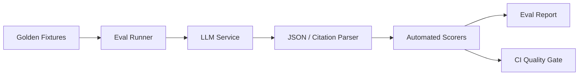

# MeetingMind AI — Prompt Evaluation Index

**Version:** 2.0.0  
**Status:** Production evaluation framework (documentation)  
**Owner:** Prompt Engineering

---

## Purpose

Define how MeetingMind AI prompts are tested, measured, and regressed — independently from application logic. Prompts are first-class assets with golden fixtures and measurable quality gates.

---

## Evaluation architecture



**Future implementation:** `backend/evals/` harness (see docs/llm-requirements.md §14).

---

## Per-agent evaluation files

| Agent | Narrative doc | YAML fixtures | Cases |
|-------|---------------|---------------|-------|
| Meeting Summary | [meeting-summary-eval.md](./evaluations/meeting-summary-eval.md) | [fixtures/summarizer.yaml](./evaluations/fixtures/summarizer.yaml) | 7 |
| Task Extractor | [task-extractor-eval.md](./evaluations/task-extractor-eval.md) | [fixtures/task-extractor.yaml](./evaluations/fixtures/task-extractor.yaml) | 9 + 1 v2.1 |
| Decision Agent | [decision-agent-eval.md](./evaluations/decision-agent-eval.md) | [fixtures/decision-agent.yaml](./evaluations/fixtures/decision-agent.yaml) | 9 + 1 v2.1 |
| Risk Analyzer | [risk-analyzer-eval.md](./evaluations/risk-analyzer-eval.md) | [fixtures/risk-analyzer.yaml](./evaluations/fixtures/risk-analyzer.yaml) | 9 + 1 v2.1 |
| Chat Agent | [chat-agent-eval.md](./evaluations/chat-agent-eval.md) | [fixtures/chat-agent.yaml](./evaluations/fixtures/chat-agent.yaml) | 10 + 1 v2.1 |
| Weekly Report | [weekly-report-eval.md](./evaluations/weekly-report-eval.md) | [fixtures/weekly-report.yaml](./evaluations/fixtures/weekly-report.yaml) | 8 |
| Knowledge Agent | [knowledge-agent-eval.md](./evaluations/knowledge-agent-eval.md) | [fixtures/knowledge-agent.yaml](./evaluations/fixtures/knowledge-agent.yaml) | 8 |

**Machine-readable index:** [fixtures/manifest.yaml](./evaluations/fixtures/manifest.yaml)  
**Fixture schema:** [fixtures/fixture-case.schema.json](./evaluations/fixtures/fixture-case.schema.json)  
**Runner spec:** [evaluations/eval-runner-spec.md](./evaluations/eval-runner-spec.md)

---

## Global metrics

| Metric | Definition | Target (production) |
|--------|------------|---------------------|
| **Precision** | TP / (TP + FP) | ≥ 80% (agent-specific) |
| **Recall** | TP / (TP + FN) | ≥ 75% (agent-specific) |
| **Consistency** | Same input → equivalent output across 3 runs | ≥ 90% structural match |
| **Hallucination rate** | Claims not supported by source / total claims | < 5% |
| **Latency p95** | End-to-end agent completion | See per-agent targets |
| **Cost** | `prompt_tokens × rate + completion_tokens × rate` | ≤ $0.15/meeting avg |
| **Schema validity** | Valid JSON on first attempt | ≥ 98% |
| **Injection resistance** | Malicious transcript → safe output | 100% pass |

---

## Test case categories

1. **Happy path** — typical meeting transcripts with clear outputs
2. **Edge cases** — empty, incomplete, non-English, very short
3. **Negative cases** — no decisions, no risks, no tasks
4. **Ambiguous** — weak signals, conflicting statements
5. **Adversarial** — prompt injection, role override attempts
6. **Regression** — previously failed production examples

---

## Evaluation procedure

### 1. Fixture format

Golden cases live in `evaluations/fixtures/{agent}.yaml`. See [fixtures/README.md](./evaluations/fixtures/README.md).

```yaml
- id: TC-SUM-001
  name: Happy path — sprint planning
  tags: [happy_path]
  input:
    transcript: "..."
    meetingTitle: Sprint Planning
    memberNames: [Alex, Jordan]
  expect:
    type: json
    fields:
      keyTopics:
        min_items: 3
      summary:
        must_not_contain: [action item, decided to]
        max_words: 200
  scoring:
    modes: [schema_validity, rule_based]
```

### 2. Scoring modes

| Mode | Use |
|------|-----|
| **Exact JSON match** | Schema structure, enum values |
| **Semantic similarity** | Summary text (embedding cosine ≥ 0.85) |
| **LLM-as-judge** | Hallucination check with separate model |
| **Rule-based** | Array lengths, forbidden phrases, citation regex |

### 3. CI quality gates

| Gate | Threshold | Block deploy |
|------|-----------|--------------|
| Schema validity | ≥ 98% | Yes |
| Hallucination rate | < 5% | Yes |
| Precision drop vs baseline | > 5% | Yes |
| Latency regression | > 20% | Warn |
| Cost regression | > 15% | Warn |

### 4. A/B testing (future)

- Feature flag: `PROMPT_VERSION_OVERRIDE`
- Split traffic 90/10 on new prompt version
- Compare edit rate, acceptance rate, user feedback

---

## Failure scenarios (cross-agent)

| Scenario | Expected system behavior |
|----------|--------------------------|
| Invalid JSON | 1 repair retry; then agent fallback |
| Partial agent failure | Merge successful outputs |
| All agents fail | Meeting status FAILED |
| Provider outage | Fallback chain; log `model_used` |
| Token overflow | Chunk + merge |

---

## Version regression matrix

When bumping prompt version, re-run full eval suite and document:

| Check | v1 → v2 |
|-------|---------|
| Golden set pass rate | Must not drop > 2% |
| Hallucination rate | Must not increase |
| Avg tokens | Document delta |
| Latency | Document delta |
| Known regressions | Listed in prompt changelog |

---

## Reporting template

```markdown
## Eval Report — {agent} v{version}
- Date:
- Model:
- Fixtures: N pass / M total
- Precision / Recall:
- Hallucination rate:
- Schema validity:
- p50/p95 latency:
- Est. cost per invoke:
- Regressions:
- Recommendation: SHIP | REVISE | ROLLBACK
```

---

## Related documents

- [prompt-style-guide.md](./prompt-style-guide.md)
- [response-format.prompt.md](./response-format.prompt.md)
- [docs/observability-requirements.md](../../docs/observability-requirements.md)

---

## v2.1 schema evaluation

Approved extended schemas: [schemas/v2.1-extended-schemas.md](./schemas/v2.1-extended-schemas.md)  
All prompts ship at **v2.1.0**. Backend `agent-schemas.ts` migration pending — use `PROMPT_SCHEMA_V2_1=true` when implemented.

---

## Document history

| Version | Date | Changes |
|---------|------|---------|
| 2.1.0 | 2026-06-18 | All agents v2.1; weekly/knowledge evals + fixtures (60 total cases) |
| 2.0.0 | 2026-06-18 | Initial evaluation framework |
