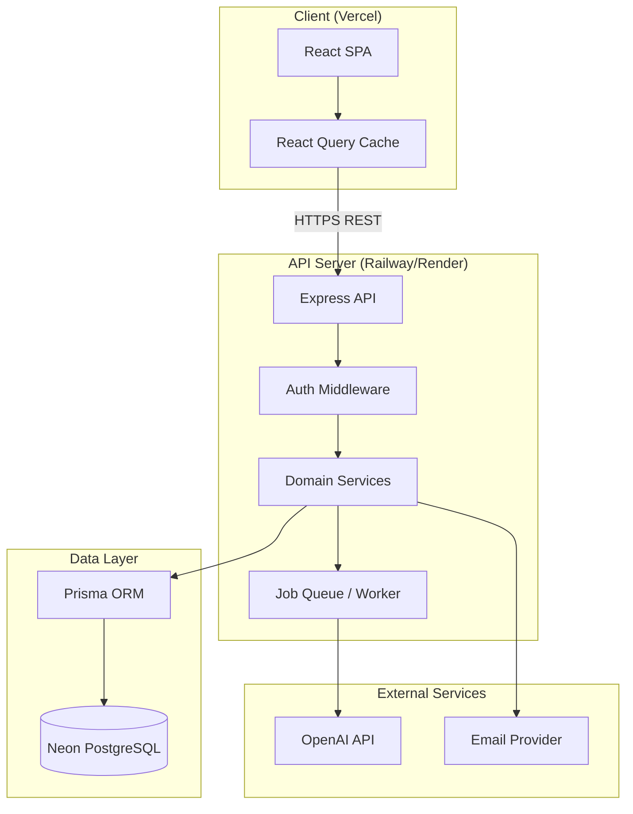

# AI Meeting Notes & Task Manager
## Software Requirements Specification (SRS)

**Version:** 1.0  
**Status:** Draft for Engineering Review  
**Stack:** React · TypeScript · Tailwind · Shadcn UI · React Query · React Router · Node.js · Express · Prisma · PostgreSQL · OpenAI · Docker · Vercel · Railway/Render · Neon

---

# 1. Product Vision

## Problem Statement

Teams spend significant time in meetings but lose context afterward. Notes are inconsistent, action items are buried in transcripts, ownership is unclear, and follow-through is poor. Existing tools either handle meetings (transcription/summarization) or tasks (Kanban/project management) — rarely both in a unified, workspace-aware workflow.

## Target Users

| Segment | Description |
|---------|-------------|
| **Small–mid teams (5–50)** | Engineering, product, and operations teams with recurring standups and planning meetings |
| **Team leads & PMs** | Need accountability, visibility, and decision traceability |
| **Individual contributors** | Need clarity on what was decided and what they own |
| **Org admins** | Need workspace governance, billing, and security controls |

## Business Value

- **Time savings:** Reduce post-meeting admin from 15–30 min to under 2 min per meeting
- **Accountability:** Auto-extracted action items with assignees and due dates
- **Institutional memory:** Searchable summaries, decisions, and meeting history
- **Velocity:** Fewer dropped tasks and fewer "what did we decide?" follow-ups

## Core Objectives

1. Ingest meeting transcripts and produce structured AI outputs (summary, decisions, risks, action items)
2. Convert action items into trackable tasks with assignment and status workflow
3. Provide workspace-scoped collaboration with role-based access
4. Deliver a fast, accessible UI with real-time-feeling updates via React Query
5. Ship an MVP in ~12–16 weeks with clear path to production SaaS

## Success Metrics

| Metric | Target (MVP + 90 days) |
|--------|--------------------------|
| Transcript → structured output success rate | ≥ 95% |
| Time to first summary | < 60 seconds (p95) |
| Task creation from AI suggestions acceptance rate | ≥ 70% |
| Weekly active workspaces | Growth baseline TBD |
| Task completion rate (assigned → done) | ≥ 60% within due date |
| User-reported NPS | ≥ 40 |
| API uptime | ≥ 99.5% |
| Support tickets per 100 meetings | < 5 |

---

# 2. User Personas

## Persona 1: Team Member — Alex (Software Engineer)

**Profile:** IC on a 8-person product squad; attends 4–6 meetings/week.

**Goals**
- Know exactly what was decided and what they own
- Spend minimal time writing or cleaning up notes
- Track personal action items in one place

**Pain Points**
- Forgets action items buried in Slack or calendar notes
- Disagrees on "what we agreed" weeks later
- Hates duplicate data entry across tools

**Main Workflows**
1. Upload/paste transcript after standup → review AI summary → accept suggested tasks
2. View Kanban board → move own tasks through statuses → add comments
3. Search past meetings for a technical decision

---

## Persona 2: Team Lead — Jordan (Engineering Manager)

**Profile:** Leads 2 squads; runs weekly syncs and retros.

**Goals**
- Ensure follow-through on commitments
- Surface risks and blockers early
- Maintain team alignment without micromanaging

**Pain Points**
- No single source of truth for decisions
- Chasing people for status updates
- Retro action items never get closed

**Main Workflows**
1. Create meeting record → upload transcript → review/edit AI output
2. Assign tasks to team members → monitor board and overdue items
3. Use dashboard to see team productivity and open action items

---

## Persona 3: Project Manager — Sam (Technical PM)

**Profile:** Cross-functional coordinator; owns roadmap and stakeholder comms.

**Goals**
- Document decisions with audit trail
- Track dependencies and risks across meetings
- Produce status updates quickly

**Pain Points**
- Manual synthesis of multiple meeting notes
- Stakeholders ask for proof of decisions
- Risk items get lost between meetings

**Main Workflows**
1. Bulk review AI-extracted decisions and risks → tag/link to projects
2. Search summaries across workspace for keyword (e.g., "launch date")
3. Export/share meeting summary with stakeholders

---

## Persona 4: Company Admin — Morgan (IT / Operations Admin)

**Profile:** Manages SaaS tools, users, and security for a 100-person company.

**Goals**
- Control who can access which workspaces
- Enforce security and compliance basics
- Onboard/offboard users cleanly

**Pain Points**
- Shadow IT and scattered meeting notes in personal drives
- No visibility into workspace membership
- Concerns about data sent to AI providers

**Main Workflows**
1. Create organization → invite workspace owners
2. Configure roles, deactivate users, audit membership
3. Review usage analytics and data retention policies

---

# 3. User Stories

## Authentication

| ID | Story |
|----|-------|
| AUTH-01 | As a **new user**, I want to **register with email and password**, so that **I can create an account and access the app**. |
| AUTH-02 | As a **registered user**, I want to **log in securely**, so that **I can access my workspaces**. |
| AUTH-03 | As a **logged-in user**, I want to **log out**, so that **my session is terminated on shared devices**. |
| AUTH-04 | As a **user**, I want **JWT-based session handling with refresh tokens**, so that **I stay signed in safely without frequent re-login**. |
| AUTH-05 | As a **user who forgot my password**, I want to **request a password reset email**, so that **I can regain access**. |
| AUTH-06 | As a **user**, I want to **reset my password via a secure link**, so that **I can set a new password**. |
| AUTH-07 | As a **user**, I want to **view and edit my profile** (name, avatar), so that **teammates can identify me on tasks**. |

## Workspace Management

| ID | Story |
|----|-------|
| WS-01 | As a **user**, I want to **create a workspace**, so that **my team has a shared space for meetings and tasks**. |
| WS-02 | As a **workspace owner**, I want to **invite members by email**, so that **they can join my workspace**. |
| WS-03 | As an **invited user**, I want to **accept a workspace invitation**, so that **I can collaborate with the team**. |
| WS-04 | As a **workspace owner**, I want to **assign roles (Owner, Member)**, so that **permissions are appropriate**. |
| WS-05 | As a **workspace owner**, I want to **remove members**, so that **former employees lose access**. |
| WS-06 | As a **member**, I want to **view all workspaces I belong to**, so that **I can switch contexts easily**. |
| WS-07 | As a **workspace owner**, I want to **edit workspace name and settings**, so that **the workspace reflects our team**. |

## Meeting Management

| ID | Story |
|----|-------|
| MTG-01 | As a **team member**, I want to **create a meeting record** (title, date, attendees), so that **transcripts are organized**. |
| MTG-02 | As a **meeting creator**, I want to **upload or paste a transcript**, so that **AI can process it**. |
| MTG-03 | As a **user**, I want to **edit meeting metadata**, so that **details stay accurate**. |
| MTG-04 | As a **workspace owner**, I want to **delete a meeting**, so that **obsolete or erroneous records are removed**. |
| MTG-05 | As a **user**, I want to **view meeting history** in my workspace, so that **I can find past discussions**. |
| MTG-06 | As a **user**, I want to **see processing status** (pending, processing, complete, failed), so that **I know when AI output is ready**. |
| MTG-07 | As a **user**, I want to **attach optional context** (agenda, project tags), so that **AI output is more relevant**. |

## AI Processing

| ID | Story |
|----|-------|
| AI-01 | As a **user**, I want an **AI-generated meeting summary**, so that **I can quickly understand what happened**. |
| AI-02 | As a **user**, I want **key decisions extracted**, so that **decisions are documented explicitly**. |
| AI-03 | As a **user**, I want **action items extracted with suggested assignees and due dates**, so that **follow-up is automatic**. |
| AI-04 | As a **PM**, I want **risks and blockers detected**, so that **I can escalate early**. |
| AI-05 | As a **user**, I want to **chat with an AI assistant about a meeting**, so that **I can ask follow-up questions without re-reading the transcript**. |
| AI-06 | As a **user**, I want to **edit AI-generated content before publishing**, so that **output matches reality**. |
| AI-07 | As a **user**, I want to **re-run AI processing**, so that **I can improve results with updated prompts or transcript fixes**. |

## Task Management

| ID | Story |
|----|-------|
| TASK-01 | As a **user**, I want **tasks auto-created from accepted action items**, so that **I don't manually re-enter work**. |
| TASK-02 | As a **team lead**, I want to **assign tasks to members**, so that **ownership is clear**. |
| TASK-03 | As a **user**, I want a **Kanban board** (To Do, In Progress, Done), so that **I can visualize workflow**. |
| TASK-04 | As an **assignee**, I want to **update task status**, so that **the team sees progress**. |
| TASK-05 | As a **user**, I want to **add comments on tasks**, so that **we can discuss implementation details**. |
| TASK-06 | As a **user**, I want to **set due dates and priorities**, so that **work is prioritized**. |
| TASK-07 | As a **user**, I want to **link tasks back to source meetings**, so that **context is preserved**. |
| TASK-08 | As a **user**, I want to **create manual tasks** not tied to meetings, so that **ad-hoc work is tracked**. |

## Notifications

| ID | Story |
|----|-------|
| NOTIF-01 | As an **assignee**, I want **in-app notification when assigned a task**, so that **I know immediately**. |
| NOTIF-02 | As a **user**, I want **notification when mentioned in a comment**, so that **I can respond**. |
| NOTIF-03 | As a **user**, I want **email notification for task due soon/overdue** (optional), so that **I don't miss deadlines**. |
| NOTIF-04 | As a **user**, I want to **mark notifications as read**, so that **my inbox stays manageable**. |
| NOTIF-05 | As a **user**, I want to **configure notification preferences**, so that **I control noise**. |

## Search

| ID | Story |
|----|-------|
| SRCH-01 | As a **user**, I want to **search meetings by title, date, or attendee**, so that **I find records quickly**. |
| SRCH-02 | As a **user**, I want to **search tasks by title, assignee, or status**, so that **I locate work items**. |
| SRCH-03 | As a **user**, I want to **full-text search summaries and decisions**, so that **I find past agreements**. |
| SRCH-04 | As a **user**, I want **filtered search results** scoped to my workspace, so that **I only see authorized data**. |

## Analytics

| ID | Story |
|----|-------|
| ANLYT-01 | As a **team lead**, I want a **dashboard with open/overdue/completed tasks**, so that **I see team health**. |
| ANLYT-02 | As a **PM**, I want **meeting volume and AI processing stats**, so that **I understand adoption**. |
| ANLYT-03 | As a **user**, I want **recent activity feed**, so that **I stay aware of workspace changes**. |
| ANLYT-04 | As a **workspace owner**, I want **productivity metrics** (tasks completed per week, avg time to complete), so that **I can improve process**. |

## Administration

| ID | Story |
|----|-------|
| ADMIN-01 | As a **company admin**, I want to **manage users across the organization**, so that **access is governed centrally** (post-MVP). |
| ADMIN-02 | As a **workspace owner**, I want to **transfer workspace ownership**, so that **continuity is maintained**. |
| ADMIN-03 | As an **admin**, I want to **view audit logs** for sensitive actions, so that **compliance needs are met** (post-MVP). |
| ADMIN-04 | As a **workspace owner**, I want to **configure data retention** for meetings, so that **old data is purged per policy** (post-MVP). |

---

# 4. Functional Requirements

## 4.1 Authentication

### Register
- **FR-AUTH-001:** System shall allow registration with email, password, and display name.
- **FR-AUTH-002:** Password minimum: 8 characters, at least one letter and one number.
- **FR-AUTH-003:** Email must be unique; return generic error on duplicate to prevent enumeration.
- **FR-AUTH-004:** Passwords stored with bcrypt (cost factor ≥ 12).
- **FR-AUTH-005:** On success, return access JWT (15 min) and refresh token (7 days, httpOnly cookie).

### Login
- **FR-AUTH-006:** Authenticate via email + password.
- **FR-AUTH-007:** Rate limit: 5 failed attempts per 15 min per IP/email.
- **FR-AUTH-008:** Return user profile + tokens on success.

### Logout
- **FR-AUTH-009:** Invalidate refresh token server-side (token blacklist or DB revocation).
- **FR-AUTH-010:** Clear client-side auth state and cookies.

### JWT Authentication
- **FR-AUTH-011:** Access token in `Authorization: Bearer` header.
- **FR-AUTH-012:** Refresh endpoint issues new access token when refresh token valid.
- **FR-AUTH-013:** JWT payload: `sub` (userId), `email`, `iat`, `exp`.
- **FR-AUTH-014:** All protected routes validate JWT middleware.

### Password Reset
- **FR-AUTH-015:** Request reset sends time-limited token (1 hour) via email (or logged link in dev).
- **FR-AUTH-016:** Reset link single-use; invalidates on password change.
- **FR-AUTH-017:** New password must meet registration rules.

---

## 4.2 Workspace Management

### Create Workspace
- **FR-WS-001:** Authenticated user can create workspace with name (3–100 chars) and optional description.
- **FR-WS-002:** Creator becomes Workspace Owner automatically.
- **FR-WS-003:** Slug auto-generated from name; unique per system.

### Invite Members
- **FR-WS-004:** Owner can invite by email; generates invitation token (expires 7 days).
- **FR-WS-005:** Invitee with existing account joins immediately on accept; new users register then accept.
- **FR-WS-006:** Pending invitations list visible to Owner.

### Roles & Permissions
- **FR-WS-007:** Roles: `OWNER`, `MEMBER` (MVP); `ADMIN` at org level (future).
- **FR-WS-008:** Owner can change member role, remove members, delete workspace.
- **FR-WS-009:** Member can create/edit own meetings, tasks; cannot delete workspace or manage billing.

---

## 4.3 Meeting Management

### Create Meeting
- **FR-MTG-001:** Fields: title (required), date/time, duration (optional), attendees (user refs or free-text), tags.
- **FR-MTG-002:** Meeting scoped to single workspace.
- **FR-MTG-003:** Creator recorded as `createdBy`.

### Edit Meeting
- **FR-MTG-004:** Creator, Owner, or assignee with edit permission can update metadata.
- **FR-MTG-005:** Transcript edits trigger optional re-processing flag.

### Delete Meeting
- **FR-MTG-006:** Owner or creator can soft-delete meeting (retain audit trail).
- **FR-MTG-007:** Associated tasks remain but lose hard link or show "source meeting deleted."

### Upload Transcript
- **FR-MTG-008:** Accept `.txt`, `.md`, `.vtt`, `.srt` up to 5 MB (MVP); paste plain text.
- **FR-MTG-009:** Store raw transcript; enqueue AI processing job.
- **FR-MTG-010:** Validate minimum transcript length (e.g., 100 characters).

### Meeting History
- **FR-MTG-011:** Paginated list sorted by date desc.
- **FR-MTG-012:** Filter by date range, tag, processing status.
- **FR-MTG-013:** Detail view shows transcript, AI outputs, linked tasks.

---

## 4.4 AI Features

### Meeting Summary
- **FR-AI-001:** Generate structured summary: overview, topics discussed, outcomes.
- **FR-AI-002:** Store raw AI response + parsed structured JSON.
- **FR-AI-003:** User can edit and save final summary.

### Key Decisions
- **FR-AI-004:** Extract list of decisions with confidence/context snippet.
- **FR-AI-005:** Each decision: text, optional owner, timestamp reference.

### Action Item Extraction
- **FR-AI-006:** Extract: title, description, suggested assignee (matched to workspace members by name), suggested due date.
- **FR-AI-007:** User reviews suggestions; bulk accept/reject before task creation.

### Risk Detection
- **FR-AI-008:** Extract risks/blockers with severity (low/medium/high).
- **FR-AI-009:** Display in meeting detail; optional conversion to task (MVP: display only; conversion in Should Have).

### AI Chat Assistant
- **FR-AI-010:** Per-meeting chat thread with transcript + AI outputs as context.
- **FR-AI-011:** Stream responses via SSE or chunked HTTP.
- **FR-AI-012:** Chat history persisted per meeting per user.

---

## 4.5 Task Management

### Automatic Task Creation
- **FR-TASK-001:** On accept, create task with fields from action item.
- **FR-TASK-002:** Link `sourceMeetingId` and `sourceActionItemId`.

### Task Assignment
- **FR-TASK-003:** Assign to workspace member; notify assignee.
- **FR-TASK-004:** Reassignment allowed by creator, assignee, or Owner.

### Kanban Board
- **FR-TASK-005:** Columns: `TODO`, `IN_PROGRESS`, `DONE` (MVP fixed).
- **FR-TASK-006:** Drag-and-drop updates status with optimistic UI.

### Task Status Tracking
- **FR-TASK-007:** Status transitions logged with timestamp.
- **FR-TASK-008:** Optional due date; overdue computed server-side.

### Comments
- **FR-TASK-009:** Threaded or flat comments (MVP: flat).
- **FR-TASK-010:** @mention triggers notification.
- **FR-TASK-011:** Edit/delete own comments within 15 minutes.

---

## 4.6 Dashboard

### Statistics
- **FR-DASH-001:** Cards: total meetings, open tasks, overdue tasks, completed this week.

### Productivity Metrics
- **FR-DASH-002:** Tasks completed per week (chart).
- **FR-DASH-003:** Avg days from creation to completion.

### Recent Activity
- **FR-DASH-004:** Feed: meetings created, tasks assigned/completed, comments (last 30 days, paginated).

---

## 4.7 Search

### Search Meetings
- **FR-SRCH-001:** Query title, attendee names, tags.
- **FR-SRCH-002:** Results paginated; highlight matches.

### Search Tasks
- **FR-SRCH-003:** Query title, description, assignee name, status.

### Search Summaries
- **FR-SRCH-004:** PostgreSQL full-text search on summary, decisions, risks (MVP); vector search future.

---

# 5. Non-Functional Requirements

| Category | Requirement |
|----------|-------------|
| **Performance** | API p95 < 300ms (excl. AI); page load < 2s on 4G; Kanban supports 500 tasks/workspace without jank |
| **Security** | HTTPS everywhere; OWASP Top 10 mitigations; secrets in env vars; CORS restricted; input sanitization; rate limiting |
| **Scalability** | Stateless API horizontally scalable; AI jobs async via queue; DB connection pooling (PgBouncer on Neon) |
| **Reliability** | AI job retries (3x exponential backoff); idempotent task creation; graceful degradation if AI unavailable |
| **Availability** | 99.5% uptime target; health check endpoints; zero-downtime deploys on Railway/Render |
| **Accessibility** | WCAG 2.1 AA; keyboard nav; ARIA labels on Shadcn components; color contrast ≥ 4.5:1 |
| **Maintainability** | TypeScript strict mode; ESLint + Prettier; Prisma migrations; OpenAPI spec; 70%+ unit test coverage on services |
| **Data Privacy** | Workspace isolation enforced at query layer; PII minimization in AI prompts; configurable transcript retention |
| **Observability** | Structured JSON logging; error tracking (Sentry); basic metrics (request latency, AI job duration) |

---

# 6. Role-Based Access Control Design

## Roles

| Role | Scope | Description |
|------|-------|-------------|
| **Admin** | Platform | Super-user for SaaS operator (future); manage all orgs |
| **Workspace Owner** | Workspace | Full control within workspace |
| **Member** | Workspace | Collaborate; limited admin actions |

## Permissions Matrix

| Resource / Action | Admin | Workspace Owner | Member |
|-------------------|:-----:|:---------------:|:------:|
| **User: register/login** | ✓ | ✓ | ✓ |
| **Workspace: create** | ✓ | ✓ | ✓ |
| **Workspace: read** | ✓ | ✓ | ✓ (if member) |
| **Workspace: update settings** | ✓ | ✓ | ✗ |
| **Workspace: delete** | ✓ | ✓ | ✗ |
| **Workspace: invite/remove members** | ✓ | ✓ | ✗ |
| **Workspace: change roles** | ✓ | ✓ | ✗ |
| **Meeting: create** | ✓ | ✓ | ✓ |
| **Meeting: read** | ✓ | ✓ | ✓ |
| **Meeting: update** | ✓ | ✓ | ✓ (own or any*) |
| **Meeting: delete** | ✓ | ✓ | ✓ (own only) |
| **Transcript: upload** | ✓ | ✓ | ✓ |
| **AI: trigger/re-run** | ✓ | ✓ | ✓ |
| **AI output: edit** | ✓ | ✓ | ✓ |
| **AI chat: use** | ✓ | ✓ | ✓ |
| **Task: create** | ✓ | ✓ | ✓ |
| **Task: read** | ✓ | ✓ | ✓ |
| **Task: update** | ✓ | ✓ | ✓ |
| **Task: delete** | ✓ | ✓ | ✓ (own created) |
| **Task: assign** | ✓ | ✓ | ✓ |
| **Comment: create** | ✓ | ✓ | ✓ |
| **Comment: delete** | ✓ | ✓ | ✓ (own) |
| **Dashboard: view** | ✓ | ✓ | ✓ |
| **Search** | ✓ | ✓ | ✓ |
| **Notifications: manage own** | ✓ | ✓ | ✓ |
| **Audit logs** | ✓ | ✗ (future: read own WS) | ✗ |

\*MVP policy: any workspace member can edit any meeting; tighten in v2 with explicit permissions.

## Enforcement

- Middleware: `authenticate` → `requireWorkspaceMember` → `requireRole(['OWNER'])`
- All queries include `workspaceId` filter from JWT + membership check
- Resource-level checks in service layer (not just route guards)

---

# 7. Database Design

## Entity Relationship Diagram

```mermaid
erDiagram
    User ||--o{ WorkspaceMember : belongs_to
    User ||--o{ RefreshToken : has
    User ||--o{ PasswordResetToken : has
    User ||--o{ Notification : receives
    User ||--o{ TaskComment : writes
    User ||--o{ MeetingChatMessage : sends

    Workspace ||--o{ WorkspaceMember : has
    Workspace ||--o{ WorkspaceInvitation : has
    Workspace ||--o{ Meeting : contains
    Workspace ||--o{ Task : contains
    Workspace ||--o{ ActivityLog : logs

    Meeting ||--o| MeetingTranscript : has
    Meeting ||--o| MeetingAIOutput : has
    Meeting ||--o{ ActionItemSuggestion : suggests
    Meeting ||--o{ MeetingChatMessage : has
    Meeting ||--o{ Task : sources

    Task ||--o{ TaskComment : has
    Task ||--o{ TaskStatusHistory : tracks
    ActionItemSuggestion ||--o| Task : becomes

    User {
        uuid id PK
        string email UK
        string passwordHash
        string displayName
        string avatarUrl
        datetime createdAt
        datetime updatedAt
        datetime deletedAt
    }

    Workspace {
        uuid id PK
        string name
        string slug UK
        string description
        uuid createdById FK
        datetime createdAt
        datetime updatedAt
        datetime deletedAt
    }

    WorkspaceMember {
        uuid id PK
        uuid workspaceId FK
        uuid userId FK
        enum role
        datetime joinedAt
    }

    Meeting {
        uuid id PK
        uuid workspaceId FK
        uuid createdById FK
        string title
        datetime meetingDate
        int durationMinutes
        json attendees
        string[] tags
        enum status
        datetime createdAt
        datetime updatedAt
        datetime deletedAt
    }

    MeetingTranscript {
        uuid id PK
        uuid meetingId FK UK
        text content
        string sourceFormat
        int charCount
        datetime uploadedAt
    }

    MeetingAIOutput {
        uuid id PK
        uuid meetingId FK UK
        text summary
        json decisions
        json risks
        json rawResponse
        enum processingStatus
        datetime processedAt
        string modelVersion
    }

    ActionItemSuggestion {
        uuid id PK
        uuid meetingId FK
        string title
        text description
        uuid suggestedAssigneeId FK
        date suggestedDueDate
        enum status
        datetime createdAt
    }

    Task {
        uuid id PK
        uuid workspaceId FK
        uuid meetingId FK
        uuid actionItemId FK
        uuid createdById FK
        uuid assigneeId FK
        string title
        text description
        enum status
        enum priority
        date dueDate
        datetime completedAt
        datetime createdAt
        datetime updatedAt
        datetime deletedAt
    }

    TaskComment {
        uuid id PK
        uuid taskId FK
        uuid authorId FK
        text content
        datetime createdAt
        datetime updatedAt
    }

    Notification {
        uuid id PK
        uuid userId FK
        uuid workspaceId FK
        enum type
        json payload
        boolean isRead
        datetime createdAt
    }
```

## Tables & Key Fields

### `users`

| Field | Type | Constraints |
|-------|------|-------------|
| id | UUID | PK, default `gen_random_uuid()` |
| email | VARCHAR(255) | UNIQUE, NOT NULL |
| password_hash | VARCHAR(255) | NOT NULL |
| display_name | VARCHAR(100) | NOT NULL |
| avatar_url | TEXT | NULL |
| created_at | TIMESTAMPTZ | NOT NULL, DEFAULT now() |
| updated_at | TIMESTAMPTZ | NOT NULL |
| deleted_at | TIMESTAMPTZ | NULL (soft delete) |

**Indexes:** `UNIQUE(email)` where `deleted_at IS NULL`

### `workspaces`

| Field | Type | Constraints |
|-------|------|-------------|
| id | UUID | PK |
| name | VARCHAR(100) | NOT NULL |
| slug | VARCHAR(120) | UNIQUE, NOT NULL |
| description | TEXT | NULL |
| created_by_id | UUID | FK → users.id |
| created_at, updated_at, deleted_at | TIMESTAMPTZ | |

**Indexes:** `UNIQUE(slug)`, `idx_workspaces_created_by`

### `workspace_members`

| Field | Type | Constraints |
|-------|------|-------------|
| id | UUID | PK |
| workspace_id | UUID | FK → workspaces.id ON DELETE CASCADE |
| user_id | UUID | FK → users.id ON DELETE CASCADE |
| role | ENUM('OWNER','MEMBER') | NOT NULL |
| joined_at | TIMESTAMPTZ | DEFAULT now() |

**Indexes:** `UNIQUE(workspace_id, user_id)`, `idx_wm_user_id`

### `workspace_invitations`

| Field | Type | Constraints |
|-------|------|-------------|
| id | UUID | PK |
| workspace_id | UUID | FK |
| email | VARCHAR(255) | NOT NULL |
| role | ENUM | DEFAULT 'MEMBER' |
| token | VARCHAR(255) | UNIQUE |
| expires_at | TIMESTAMPTZ | NOT NULL |
| accepted_at | TIMESTAMPTZ | NULL |

### `meetings`

| Field | Type | Constraints |
|-------|------|-------------|
| id | UUID | PK |
| workspace_id | UUID | FK, NOT NULL |
| created_by_id | UUID | FK |
| title | VARCHAR(200) | NOT NULL |
| meeting_date | TIMESTAMPTZ | NOT NULL |
| duration_minutes | INT | NULL |
| attendees | JSONB | DEFAULT '[]' |
| tags | TEXT[] | DEFAULT '{}' |
| status | ENUM('DRAFT','PROCESSING','READY','FAILED') | |
| created_at, updated_at, deleted_at | TIMESTAMPTZ | |

**Indexes:** `idx_meetings_workspace_date (workspace_id, meeting_date DESC)`, `idx_meetings_status`, GIN on `tags`

### `meeting_transcripts`

| Field | Type | Constraints |
|-------|------|-------------|
| meeting_id | UUID | FK, UNIQUE |
| content | TEXT | NOT NULL |
| source_format | VARCHAR(20) | |
| char_count | INT | |

**Indexes:** GIN full-text: `to_tsvector('english', content)`

### `meeting_ai_outputs`

| Field | Type | Constraints |
|-------|------|-------------|
| meeting_id | UUID | FK, UNIQUE |
| summary | TEXT | |
| decisions | JSONB | DEFAULT '[]' |
| risks | JSONB | DEFAULT '[]' |
| raw_response | JSONB | |
| processing_status | ENUM | |
| processed_at | TIMESTAMPTZ | |
| model_version | VARCHAR(50) | |

**Indexes:** GIN full-text on `summary`

### `action_item_suggestions`

| Field | Type | Constraints |
|-------|------|-------------|
| meeting_id | UUID | FK |
| title | VARCHAR(300) | NOT NULL |
| description | TEXT | |
| suggested_assignee_id | UUID | FK → users, NULL |
| suggested_due_date | DATE | NULL |
| status | ENUM('PENDING','ACCEPTED','REJECTED') | |

### `tasks`

| Field | Type | Constraints |
|-------|------|-------------|
| workspace_id | UUID | FK |
| meeting_id | UUID | FK, NULL |
| action_item_id | UUID | FK, NULL, UNIQUE |
| created_by_id, assignee_id | UUID | FK |
| title | VARCHAR(300) | NOT NULL |
| description | TEXT | |
| status | ENUM('TODO','IN_PROGRESS','DONE') | |
| priority | ENUM('LOW','MEDIUM','HIGH') | DEFAULT 'MEDIUM' |
| due_date | DATE | NULL |
| completed_at | TIMESTAMPTZ | NULL |

**Indexes:** `idx_tasks_workspace_status`, `idx_tasks_assignee`, `idx_tasks_due_date`

### Supporting Tables

- `refresh_tokens` — token hash, user_id, expires_at, revoked_at
- `password_reset_tokens` — token hash, user_id, expires_at, used_at
- `task_comments` — task_id, author_id, content
- `task_status_history` — task_id, from_status, to_status, changed_by, changed_at
- `meeting_chat_messages` — meeting_id, user_id, role (user/assistant), content
- `notifications` — user_id, workspace_id, type, payload JSONB, is_read
- `activity_logs` — workspace_id, actor_id, action, entity_type, entity_id, metadata

## PostgreSQL Recommendations

- Use **UUID v4** primary keys (Prisma `@default(uuid())`)
- **TIMESTAMPTZ** for all timestamps (UTC storage)
- Enable `pg_trgm` extension for fuzzy search on titles
- Use **partial indexes** for active records: `WHERE deleted_at IS NULL`
- Neon: use connection pooling endpoint for app; direct for migrations
- JSONB for flexible AI structures with GIN indexes where queried

---

# 8. API Design

**Base URL:** `https://api.example.com/api/v1`  
**Auth:** Bearer JWT unless noted  
**Errors:** `{ "error": { "code": "VALIDATION_ERROR", "message": "...", "details": [...] } }`

---

## Authentication

### POST `/auth/register`

| | |
|--|--|
| **Auth** | None |
| **Body** | `{ "email": "string", "password": "string", "displayName": "string" }` |
| **Validation** | email valid; password ≥ 8 chars; displayName 2–100 chars |
| **Response 201** | `{ "user": { "id", "email", "displayName" }, "accessToken": "..." }` + Set-Cookie refresh |
| **Errors** | 400 validation, 409 email exists |

### POST `/auth/login`

| | |
|--|--|
| **Body** | `{ "email", "password" }` |
| **Response 200** | `{ "user", "accessToken" }` + refresh cookie |
| **Errors** | 401 invalid credentials, 429 rate limited |

### POST `/auth/logout`

| | |
|--|--|
| **Auth** | Required |
| **Response 204** | No body |

### POST `/auth/refresh`

| | |
|--|--|
| **Auth** | Refresh cookie |
| **Response 200** | `{ "accessToken" }` |

### POST `/auth/forgot-password`

| | |
|--|--|
| **Body** | `{ "email" }` |
| **Response 200** | `{ "message": "If account exists, email sent" }` (always 200) |

### POST `/auth/reset-password`

| | |
|--|--|
| **Body** | `{ "token", "password" }` |
| **Response 200** | `{ "message": "Password updated" }` |

### GET `/auth/me`

| | |
|--|--|
| **Response 200** | `{ "id", "email", "displayName", "avatarUrl" }` |

---

## Workspaces

### POST `/workspaces`

| | |
|--|--|
| **Body** | `{ "name": "string", "description?": "string" }` |
| **Response 201** | `{ "id", "name", "slug", "role": "OWNER" }` |

### GET `/workspaces`

| | |
|--|--|
| **Response 200** | `{ "data": [{ "id", "name", "slug", "role", "memberCount" }] }` |

### GET `/workspaces/:workspaceId`

| | |
|--|--|
| **Auth** | Workspace member |
| **Response 200** | Workspace detail + members summary |

### PATCH `/workspaces/:workspaceId`

| | |
|--|--|
| **Auth** | Owner |
| **Body** | `{ "name?", "description?" }` |

### DELETE `/workspaces/:workspaceId`

| | |
|--|--|
| **Auth** | Owner |
| **Response 204** | Soft delete |

### POST `/workspaces/:workspaceId/invitations`

| | |
|--|--|
| **Auth** | Owner |
| **Body** | `{ "email", "role": "MEMBER" }` |
| **Response 201** | `{ "id", "email", "expiresAt" }` |

### POST `/invitations/:token/accept`

| | |
|--|--|
| **Response 200** | `{ "workspace": { "id", "name" } }` |

### GET `/workspaces/:workspaceId/members`

| | |
|--|--|
| **Response 200** | `{ "data": [{ "userId", "displayName", "email", "role", "joinedAt" }] }` |

### PATCH `/workspaces/:workspaceId/members/:userId`

| | |
|--|--|
| **Auth** | Owner |
| **Body** | `{ "role": "MEMBER" \| "OWNER" }` |

### DELETE `/workspaces/:workspaceId/members/:userId`

| | |
|--|--|
| **Auth** | Owner |

---

## Meetings

### POST `/workspaces/:workspaceId/meetings`

| | |
|--|--|
| **Body** | `{ "title", "meetingDate", "durationMinutes?", "attendees?", "tags?" }` |
| **Response 201** | Meeting object |

### GET `/workspaces/:workspaceId/meetings`

| | |
|--|--|
| **Query** | `?page=1&limit=20&status=&from=&to=&tag=` |
| **Response 200** | `{ "data": [...], "meta": { "page", "total" } }` |

### GET `/workspaces/:workspaceId/meetings/:meetingId`

| | |
|--|--|
| **Response 200** | Meeting + transcript + aiOutput + actionItems + linkedTasks |

### PATCH `/workspaces/:workspaceId/meetings/:meetingId`

| | |
|--|--|
| **Body** | Partial meeting fields |

### DELETE `/workspaces/:workspaceId/meetings/:meetingId`

| | |
|--|--|
| **Response 204** | Soft delete |

### PUT `/workspaces/:workspaceId/meetings/:meetingId/transcript`

| | |
|--|--|
| **Body** | `{ "content": "string", "sourceFormat": "text" }` |
| **Validation** | content ≥ 100 chars, ≤ 5MB |
| **Response 200** | `{ "meetingId", "status": "PROCESSING" }` — enqueues AI job |

### POST `/workspaces/:workspaceId/meetings/:meetingId/reprocess`

| | |
|--|--|
| **Response 202** | `{ "status": "PROCESSING" }` |

---

## AI Outputs

### GET `/workspaces/:workspaceId/meetings/:meetingId/ai-output`

| | |
|--|--|
| **Response 200** | `{ "summary", "decisions", "risks", "processingStatus", "processedAt" }` |

### PATCH `/workspaces/:workspaceId/meetings/:meetingId/ai-output`

| | |
|--|--|
| **Body** | `{ "summary?", "decisions?", "risks?" }` |

### GET `/workspaces/:workspaceId/meetings/:meetingId/action-items`

| | |
|--|--|
| **Response 200** | `{ "data": [ActionItemSuggestion] }` |

### POST `/workspaces/:workspaceId/meetings/:meetingId/action-items/accept`

| | |
|--|--|
| **Body** | `{ "actionItemIds": ["uuid"], "overrides?": [{ "id", "assigneeId", "dueDate" }] }` |
| **Response 201** | `{ "tasks": [Task] }` |

### POST `/workspaces/:workspaceId/meetings/:meetingId/chat`

| | |
|--|--|
| **Body** | `{ "message": "string" }` |
| **Response 200** | SSE stream or `{ "reply", "messageId" }` |

### GET `/workspaces/:workspaceId/meetings/:meetingId/chat`

| | |
|--|--|
| **Response 200** | `{ "data": [ChatMessage] }` |

---

## Tasks

### POST `/workspaces/:workspaceId/tasks`

| | |
|--|--|
| **Body** | `{ "title", "description?", "assigneeId?", "dueDate?", "priority?", "meetingId?" }` |

### GET `/workspaces/:workspaceId/tasks`

| | |
|--|--|
| **Query** | `?status=&assigneeId=&page=&limit=` |
| **Response 200** | Paginated tasks |

### GET `/workspaces/:workspaceId/tasks/board`

| | |
|--|--|
| **Response 200** | `{ "TODO": [...], "IN_PROGRESS": [...], "DONE": [...] }` |

### GET `/workspaces/:workspaceId/tasks/:taskId`

### PATCH `/workspaces/:workspaceId/tasks/:taskId`

| | |
|--|--|
| **Body** | `{ "title?", "status?", "assigneeId?", "dueDate?", "priority?" }` |

### DELETE `/workspaces/:workspaceId/tasks/:taskId`

### POST `/workspaces/:workspaceId/tasks/:taskId/comments`

| | |
|--|--|
| **Body** | `{ "content": "string" }` |

### GET `/workspaces/:workspaceId/tasks/:taskId/comments`

---

## Dashboard & Search

### GET `/workspaces/:workspaceId/dashboard`

| | |
|--|--|
| **Response 200** | `{ "stats": {...}, "productivity": {...}, "recentActivity": [...] }` |

### GET `/workspaces/:workspaceId/search`

| | |
|--|--|
| **Query** | `?q=string&type=meetings\|tasks\|all&page=1` |
| **Response 200** | `{ "meetings": [], "tasks": [], "snippets": [] }` |

---

## Notifications

### GET `/notifications`

| | |
|--|--|
| **Query** | `?unreadOnly=true&page=1` |

### PATCH `/notifications/:id/read`

### POST `/notifications/read-all`

### GET/PATCH `/users/me/notification-preferences`

---

## Health

### GET `/health`

| | |
|--|--|
| **Auth** | None |
| **Response 200** | `{ "status": "ok", "db": "ok" }` |

---

# 9. System Architecture

## High-Level Architecture



## Frontend Architecture

```
Browser
  └── React Router (routes, layouts, guards)
        └── React Query (server state, cache, mutations)
              └── API Client (axios/fetch + interceptors)
        └── Zustand or Context (UI state: sidebar, theme)
        └── Shadcn UI + Tailwind (components)
```

**Key patterns:**
- Feature-based folders (`features/meetings`, `features/tasks`)
- Route guards: `ProtectedRoute`, `WorkspaceRoute`
- Optimistic updates on Kanban drag-and-drop
- Token refresh interceptor on 401

## Backend Architecture

```
Express App
  ├── Middleware: cors, helmet, rateLimit, errorHandler
  ├── Routes (thin controllers)
  ├── Services (business logic)
  ├── Repositories (Prisma data access)
  ├── Jobs (AI processing worker)
  └── Utils (JWT, email, OpenAI client)
```

**AI Job Flow:**
1. Transcript uploaded → meeting status `PROCESSING`
2. Job enqueued (BullMQ + Redis, or in-process queue for MVP)
3. Worker calls OpenAI with structured output prompt (JSON schema)
4. Parse response → save `MeetingAIOutput` + `ActionItemSuggestion` records
5. Update status `READY` or `FAILED` with error log
6. Frontend polls or uses WebSocket/SSE for status (MVP: polling via React Query)

## Database Flow

- All tenant data scoped by `workspace_id`
- Prisma middleware or service-layer guard enforces workspace membership
- Migrations via `prisma migrate deploy` in CI/CD
- Read replicas (Neon) optional at scale

## Deployment Topology

| Component | Platform |
|-----------|----------|
| Frontend | Vercel (static + SSR optional later) |
| API + Worker | Railway or Render (Docker) |
| Database | Neon PostgreSQL (pooled) |
| Redis (queue) | Upstash Redis (Phase 4+) |
| Secrets | Platform env vars + Vercel/Railway dashboards |

---

# 10. Project Structure

## Frontend (`/apps/web` or `/frontend`)

```
frontend/
├── public/
├── src/
│   ├── app/                    # App shell, providers, router
│   │   ├── App.tsx
│   │   ├── router.tsx
│   │   └── providers.tsx       # QueryClient, Theme, Auth
│   ├── components/
│   │   ├── ui/                 # Shadcn primitives
│   │   └── common/             # Layout, Header, Sidebar, ErrorBoundary
│   ├── features/
│   │   ├── auth/
│   │   │   ├── api/
│   │   │   ├── components/
│   │   │   ├── hooks/
│   │   │   └── pages/
│   │   ├── workspaces/
│   │   ├── meetings/
│   │   ├── tasks/
│   │   ├── dashboard/
│   │   ├── search/
│   │   └── notifications/
│   ├── hooks/                  # Shared hooks
│   ├── lib/
│   │   ├── api-client.ts
│   │   ├── utils.ts
│   │   └── constants.ts
│   ├── types/                  # Shared TS types
│   └── main.tsx
├── index.html
├── tailwind.config.ts
├── tsconfig.json
├── vite.config.ts
└── package.json
```

## Backend (`/apps/api` or `/backend`)

```
backend/
├── prisma/
│   ├── schema.prisma
│   ├── migrations/
│   └── seed.ts
├── src/
│   ├── app.ts                  # Express bootstrap
│   ├── server.ts
│   ├── config/
│   │   ├── env.ts
│   │   └── database.ts
│   ├── middleware/
│   │   ├── auth.ts
│   │   ├── workspace.ts
│   │   ├── validate.ts
│   │   └── error-handler.ts
│   ├── modules/
│   │   ├── auth/
│   │   │   ├── auth.routes.ts
│   │   │   ├── auth.controller.ts
│   │   │   ├── auth.service.ts
│   │   │   └── auth.schema.ts   # Zod validation
│   │   ├── workspaces/
│   │   ├── meetings/
│   │   ├── ai/
│   │   ├── tasks/
│   │   ├── dashboard/
│   │   ├── search/
│   │   └── notifications/
│   ├── jobs/
│   │   ├── queue.ts
│   │   └── process-meeting.job.ts
│   ├── lib/
│   │   ├── openai.ts
│   │   ├── email.ts
│   │   └── jwt.ts
│   ├── types/
│   └── utils/
├── tests/
│   ├── unit/
│   └── integration/
├── Dockerfile
├── docker-compose.yml
├── tsconfig.json
└── package.json
```

## Monorepo (Optional)

```
/
├── apps/web/
├── apps/api/
├── packages/shared-types/
├── docker-compose.yml
├── package.json              # Turborepo/npm workspaces
└── README.md
```

---

# 11. Development Roadmap

## Phase 1: Foundation & Authentication

**Duration:** 2–3 weeks

| | |
|--|--|
| **Objectives** | Bootstrapped repos, auth flow, CI basics |
| **Deliverables** | Register/login/logout/refresh/reset; JWT middleware; User model; React auth pages; protected routes; Docker dev environment |
| **Dependencies** | Neon DB provisioned; domain/DNS (optional) |
| **Effort** | 1 FE + 1 BE engineer |

---

## Phase 2: Workspace Management

**Duration:** 2 weeks

| | |
|--|--|
| **Objectives** | Multi-tenant workspace foundation |
| **Deliverables** | CRUD workspaces; invitations; member management; role middleware; workspace switcher UI |
| **Dependencies** | Phase 1 complete |
| **Effort** | 1.5 weeks BE, 1 week FE |

---

## Phase 3: Meeting Management

**Duration:** 2–3 weeks

| | |
|--|--|
| **Objectives** | Core meeting CRUD and transcript ingestion |
| **Deliverables** | Meeting list/detail; create/edit/delete; transcript upload/paste; meeting history filters; file validation |
| **Dependencies** | Phase 2 |
| **Effort** | 2 weeks combined |

---

## Phase 4: AI Processing

**Duration:** 3 weeks

| | |
|--|--|
| **Objectives** | OpenAI integration and structured extraction |
| **Deliverables** | Job queue; summary/decisions/risks/action items; processing status UI; edit AI output; prompt versioning |
| **Dependencies** | Phase 3; OpenAI API key; Redis (recommended) |
| **Effort** | 2 weeks BE, 1 week FE |

---

## Phase 5: Task Management

**Duration:** 2–3 weeks

| | |
|--|--|
| **Objectives** | Action items → tasks; Kanban workflow |
| **Deliverables** | Accept action items; task CRUD; Kanban board; assignment; comments; notifications (in-app) |
| **Dependencies** | Phase 4 |
| **Effort** | 2.5 weeks combined |

---

## Phase 6: Dashboard & Analytics

**Duration:** 2 weeks

| | |
|--|--|
| **Objectives** | Visibility and search |
| **Deliverables** | Dashboard stats/charts; activity feed; global search; full-text search on summaries |
| **Dependencies** | Phases 3–5 |
| **Effort** | 1.5 weeks combined |

---

## Phase 7: Deployment & DevOps

**Duration:** 1–2 weeks (parallel with Phase 6)

| | |
|--|--|
| **Objectives** | Production-ready deployment |
| **Deliverables** | Docker images; CI/CD (GitHub Actions); Vercel + Railway deploy; env management; monitoring (Sentry); backup strategy; API docs (OpenAPI) |
| **Dependencies** | MVP feature-complete |
| **Effort** | 1 week DevOps-focused |

**Total estimated timeline:** 14–18 weeks for full MVP with 2 engineers.

---

# 12. MVP Scope

## Must Have (MVP Launch)

- Email/password auth (register, login, logout, JWT refresh, password reset)
- Single workspace per user initially, then multi-workspace membership
- Workspace create, invite, member list, Owner/Member roles
- Meeting CRUD + transcript paste/upload
- AI: summary, decisions, action items (risks as read-only list)
- Async AI processing with status indicator
- Review and accept/reject action item suggestions → create tasks
- Task list + Kanban (3 columns)
- Task assign, status update, due date, priority
- Task comments (basic)
- In-app notifications (assignment, mentions)
- Dashboard: key stats + recent activity
- Search meetings and tasks by title
- Responsive UI (desktop-first, mobile-usable)
- Docker Compose local dev
- Deploy: Vercel (FE) + Railway (BE) + Neon (DB)

## Should Have (MVP+1, weeks 1–4 post-launch)

- AI risk → task conversion
- AI chat assistant per meeting
- Full-text search on summaries/decisions
- Email notifications (due date reminders)
- Meeting tags and advanced filters
- Productivity charts on dashboard
- Re-run AI processing
- Drag-and-drop Kanban with optimistic updates
- Profile avatar upload

## Nice To Have (v2+)

- Calendar integrations (Google/Outlook)
- Native transcription (Whisper) or Zoom/Teams bot
- Custom Kanban columns
- Organization-level admin and SSO (SAML/OIDC)
- Vector/semantic search
- Export to PDF/Notion/Slack
- Billing/subscriptions (Stripe)
- Audit logs and compliance (SOC2 path)
- Real-time collaboration (WebSockets)
- Mobile apps

---

# 13. Future Enhancements

| Category | Features |
|----------|----------|
| **Integrations** | Zoom, Google Meet, MS Teams auto-import; Slack task notifications; Jira/Linear sync |
| **AI Advanced** | Custom prompt templates per workspace; multi-language transcripts; speaker diarization; meeting comparison ("what changed since last sprint planning?") |
| **Collaboration** | Live co-editing of summaries; meeting templates; recurring meeting series |
| **Enterprise** | SSO, SCIM provisioning, data residency, BYOK for OpenAI, admin analytics |
| **Monetization** | Free tier (5 meetings/mo), Pro (unlimited), Team (advanced RBAC), Enterprise |
| **Analytics** | Decision velocity, meeting cost calculator, team health scores |
| **Automation** | Auto-assign based on rules; recurring task templates; webhook API |
| **Compliance** | GDPR export/delete; retention policies; audit trail export |

---

## Appendix A: AI Prompt Strategy (High-Level)

Structured JSON output from OpenAI using `response_format: { type: "json_schema" }`:

```json
{
  "summary": "string",
  "topics": ["string"],
  "decisions": [{ "text": "string", "context": "string" }],
  "risks": [{ "text": "string", "severity": "low|medium|high" }],
  "actionItems": [{
    "title": "string",
    "description": "string",
    "suggestedAssignee": "string|null",
    "suggestedDueDate": "YYYY-MM-DD|null"
  }]
}
```

Post-process: fuzzy-match `suggestedAssignee` to workspace member display names.

---

## Appendix B: Key Technical Decisions

| Decision | Choice | Rationale |
|----------|--------|-----------|
| API style | REST | Team familiarity; simple CRUD + React Query |
| Validation | Zod (shared schemas) | Type-safe FE/BE |
| Queue (MVP) | In-process → BullMQ | Start simple; migrate when scale demands |
| File storage | DB text (MVP) | Simplicity; S3 for large files later |
| Soft deletes | Yes | Audit and recovery |
| ID format | UUID | Safe distributed generation |

---

## Appendix C: Risks & Mitigations

| Risk | Mitigation |
|------|------------|
| AI hallucinations | Human review step before task creation; editable outputs |
| OpenAI cost/latency | Token limits on transcript size; chunk long transcripts; cache results |
| Multi-tenant data leak | Workspace scoping in every query; integration tests |
| Scope creep | Strict MVP boundary; phased roadmap |

---

## Document History

| Version | Date | Author | Changes |
|---------|------|--------|---------|
| 1.0 | 2026-06-15 | Product & Engineering | Initial SRS draft |
