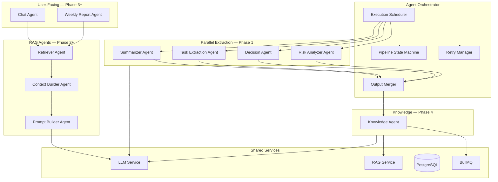
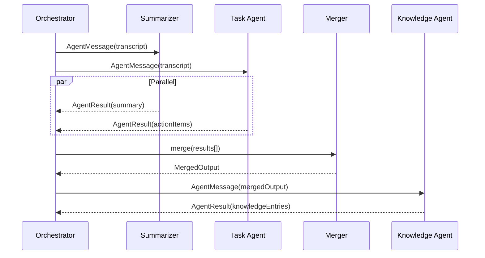
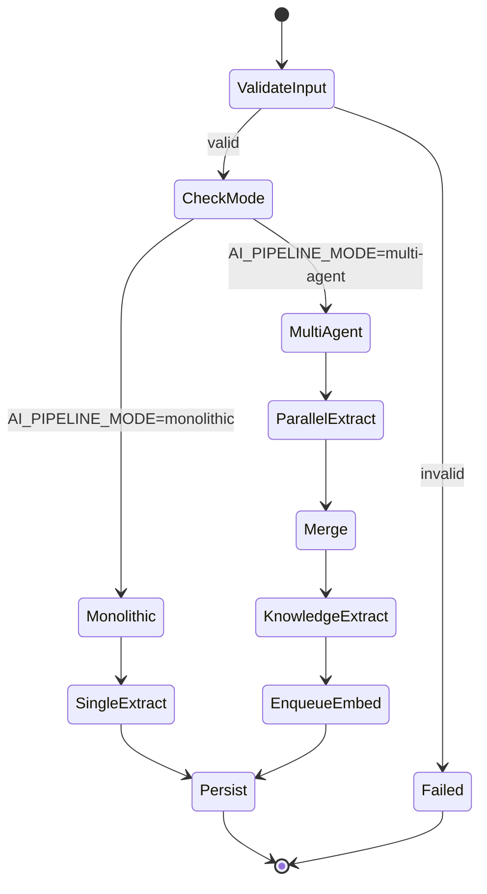
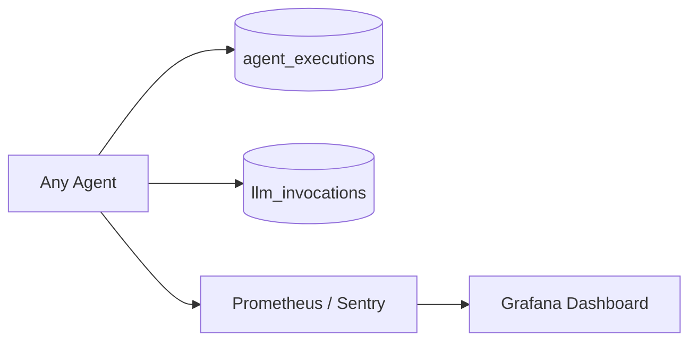
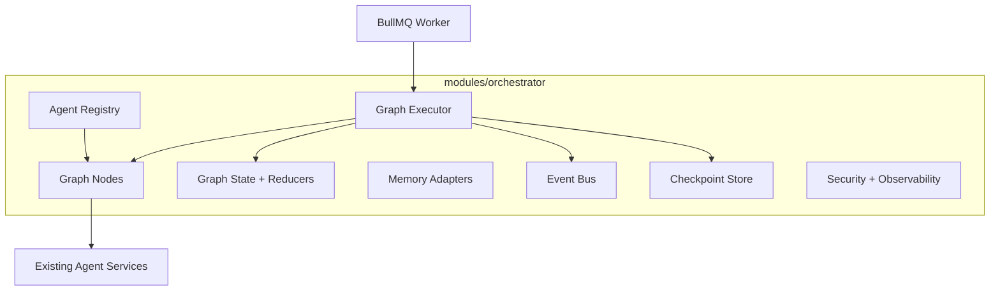

# Agent Architecture — MeetingMind AI

**Product:** MeetingMind AI  
**Version:** 1.0  
**Status:** Architecture — Documentation Only  
**Requirements:** [multi-agent-requirements.md](./multi-agent-requirements.md) · [llm-requirements.md](./llm-requirements.md)

---

## 1. Multi-Agent System Overview



---

## 2. Agent Catalog

### 2.1 Summarizer Agent

| Attribute | Definition |
|-----------|------------|
| **Purpose** | Generate structured meeting summary from transcript |
| **Inputs** | `transcript`, `meetingTitle`, `memberNames`, `meetingDate` |
| **Outputs** | `{ summary, keyTopics[], participants[], duration }` |
| **Responsibilities** | Executive summary; topic extraction; participant identification |
| **Dependencies** | LLM Service, Prompt Registry (`summarizer-v2`) |
| **Failure Scenarios** | Timeout; empty transcript; token overflow |
| **Metrics** | `agent.summarizer.latency_ms`, `agent.summarizer.tokens`, `agent.summarizer.success_rate` |
| **Protocol** | Async job message; returns `AgentResult<T>` |

### 2.2 Task Extraction Agent

| Attribute | Definition |
|-----------|------------|
| **Purpose** | Extract actionable tasks with assignees and deadlines |
| **Inputs** | `transcript`, `memberNames`, `summary` (optional from Summarizer) |
| **Outputs** | `ActionItem[]` → `action_item_suggestions` table |
| **Responsibilities** | Identify tasks; map assignees; infer deadlines; confidence scores |
| **Dependencies** | LLM Service, Prompt Registry (`task-extractor-v2`), Member Service |
| **Failure Scenarios** | No assignable members; ambiguous ownership |
| **Metrics** | `agent.task_extraction.items_count`, `agent.task_extraction.confidence_avg` |
| **Protocol** | Parallel with Summarizer; merge before persist |

### 2.3 Decision Agent

| Attribute | Definition |
|-----------|------------|
| **Purpose** | Extract formal decisions and rationale |
| **Inputs** | `transcript`, `summary`, `memberNames` |
| **Outputs** | `Decision[]` → `meeting_ai_outputs.decisions` JSON |
| **Responsibilities** | Decision statements; decision makers; rationale; vote/consensus |
| **Dependencies** | LLM Service, Prompt Registry (`decision-extractor-v1`) |
| **Failure Scenarios** | No explicit decisions in meeting |
| **Metrics** | `agent.decision.count`, `agent.decision.latency_ms` |
| **Protocol** | Parallel execution; empty array is valid success |

### 2.4 Risk Analyzer Agent

| Attribute | Definition |
|-----------|------------|
| **Purpose** | Identify risks, blockers, and concerns raised |
| **Inputs** | `transcript`, `summary`, `decisions[]` |
| **Outputs** | `Risk[]` → `meeting_ai_outputs.risks` JSON |
| **Responsibilities** | Risk identification; severity; mitigation suggestions; owners |
| **Dependencies** | LLM Service, Prompt Registry (`risk-analyzer-v1`) |
| **Failure Scenarios** | Low-signal meeting (standup) |
| **Metrics** | `agent.risk.count`, `agent.risk.high_severity_count` |
| **Protocol** | Parallel; can run after Decision Agent for context (optional v2) |

### 2.5 Knowledge Agent

| Attribute | Definition |
|-----------|------------|
| **Purpose** | Extract durable knowledge entities for workspace KB |
| **Inputs** | Merged extraction output, `transcript`, `workspaceId` |
| **Outputs** | `KnowledgeEntry[]` → `knowledge_entries` + embed chunks |
| **Responsibilities** | Entity extraction; dedup against existing KB; relationship mapping |
| **Dependencies** | LLM Service, RAG Service, Vector DB |
| **Failure Scenarios** | Duplicate entities; low confidence extractions |
| **Metrics** | `agent.knowledge.entities_created`, `agent.knowledge.dedup_rate` |
| **Protocol** | Sequential after merge; enqueues `embed-knowledge` job |

### 2.6 Weekly Report Agent

| Attribute | Definition |
|-----------|------------|
| **Purpose** | Synthesize workspace activity into weekly intelligence report |
| **Inputs** | `workspaceId`, `dateRange`, retrieved summaries/decisions/tasks |
| **Outputs** | `WeeklyReport` → `workspace_reports` table |
| **Responsibilities** | Activity summary; key decisions; open risks; task completion stats |
| **Dependencies** | RAG Service, Retriever Agent, LLM Service |
| **Failure Scenarios** | No meetings in range; retrieval empty |
| **Metrics** | `agent.weekly_report.generation_ms`, `agent.weekly_report.meetings_covered` |
| **Protocol** | Scheduled cron job; async via BullMQ |

### 2.7 Chat Agent

| Attribute | Definition |
|-----------|------------|
| **Purpose** | Answer user questions grounded in workspace/meeting knowledge |
| **Inputs** | `userMessage`, `chatHistory`, `scope` (workspace/meeting), `workspaceId` |
| **Outputs** | Streamed response + `Citation[]` → `chat_messages` |
| **Responsibilities** | Orchestrate retrieval; manage conversation; cite sources; refuse ungrounded answers |
| **Dependencies** | Retriever Agent, Context Builder, Prompt Builder, LLM Service |
| **Failure Scenarios** | No relevant context; provider outage; token budget exceeded |
| **Metrics** | `agent.chat.latency_ms`, `agent.chat.citations_count`, `agent.chat.grounded_rate` |
| **Protocol** | HTTP SSE; synchronous retrieval + async streaming generation |

### 2.8 Retriever Agent

| Attribute | Definition |
|-----------|------------|
| **Purpose** | Execute hybrid search to find relevant document chunks |
| **Inputs** | `query`, `workspaceId`, `filters` (meetingId, dateRange, sourceType) |
| **Outputs** | `RetrievedChunk[]` ranked by relevance |
| **Responsibilities** | Query embedding; hybrid search; metadata filtering; cache lookup |
| **Dependencies** | RAG Service, Vector DB, Redis Cache |
| **Failure Scenarios** | Vector index down → FTS fallback; empty results |
| **Metrics** | `agent.retriever.latency_ms`, `agent.retriever.chunks_returned`, `agent.retriever.cache_hit_rate` |
| **Protocol** | Called by Chat Agent, Weekly Report Agent, Semantic Search API |

### 2.9 Context Builder Agent

| Attribute | Definition |
|-----------|------------|
| **Purpose** | Assemble retrieved chunks into token-budgeted context |
| **Inputs** | `RetrievedChunk[]`, `tokenBudget`, `query` |
| **Outputs** | `ContextBlock[]` with citation indices |
| **Responsibilities** | Deduplicate; sort; truncate; format; assign CITATION-N labels |
| **Dependencies** | Token Manager |
| **Failure Scenarios** | All chunks below similarity threshold |
| **Metrics** | `agent.context_builder.tokens_used`, `agent.context_builder.chunks_included` |
| **Protocol** | Pure function; no LLM call; < 50ms target |

### 2.10 Prompt Builder Agent

| Attribute | Definition |
|-----------|------------|
| **Purpose** | Construct final LLM message array from context and history |
| **Inputs** | `systemPrompt`, `contextBlocks`, `chatHistory`, `userQuery` |
| **Outputs** | `Message[]` ready for LLM Service |
| **Responsibilities** | Template rendering; history truncation; anti-hallucination instructions |
| **Dependencies** | Prompt Registry, Token Manager |
| **Failure Scenarios** | Context exceeds budget after truncation |
| **Metrics** | `agent.prompt_builder.total_tokens` |
| **Protocol** | Pure function; called immediately before LLM invocation |

---

## 3. Communication Protocol

### 3.1 Agent Message Envelope

```typescript
// Conceptual — not implementation
interface AgentMessage<TInput, TOutput> {
  id: string;                    // UUID
  correlationId: string;         // Pipeline trace ID
  agentType: AgentType;
  workspaceId: string;
  meetingId?: string;
  input: TInput;
  output?: TOutput;
  status: 'pending' | 'running' | 'completed' | 'failed' | 'skipped';
  error?: AgentError;
  metrics: {
    startedAt: string;
    completedAt?: string;
    latencyMs?: number;
    promptTokens?: number;
    completionTokens?: number;
    model?: string;
    provider?: string;
  };
}
```

### 3.2 Inter-Agent Communication



| Pattern | Use Case |
|---------|----------|
| **Parallel fan-out** | Summarizer, Task, Decision, Risk |
| **Sequential chain** | Merge → Knowledge → Embed |
| **Request-response** | Chat → Retriever → Context → Prompt → LLM |
| **Fire-and-forget** | Enqueue embed job after Knowledge |
| **Pub/Sub (future)** | LangGraph state updates |

---

## 4. Orchestrator Design



### 4.1 Execution Policies

| Policy | Value |
|--------|-------|
| Max parallel agents | 4 (Summarizer, Task, Decision, Risk) |
| Per-agent timeout | 120s |
| Per-agent retries | 2 (exponential backoff) |
| Pipeline timeout | 300s |
| Partial failure | Persist successful agents; mark failed agents |
| Feature flag | `AI_PIPELINE_MODE` env var |

---

## 5. Failure Handling Matrix

| Agent | Failure | Recovery |
|-------|---------|----------|
| Summarizer | Timeout | Retry 2x; fallback to truncated transcript |
| Task Extraction | Invalid JSON | Repair prompt once |
| Decision | Empty result | Valid — store empty array |
| Risk | Provider down | Skip; log warning |
| Knowledge | Dedup conflict | Merge with existing entry |
| Chat | No retrieval hits | Respond "not found in your meetings" |
| Retriever | Vector index down | FTS-only fallback |
| Weekly Report | No data in range | Generate minimal report |

---

## 6. Observability per Agent



| Metric | Type | Alert Threshold |
|--------|------|-----------------|
| `agent.{type}.success_rate` | Gauge | < 95% over 1h |
| `agent.{type}.latency_p95` | Histogram | > 60s |
| `agent.{type}.tokens_total` | Counter | > workspace budget |
| `agent.pipeline.partial_failure_rate` | Gauge | > 10% |

---

## 7. LangGraph Orchestration Layer (Implemented)

Production orchestration lives in `backend/src/modules/orchestrator/` and uses **LangGraph `StateGraph`** with workflow definitions in `workflows/workflow.types.ts` (graph structure is data-driven — not hardcoded in nodes).



### 7.1 Workflows

| Workflow ID | Trigger | Graph path |
|-------------|---------|------------|
| `meeting-intelligence` | `process-meeting` job | Parallel extract → merge → persist → knowledge |
| `weekly-report` | Cron / report job | Retriever → context → report → persist |
| `chat` | Chat API | Retriever → context → chat |
| `knowledge-update` | Post-embed pipeline | Chunk → embed → vector → knowledge → index |

### 7.2 Graph State

- `OrchestratorGraphState` — correlation ID, workspace scope, agent results map, errors, metrics, token budget
- Reducers merge partial node updates (agent results, errors, metrics)
- Checkpoints stored via `InMemoryCheckpointStore` (Redis-ready interface); transcripts redacted at rest

### 7.3 Execution Engine

| Capability | Implementation |
|------------|----------------|
| Sequential / parallel edges | LangGraph `StateGraph` from `WORKFLOW_REGISTRY` |
| Retries | `withRetry` — 2 attempts, 2s/4s/8s backoff |
| Timeouts | `withTimeout` per node (default 120s) |
| Circuit breaker | Per `workspaceId:nodeId` key, 5 failures / 60s |
| Checkpoint recovery | `checkpointService.recover(threadId)` |
| Human-in-the-loop | State flags `humanApprovalRequired` / `humanApproved` (reserved) |

### 7.4 Event System

Typed events via `orchestratorEventBus`: `MeetingProcessed`, `TaskCreated`, `DecisionDetected`, `RiskDetected`, `KnowledgeUpdated`, `WeeklyReportGenerated`, `ChatCompleted`, `GraphFailed`, `GraphPartialSuccess`.

### 7.5 Agent Registry

Central registry (`agents/registry/agent-registry.ts`) supports dynamic registration, metadata (version, capabilities, dependencies, critical flag), and per-workflow enablement.

**Design principles (unchanged):**
- Each agent is invoked only from graph nodes — `async (state) → partialState`
- Orchestrator state matches LangGraph `StateGraph` schema
- `agent_executions` remains the per-agent audit trail; checkpoints supplement resumability
- BullMQ remains the job trigger; LangGraph runs inside the worker

---

## 8. Security

- Agents never receive cross-workspace data
- Chat Agent scope enforced before Retriever call
- Agent outputs validated against Zod schemas before DB write
- `agent_executions` logs exclude transcript content (metadata only)
- Rate limit: 20 agent pipeline triggers per workspace per hour

---

## Related Documents

- [agent-flow.md](./agent-flow.md)
- [llm-architecture.md](./llm-architecture.md)
- [rag-architecture.md](./rag-architecture.md)
- [multi-agent-requirements.md](./multi-agent-requirements.md)

---

## Document History

| Version | Date | Changes |
|---------|------|---------|
| 1.0 | 2026-06-18 | Initial agent architecture — 10 agents defined |
| 1.1 | 2026-06-20 | LangGraph orchestration layer implemented in `modules/orchestrator` |
