# Agent Flow — MeetingMind AI

**Product:** MeetingMind AI  
**Version:** 1.0  
**Status:** Architecture — Documentation Only  
**Scope:** Multi-agent orchestration from meeting transcript to knowledge base and user-facing agents

---

## 1. Master Agent Pipeline

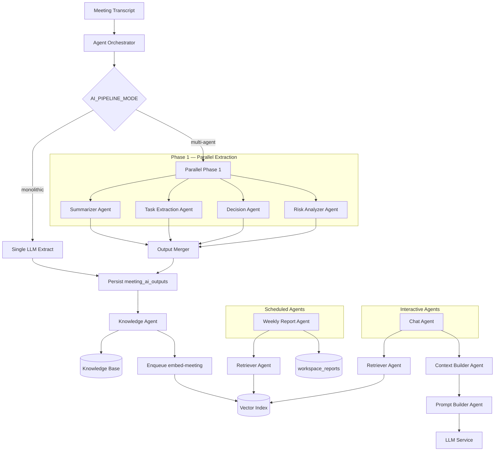

---

## 2. Execution Order & Dependencies

```mermaid
gantt
    title Meeting Processing Agent Timeline
    dateFormat X
    axisFormat %s

    section Parallel
    Summarizer Agent       :sa, 0, 30
    Task Extraction Agent  :ta, 0, 25
    Decision Agent         :da, 0, 20
    Risk Analyzer Agent    :ra, 0, 22

    section Sequential
    Output Merger          :merge, after sa, 5
    Persist AI Outputs     :persist, after merge, 3
    Knowledge Agent        :ka, after persist, 15
    Embed Meeting Job      :embed, after ka, 20
```

| Step | Agent | Depends On | Parallel? |
|------|-------|------------|-----------|
| 1 | Summarizer | transcript | ✅ With 2–4 |
| 2 | Task Extraction | transcript | ✅ With 1,3,4 |
| 3 | Decision | transcript | ✅ With 1,2,4 |
| 4 | Risk Analyzer | transcript | ✅ With 1,2,3 |
| 5 | Output Merger | 1–4 complete | ❌ Sequential |
| 6 | Persist | Merger output | ❌ Sequential |
| 7 | Knowledge Agent | Persisted outputs | ❌ Sequential |
| 8 | embed-meeting | Knowledge complete | ❌ Async job |
| 9 | Weekly Report | Vector index | ❌ Scheduled |
| 10 | Chat | Vector index | ❌ On-demand |

---

## 3. Parallel Execution Architecture

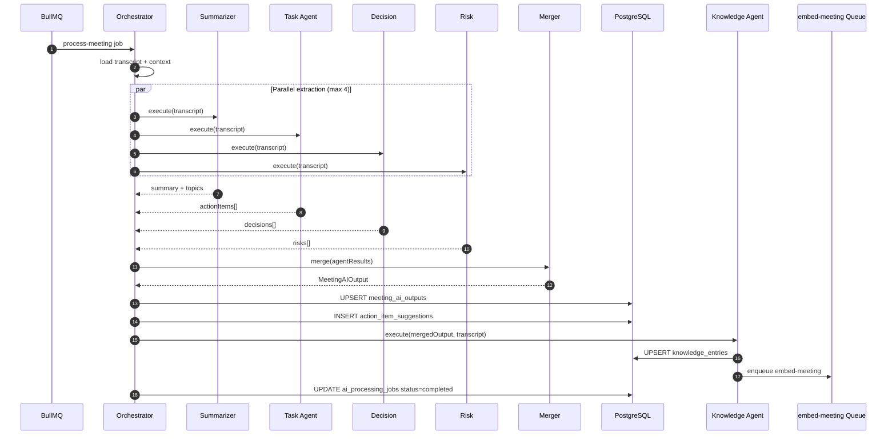

---

## 4. Failure Handling

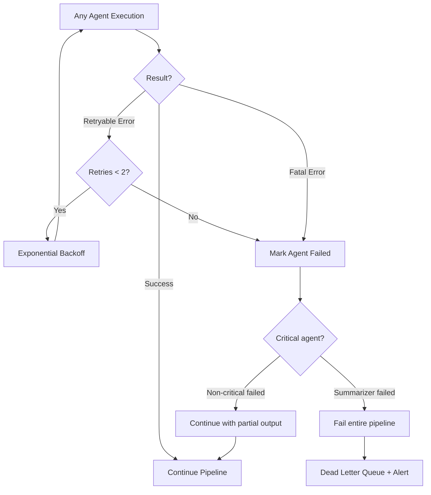

| Agent | Critical? | Partial Failure Behavior |
|-------|-----------|--------------------------|
| Summarizer | ✅ Yes | Pipeline fails; user notified |
| Task Extraction | ⚠️ Medium | Continue; empty action items |
| Decision | ❌ No | Continue; empty decisions |
| Risk Analyzer | ❌ No | Continue; empty risks |
| Knowledge Agent | ❌ No | Skip KB update; embed still runs |
| Retriever | ⚠️ Medium | FTS fallback |
| Chat Agent | ✅ Yes | User error message |

### Retry Policy

| Parameter | Value |
|-----------|-------|
| Max retries per agent | 2 |
| Backoff | 2s, 4s |
| Retryable errors | 429, 5xx, timeout |
| Non-retryable | 400, validation error |
| Pipeline timeout | 300s |

---

## 5. Monolithic Fallback Flow

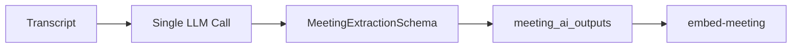

**When `AI_PIPELINE_MODE=monolithic`:**
- Skip parallel agents
- Use existing v0.3.0 extraction prompt
- Same output schema — zero migration risk
- Feature flag allows instant rollback

---

## 6. Knowledge Agent Flow

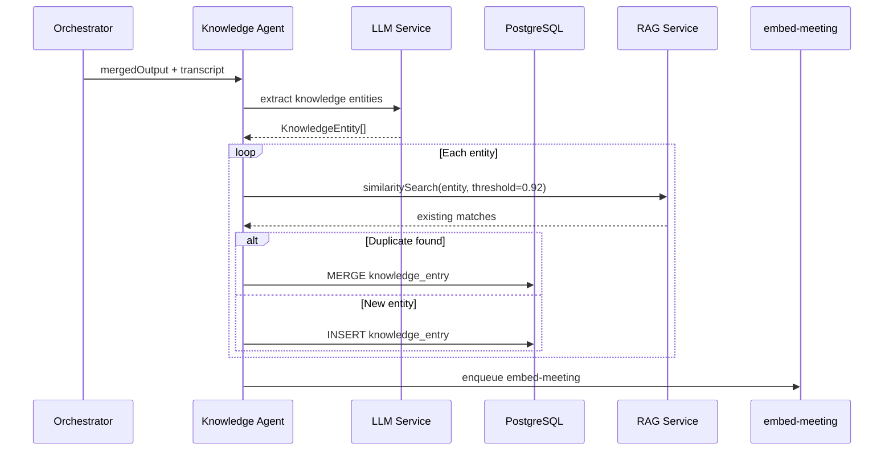

---

## 7. Weekly Report Agent Flow

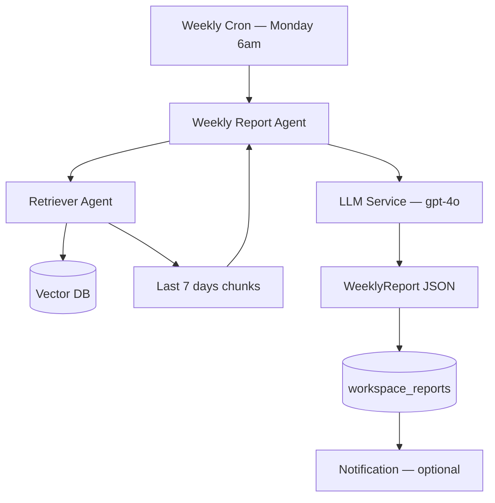

| Input | Value |
|-------|-------|
| Date range | Last 7 days |
| Retrieval query | "weekly summary decisions risks tasks" |
| Top-K chunks | 30 |
| Model | `gpt-4o` (higher quality for reports) |

---

## 8. Chat Agent Flow

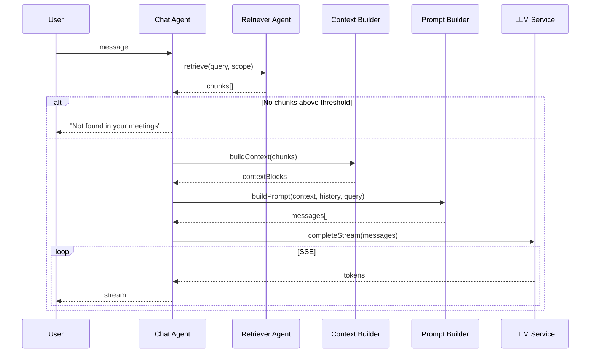

---

## 9. RAG Sub-Agent Chain

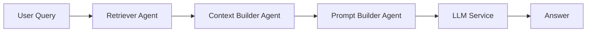

**Latency budget:**
- Retriever: 200ms
- Context Builder: 20ms
- Prompt Builder: 10ms
- LLM first token: 500ms

---

## 10. Future LangGraph Support

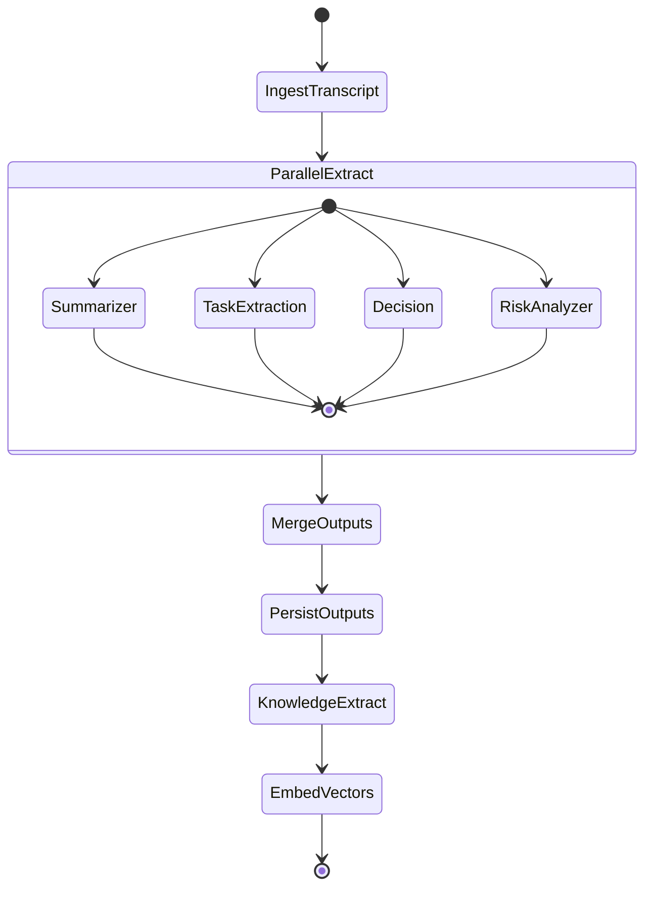

### LangGraph Migration Path

| Current | LangGraph Equivalent |
|---------|---------------------|
| Agent Orchestrator | `StateGraph` |
| Agent message envelope | Graph state schema |
| `agent_executions` table | Checkpoint store |
| BullMQ job | Graph invocation trigger |
| Parallel fan-out | `add_edge` from START to multiple nodes |
| Merge node | Reducer function on state |
| Feature flag | Graph selector at runtime |

**Design principles for compatibility:**
1. Each agent is a pure `async function(state) → partialState`
2. No agent calls another agent directly — only via orchestrator/graph edges
3. State schema is versioned and JSON-serializable
4. BullMQ remains the job trigger; LangGraph runs inside worker

---

## 11. Agent State Schema (Conceptual)

```typescript
interface PipelineState {
  correlationId: string;
  workspaceId: string;
  meetingId: string;
  transcript: string;
  memberNames: string[];
  agentResults: {
    summarizer?: SummaryOutput;
    taskExtraction?: ActionItem[];
    decision?: Decision[];
    risk?: Risk[];
    knowledge?: KnowledgeEntry[];
  };
  status: 'running' | 'completed' | 'partial' | 'failed';
  errors: AgentError[];
  metrics: {
    startedAt: string;
    completedAt?: string;
    totalTokens: number;
    estimatedCostUsd: number;
  };
}
```

---

## 12. Observability Flow

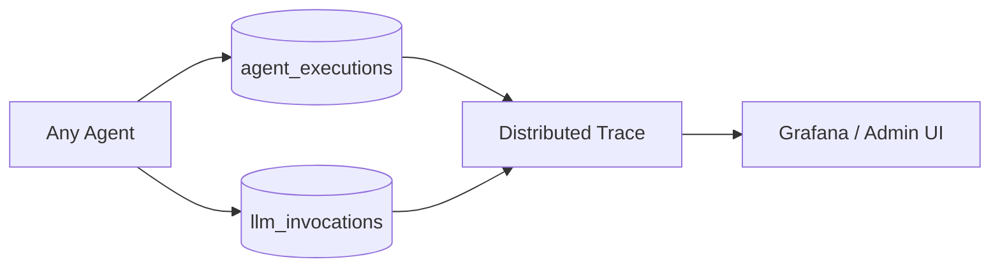

Every agent execution records:
- `agentType`, `status`, `latencyMs`
- `promptTokens`, `completionTokens`, `model`
- `correlationId` linking to parent job

---

## 13. Scalability

| Scale | Strategy |
|-------|----------|
| 1–10 concurrent pipelines | Single worker, concurrency=3 |
| 10–50 concurrent | 3 worker replicas |
| 50+ concurrent | Dedicated extraction worker pool |
| Chat agents | Stateless API horizontal scaling |
| Weekly reports | Low-priority queue; off-peak scheduling |

---

## Related Documents

- [agent-architecture.md](./agent-architecture.md)
- [llm-architecture.md](./llm-architecture.md)
- [embedding-flow.md](./embedding-flow.md)
- [multi-agent-requirements.md](./multi-agent-requirements.md)

---

## Document History

| Version | Date | Changes |
|---------|------|---------|
| 1.0 | 2026-06-18 | Initial agent flow |
