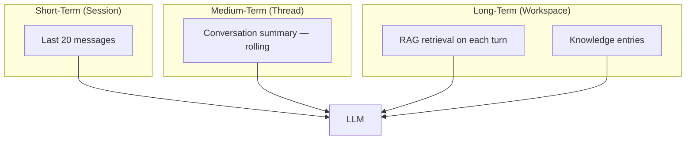

# AI Chat Requirements — MeetingMind AI

**Product:** MeetingMind AI  
**Version:** 1.0  
**Status:** Requirements — Documentation Only  
**Baseline:** FR-AI-010 – FR-AI-012 (per-meeting chat, MVP+1); platform v0.3.0 backend chat endpoints  
**Related:** [rag-requirements.md](./rag-requirements.md) · [llm-requirements.md](./llm-requirements.md) · [multi-agent-requirements.md](./multi-agent-requirements.md)

---

## 1. Purpose

MeetingMind AI Chat transforms the platform from static meeting outputs into a **conversational intelligence layer** where users ask natural language questions about meetings, tasks, decisions, and risks — with **grounded, cited answers** from workspace data.

### Extension of Existing Chat

| Capability | Current (v0.3) | MeetingMind AI |
|------------|----------------|----------------|
| Scope | Per-meeting | Per-meeting + **workspace-wide** |
| Context | Transcript + AI output | RAG retrieval across corpus |
| Streaming | Planned (SSE) | SSE with citations |
| Memory | Shared meeting thread | Meeting thread + workspace conversation sessions |
| Agents | Direct LLM | **Chat Agent** + **Context Retrieval Agent** |

**Preservation:** Existing per-meeting chat endpoints and `meeting_chat_messages` table remain; workspace chat adds new routes.

---

## 2. Supported Query Types

### 2.1 Natural Language Examples

| Query | Intent | Retrieval Strategy |
|-------|--------|-------------------|
| "What decisions did we make last week?" | Temporal + type filter | RAG: `decisions`, date filter 7d |
| "What tasks are assigned to Sarah?" | Task lookup | SQL tasks by assignee + optional RAG |
| "What meetings discussed authentication?" | Topic search | Hybrid semantic + keyword |
| "Show risks for Project Alpha." | Risk + tag filter | RAG: `risks`, tag=`project-alpha` |
| "Summarize our last sprint planning." | Meeting summary | Direct `meeting_ai_outputs` + RAG |
| "Did we change the launch date?" | Cross-meeting comparison | Cross-meeting intelligence |
| "What action items are still pending from retro?" | Action item status | SQL `action_item_suggestions` + RAG |
| "Who owns the API migration task?" | Task assignment | SQL task query |

### 2.2 Query Classification

**FR-CHAT-CLS-001:** Classify intent before retrieval: `factual_lookup | synthesis | comparison | task_query | meeting_query | general`

| Intent | Primary Source | Fallback |
|--------|----------------|----------|
| `task_query` | PostgreSQL tasks API | RAG tasks |
| `meeting_query` | PostgreSQL meetings | RAG transcripts |
| `synthesis` | RAG multi-chunk | — |
| `comparison` | RAG cross-meeting | — |
| `factual_lookup` | Structured AI outputs | RAG |

---

## 3. Chat Modes

### 3.1 Per-Meeting Chat (Preserved + Enhanced)

| Attribute | Detail |
|-----------|--------|
| **Route** | `POST /workspaces/:id/meetings/:meetingId/chat` |
| **Context** | Full transcript + AI output + meeting-scoped RAG |
| **Thread** | Shared per meeting (existing FR-AI-012) |
| **Use case** | Deep dive on single meeting |

### 3.2 Workspace Chat (New)

| Attribute | Detail |
|-----------|--------|
| **Route** | `POST /workspaces/:id/chat` |
| **Context** | RAG across full workspace corpus |
| **Thread** | Per-user conversation sessions |
| **Use case** | Cross-meeting questions, productivity queries |

### 3.3 Inline Chat (New — Phase 3)

| Attribute | Detail |
|-----------|--------|
| **Location** | Dashboard, Kanban, search results |
| **Context** | Current page context + RAG |
| **Use case** | "Explain this task's meeting context" |

---

## 4. Conversation Memory

### 4.1 Memory Layers



### 4.2 Requirements

- **FR-CHAT-MEM-001:** Persist all messages in `meeting_chat_messages` (meeting) or `workspace_chat_messages` (workspace)
- **FR-CHAT-MEM-002:** Include last 20 messages in context (configurable)
- **FR-CHAT-MEM-003:** When history exceeds 4000 tokens, summarize older messages into rolling summary
- **FR-CHAT-MEM-004:** Rolling summary updated every 10 messages
- **FR-CHAT-MEM-005:** User can clear conversation history (soft delete messages)
- **FR-CHAT-MEM-006:** Memory scoped to workspace — no cross-workspace recall

### 4.3 Session Model (Workspace Chat)

```json
{
  "id": "uuid",
  "workspaceId": "uuid",
  "userId": "uuid",
  "title": "Auto-generated from first message",
  "createdAt": "...",
  "updatedAt": "..."
}
```

---

## 5. Context Retrieval

Handled by **Context Retrieval Agent** (see multi-agent-requirements.md).

### 5.1 Retrieval per Turn

1. Classify user intent
2. If SQL-sufficient (task assignee lookup) → query DB directly
3. Else → RAG hybrid retrieval with metadata filters inferred from query
4. Inject retrieved chunks into prompt
5. Pass to Chat Agent for response generation

**FR-CHAT-CTX-001:** Retrieval occurs on every turn (not cached across turns unless same query)  
**FR-CHAT-CTX-002:** Meeting chat prioritizes current meeting chunks (60% budget) before workspace RAG (40%)  
**FR-CHAT-CTX-003:** Log retrieved chunk IDs for observability

---

## 6. Streaming Responses

### 6.1 SSE Event Types

```
event: token
data: {"content": "The team decided"}

event: citation
data: {"index": 1, "meetingId": "...", "title": "Sprint Planning", "excerpt": "..."}

event: done
data: {"messageId": "uuid", "tokenUsage": {"prompt": 1200, "completion": 350}}

event: error
data: {"code": "LLM_UNAVAILABLE", "message": "..."}
```

### 6.2 Requirements

- **FR-CHAT-STR-001:** SSE via `POST` with `Accept: text/event-stream`
- **FR-CHAT-STR-002:** First token < 2s p95
- **FR-CHAT-STR-003:** Citations emitted after completion (or inline with `[n]` markers)
- **FR-CHAT-STR-004:** Persist complete message on `done` event
- **FR-CHAT-STR-005:** Non-streaming fallback: `?stream=false` returns full JSON

---

## 7. Message History

### 7.1 API

| Method | Route | Description |
|--------|-------|-------------|
| GET | `/workspaces/:id/meetings/:meetingId/chat` | Meeting thread (existing) |
| GET | `/workspaces/:id/chat/sessions` | List workspace sessions |
| GET | `/workspaces/:id/chat/sessions/:sessionId` | Session messages |
| DELETE | `/workspaces/:id/chat/sessions/:sessionId` | Clear session |

### 7.2 Message Schema

```json
{
  "id": "uuid",
  "role": "USER | ASSISTANT",
  "content": "string",
  "citations": [],
  "tokenUsage": {},
  "model": "gpt-4o-mini",
  "retrievalMetadata": {
    "chunksRetrieved": 8,
    "avgSimilarity": 0.84,
    "retrievalMode": "hybrid"
  },
  "createdAt": "..."
}
```

**FR-CHAT-HIST-001:** Paginate history (50 messages per page)  
**FR-CHAT-HIST-002:** Messages immutable after creation (no edit)  
**FR-CHAT-HIST-003:** Soft-delete on session clear; hard-delete after 90 days (configurable)

---

## 8. Token Limits

| Limit | Value |
|-------|-------|
| Max user message length | 4,000 characters |
| Max context (retrieval + history) | 32,000 tokens |
| Max completion tokens | 2,048 |
| Max messages per session | 200 |
| Max sessions per user per workspace | 50 |

**FR-CHAT-TOK-001:** Reject messages exceeding limits with 400  
**FR-CHAT-TOK-002:** Warn user at 80% of session message limit  
**FR-CHAT-TOK-003:** Workspace daily chat token budget (default: 500k tokens/day)

---

## 9. Citations and References

- **FR-CHAT-CITE-001:** Every factual claim derived from retrieval must include `[n]` citation
- **FR-CHAT-CITE-002:** UI: citation popover with meeting title, date, excerpt, link
- **FR-CHAT-CITE-003:** Click citation → navigate to meeting detail with highlight (MVP+2)
- **FR-CHAT-CITE-004:** If answer is general knowledge (not from corpus), state "not from your meetings"
- **FR-CHAT-CITE-005:** Minimum citation count: 1 when retrieval score > threshold

---

## 10. Failure Handling

| Scenario | User Experience | System |
|----------|-----------------|--------|
| LLM timeout | "Response timed out. Please try again." | Log; no partial persist unless > 50 tokens |
| LLM rate limit | "High demand. Retrying..." → auto-retry once | Fallback provider |
| Empty retrieval | "I couldn't find relevant meetings for that question." | Suggest keyword search |
| SQL + RAG both empty | Honest "no data" response | No hallucination |
| Stream disconnect | Partial response saved with `incomplete: true` | Cancel LLM call |
| Moderation flag | "Unable to process this message." | Log; no content stored |

**FR-CHAT-FAIL-001:** Never fabricate meeting content, decisions, or task assignments  
**FR-CHAT-FAIL-002:** Confidence indicator when avg similarity < 0.75: "Based on limited matches..."

---

## 11. Security Considerations

- **FR-CHAT-SEC-001:** All chat scoped to authenticated workspace member
- **FR-CHAT-SEC-002:** RAG retrieval enforces `workspace_id` — same as existing tenant isolation
- **FR-CHAT-SEC-003:** Do not expose other users' private data beyond workspace visibility
- **FR-CHAT-SEC-004:** Rate limit: 30 messages/minute per user
- **FR-CHAT-SEC-005:** Prompt injection defense: system prompt instructs ignore transcript instructions
- **FR-CHAT-SEC-006:** Log chat queries for audit; no log of full transcript re-sent
- **FR-CHAT-SEC-007:** PII redaction option for enterprise (v3)

---

## 12. Response Quality Requirements

| Metric | Target |
|--------|--------|
| Citation accuracy (human eval) | ≥ 90% |
| Hallucination rate (fabricated facts) | < 5% |
| User thumbs-up rate | ≥ 75% |
| Answer relevance (human eval) | ≥ 4/5 |
| Retrieval precision @5 | ≥ 0.80 |

### 12.1 Quality Controls

- **FR-CHAT-QA-001:** System prompt: "Answer only from provided context"
- **FR-CHAT-QA-002:** Thumbs up/down on each assistant message
- **FR-CHAT-QA-003:** Feedback stored for prompt tuning (not model training without consent)
- **FR-CHAT-QA-004:** Golden question set (50 queries) for regression testing
- **FR-CHAT-QA-005:** Block response if zero retrieval and query is factual (force "not found")

---

## 13. User Stories

| ID | Story | Priority |
|----|-------|----------|
| CHAT-01 | As a **user**, I want to **ask questions about a meeting in natural language**, so that **I don't re-read the transcript** | P0 |
| CHAT-02 | As a **PM**, I want to **ask workspace-wide questions across meetings**, so that **I find decisions quickly** | P1 |
| CHAT-03 | As a **user**, I want **streaming responses**, so that **I see answers immediately** | P0 |
| CHAT-04 | As a **user**, I want **citations to source meetings**, so that **I trust and verify answers** | P0 |
| CHAT-05 | As a **user**, I want **conversation history**, so that **I can continue prior threads** | P1 |
| CHAT-06 | As a **user**, I want to **ask about tasks and assignees**, so that **I get status without opening Kanban** | P1 |
| CHAT-07 | As a **lead**, I want to **compare decisions across meetings**, so that **I spot contradictions** | P2 |

---

## 14. API Summary (New + Extended)

| Endpoint | Method | Description |
|----------|--------|-------------|
| `.../meetings/:id/chat` | POST | Per-meeting chat (enhanced with RAG) |
| `.../meetings/:id/chat` | GET | Meeting chat history |
| `.../chat` | POST | Workspace chat (new) |
| `.../chat/sessions` | GET | List sessions |
| `.../chat/sessions/:id` | GET | Session messages |
| `.../chat/sessions/:id` | DELETE | Clear session |
| `.../chat/feedback` | POST | Thumbs up/down |

---

## Document History

| Version | Date | Changes |
|---------|------|---------|
| 1.0 | 2026-06-18 | Initial AI chat requirements |
