# MeetingMind AI — Architecture Review Report

**Product:** MeetingMind AI  
**Version:** 1.0  
**Review Date:** 2026-06-18  
**Reviewers:** Principal AI Architect, Principal Software Architect, Staff LLM Engineer, RAG Architect, Vector DB Architect, Technical Lead  
**Baseline:** Platform v0.3.0 (shipped MVP) + MeetingMind AI requirements package

**Related:** [architecture-review.md](./architecture-review.md) (platform review) · [future-roadmap.md](./future-roadmap.md)

---

## Executive Summary

MeetingMind AI extends a **production-ready v0.3.0 foundation** (auth, workspaces, meetings, OpenAI extraction, BullMQ, tasks, dashboard, search, notifications) with LLM abstraction, RAG, semantic search, multi-agent orchestration, and observability.

This AI-focused review identifies **14 architectural strengths**, **18 weaknesses**, **12 risks**, and **22 recommendations** prior to Phase 1 implementation.

**Verdict:** ✅ Proceed with MeetingMind AI Phase 1 (LLM Service Layer) immediately after addressing P0 items below. Architecture is sound for 0–50k users with documented scale path.

---

## Documents Reviewed

| Category | Documents |
|----------|-----------|
| Platform | requirements.md, architecture.md, database-design.md, api-design.md, system-architecture.md, functional-requirements.md |
| MeetingMind AI | llm-requirements.md, rag-requirements.md, multi-agent-requirements.md, ai-chat-requirements.md, semantic-search-requirements.md, vector-db-requirements.md, observability-requirements.md |
| Platform reviews | architecture-review.md, api-architecture-review.md, security-architecture.md, scalability-design.md |

---

## Current Strengths

| # | Strength | Evidence |
|---|----------|----------|
| S1 | **Async AI processing** | BullMQ + worker decouples LLM from HTTP; v0.2 shipped |
| S2 | **Workspace multi-tenancy** | `workspace_id` on all entities; RBAC middleware; integration tests |
| S3 | **Structured extraction pipeline** | JSON schema output → `meeting_ai_outputs` + `action_item_suggestions` |
| S4 | **Human-in-the-loop** | Action items require accept/reject before task creation |
| S5 | **Stateless API** | JWT + horizontal scaling ready on Railway/Vercel |
| S6 | **Job durability foundation** | `ai_processing_jobs` designed; token logging specified |
| S7 | **Mock mode for dev** | `AI_USE_MOCK=true` enables CI without API keys |
| S8 | **Comprehensive requirements** | LLM, RAG, agents, chat, search, vector DB, observability documented |
| S9 | **pgvector decision** | Extends Neon PostgreSQL; no new infra for RAG MVP |
| S10 | **Feature-flag strategy** | `AI_PIPELINE_MODE=monolithic\|multi-agent` preserves backward compat |
| S11 | **Security baseline** | Memory-only access tokens, refresh rotation, workspace isolation |
| S12 | **Frontend feature architecture** | React Query, feature modules, SSE-ready chat UI patterns |
| S13 | **Phased roadmap** | 10 phases with clear dependencies and success criteria |
| S14 | **Observability design** | `llm_invocations`, per-agent metrics, cost tracking specified |

---

## Weaknesses

### P0 — Address Before MeetingMind AI Phase 1

| # | Weakness | Impact | Recommendation |
|---|----------|--------|----------------|
| W1 | **No LLM abstraction layer yet** | Provider lock-in; blocks Gemini/Claude | Implement `LLMService` per llm-architecture.md |
| W2 | **Monolithic extraction prompt** | Quality ceiling; no per-agent retry | Phase 1: versioned prompts; Phase 5: multi-agent |
| W3 | **No vector index** | Semantic search and RAG blocked | Phase 2: pgvector + `document_chunks` |
| W4 | **No `llm_invocations` table** | No cost/token visibility | Add in Phase 1 migration |
| W5 | **Chat not RAG-grounded** | Hallucination risk when chat ships | Phase 3: retrieval before generation |
| W6 | **Prompts inline in code** | No versioning; hard to tune | Prompt registry per llm-architecture.md |

### P1 — Address During Phases 2–5

| # | Weakness | Impact | Recommendation |
|---|----------|--------|----------------|
| W7 | **Single worker process** | AI backlog under load | Horizontal worker scaling + concurrency config |
| W8 | **No embedding pipeline** | Search limited to keyword | embed-meeting job per embedding-flow.md |
| W9 | **No retrieval service** | Chat/search cannot share logic | Unified `RAGService` per rag-architecture.md |
| W10 | **No agent orchestrator** | Parallel extraction impossible | AgentOrchestrator per agent-architecture.md |
| W11 | **Transcripts in PostgreSQL TEXT** | DB bloat at 10k+ meetings | Object storage migration path (Phase 7) |
| W12 | **Dashboard full-scan risk** | Slow at scale | Redis cache + materialized counters |
| W13 | **No eval harness** | Cannot measure AI quality regressions | Golden transcript set + automated eval |
| W14 | **No LangGraph/state machine** | Complex agent flows hard to maintain | Design for LangGraph compatibility (agent-flow.md) |

### P2 — Post-Phase 5

| # | Weakness | Recommendation |
|---|----------|----------------|
| W15 | No cross-encoder re-ranker | Add Cohere/bge-reranker in RAG v2 |
| W16 | No Pinecone escape hatch implemented | Document migration trigger; build router |
| W17 | No prompt injection test suite | Red-team chat + extraction prompts |
| W18 | No workspace LLM budget enforcement | Token throttle middleware |

---

## Risks

| ID | Risk | Severity | Likelihood | Mitigation |
|----|------|----------|------------|------------|
| R1 | LLM hallucination in chat | High | Medium | RAG grounding + citations + "not found" responses |
| R2 | Cross-tenant vector leak | Critical | Low | `workspace_id` mandatory on all ANN queries |
| R3 | OpenAI cost overrun | High | Medium | Token budgets, model routing, caching |
| R4 | pgvector latency at scale | Medium | Medium | HNSW tuning; Pinecone at 10M vectors |
| R5 | Multi-agent partial failure | Medium | High | Graceful degradation; per-agent retry |
| R6 | Embedding model deprecation | Medium | Low | `embedding_model` column; re-embed job |
| R7 | Provider outage | High | Low | Fallback chain; queue persistence |
| R8 | Prompt injection via transcript | Medium | Medium | System prompt hardening; output validation |
| R9 | Stale vector index | Medium | Medium | Re-embed on edit; index status UI |
| R10 | Scope creep across 10 phases | High | High | Strict phase gates; feature flags |
| R11 | Worker memory pressure (large transcripts) | Medium | Medium | Chunking; stream processing |
| R12 | Chat SSE connection drops | Low | Medium | Partial message persist; reconnect |

---

## Recommendations

### Immediate (Phase 1 — Weeks 1–6)

1. **Implement LLM Service Layer** — `LLMProvider` interface; refactor `openai.ts` to adapter
2. **Add `llm_invocations` + `llm_usage_daily` tables** — token/cost from day one
3. **Extract prompt templates** — versioned files; log `prompt_version` per job
4. **Provider fallback chain** — OpenAI → Gemini → Claude with circuit breaker
5. **Preserve `AI_PIPELINE_MODE=monolithic`** — zero regression on v0.3.0 behavior

### Phase 2 (Weeks 7–12)

6. **Enable pgvector** on Neon; create `document_chunks` per vector-db-design.md
7. **Implement embedding pipeline** per embedding-flow.md
8. **Build `RAGService`** — shared by search and chat
9. **Hybrid search** — RRF fusion vector + FTS

### Phase 3–5 (Weeks 13–30)

10. **Chat with RAG** — Context Builder + Chat Agent; SSE streaming
11. **Agent Orchestrator** — parallel Phase 1 agents; feature-flagged
12. **Knowledge Agent** — `knowledge_entries` + embed
13. **Eval harness** — 50 golden queries; CI regression gate

### Cross-Cutting

14. **Correlation IDs** — `requestId` + `correlationId` across HTTP → job → agent → LLM
15. **Redis caching** — query embeddings, retrieval results, LLM responses (hashed)
16. **Security review** — before chat launch; prompt injection tests
17. **Load test** — 50 concurrent AI jobs before multi-agent GA
18. **Documentation** — keep architecture docs in sync with implementation

### Scale Path (Post 50k Users)

19. Pinecone for vectors > 10M
20. Dedicated embedding worker fleet
21. Read replica for search queries
22. OpenTelemetry distributed tracing

---

## Missing AI Components (Gap vs Target State)

```mermaid
flowchart LR
    subgraph Shipped["v0.3.0 Shipped"]
        A1[OpenAI Adapter]
        A2[BullMQ Worker]
        A3[Structured Extract]
    end

    subgraph Phase1["Phase 1 — Missing"]
        B1[LLM Service Layer]
        B2[Prompt Registry]
        B3[llm_invocations]
        B4[Provider Fallback]
    end

    subgraph Phase2["Phase 2 — Missing"]
        C1[RAG Service]
        C2[Embedding Pipeline]
        C3[pgvector Index]
    end

    subgraph Phase3_5["Phase 3–5 — Missing"]
        D1[Chat Agent]
        D2[Agent Orchestrator]
        D3[Knowledge Agent]
        D4[Semantic Search Hybrid]
    end

    Shipped --> Phase1 --> Phase2 --> Phase3_5
```

| Component | Status | Target Doc |
|-----------|--------|------------|
| LLM Service Layer | ❌ Missing | llm-architecture.md |
| Prompt Registry | ❌ Missing | llm-architecture.md |
| RAG Service | ❌ Missing | rag-architecture.md |
| Vector Index | ❌ Missing | vector-db-design.md |
| Agent Orchestrator | ❌ Missing | agent-architecture.md |
| Context Builder | ❌ Missing | rag-architecture.md |
| Retriever Agent | ❌ Missing | agent-architecture.md |
| Chat Agent (RAG) | ❌ Missing | agent-architecture.md |
| LLM Observability | ⚠️ Partial | observability-requirements.md |
| Eval Harness | ❌ Missing | future-roadmap.md |

---

## Security Considerations (AI-Specific)

| Concern | Current | Target |
|---------|---------|--------|
| Transcript sent to third-party LLM | Yes (OpenAI) | Documented; BYOK option Phase 10 |
| Workspace isolation in RAG | N/A | Mandatory `workspace_id` filter |
| Prompt injection | Minimal defense | System prompt + output schema validation |
| PII in prompts | Member names only | Redaction option enterprise |
| API keys | Server env vars | BYOK per workspace (v2) |
| Chat data retention | 90 days specified | Configurable retention |

---

## Performance Bottlenecks

| Bottleneck | Trigger | Mitigation |
|------------|---------|------------|
| Single LLM call for long transcripts | > 80k tokens | Chunk + merge (existing FR-AI-016) |
| Synchronous embed on upload | Phase 2 mistake | Always async via BullMQ |
| Full transcript in chat context | Meeting chat | RAG retrieval instead |
| HNSW index build | Initial embed | Background; status indicator |
| Kanban + search concurrent load | Peak hours | Redis cache; read replica |
| Worker concurrency | > 50 parallel jobs | Scale workers; queue priority |

---

## Architecture Document Index

| Document | Purpose |
|----------|---------|
| [llm-architecture.md](./llm-architecture.md) | LLM service layer design |
| [rag-architecture.md](./rag-architecture.md) | RAG pipeline design |
| [agent-architecture.md](./agent-architecture.md) | Multi-agent system design |
| [vector-db-design.md](./vector-db-design.md) | Vector storage design |
| [query-flow.md](./query-flow.md) | End-to-end query path |
| [embedding-flow.md](./embedding-flow.md) | Ingestion pipeline |
| [retrieval-flow.md](./retrieval-flow.md) | Retrieval pipeline |
| [agent-flow.md](./agent-flow.md) | Agent orchestration flows |
| [system-sequence-diagrams.md](./system-sequence-diagrams.md) | System-wide sequences |

---

## Sign-Off

| Area | Status |
|------|--------|
| AI architecture readiness | ✅ Approved for Phase 1 |
| RAG architecture | ✅ Designed; implement Phase 2 |
| Multi-agent architecture | ✅ Designed; implement Phase 5 |
| Vector DB choice (pgvector) | ✅ Approved |
| Security (AI) | ⚠️ Chat launch requires review |
| Cost model | ✅ Observability from Phase 1 |

---

## Document History

| Version | Date | Changes |
|---------|------|---------|
| 1.0 | 2026-06-18 | Initial MeetingMind AI architecture review |
