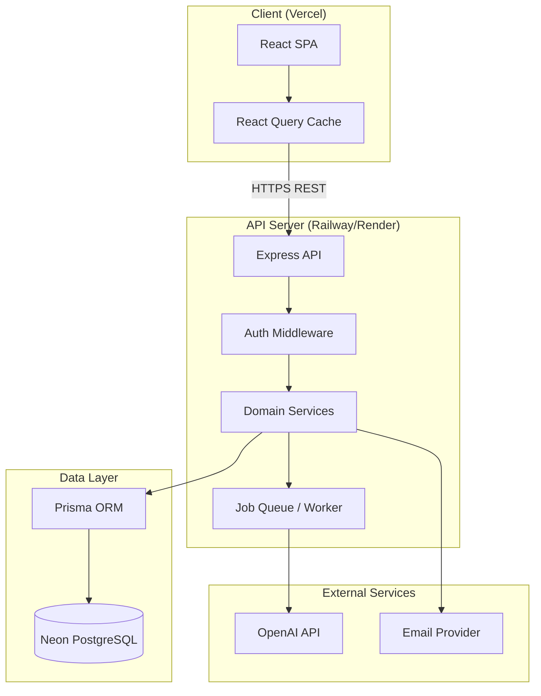
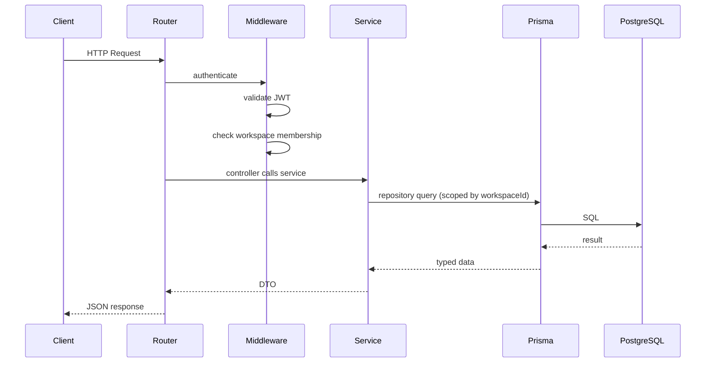
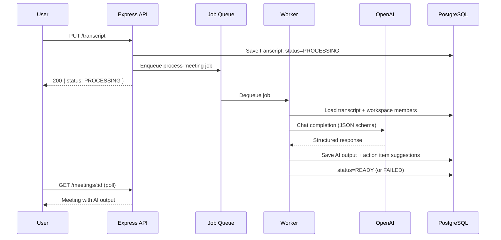

# System Architecture (Legacy)

**Product:** AI Meeting Notes & Task Manager  
**Version:** 1.0

> **Canonical reference:** [system-architecture.md](./system-architecture.md)  
> This file is retained for historical reference. Use `system-architecture.md` for implementation.

---

## 1. High-Level Architecture



### Component Overview

| Component | Responsibility |
|-----------|----------------|
| React SPA | User interface, routing, client state, API consumption |
| React Query | Server state caching, mutations, background refetch, polling |
| Express API | REST endpoints, auth, validation, business logic orchestration |
| Domain Services | Core business rules per module (meetings, tasks, AI, etc.) |
| Job Queue | Async AI processing; decouples long-running OpenAI calls |
| Prisma ORM | Type-safe database access, migrations, query building |
| Neon PostgreSQL | Persistent storage with connection pooling |
| OpenAI API | Transcript analysis, structured extraction, chat |
| Email Provider | Password reset, invitations, optional notifications |

---

## 2. Frontend Architecture

```
Browser
  └── React Router (routes, layouts, guards)
        ├── React Query (server state, cache, mutations)
        │     └── API Client (axios/fetch + interceptors)
        ├── Zustand or Context (UI state: sidebar, theme, workspace)
        └── Shadcn UI + Tailwind (components)
```

### Key Patterns

- **Feature-based folders:** `features/meetings`, `features/tasks`, etc.
- **Route guards:** `ProtectedRoute` (auth), `WorkspaceRoute` (membership)
- **Optimistic updates:** Kanban drag-and-drop with rollback on error
- **Token refresh:** Axios/fetch interceptor on 401 → refresh → retry
- **Polling:** React Query refetch interval for meeting `PROCESSING` status

### Route Structure

| Route | Page | Guard |
|-------|------|-------|
| `/login` | Login | Public |
| `/register` | Register | Public |
| `/forgot-password` | Forgot password | Public |
| `/workspaces` | Workspace list | Auth |
| `/workspaces/:id/dashboard` | Dashboard | Auth + Member |
| `/workspaces/:id/meetings` | Meeting list | Auth + Member |
| `/workspaces/:id/meetings/:meetingId` | Meeting detail | Auth + Member |
| `/workspaces/:id/tasks` | Task list / Kanban | Auth + Member |
| `/workspaces/:id/settings` | Workspace settings | Auth + Owner |

### State Management

| State Type | Tool | Examples |
|------------|------|----------|
| Server data | React Query | Meetings, tasks, user profile |
| Auth session | Context + localStorage | Access token, user |
| UI ephemeral | Zustand/Context | Sidebar open, active workspace |
| Form state | React Hook Form | Create meeting, task forms |

---

## 3. Backend Architecture

```
Express App
  ├── Middleware
  │     ├── cors, helmet, rateLimit
  │     ├── authenticate (JWT)
  │     ├── requireWorkspaceMember
  │     ├── requireRole(['OWNER'])
  │     ├── validate (Zod)
  │     └── errorHandler
  ├── Routes (thin controllers)
  ├── Services (business logic)
  ├── Repositories (Prisma data access)
  ├── Jobs (AI processing worker)
  └── Lib (JWT, email, OpenAI client)
```

### Request Lifecycle



### Module Boundaries

| Module | Routes Prefix | Key Services |
|--------|---------------|--------------|
| auth | `/auth` | register, login, refresh, reset |
| workspaces | `/workspaces` | CRUD, invitations, members |
| meetings | `/workspaces/:id/meetings` | CRUD, transcript upload |
| ai | `/workspaces/:id/meetings/:id/...` | process, output, chat |
| tasks | `/workspaces/:id/tasks` | CRUD, board, comments |
| dashboard | `/workspaces/:id/dashboard` | stats, activity |
| search | `/workspaces/:id/search` | full-text, filters |
| notifications | `/notifications` | list, read, preferences |

---

## 4. AI Integration Flow



### AI Processing Details

1. **Input:** Raw transcript + optional agenda/tags + workspace member names
2. **Model:** OpenAI GPT-4o (or equivalent) with structured JSON output
3. **Output:** Summary, decisions, risks, action items
4. **Post-processing:** Fuzzy-match assignee names to user IDs
5. **Retries:** 3 attempts with exponential backoff on transient failures
6. **Token limits:** Truncate or chunk transcripts > 100k characters

### Queue Strategy

| Phase | Implementation |
|-------|----------------|
| MVP early | In-process queue (simple, single instance) |
| MVP production | BullMQ + Upstash Redis |
| Scale | Dedicated worker process on Railway |

---

## 5. Database Flow

- All tenant data scoped by `workspace_id`
- Prisma middleware or service-layer guard enforces workspace membership on every query
- Migrations via `prisma migrate deploy` in CI/CD
- Neon connection pooling endpoint for application; direct connection for migrations
- Soft deletes via `deleted_at` on users, workspaces, meetings, tasks

### Multi-Tenancy Model

```
User ──< WorkspaceMember >── Workspace
                                  │
                    ┌─────────────┼─────────────┐
                    ▼             ▼             ▼
                Meeting         Task      ActivityLog
```

Every query for meetings, tasks, or search MUST include `WHERE workspace_id = :id` with membership verified.

---

## 6. Deployment Topology

| Component | Platform | Notes |
|-----------|----------|-------|
| Frontend | Vercel | Static SPA build; env vars for API URL |
| API + Worker | Railway or Render | Docker container; auto-deploy from main |
| Database | Neon PostgreSQL | Pooled connection string |
| Redis (queue) | Upstash Redis | Phase 4+ |
| Secrets | Platform env vars | Never committed to repo |
| Monitoring | Sentry | FE + BE error tracking |
| CI/CD | GitHub Actions | Lint, test, build, deploy |

### Docker Compose (Local Dev)

```yaml
services:
  api:
    build: ./backend
    ports: ["3001:3001"]
    env_file: .env
    depends_on: [db]

  db:
    image: postgres:16
    ports: ["5432:5432"]
    environment:
      POSTGRES_DB: meeting_notes
      POSTGRES_USER: postgres
      POSTGRES_PASSWORD: postgres
```

---

## 7. Project Structure

### Frontend (`frontend/`)

```
frontend/
├── public/
├── src/
│   ├── app/
│   │   ├── App.tsx
│   │   ├── router.tsx
│   │   └── providers.tsx
│   ├── components/
│   │   ├── ui/                 # Shadcn primitives
│   │   └── common/             # Layout, Header, Sidebar
│   ├── features/
│   │   ├── auth/
│   │   ├── workspaces/
│   │   ├── meetings/
│   │   ├── tasks/
│   │   ├── dashboard/
│   │   ├── search/
│   │   └── notifications/
│   ├── hooks/
│   ├── lib/
│   │   ├── api-client.ts
│   │   ├── utils.ts
│   │   └── constants.ts
│   ├── types/
│   └── main.tsx
├── index.html
├── tailwind.config.ts
├── tsconfig.json
├── vite.config.ts
└── package.json
```

### Backend (`backend/`)

```
backend/
├── prisma/
│   ├── schema.prisma
│   ├── migrations/
│   └── seed.ts
├── src/
│   ├── app.ts
│   ├── server.ts
│   ├── config/
│   ├── middleware/
│   ├── modules/
│   │   ├── auth/
│   │   ├── workspaces/
│   │   ├── meetings/
│   │   ├── ai/
│   │   ├── tasks/
│   │   ├── dashboard/
│   │   ├── search/
│   │   └── notifications/
│   ├── jobs/
│   ├── lib/
│   ├── types/
│   └── utils/
├── tests/
├── Dockerfile
├── docker-compose.yml
└── package.json
```

### Monorepo (Recommended)

```
/
├── apps/
│   ├── web/          # Frontend
│   └── api/          # Backend
├── packages/
│   └── shared-types/ # Shared Zod schemas & TS types
├── docker-compose.yml
├── package.json      # npm workspaces / Turborepo
└── README.md
```

---

## 8. Key Technical Decisions

| Decision | Choice | Rationale |
|----------|--------|-----------|
| API style | REST | Team familiarity; simple CRUD + React Query |
| Validation | Zod | Type-safe; shareable schemas FE/BE |
| Queue (MVP) | In-process → BullMQ | Start simple; migrate when scale demands |
| File storage | DB text (MVP) | Simplicity; S3 for large files later |
| Soft deletes | Yes | Audit and recovery |
| ID format | UUID v4 | Safe distributed generation |
| Auth | JWT + refresh cookie | Stateless API; secure refresh rotation |

---

## 9. Security Architecture

- **Transport:** TLS everywhere (Vercel, Railway enforce HTTPS)
- **Auth:** Short-lived access tokens; httpOnly refresh cookies
- **CORS:** Whitelist frontend origin only
- **Rate limiting:** Auth endpoints, AI triggers
- **Input validation:** Zod on all request bodies
- **SQL injection:** Prisma parameterized queries
- **XSS:** React escaping; sanitize rich text if added later
- **Workspace isolation:** Mandatory `workspaceId` on all tenant queries
