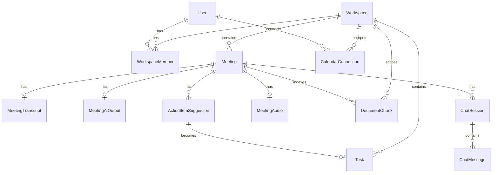

# Database Design — MeetingMind AI

**Product:** MeetingMind AI  
**Version:** 0.7.2  
**Synced:** 2026-07-29 from `backend/prisma/schema.prisma`  
**Related:** [erd.md](./erd.md) · [database-architecture.md](./database-architecture.md)

---

## 1. Overview

| Item        | Value                                          |
| ----------- | ---------------------------------------------- |
| Engine      | PostgreSQL 16                                  |
| Extensions  | pgvector (`vector(1536)` on `document_chunks`) |
| ORM         | Prisma                                         |
| Schema file | `backend/prisma/schema.prisma`                 |
| Migrations  | 14 under `backend/prisma/migrations/`          |

Local image: `pgvector/pgvector:pg16` (`docker-compose.yml`).

---

## 2. Migration history

| Migration                                    | Purpose                            |
| -------------------------------------------- | ---------------------------------- |
| `20250615000000_init`                        | Base                               |
| `20250615000001_auth`                        | Auth tokens                        |
| `20250615000002_workspace_invitations`       | Invitations                        |
| `20250615000003_meetings`                    | Meetings / transcripts             |
| `20250615000004_ai_processing`               | AI outputs / jobs                  |
| `20250615000005_task_status_history`         | Task history                       |
| `20250615000006_notification_preferences`    | Prefs                              |
| `20250618000000_meetingmind_pgvector`        | Vector / chunks                    |
| `20250619000000_meetingmind_ai_tables`       | LLM / agents / chat / KB / reports |
| `20250620000000_meeting_audio_transcription` | Audio jobs                         |
| `20250620000001_add_risk_source_type`        | Risk source enum tweak             |
| `20250621000000_calendar_integration`        | Calendar                           |
| `20250720000000_meeting_imports`             | Platform imports                   |
| `20250720000001_google_auth_meet`            | Google auth + Meet fields          |

---

## 3. Enums (from Prisma)

| Enum                       | Values                                                                                                                                      |
| -------------------------- | ------------------------------------------------------------------------------------------------------------------------------------------- |
| `WorkspaceRole`            | OWNER, MEMBER                                                                                                                               |
| `MeetingStatus`            | DRAFT, TRANSCRIBING, PROCESSING, READY, FAILED                                                                                              |
| `TranscriptionJobStatus`   | PENDING, TRANSCRIBING, COMPLETED, FAILED                                                                                                    |
| `AiProcessingStatus`       | PENDING, PROCESSING, COMPLETED, FAILED                                                                                                      |
| `ActionItemStatus`         | PENDING, ACCEPTED, REJECTED                                                                                                                 |
| `JobStatus`                | PENDING, PROCESSING, COMPLETED, FAILED, CANCELLED                                                                                           |
| `TaskStatus`               | TODO, IN_PROGRESS, DONE                                                                                                                     |
| `TaskPriority`             | LOW, MEDIUM, HIGH                                                                                                                           |
| `NotificationType`         | TASK_ASSIGNED, TASK_MENTION, TASK_DUE_SOON, TASK_OVERDUE, INVITATION, MEETING_PROCESSED, MEETING_TRANSCRIPT_REMINDER, MEETING_STARTING_SOON |
| `AuthProvider`             | PASSWORD, GOOGLE, BOTH                                                                                                                      |
| `CalendarProvider`         | GOOGLE, MICROSOFT                                                                                                                           |
| `CalendarConnectionStatus` | ACTIVE, REVOKED, ERROR                                                                                                                      |
| `MeetingSource`            | MANUAL, GOOGLE_CALENDAR, MICROSOFT_CALENDAR, ZOOM_IMPORT, GOOGLE_MEET_IMPORT, TEAMS_IMPORT                                                  |
| `MeetingImportProvider`    | ZOOM, GOOGLE_MEET, TEAMS                                                                                                                    |
| `MeetingImportStatus`      | PENDING, IMPORTED, FAILED                                                                                                                   |
| `DocumentSourceType`       | TRANSCRIPT, SUMMARY, DECISION, RISK, ACTION_ITEM, KNOWLEDGE                                                                                 |
| `EmbeddingJobStatus`       | PENDING, RUNNING, COMPLETED, FAILED                                                                                                         |
| `ChatRole`                 | USER, ASSISTANT, SYSTEM                                                                                                                     |
| `LlmInvocationStatus`      | COMPLETED, FAILED                                                                                                                           |
| `KnowledgeEntityType`      | PERSON, PROJECT, DECISION, CONCEPT, PROCESS, OTHER                                                                                          |

---

## 4. Tables (models)

### Identity & tenancy

| Model                 | Table                   | Key relations                              |
| --------------------- | ----------------------- | ------------------------------------------ |
| `User`                | `users`                 | memberships, tokens, tasks, chat, calendar |
| `RefreshToken`        | `refresh_tokens`        | → User                                     |
| `PasswordResetToken`  | `password_reset_tokens` | → User                                     |
| `Workspace`           | `workspaces`            | members, meetings, tasks, RAG, reports     |
| `WorkspaceMember`     | `workspace_members`     | User ↔ Workspace + role                    |
| `WorkspaceInvitation` | `workspace_invitations` | Workspace + sender                         |

### Meetings & capture

| Model                  | Table                     | Notes                                       |
| ---------------------- | ------------------------- | ------------------------------------------- |
| `Meeting`              | `meetings`                | status, Meet URL, calendar ids, soft delete |
| `MeetingTranscript`    | `meeting_transcripts`     | 1:1 content                                 |
| `MeetingAiOutput`      | `meeting_ai_outputs`      | summary, decisions, risks JSON              |
| `ActionItemSuggestion` | `action_item_suggestions` | accept → Task                               |
| `AiProcessingJob`      | `ai_processing_jobs`      | BullMQ tracking                             |
| `MeetingAudio`         | `meeting_audio`           | storage path + transcription status         |
| `MeetingImport`        | `meeting_imports`         | platform import metadata                    |

### Tasks & collab

| Model                    | Table                      | Notes                     |
| ------------------------ | -------------------------- | ------------------------- |
| `Task`                   | `tasks`                    | Kanban columns via status |
| `TaskStatusHistory`      | `task_status_history`      | audit                     |
| `Comment`                | `comments`                 | task comments             |
| `Notification`           | `notifications`            | in-app                    |
| `NotificationPreference` | `notification_preferences` | per user                  |
| `ActivityLog`            | `activity_logs`            | workspace activity        |

### RAG / AI observability / chat

| Model             | Table               | Notes                                                 |
| ----------------- | ------------------- | ----------------------------------------------------- |
| `DocumentChunk`   | `document_chunks`   | embedding `vector(1536)`; FTS via SQL `search_vector` |
| `EmbeddingJob`    | `embedding_jobs`    | async embed                                           |
| `LlmInvocation`   | `llm_invocations`   | per-call metrics                                      |
| `LlmUsageDaily`   | `llm_usage_daily`   | daily rollup                                          |
| `AgentExecution`  | `agent_executions`  | agent run log                                         |
| `ChatSession`     | `chat_sessions`     | meeting or workspace scoped                           |
| `ChatMessage`     | `chat_messages`     | roles + citations JSON                                |
| `KnowledgeEntry`  | `knowledge_entries` | KB entities                                           |
| `WorkspaceReport` | `workspace_reports` | weekly reports                                        |

### Calendar

| Model                 | Table                    | Notes                           |
| --------------------- | ------------------------ | ------------------------------- |
| `CalendarConnection`  | `calendar_connections`   | OAuth tokens (encrypted fields) |
| `CalendarSyncedEvent` | `calendar_synced_events` | synced events ↔ meetings        |

---

## 5. ERD (core)



Full diagram: [erd.md](./erd.md).

---

## 6. Important indexes & constraints

From schema (non-exhaustive):

| Table                     | Index / constraint                                                                       |
| ------------------------- | ---------------------------------------------------------------------------------------- |
| `users`                   | unique `email`; unique `google_sub`                                                      |
| `meetings`                | `(workspace_id, meeting_date DESC)`; unique `(workspace_id, external_calendar_event_id)` |
| `action_item_suggestions` | `(meeting_id)`                                                                           |
| `ai_processing_jobs`      | unique `idempotency_key`; `(meeting_id)`, `(status)`                                     |
| `tasks`                   | `(workspace_id, status)`, `(assignee_id, status)`                                        |
| `notifications`           | `(user_id, created_at DESC)`                                                             |
| `document_chunks`         | workspace/meeting/source indexes (see migration + architecture doc)                      |
| Soft deletes              | `deleted_at` on User, Workspace, Meeting, Task, Comment                                  |

---

## 7. Vector / FTS notes

- Embeddings stored as Prisma `Unsupported("vector(1536)")`
- Full-text `search_vector` managed in SQL migrations (not a Prisma field)
- Hybrid retrieval + RRF implemented in `backend/src/modules/vector/` and `rag/`

---

## 8. Operational commands

```bash
cd backend
npx prisma generate
npx prisma migrate dev      # local
npm run prisma:deploy       # apply in Docker/prod-style
npx prisma studio
```
