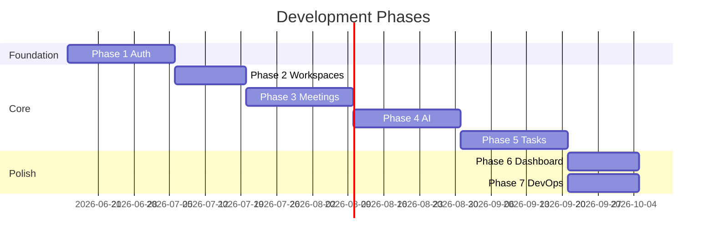

# Development Roadmap

**Product:** AI Meeting Notes & Task Manager  
**Version:** 1.1  
**Total Estimated Timeline:** 14–18 weeks (2 engineers)

> **Review notes:** See [architecture-review.md](./architecture-review.md). Key additions: staging environment (Phase 7), BullMQ required for Phase 4 production exit, tenant isolation tests from Phase 2, security review gate before launch.

---

## Overview

---

## Phase 1: Foundation & Authentication

**Duration:** 2–3 weeks  
**Priority:** P0

### Objectives

- Establish project scaffolding for frontend and backend
- Implement secure authentication flow
- Set up local development environment with Docker
- Establish CI basics (lint, typecheck)

### Deliverables

| # | Deliverable | Owner |
|---|-------------|-------|
| 1 | Monorepo or dual-repo scaffold (FE + BE) | BE |
| 2 | Prisma schema: `users`, `refresh_tokens`, `password_reset_tokens` | BE |
| 3 | Auth API: register, login, logout, refresh, forgot/reset password | BE |
| 4 | JWT middleware + rate limiting on auth routes | BE |
| 5 | React auth pages: login, register, forgot password, reset password | FE |
| 6 | Protected route wrapper + auth context | FE |
| 7 | API client with token refresh interceptor | FE |
| 8 | Docker Compose: API + PostgreSQL | BE |
| 9 | ESLint, Prettier, TypeScript strict config | Both |
| 10 | GitHub Actions: lint + typecheck on PR | BE |

### Dependencies

- Neon PostgreSQL provisioned (or local Docker Postgres)
- Environment variable template (`.env.example`)

### Exit Criteria

- User can register, log in, log out, and reset password end-to-end
- Protected routes redirect unauthenticated users to login
- All auth endpoints have integration tests

---

## Phase 2: Workspace Management

**Duration:** 2 weeks  
**Priority:** P0

### Objectives

- Multi-tenant workspace foundation
- Member invitation and role management
- Workspace context in frontend

### Deliverables

| # | Deliverable | Owner |
|---|-------------|-------|
| 1 | Prisma schema: `workspaces`, `workspace_members`, `workspace_invitations` | BE |
| 2 | Workspace CRUD API | BE |
| 3 | Invitation flow: create, list, accept | BE |
| 4 | Member management: list, update role, remove | BE |
| 5 | `requireWorkspaceMember` + `requireRole` middleware | BE |
| 6 | Workspace list + create UI | FE |
| 7 | Workspace switcher in app shell | FE |
| 8 | Workspace settings page (members, invitations) | FE |
| 9 | Invitation accept page (deep link) | FE |

### Dependencies

- Phase 1 complete
- Email provider configured (or dev log fallback)

### Exit Criteria

- User can create workspace, invite member, accept invite
- Role-based access enforced on workspace routes
- Workspace switcher persists selection

---

## Phase 3: Meeting Management

**Duration:** 2–3 weeks  
**Priority:** P0

### Objectives

- Core meeting CRUD
- Transcript upload and paste
- Meeting history with filters

### Deliverables

| # | Deliverable | Owner |
|---|-------------|-------|
| 1 | Prisma schema: `meetings`, `meeting_transcripts`, `ai_processing_jobs` | BE |
| 2 | Meeting CRUD API with workspace scoping | BE |
| 3 | Transcript upload endpoint with validation | BE |
| 4 | Meeting list with pagination and filters | BE |
| 5 | Meeting detail endpoint (metadata + transcript) | BE |
| 6 | Meeting list page with filters | FE |
| 7 | Create/edit meeting form | FE |
| 8 | Meeting detail page (metadata, transcript view) | FE |
| 9 | Transcript paste + file upload UI | FE |
| 10 | Processing status badge component | FE |

### Dependencies

- Phase 2 complete

### Exit Criteria

- User can create meeting, upload transcript, view history
- Transcript validation enforced (min length, max size)
- Soft delete works; deleted meetings hidden from list

---

## Phase 4: AI Processing

**Duration:** 3 weeks  
**Priority:** P0

### Objectives

- OpenAI integration for structured meeting analysis
- Async job processing
- AI output display and editing

### Deliverables

| # | Deliverable | Owner |
|---|-------------|-------|
| 1 | Prisma schema: `meeting_ai_outputs`, `action_item_suggestions` | BE |
| 2 | OpenAI client with JSON schema prompt | BE |
| 3 | Job queue + `process-meeting` worker | BE |
| 4 | AI output CRUD endpoints | BE |
| 5 | Action item list + accept/reject endpoints | BE |
| 6 | Assignee fuzzy-matching post-processor | BE |
| 7 | AI output section on meeting detail (summary, decisions, risks) | FE |
| 8 | Processing status polling (React Query) | FE |
| 9 | Action item review UI (accept/reject/edit) | FE |
| 10 | Editable AI output fields | FE |
| 11 | Error state for failed processing | FE |

### Dependencies

- Phase 3 complete
- OpenAI API key
- Redis recommended (Upstash); in-process queue acceptable for dev

### Exit Criteria

- Transcript upload triggers AI job; status transitions DRAFT → PROCESSING → READY (or FAILED)
- BullMQ + Redis deployed (not in-process queue)
- Summary, decisions, risks, and action items displayed
- User can accept action items (task creation in Phase 5)
- Failed jobs show error with retry option

---

## Phase 5: Task Management

**Duration:** 2–3 weeks  
**Priority:** P0

### Objectives

- Convert accepted action items to tasks
- Kanban board workflow
- Task assignment, comments, notifications

### Deliverables

| # | Deliverable | Owner |
|---|-------------|-------|
| 1 | Prisma schema: `tasks`, `task_comments`, `task_status_history`, `notifications` | BE |
| 2 | Task CRUD API | BE |
| 3 | Kanban board endpoint (grouped by status) | BE |
| 4 | Accept action items → create tasks (linked) | BE |
| 5 | Comment API with @mention parsing | BE |
| 6 | In-app notification creation on assign/mention | BE |
| 7 | Kanban board UI (3 columns) | FE |
| 8 | Task detail drawer/modal | FE |
| 9 | Task create/edit form | FE |
| 10 | Comment thread UI | FE |
| 11 | Notification bell + dropdown | FE |

### Dependencies

- Phase 4 complete

### Exit Criteria

- Accepted action items create linked tasks
- Kanban board displays and updates task status
- Assignee receives in-app notification
- Comments with @mentions trigger notifications

---

## Phase 6: Dashboard & Analytics

**Duration:** 2 weeks  
**Priority:** P0

### Objectives

- Workspace dashboard with key metrics
- Activity feed
- Search across meetings and tasks

### Deliverables

| # | Deliverable | Owner |
|---|-------------|-------|
| 1 | Prisma schema: `activity_logs` | BE |
| 2 | Dashboard stats endpoint | BE |
| 3 | Activity log writer (hook into services) | BE |
| 4 | Search endpoint (meetings + tasks) | BE |
| 5 | Full-text search on summaries (PostgreSQL FTS) | BE |
| 6 | Dashboard page with stat cards | FE |
| 7 | Recent activity feed component | FE |
| 8 | Global search bar + results page | FE |
| 9 | Productivity chart (tasks/week) | FE |

### Dependencies

- Phases 3–5 complete

### Exit Criteria

- Dashboard shows accurate stats for workspace
- Activity feed updates on key actions
- Search returns relevant meetings and tasks

---

## Phase 7: Deployment & DevOps

**Duration:** 1–2 weeks (parallel with Phase 6)  
**Priority:** P0

### Objectives

- Production deployment pipeline
- Monitoring and observability
- Documentation for operations

### Deliverables

| # | Deliverable | Owner |
|---|-------------|-------|
| 1 | Production Dockerfile (multi-stage) | BE |
| 2 | GitHub Actions: test, build, deploy | BE |
| 3 | Vercel deployment for frontend | FE |
| 4 | Railway/Render deployment for API | BE |
| 5 | Neon production database + pooling | BE |
| 6 | Environment variable documentation | Both |
| 7 | Sentry integration (FE + BE) | Both |
| 8 | Health check endpoint + uptime monitoring | BE |
| 9 | OpenAPI spec generation | BE |
| 10 | Database backup verification | BE |
| 11 | Staging environment (Neon branch + Railway staging) | BE |
| 12 | Security review gate (checklist from security-architecture.md) | Both |
| 13 | Tenant isolation integration test suite | BE |

### Dependencies

- MVP feature-complete (Phases 1–6)
- Domain names (optional)
- Platform accounts: Vercel, Railway, Neon

### Exit Criteria

- Production deploy on merge to `main`
- Health check returns 200
- Sentry captures errors
- Rollback procedure documented

---

## Milestone Summary

| Milestone | Phase | Target Week | Key Demo |
|-----------|-------|-------------|----------|
| M1: Auth works | 1 | Week 3 | Register → login → protected page |
| M2: Team onboarded | 2 | Week 5 | Create workspace → invite → join |
| M3: Meetings live | 3 | Week 8 | Upload transcript → view meeting |
| M4: AI magic | 4 | Week 11 | Transcript → summary + action items |
| M5: Tasks flowing | 5 | Week 14 | Accept items → Kanban → complete |
| M6: MVP launch | 6+7 | Week 16–18 | Full flow in production |

---

## Team Allocation

| Role | Phases | Focus |
|------|--------|-------|
| Backend Engineer | 1–7 | API, Prisma, AI jobs, DevOps |
| Frontend Engineer | 1–7 | React UI, React Query, Shadcn |
| PM (part-time) | All | Scope, acceptance, stakeholder demos |
| Designer (part-time) | 1, 3, 5 | Wireframes for key flows |

---

## Risk Buffer

- Add 1 week buffer before MVP launch for integration testing and bug fixes
- Phase 4 (AI) is highest risk — start OpenAI spike in Week 6 during Phase 3
