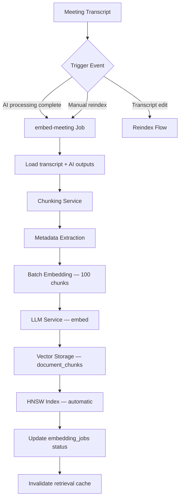
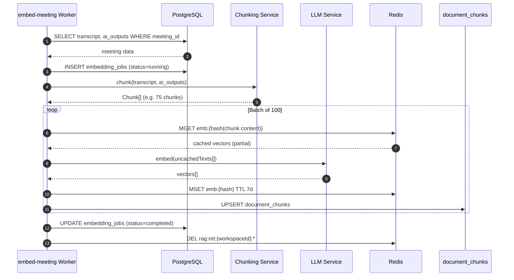
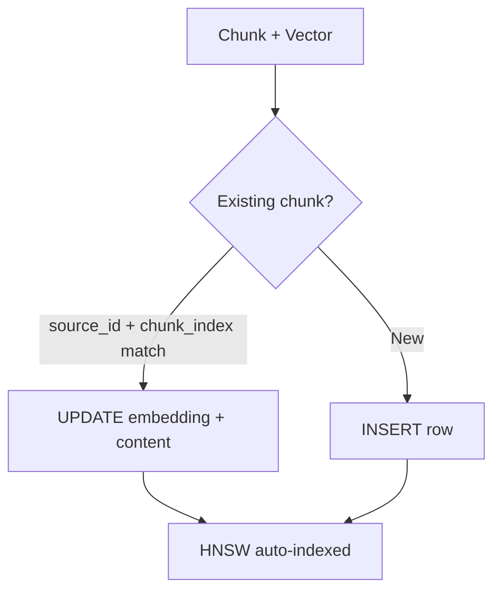
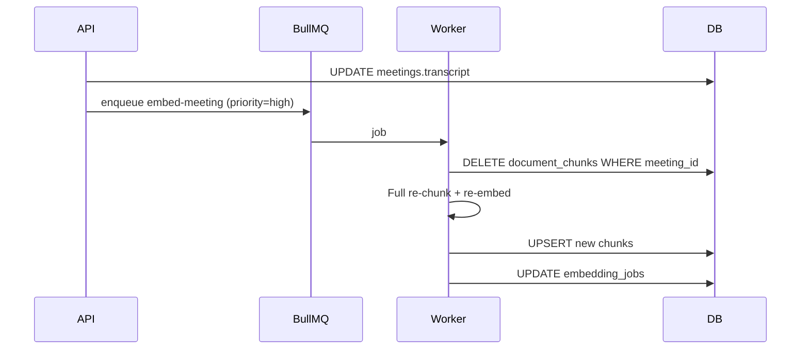
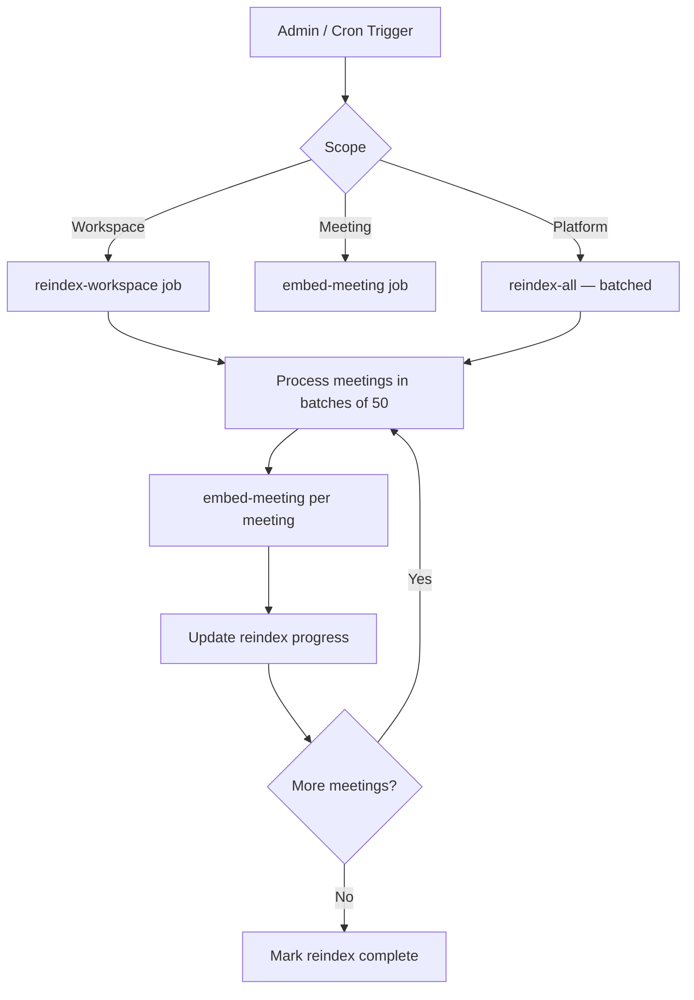
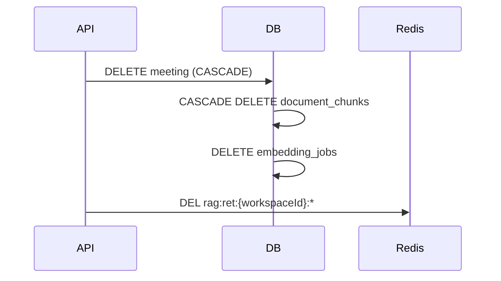
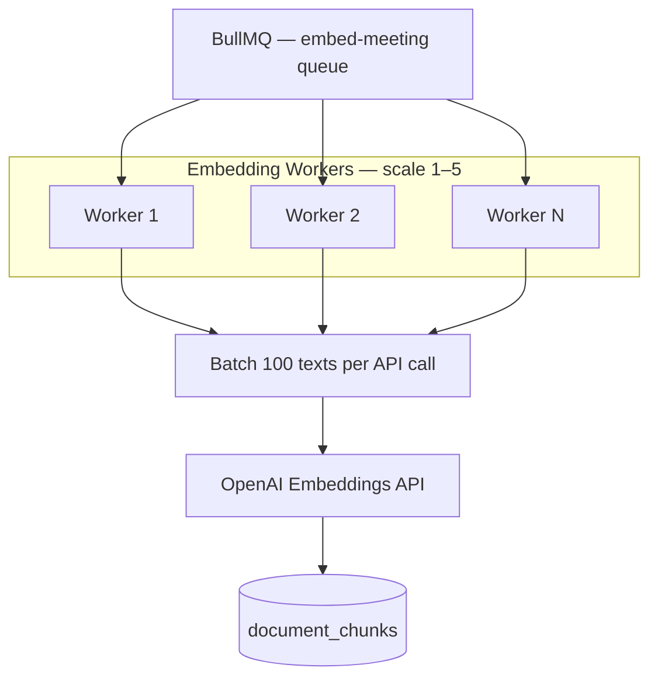
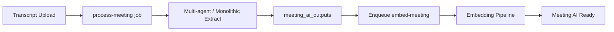

# Embedding Flow — MeetingMind AI

**Product:** MeetingMind AI  
**Version:** 1.0  
**Status:** Architecture — Documentation Only  
**Scope:** Transcript ingestion through vector indexing

---

## 1. Primary Embedding Pipeline



---

## 2. Chunking Detail

```mermaid
flowchart LR
    subgraph Sources["Chunk Sources"]
        T[Transcript paragraphs]
        S[Summary sections]
        D[Decisions]
        A[Action items]
        K[Knowledge entries]
    end

    subgraph Process["Chunking"]
        Clean[Clean + normalize]
        Split[Split by token limit]
        Overlap[Apply overlap — transcript only]
        Enrich[Attach metadata]
    end

    T --> Clean
    S & D & A & K --> Enrich
    Clean --> Split --> Overlap --> Enrich
    Enrich --> Chunks[Chunk[]]
```

| Source | Chunks per Meeting (avg) | Token Size |
|--------|--------------------------|------------|
| Transcript (60 min) | 40–80 | 512 |
| Summary | 3–5 | Full section |
| Decisions | 2–10 | Variable |
| Action items | 5–15 | Variable |
| **Total** | **~50–110** | |

---

## 3. Embedding Generation Sequence



---

## 4. Metadata Extraction

| Field | Source | Extraction Method |
|-------|--------|-------------------|
| `workspace_id` | `meetings.workspace_id` | Direct |
| `meeting_id` | `meetings.id` | Direct |
| `source_type` | Chunk origin | Chunker assignment |
| `source_id` | meeting_id or entity id | Chunker assignment |
| `speaker` | VTT `[Speaker]` tags | Regex parser |
| `timestamp_start` | VTT timestamps | Regex parser |
| `meeting_title` | `meetings.title` | Join |
| `meeting_date` | `meetings.scheduled_at` | Join |
| `token_count` | Chunk content | tiktoken count |
| `embedding_model` | Config | `EMBEDDING_MODEL` env |

---

## 5. Vector Storage



**UPSERT key:** `(workspace_id, source_type, source_id, chunk_index)`

---

## 6. Update Flow

Triggered when: transcript edited, AI outputs regenerated, meeting metadata changed.



**Rule:** Always delete-then-insert for meeting updates — avoids stale chunk orphans.

---

## 7. Reindex Flow

Triggered when: embedding model change, bulk workspace migration, index corruption.



| Reindex Type | Trigger | Concurrency | Est. Duration |
|--------------|---------|-------------|---------------|
| Single meeting | Transcript edit | 1 | < 30s |
| Workspace | Model upgrade | 5 parallel | ~1h per 1000 meetings |
| Platform | Admin command | 10 parallel | ~24h per 10k meetings |

---

## 8. Deletion Flow



| Event | Chunks Affected | Cache Action |
|-------|-----------------|--------------|
| Meeting deleted | CASCADE DELETE all meeting chunks | Invalidate workspace retrieval cache |
| Workspace deleted | CASCADE DELETE all chunks | Invalidate all workspace caches |
| Knowledge entry deleted | DELETE chunks WHERE source_id | Invalidate workspace cache |
| AI output regenerated | DELETE + re-insert summary/decision chunks | Invalidate meeting cache |

---

## 9. Batch Processing



| Parameter | Value |
|-----------|-------|
| Batch size | 100 chunks |
| Worker concurrency | 3 per worker process |
| Queue priority | High: user-triggered; Normal: post-process; Low: reindex |
| Retry | 3 attempts; exponential backoff |
| Dead letter | After 3 failures → `embedding_jobs.status=failed` |

---

## 10. Pipeline Integration with AI Processing



**Ordering guarantee:** `embed-meeting` only starts after `process-meeting` completes successfully.

---

## 11. Index Status & UI

| Status | Meaning | UI Indicator |
|--------|---------|--------------|
| `pending` | Job queued | "Indexing..." spinner |
| `running` | Embedding in progress | Progress bar |
| `completed` | All chunks indexed | Green check |
| `failed` | Error after retries | Red warning + retry button |
| `stale` | Transcript newer than chunks | Yellow warning |

---

## 12. Performance & Cost

| Metric | Target |
|--------|--------|
| Embed 75 chunks (single meeting) | < 30s |
| Embed 1000 meetings (batch reindex) | < 4 hours (5 workers) |
| Cost per meeting (75 chunks, ~40k tokens) | ~$0.0008 |
| Cache hit rate (re-embed) | > 80% for unchanged chunks |

---

## 13. Error Handling

| Error | Action |
|-------|--------|
| OpenAI 429 | Backoff; retry batch |
| OpenAI 5xx | Retry 3x; fail job |
| Empty transcript | Skip embedding; status=completed |
| Chunk too large | Force split at sentence boundary |
| DB write failure | Retry transaction; rollback batch |
| Partial batch failure | Retry failed chunks only |

---

## 14. Security

- Embedding jobs inherit workspace auth from triggering user
- No cross-workspace batch operations
- Transcript content not logged in embedding worker
- Reindex admin endpoint requires `workspace:admin` role

---

## Related Documents

- [vector-db-design.md](./vector-db-design.md)
- [rag-architecture.md](./rag-architecture.md)
- [retrieval-flow.md](./retrieval-flow.md)
- [agent-flow.md](./agent-flow.md)

---

## Document History

| Version | Date | Changes |
|---------|------|---------|
| 1.0 | 2026-06-18 | Initial embedding flow |
