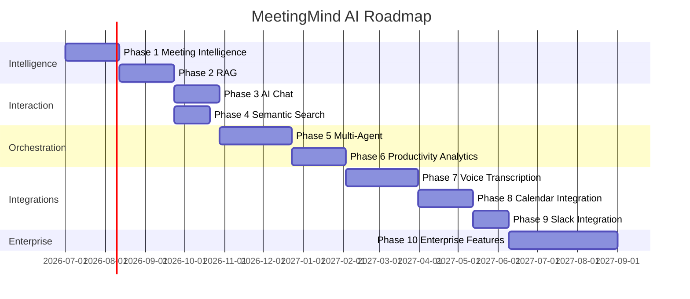
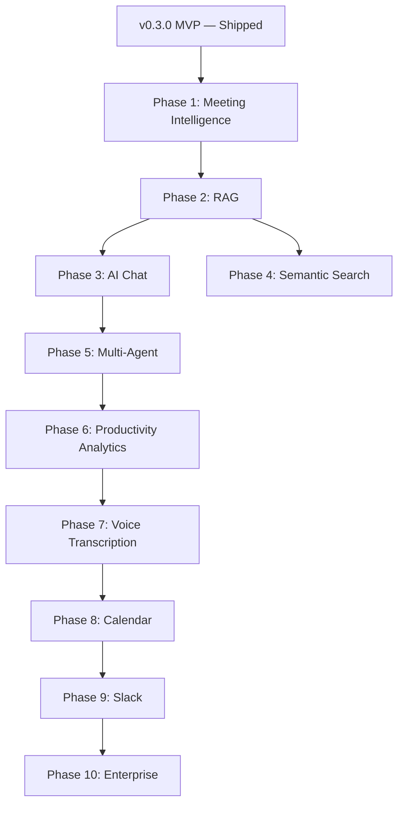

# Future Roadmap — MeetingMind AI

**Product:** MeetingMind AI (evolution of AI Meeting Notes & Task Manager)  
**Version:** 1.0  
**Status:** Strategic Roadmap — Documentation Only  
**Current Baseline:** Platform v0.3.0 (full MVP: auth, workspaces, meetings, AI extraction, tasks, dashboard, search, notifications)

---

## 1. Vision

Transform the shipped MVP into a **production-grade LLM-powered Meeting Intelligence Platform** through incremental phases that preserve existing functionality while adding model abstraction, RAG, semantic search, multi-agent orchestration, and enterprise capabilities.

### Guiding Principles

1. **Never break existing users** — each phase is backward compatible
2. **Ship incrementally** — every phase delivers standalone value
3. **Measure before scaling** — observability before optimization
4. **Extend the monolith** — microservices only when metrics justify

---

## 2. Roadmap Overview

**Estimated total:** 18–24 months from Phase 1 start (post-MVP v0.3.0)

---

## Phase 1: Meeting Intelligence

**Duration:** 4–6 weeks  
**Depends on:** v0.3.0 MVP (shipped)

### Objectives

- Introduce LLM abstraction layer (preserve OpenAI as default)
- Enhance extraction quality with specialized prompts per output type
- Add meeting recommendations and context memory foundations
- Establish `llm_invocations` observability

### Deliverables

| # | Deliverable |
|---|-------------|
| 1 | `LLMProvider` interface + OpenAI adapter (refactor existing) |
| 2 | Versioned prompt templates per extraction type |
| 3 | Provider fallback chain (OpenAI → Gemini → Claude) |
| 4 | `llm_invocations` table + token/cost logging |
| 5 | Meeting recommendations on dashboard |
| 6 | Enhanced summary with topics array |
| 7 | Gemini + Claude provider adapters (staging) |
| 8 | Feature flag: `AI_PIPELINE_MODE=monolithic|multi-prompt` |

### Preserved

- All existing API endpoints and response schemas
- Action item review → task conversion flow
- BullMQ job queue architecture
- `AI_USE_MOCK=true` dev mode

### Success Criteria

- Extraction success rate ≥ 95%
- Token usage logged for 100% of LLM calls
- Zero regression on existing integration tests
- User edit rate on summaries stable or improved

### Requirements Reference

- [llm-requirements.md](./llm-requirements.md) — Sections 1–14, 15.1–15.5, 15.7, 15.9

---

## Phase 2: RAG

**Duration:** 5–6 weeks  
**Depends on:** Phase 1

### Objectives

- Enable vector storage and retrieval (pgvector on Neon)
- Chunk and embed all processed meetings
- Build RAG service for context retrieval
- Hybrid search foundation

### Deliverables

| # | Deliverable |
|---|-------------|
| 1 | `pgvector` extension + `document_chunks` table |
| 2 | Chunking service with overlap strategy |
| 3 | `embed-meeting` BullMQ job (post-processing) |
| 4 | Embedding batch API integration |
| 5 | RAG retrieval service with metadata filters |
| 6 | Hybrid search (vector + FTS fusion) |
| 7 | `embedding_jobs` tracking |
| 8 | Re-index on transcript edit |
| 9 | Index status UI indicator |

### Preserved

- Keyword search (`mode=keyword`) unchanged
- Meeting processing pipeline (adds async embed step)
- PostgreSQL FTS on transcripts (complementary)

### Success Criteria

- ≥ 95% of READY meetings indexed within 5 minutes
- Retrieval p95 < 300ms
- Hybrid search recall > keyword-only on eval set (20 queries)

### Requirements Reference

- [rag-requirements.md](./rag-requirements.md)
- [vector-db-requirements.md](./vector-db-requirements.md)

---

## Phase 3: AI Chat

**Duration:** 4–5 weeks  
**Depends on:** Phase 2

### Objectives

- Launch workspace-wide conversational AI
- Enhance per-meeting chat with RAG
- Streaming SSE responses with citations

### Deliverables

| # | Deliverable |
|---|-------------|
| 1 | Context Retrieval Agent |
| 2 | Chat Agent with streaming |
| 3 | Workspace chat sessions API |
| 4 | Per-meeting chat RAG enhancement |
| 5 | Citation UI components |
| 6 | Conversation memory + rolling summary |
| 7 | Intent classification (SQL vs RAG routing) |
| 8 | Thumbs up/down feedback |
| 9 | Chat SSE frontend component |

### Preserved

- Existing per-meeting chat endpoints (enhanced, not replaced)
- `meeting_chat_messages` table

### Success Criteria

- Chat first-token p95 < 2s
- Citation accuracy ≥ 90% (human eval, 50 queries)
- Hallucination rate < 5%
- User thumbs-up ≥ 75%

### Requirements Reference

- [ai-chat-requirements.md](./ai-chat-requirements.md)

---

## Phase 4: Semantic Search

**Duration:** 3–4 weeks  
**Depends on:** Phase 2 (can parallel with Phase 3)

### Objectives

- Upgrade search from keyword to hybrid semantic
- Search across all entity types with relevance ranking

### Deliverables

| # | Deliverable |
|---|-------------|
| 1 | `mode=hybrid|semantic|keyword` on search endpoint |
| 2 | Snippet results with similarity scores |
| 3 | Metadata filters (date, tags, type, severity) |
| 4 | Re-ranking with recency + type boosts |
| 5 | Search UI: match type badges, snippet cards |
| 6 | Embed tasks on create/update |
| 7 | Search analytics (zero-result rate) |

### Preserved

- Existing search API params and response fields (additive)
- Global search bar and mobile search components

### Success Criteria

- Search p95 < 300ms
- Click-through rate ≥ 60%
- Zero-result rate < 20%

### Requirements Reference

- [semantic-search-requirements.md](./semantic-search-requirements.md)

---

## Phase 5: Multi-Agent Orchestration

**Duration:** 6–8 weeks  
**Depends on:** Phase 3

### Objectives

- Replace monolithic extraction with parallel specialized agents
- Add Knowledge Agent for persistent workspace knowledge
- Agent execution tracking and per-agent observability

### Deliverables

| # | Deliverable |
|---|-------------|
| 1 | Agent Orchestrator service |
| 2 | Summarizer, Decision, Task, Risk agents (parallel) |
| 3 | Knowledge Agent + `knowledge_entries` table |
| 4 | `agent_executions` tracking |
| 5 | Merge layer → canonical `meeting_ai_outputs` schema |
| 6 | Feature flag: `AI_PIPELINE_MODE=multi-agent` |
| 7 | Per-agent metrics dashboard |
| 8 | Partial failure handling (graceful degradation) |
| 9 | Agent registry for future agents |

### Preserved

- `AI_PIPELINE_MODE=monolithic` fallback
- Output schema identical to v0.3.0
- Action item suggestions flow unchanged

### Success Criteria

- Multi-agent quality ≥ monolithic on golden eval set
- Pipeline p95 < 90s (parallel execution)
- Per-agent success rate ≥ 95%

### Requirements Reference

- [multi-agent-requirements.md](./multi-agent-requirements.md)

---

## Phase 6: Productivity Analytics

**Duration:** 5–6 weeks  
**Depends on:** Phase 5

### Objectives

- Weekly automated reports
- Productivity insights and cross-meeting analysis
- Historical meeting intelligence

### Deliverables

| # | Deliverable |
|---|-------------|
| 1 | Weekly Report Agent + cron scheduler |
| 2 | `workspace_reports` table + report UI |
| 3 | Productivity insights dashboard cards |
| 4 | Cross-meeting analysis endpoint |
| 5 | Historical trend charts (meetings/week, task velocity) |
| 6 | Anomaly detection (overdue spike, meeting volume) |
| 7 | Optional email digest to Owners |
| 8 | Report export (PDF/Markdown) |

### Success Criteria

- Weekly reports generated for 100% active workspaces
- Report open rate ≥ 60%
- Insight action click-through ≥ 25%

### Requirements Reference

- [llm-requirements.md](./llm-requirements.md) — Sections 15.5–15.11

---

## Phase 7: Voice Transcription

**Duration:** 6–8 weeks  
**Depends on:** Phase 6

### Objectives

- Accept audio uploads; transcribe to text before AI pipeline
- Eliminate manual transcript paste for recorded meetings

### Deliverables

| # | Deliverable |
|---|-------------|
| 1 | Audio upload (.mp3, .m4a, .wav, max 100MB) |
| 2 | Whisper API or Deepgram integration |
| 3 | `transcribe-audio` BullMQ job |
| 4 | Transcription status UI (uploading → transcribing → processing) |
| 5 | Object storage for audio files (S3/R2) |
| 6 | Speaker diarization (optional, MVP+1 within phase) |

### Preserved

- Text transcript upload (paste/file) unchanged
- Existing AI pipeline triggered after transcription completes

### Success Criteria

- Transcription accuracy ≥ 90% (WER on sample set)
- Audio → READY pipeline < 5 min for 60-min recording

---

## Phase 8: Calendar Integration

**Duration:** 5–6 weeks  
**Depends on:** Phase 7

### Objectives

- Sync Google Calendar / Outlook meetings
- Auto-create meeting records with metadata pre-filled

### Deliverables

| # | Deliverable |
|---|-------------|
| 1 | Google Calendar OAuth integration |
| 2 | Microsoft Outlook OAuth integration |
| 3 | Calendar sync job (hourly) |
| 4 | Auto-create meeting stubs from calendar events |
| 5 | Attendee mapping to workspace members |
| 6 | Post-meeting reminder to upload transcript |

### Success Criteria

- Calendar sync latency < 1 hour
- 50% of meetings auto-created from calendar (adoption metric)

---

## Phase 9: Slack Integration

**Duration:** 3–4 weeks  
**Depends on:** Phase 8

### Objectives

- Post meeting summaries and task assignments to Slack channels
- Receive Slack commands for search and status

### Deliverables

| # | Deliverable |
|---|-------------|
| 1 | Slack OAuth app installation per workspace |
| 2 | Channel notification on meeting READY |
| 3 | Task assignment notifications in Slack |
| 4 | `/meetingmind search <query>` slash command |
| 5 | Weekly report posted to configured channel |

### Success Criteria

- Slack notification delivery rate ≥ 99%
- 30% of workspaces connect Slack within 90 days

---

## Phase 10: Enterprise Features

**Duration:** 10–12 weeks  
**Depends on:** Phase 9

### Objectives

- Enterprise-grade security, compliance, and scale
- Monetization via Stripe billing tiers

### Deliverables

| # | Deliverable |
|---|-------------|
| 1 | SSO (SAML/OIDC) |
| 2 | SCIM user provisioning |
| 3 | Organization-level admin (multi-workspace) |
| 4 | Audit log export |
| 5 | Data retention policies |
| 6 | BYOK (bring your own OpenAI key) |
| 7 | Local LLM support (Ollama/vLLM) |
| 8 | Stripe billing (Free/Pro/Team/Enterprise) |
| 9 | Pinecone migration path for large tenants |
| 10 | SOC 2 readiness documentation |
| 11 | GDPR data export/delete |
| 12 | Custom agent prompts per workspace |
| 13 | SLA monitoring + dedicated support tier |

### Success Criteria

- First enterprise customer onboarded
- SSO working with Okta/Azure AD
- 99.9% uptime SLA met

---

## 3. Phase Dependencies

**Parallelization opportunities:**
- Phase 3 + Phase 4 (after Phase 2)
- Phase 7 transcription R&D can start during Phase 5

---

## 4. Team Allocation (Suggested)

| Phase | Backend | Frontend | ML/AI | DevOps |
|-------|---------|----------|-------|--------|
| 1 | 1.5 w | 0.5 w | 1 w | — |
| 2 | 2 w | 0.5 w | 1 w | 0.5 w |
| 3 | 1.5 w | 1.5 w | 0.5 w | — |
| 4 | 1 w | 1 w | 0.5 w | — |
| 5 | 2 w | 0.5 w | 2 w | — |
| 6 | 1.5 w | 1.5 w | 0.5 w | — |
| 7–10 | Scale team | | | |

---

## 5. Risk Summary by Phase

| Phase | Top Risk | Mitigation |
|-------|----------|------------|
| 1 | Provider API changes | Abstraction layer |
| 2 | pgvector performance | HNSW tuning; Pinecone escape hatch |
| 3 | Chat hallucinations | RAG grounding + citations |
| 4 | Search relevance | Hybrid + eval set |
| 5 | Multi-agent complexity | Feature flag; monolithic fallback |
| 6 | Report quality | Human review loop |
| 7 | Audio cost | Whisper pricing monitoring |
| 8 | OAuth scope approval | Early Google/Microsoft app review |
| 9 | Slack app review | Early submission |
| 10 | Compliance scope | Phased SOC 2 |

---

## 6. Documentation Index (MeetingMind AI)

| Document | Phase |
|----------|-------|
| [llm-requirements.md](./llm-requirements.md) | 1, 5, 6 |
| [rag-requirements.md](./rag-requirements.md) | 2, 3 |
| [vector-db-requirements.md](./vector-db-requirements.md) | 2 |
| [semantic-search-requirements.md](./semantic-search-requirements.md) | 4 |
| [ai-chat-requirements.md](./ai-chat-requirements.md) | 3 |
| [multi-agent-requirements.md](./multi-agent-requirements.md) | 5 |
| [observability-requirements.md](./observability-requirements.md) | 1+ (all) |
| [future-roadmap.md](./future-roadmap.md) | This document |

### Existing Platform Docs (Preserved)

- [functional-requirements.md](./functional-requirements.md)
- [system-architecture.md](./system-architecture.md)
- [database-architecture.md](./database-architecture.md)
- [security-architecture.md](./security-architecture.md)

---

## Document History

| Version | Date | Changes |
|---------|------|---------|
| 1.0 | 2026-06-18 | Initial MeetingMind AI roadmap |
