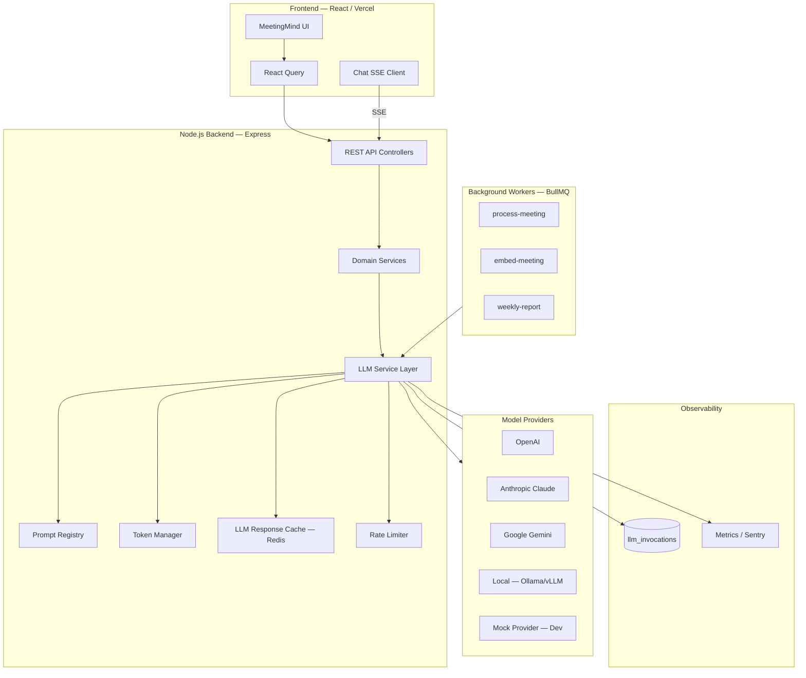
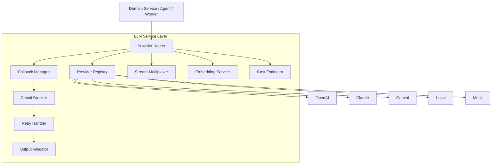
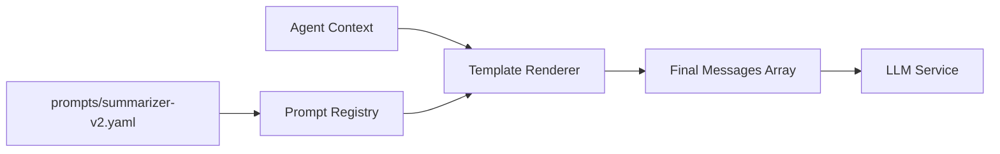
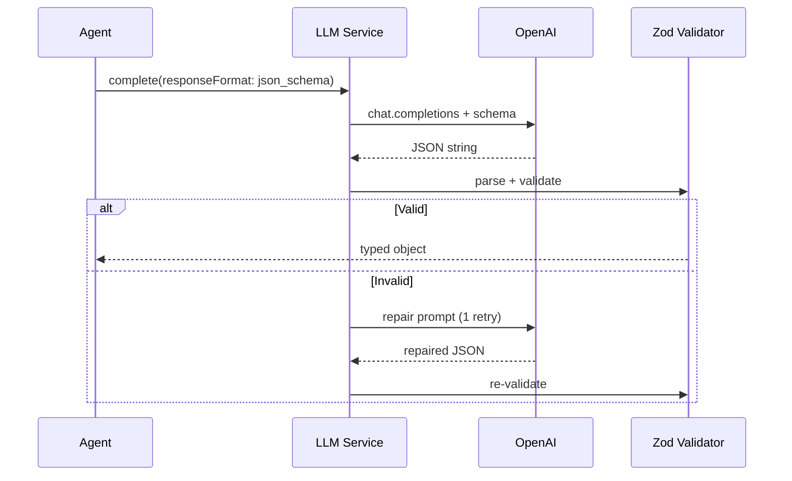
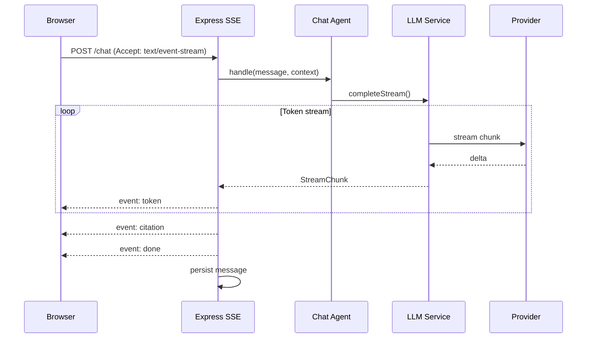
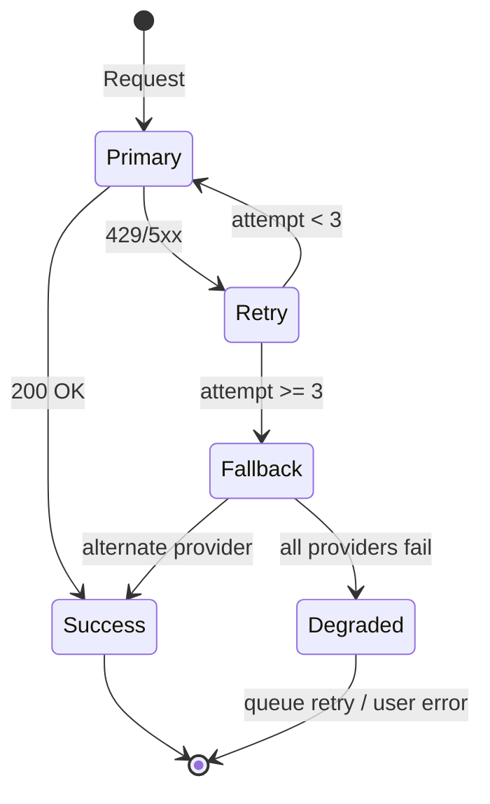
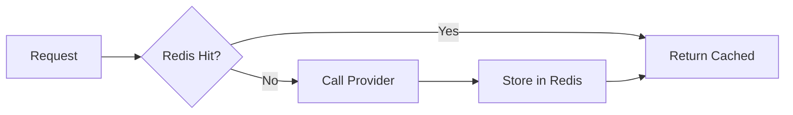
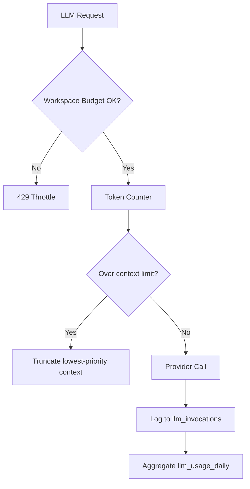
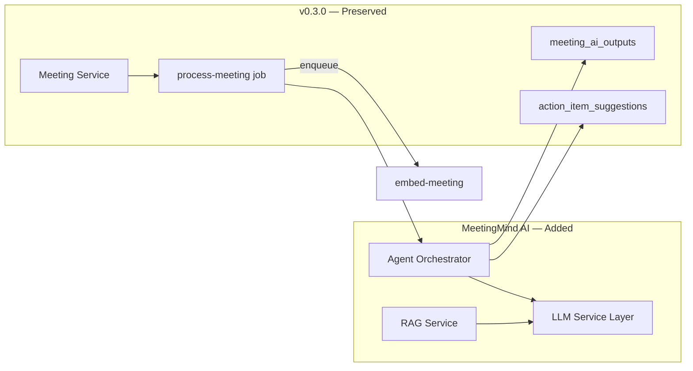

# LLM Architecture — MeetingMind AI

**Product:** MeetingMind AI  
**Version:** 1.0  
**Status:** Architecture — Documentation Only  
**Baseline:** v0.3.0 OpenAI direct integration → LLM Service Layer  
**Requirements:** [llm-requirements.md](./llm-requirements.md)

---

## 1. Architecture Overview



### Layer Responsibilities

| Layer | Responsibility |
|-------|----------------|
| **Frontend** | User interaction; SSE consumer for chat; no direct LLM access |
| **API Controllers** | Auth, validation, enqueue jobs, stream proxy |
| **Domain Services** | Business rules; never call providers directly |
| **LLM Service Layer** | Provider routing, retries, caching, token accounting |
| **Prompt Registry** | Versioned templates; variable interpolation |
| **Workers** | Long-running LLM workflows off request path |
| **Providers** | External model APIs |

---

## 2. LLM Service Layer

### 2.1 Component Diagram



### 2.2 Provider Interface (Conceptual)

```
LLMProvider
├── complete(request) → CompletionResponse
├── completeStream(request) → AsyncIterable<StreamChunk>
├── embed(request) → EmbedResponse
├── getModelInfo(modelId) → ModelInfo
└── healthCheck() → boolean
```

### 2.3 Provider Registry

| Provider ID | Adapter | Capabilities |
|-------------|---------|--------------|
| `openai` | OpenAIAdapter | complete, stream, embed, json_schema |
| `anthropic` | ClaudeAdapter | complete, stream |
| `google` | GeminiAdapter | complete, stream, embed |
| `local` | OpenAICompatAdapter | complete (OpenAI-compatible endpoint) |
| `mock` | MockAdapter | complete, embed (deterministic fixtures) |

**Selection logic:**
1. Read `workflow` + `workspace.llm_config` override
2. Resolve primary provider + model
3. On failure → fallback chain from `LLM_FALLBACK_CHAIN`
4. Circuit breaker opens after 5 failures in 60s per provider

---

## 3. Prompt Management



### 3.1 Prompt Template Structure

```yaml
id: summarizer
version: "2.1.0"
workflow: process-meeting
model_hint: gpt-4o
system: |
  You are a meeting summarizer...
variables:
  - transcript
  - meetingTitle
  - memberNames
output_schema: SummaryOutputSchema
```

### 3.2 Design Rules

- Templates live in `prompts/` directory; loaded at startup + hot-reload in dev
- Every invocation logs `promptId` + `promptVersion`
- Workspace custom prompts (enterprise) override platform default by ID
- System prompts include anti-hallucination and schema compliance instructions

---

## 4. Structured Outputs



| Workflow | Schema | Storage |
|----------|--------|---------|
| process-meeting | `MeetingExtractionSchema` | `meeting_ai_outputs` |
| weekly-report | `WeeklyReportSchema` | `workspace_reports` |
| knowledge-extract | `KnowledgeEntitySchema` | `knowledge_entries` |
| chat | free text + `CitationSchema[]` | `chat_messages` |

**Backward compatibility:** Multi-agent merge produces identical `meeting_ai_outputs` shape as v0.3.0.

---

## 5. Streaming Architecture



| Event | Payload |
|-------|---------|
| `token` | `{ content: "..." }` |
| `citation` | `{ index, meetingId, excerpt }` |
| `done` | `{ messageId, tokenUsage }` |
| `error` | `{ code, message }` |

**Client disconnect:** AbortController cancels provider stream within 5s.

---

## 6. Fallback Strategy



| Failure | Action |
|---------|--------|
| 429 Rate limit | Backoff 2s/4s/8s; same provider |
| 5xx Server error | Retry 2x; then fallback provider |
| Timeout (>120s) | Fail job; user retry |
| Invalid JSON | Repair prompt once |
| All providers down | `FAILED` status; alert ops |

---

## 7. Caching

| Cache Layer | Key | TTL | Scope |
|-------------|-----|-----|-------|
| LLM completion | `llm:cmp:{hash(prompt+model+schema)}` | 24h | Per workspace |
| Embedding | `llm:emb:{hash(text)}` | 7d | Global |
| Prompt render | `llm:prm:{templateVersion}:{hash(vars)}` | 1h | Per workspace |



**Invalidation:** Transcript edit invalidates extraction cache for that meeting hash.

---

## 8. Token Management



| Control | Value |
|---------|-------|
| Max extraction input | 120k tokens |
| Max chat context | 32k tokens |
| Max completion | 4,096 tokens |
| Workspace daily budget | 500k tokens (configurable) |
| Platform alert threshold | 80% of monthly budget |

---

## 9. Error Handling

| Error Class | HTTP/Job Status | User Message |
|-------------|-----------------|--------------|
| `ProviderUnavailable` | 503 / FAILED | "AI temporarily unavailable" |
| `TokenBudgetExceeded` | 429 | "Workspace AI limit reached" |
| `ValidationError` | 500 / FAILED | "Processing failed — retry" |
| `TimeoutError` | 504 / FAILED | "Processing timed out" |
| `RateLimited` | 429 | "Too many requests" |

All errors: log `requestId`, `provider`, `model`, `workflow`; never expose provider internals.

---

## 10. Cost Optimization

| Strategy | Savings | Implementation |
|----------|---------|----------------|
| Model routing | 40–60% on chat | `gpt-4o-mini` for chat; `gpt-4o` for extraction |
| Response caching | 10–30% on reprocess | Redis hash cache |
| Embedding batching | 50% API calls | Batch 100 chunks |
| Prompt compression | 10–20% tokens | Strip VTT timestamps; member names only |
| Chunk-only RAG in chat | 70% vs full transcript | Retrieval vs dump |
| Mock in CI | 100% dev cost | `AI_USE_MOCK=true` |

**Cost estimation:** `estimated_cost_usd = (prompt_tokens × input_rate) + (completion_tokens × output_rate)` per model price table in config.

---

## 11. Rate Limiting

| Layer | Limit | Scope |
|-------|-------|-------|
| HTTP | 30 chat msg/min | Per user |
| LLM Service | 20 AI triggers/hour | Per workspace |
| Provider | Respect 429 + backoff | Per API key |
| Token budget | Daily workspace cap | Per workspace |

Rate limiter: Redis sliding window; returns `Retry-After` header.

---

## 12. Integration with Existing System



**Migration path:**
1. Wrap existing `openai.ts` → `OpenAIAdapter` implementing `LLMProvider`
2. Route `process-meeting` through `LLMService.complete()`
3. Add observability without changing output schema
4. Feature-flag multi-agent when ready

---

## 13. Future Extensibility

| Extension | Mechanism |
|-----------|-----------|
| New provider | Implement `LLMProvider`; register in registry |
| New model | Config entry; no code change |
| Fine-tuned models | `model` override per workspace |
| BYOK | Workspace-specific API key in `llm_config` |
| Multimodal | Extend `CompletionRequest` with `attachments[]` |
| Function calling | `tools[]` in request; agent tool-use loop |
| LangGraph | Agents as graph nodes; LLM Service as tool |
| Eval pipeline | Hook post-complete for golden set comparison |

---

## 14. Security

- API keys server-side only; never in frontend
- All LLM calls include `workspaceId` in metadata for audit
- PII minimization: display names only in prompts
- Local model mode: route all traffic to `LOCAL_LLM_BASE_URL`
- Prompt injection defense in system templates
- Output validation prevents malformed data persistence

---

## 15. Deployment Topology

| Component | Platform | Scaling |
|-----------|----------|---------|
| API + LLM Service | Railway | Horizontal |
| Workers | Railway (separate process) | Horizontal |
| Redis cache | Upstash | Serverless |
| llm_invocations | Neon PostgreSQL | Vertical |
| Providers | External SaaS | N/A |

---

## Related Documents

- [rag-architecture.md](./rag-architecture.md)
- [agent-architecture.md](./agent-architecture.md)
- [observability-requirements.md](./observability-requirements.md)
- [embedding-flow.md](./embedding-flow.md)

---

## Document History

| Version | Date | Changes |
|---------|------|---------|
| 1.0 | 2026-06-18 | Initial LLM architecture |
