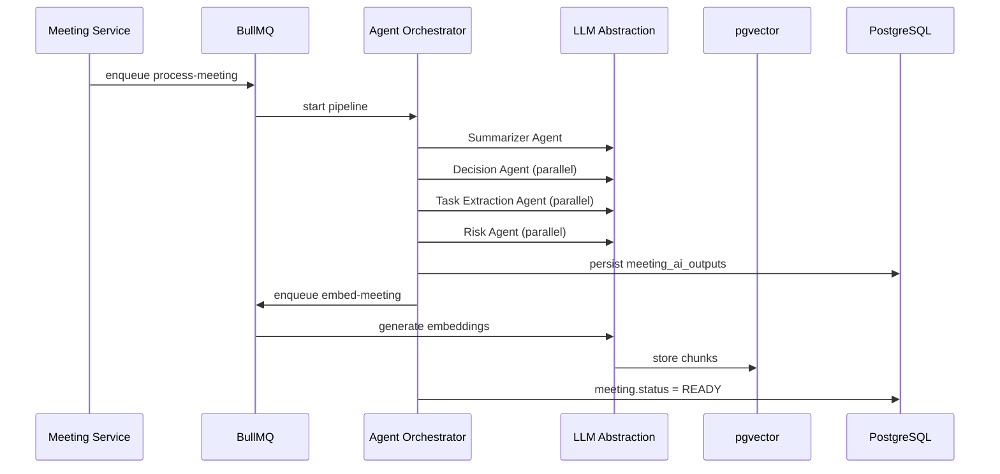
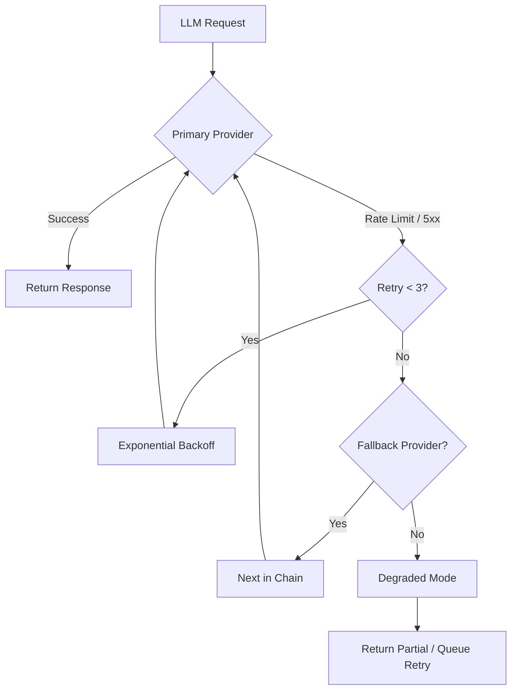

# LLM Requirements — MeetingMind AI

**Product:** MeetingMind AI (extension of AI Meeting Notes & Task Manager)  
**Version:** 1.0  
**Status:** Requirements — Documentation Only  
**Baseline:** Platform v0.3.0 (OpenAI single-job pipeline, BullMQ, structured JSON output)

**Related:** [rag-requirements.md](./rag-requirements.md) · [multi-agent-requirements.md](./multi-agent-requirements.md) · [observability-requirements.md](./observability-requirements.md)

---

## 1. Purpose of LLM Integration

MeetingMind AI extends the existing meeting intelligence pipeline from a **single-provider, monolithic extraction job** into a **model-agnostic, multi-workflow LLM platform** that powers:

- Per-meeting intelligence (summary, decisions, action items, risks) — **preserved and enhanced**
- Cross-meeting memory and retrieval (RAG)
- Workspace-scoped conversational AI (chat)
- Semantic search and productivity analytics
- Specialized multi-agent orchestration

### Extension Principles (Non-Negotiable)

| Principle | Detail |
|-----------|--------|
| **Preserve existing behavior** | Current `process-meeting` job, action item review, and task conversion remain functional |
| **Backward compatible API** | Existing `meeting_ai_outputs` schema and endpoints unchanged unless versioned (`/api/v2`) |
| **Workspace isolation** | All LLM calls scoped by `workspace_id`; no cross-tenant context |
| **Human-in-the-loop** | AI outputs remain editable; action items require explicit acceptance |
| **Async by default** | Long-running LLM work stays off the request path (BullMQ) |

---

## 2. Supported Models

### 2.1 Provider Matrix

| Provider | Models (Initial) | Use Cases | Priority |
|----------|------------------|-----------|----------|
| **OpenAI** | `gpt-4o`, `gpt-4o-mini`, `text-embedding-3-small` | Primary extraction, chat, embeddings | P0 — already integrated |
| **Google Gemini** | `gemini-1.5-pro`, `gemini-1.5-flash`, `text-embedding-004` | Cost-optimized extraction, long context | P1 |
| **Anthropic Claude** | `claude-3-5-sonnet`, `claude-3-5-haiku` | High-quality reasoning, risk analysis | P1 |
| **Local Models** | Ollama: `llama3`, `mistral`; vLLM self-hosted | Dev/offline, air-gapped enterprise | P2 |

### 2.2 Model Selection Policy

| Workflow | Default Model | Fallback | Rationale |
|----------|---------------|----------|-----------|
| Meeting extraction (production) | `gpt-4o` | `gemini-1.5-flash` → `claude-3-5-haiku` | Quality + structured output |
| Meeting extraction (dev/mock) | Mock provider | — | Existing `AI_USE_MOCK=true` preserved |
| Embeddings | `text-embedding-3-small` | `text-embedding-004` | Cost; 1536 dims |
| Chat (workspace) | `gpt-4o-mini` | `gemini-1.5-flash` | Latency + cost |
| Weekly reports | `gpt-4o` | `claude-3-5-sonnet` | Synthesis quality |
| Risk analysis | `claude-3-5-sonnet` | `gpt-4o` | Reasoning depth |

### 2.3 Local Model Requirements

- **FR-LLM-LOC-001:** Support OpenAI-compatible API endpoint (`LOCAL_LLM_BASE_URL`) for Ollama/vLLM
- **FR-LLM-LOC-002:** Local models disabled in production unless explicitly enabled per workspace (enterprise)
- **FR-LLM-LOC-003:** No embedding or chat data leaves premises when local mode enabled
- **FR-LLM-LOC-004:** Feature parity not required for local models (extraction only minimum)

---

## 3. Model Abstraction Layer

### 3.1 Purpose

Decouple business logic from provider SDKs. Existing `openai.ts` becomes one adapter behind a unified interface.

### 3.2 Interface Requirements

**FR-LLM-ABS-001:** Implement `LLMProvider` interface:

```
complete(request: CompletionRequest): Promise<CompletionResponse>
completeStream(request: CompletionRequest): AsyncIterable<StreamChunk>
embed(request: EmbedRequest): Promise<EmbedResponse>
getModelInfo(modelId: string): ModelInfo
healthCheck(): Promise<boolean>
```

**FR-LLM-ABS-002:** `CompletionRequest` fields: `model`, `messages`, `systemPrompt`, `responseFormat` (json_schema | text), `temperature`, `maxTokens`, `timeout`, `metadata` (workspaceId, jobId, agentId)

**FR-LLM-ABS-003:** Provider registry configured via env + workspace-level overrides (v2)

**FR-LLM-ABS-004:** All provider calls emit observability events (see observability-requirements.md)

### 3.3 Configuration

| Config Key | Scope | Example |
|------------|-------|---------|
| `LLM_DEFAULT_PROVIDER` | Platform | `openai` |
| `LLM_DEFAULT_COMPLETION_MODEL` | Platform | `gpt-4o` |
| `LLM_DEFAULT_EMBEDDING_MODEL` | Platform | `text-embedding-3-small` |
| `LLM_FALLBACK_CHAIN` | Platform | `openai,gemini,claude` |
| `workspace.llm_config` | Workspace (v2) | JSON override |

---

## 4. LLM Workflows

### 4.1 Existing Workflows (Preserved)

| Workflow | Trigger | Current Implementation | Change |
|----------|---------|------------------------|--------|
| `process-meeting` | Transcript upload | Single OpenAI call, JSON schema | Route through abstraction layer; optional multi-agent split |
| `reprocess-meeting` | User retry | Same job | Same |
| Per-meeting chat (MVP+1) | User message | Direct OpenAI | RAG-augmented via Context Retrieval Agent |

### 4.2 New Workflows

| Workflow | Trigger | Output | Async |
|----------|---------|--------|-------|
| `embed-meeting` | After `process-meeting` completes | Vector chunks in pgvector | Yes |
| `embed-task` | Task create/update (title+desc) | Vector record | Yes |
| `workspace-chat` | User chat message | Streamed response + citations | Sync stream |
| `weekly-report` | Cron (Monday 8am workspace TZ) | Report document | Yes |
| `cross-meeting-analysis` | User request or scheduled | Comparative insights | Yes |
| `meeting-recommendations` | Dashboard load / weekly | Suggested follow-ups | Yes (cached) |
| `knowledge-extract` | Post-processing | Knowledge graph entries | Yes |

### 4.3 Workflow Sequence (Enhanced Pipeline)



---

## 5. Token Usage Considerations

### 5.1 Budget Limits

| Scope | Limit | Action on Exceed |
|-------|-------|------------------|
| Single meeting extraction | 120k input tokens | Chunk + merge (existing FR-AI-016) |
| Chat turn | 32k context window budget | Truncate oldest history; summarize |
| Weekly report | 200k input tokens | Sample top N meetings by relevance |
| Workspace monthly | Configurable (default: 10M tokens) | Throttle + notify Owner |

### 5.2 Token Accounting

- **FR-LLM-TOK-001:** Log `prompt_tokens`, `completion_tokens`, `total_tokens` per call
- **FR-LLM-TOK-002:** Aggregate daily per workspace in `llm_usage_daily` table
- **FR-LLM-TOK-003:** Include token count in `ai_processing_jobs` and `llm_invocations` records
- **FR-LLM-TOK-004:** Dashboard for Owners: token usage + estimated cost (MVP+2)

### 5.3 Context Optimization

- Send workspace member **display names only** (not emails) to LLM
- Strip boilerplate from VTT/SRT (timestamps optional in extraction)
- Use RAG retrieval instead of full transcript history in chat
- Cache system prompts (provider-side where supported)

---

## 6. Cost Optimization

| Strategy | Requirement ID | Detail |
|----------|----------------|--------|
| Model routing | FR-LLM-COST-001 | Use `gpt-4o-mini` / `gemini-flash` for simple meetings (< 5k chars) |
| Prompt caching | FR-LLM-COST-002 | Redis cache for identical transcript hash (24h TTL) |
| Embedding batching | FR-LLM-COST-003 | Batch up to 100 chunks per embed API call |
| Deduplication | FR-LLM-COST-004 | Skip re-embed if transcript hash unchanged |
| Result caching | FR-LLM-COST-005 | Cache weekly report per workspace/week |
| Mock mode | FR-LLM-COST-006 | Preserve `AI_USE_MOCK=true` for dev/CI |

**Target:** ≤ $0.15 per average meeting processed (45 min transcript) at scale.

---

## 7. Fallback Mechanisms



| Failure Type | Behavior |
|--------------|----------|
| Rate limit (429) | Backoff 2s/4s/8s; switch provider after 2 failures |
| Timeout (>120s) | Retry once; then fail job with `FAILED` status |
| Invalid JSON schema response | Retry with repair prompt (1 attempt) |
| All providers down | Job `FAILED`; user message "AI temporarily unavailable" |
| Embedding failure | Meeting processing succeeds; search degraded until re-embed |

**FR-LLM-FB-001:** Fallback chain configurable per workflow type  
**FR-LLM-FB-002:** Never silently switch model without logging `model_used` in output metadata

---

## 8. Prompt Engineering Requirements

### 8.1 Prompt Management

- **FR-LLM-PRM-001:** Prompts stored as versioned templates in `prompts/` (not inline strings)
- **FR-LLM-PRM-002:** Each template has `id`, `version`, `workflow`, `variables`
- **FR-LLM-PRM-003:** Default prompts in repo; workspace custom prompts (enterprise v2)
- **FR-LLM-PRM-004:** Prompt changes require version bump; log `prompt_version` in job output

### 8.2 Prompt Structure (Extraction)

```
[System] Role, output rules, JSON schema reference, anti-hallucination rules
[Context] Workspace member names, meeting metadata, agenda, tags
[User] Transcript (or chunk N of M)
```

### 8.3 Quality Rules (All Prompts)

- Instruct: "Only extract information explicitly stated or strongly implied"
- Instruct: "Use null for unknown assignees/dates"
- Instruct: "Do not invent participants not in transcript"
- Include 1-shot example for action item format (optional per agent)

---

## 9. Structured Output Requirements

### 9.1 Preserved Schema (v1 Compatibility)

Existing JSON schema for `process-meeting` remains canonical:

```json
{
  "summary": "string",
  "topics": ["string"],
  "decisions": [{ "text": "string", "context": "string" }],
  "risks": [{ "text": "string", "severity": "low|medium|high", "context": "string" }],
  "actionItems": [{
    "title": "string",
    "description": "string",
    "suggestedAssignee": "string|null",
    "suggestedDueDate": "YYYY-MM-DD|null"
  }]
}
```

**FR-LLM-SO-001:** Multi-agent pipeline MUST merge into this schema for `meeting_ai_outputs`  
**FR-LLM-SO-002:** Validate response with Zod before persistence  
**FR-LLM-SO-003:** On validation failure, attempt JSON repair via LLM (1 retry max)

### 9.2 Extended Schemas (New Features)

| Feature | Schema Location | Storage |
|---------|-----------------|---------|
| Weekly report | `WeeklyReportSchema` | `workspace_reports` table |
| Knowledge entities | `KnowledgeEntitySchema` | `knowledge_entries` table |
| Chat citations | `CitationSchema` | Inline in `meeting_chat_messages` |
| Productivity insights | `InsightSchema` | `workspace_insights` table |

---

## 10. Caching Requirements

| Cache Key Pattern | TTL | Invalidation |
|-------------------|-----|--------------|
| `llm:extract:{transcriptHash}:{promptVersion}` | 24h | Transcript edit, prompt version change |
| `llm:embed:{chunkHash}` | 7d | Content change |
| `llm:weekly:{workspaceId}:{week}` | 7d | New meeting in week |
| `llm:chat:{conversationId}:summary` | 1h | New messages > 10 |

**FR-LLM-CACHE-001:** Redis-backed; cache miss proceeds to LLM  
**FR-LLM-CACHE-002:** Cache scoped by `workspace_id` — no cross-tenant keys  
**FR-LLM-CACHE-003:** Cache bypass header `X-Skip-LLM-Cache: true` for reprocess (Owner only)

---

## 11. Streaming Requirements

| Endpoint | Stream Protocol | Chunks |
|----------|-----------------|--------|
| `POST .../chat` | SSE (`text/event-stream`) | `data: {"type":"token","content":"..."}` |
| `POST .../workspace/chat` | SSE | Same + `data: {"type":"citation",...}` |
| Agent orchestration (internal) | N/A | Batch only |

**FR-LLM-STR-001:** First token latency < 2s p95  
**FR-LLM-STR-002:** Stream includes final `done` event with `messageId`, `tokenUsage`  
**FR-LLM-STR-003:** Client disconnect cancels LLM call within 5s  
**FR-LLM-STR-004:** Preserve existing non-streaming fallback for clients without SSE

---

## 12. Latency Requirements

| Operation | p50 | p95 | p99 |
|-----------|-----|-----|-----|
| Meeting extraction (single agent, legacy) | 15s | 45s | 90s |
| Meeting extraction (multi-agent) | 20s | 60s | 120s |
| Embedding job (per meeting) | 3s | 10s | 20s |
| Chat first token | 0.5s | 2s | 4s |
| Chat full response (short) | 2s | 8s | 15s |
| Semantic search | 100ms | 300ms | 500ms |
| Weekly report generation | 30s | 90s | 180s |

---

## 13. Failure Handling

| Scenario | User Impact | System Behavior |
|----------|-------------|-----------------|
| Extraction fails | Meeting shows FAILED | Retry UI; error in `ai_processing_jobs` |
| Partial agent failure | Partial output | Merge successful agents; flag incomplete sections |
| Embedding fails | Search degraded | Meeting still READY; background re-embed |
| Chat fails mid-stream | Error message in thread | Persist partial response with `incomplete: true` |
| Provider outage | Graceful message | Queue jobs; alert ops |

**FR-LLM-FAIL-001:** All failures logged with `requestId`, `provider`, `model`, `errorCode`  
**FR-LLM-FAIL-002:** No raw provider error bodies exposed to client

---

## 14. Future Extensibility

- Plugin interface for new providers (`LLMProvider` implementation)
- Agent registry for new specialized agents
- Workspace-level model preferences and BYOK (bring your own key)
- Fine-tuned models per workspace (enterprise)
- Multimodal input (audio/video transcript) via Gemini 1.5
- Evaluation harness (golden transcripts + expected outputs)
- A/B testing prompts via feature flags

---

# 15. AI Meeting Intelligence Features

## 15.1 Meeting Summary

| Attribute | Detail |
|-----------|--------|
| **Purpose** | Concise overview of what happened, for quick consumption |
| **Inputs** | Transcript, meeting metadata, agenda, tags, attendee names |
| **Outputs** | `summary` text, `topics[]` — stored in `meeting_ai_outputs` |
| **Business Value** | 80% reduction in post-meeting note time |
| **Status** | ✅ Exists (v0.2) — enhance via Summarizer Agent |

**User Stories:** AI-01, AI-06  
**Functional:** FR-AI-001 – FR-AI-003, FR-LLM-ABS-*  
**Non-Functional:** p95 extraction < 60s; ≥ 90% user satisfaction on summary accuracy  
**Success Metrics:** Summary edit rate < 30%; time-to-read < 2 min

---

## 15.2 Decision Extraction

| Attribute | Detail |
|-----------|--------|
| **Purpose** | Explicit documentation of agreements and commitments |
| **Inputs** | Transcript, summary (optional pre-read) |
| **Outputs** | `decisions[]` with text, context, optional owner |
| **Business Value** | Eliminates "what did we decide?" disputes |
| **Status** | ✅ Exists — enhance via Decision Agent |

**User Stories:** AI-02  
**Functional:** FR-AI-004 – FR-AI-005  
**Non-Functional:** Precision ≥ 85% on golden set  
**Success Metrics:** Decisions cited in search ≥ 20% of workspace queries

---

## 15.3 Action Item Extraction

| Attribute | Detail |
|-----------|--------|
| **Purpose** | Convert discussion into trackable work |
| **Inputs** | Transcript, workspace member display names |
| **Outputs** | `action_item_suggestions` records → user acceptance → `tasks` |
| **Business Value** | 70%+ acceptance rate; zero duplicate manual entry |
| **Status** | ✅ Exists — enhance via Task Extraction Agent |

**User Stories:** AI-03, TASK-01  
**Functional:** FR-AI-006 – FR-AI-007, FR-AI-013  
**Non-Functional:** Assignee match accuracy ≥ 75%  
**Success Metrics:** Acceptance rate ≥ 70%; task completion within due date ≥ 60%

---

## 15.4 Risk Detection

| Attribute | Detail |
|-----------|--------|
| **Purpose** | Surface blockers and concerns early |
| **Inputs** | Transcript, project tags, historical risks (RAG, v2) |
| **Outputs** | `risks[]` with severity, context |
| **Business Value** | Proactive escalation; fewer surprise delays |
| **Status** | ✅ Exists — enhance via Risk Analyzer Agent |

**User Stories:** AI-04  
**Functional:** FR-AI-008 – FR-AI-009  
**Non-Functional:** Recall ≥ 80% on labeled risk transcripts  
**Success Metrics:** Risk → task conversion rate (MVP+1) ≥ 40%

---

## 15.5 Weekly Reports

| Attribute | Detail |
|-----------|--------|
| **Purpose** | Automated synthesis of workspace activity for leads/PMs |
| **Inputs** | Meetings, tasks, decisions, risks from past 7 days |
| **Outputs** | Structured report: highlights, decisions, open items, risks, trends |
| **Business Value** | 2+ hours/week saved on status reporting |
| **Status** | 🆕 New — Weekly Report Agent |

**User Stories:** ANLYT-04 (extended), new WR-01 – WR-03  
**Functional:** FR-LLM-WR-001 – FR-LLM-WR-008 (see below)  
**Non-Functional:** Generated by Monday 9am workspace timezone; p95 < 90s  
**Success Metrics:** Report open rate ≥ 60%; manual export requests ↓ 50%

**FR-LLM-WR-001:** Cron triggers `weekly-report` job per active workspace  
**FR-LLM-WR-002:** Report stored in `workspace_reports` with markdown + JSON  
**FR-LLM-WR-003:** Email digest to Owners (optional, MVP+2)  
**FR-LLM-WR-004:** User can regenerate on demand  
**FR-LLM-WR-005:** Report sections: summary, key decisions, completed tasks, open risks, meeting count  
**FR-LLM-WR-006:** Link to source meetings for each cited item  
**FR-LLM-WR-007:** Skip generation if < 1 meeting in period  
**FR-LLM-WR-008:** Token budget max 200k input; summarize if exceeded

---

## 15.6 Productivity Insights

| Attribute | Detail |
|-----------|--------|
| **Purpose** | Data-driven patterns in team meeting and task behavior |
| **Inputs** | Task history, meeting frequency, completion rates, AI outputs |
| **Outputs** | `workspace_insights[]`: trends, anomalies, recommendations |
| **Business Value** | Process improvement; meeting load visibility |
| **Status** | 🆕 New — Phase 6 |

**User Stories:** INS-01 – INS-04  
**Functional:** FR-LLM-INS-001 – FR-LLM-INS-006  
**Non-Functional:** Insights refresh daily; cached 24h  
**Success Metrics:** Insight action click-through ≥ 25%

**FR-LLM-INS-001:** Metrics: meetings/week, tasks created vs completed, avg completion time  
**FR-LLM-INS-002:** LLM generates narrative interpretation of metrics  
**FR-LLM-INS-003:** Flag anomalies: overdue spike, meeting volume +50%  
**FR-LLM-INS-004:** Display on dashboard "Insights" card  
**FR-LLM-INS-005:** Compare current week vs 4-week rolling average  
**FR-LLM-INS-006:** No PII in insight text beyond display names

---

## 15.7 Meeting Recommendations

| Attribute | Detail |
|-----------|--------|
| **Purpose** | Suggest follow-up meetings, agenda items, or stale topic revisits |
| **Inputs** | Open tasks, unresolved decisions, risk age, meeting patterns |
| **Outputs** | Recommendation list with rationale and priority |
| **Business Value** | Reduces dropped follow-ups |
| **Status** | 🆕 New — Phase 1 extension |

**User Stories:** REC-01 – REC-02  
**Functional:** FR-LLM-REC-001 – FR-LLM-REC-004  
**Success Metrics:** Recommendation dismissal rate < 50%

---

## 15.8 Knowledge Extraction

| Attribute | Detail |
|-----------|--------|
| **Purpose** | Build persistent workspace knowledge base from meetings |
| **Inputs** | Decisions, definitions, technical agreements, process notes |
| **Outputs** | `knowledge_entries`: entity, type, content, source_meeting_id |
| **Business Value** | Institutional memory beyond individual meeting records |
| **Status** | 🆕 New — Knowledge Agent |

**User Stories:** KNOW-01 – KNOW-03  
**Functional:** FR-LLM-KNOW-001 – FR-LLM-KNOW-005  
**Success Metrics:** Knowledge entries retrieved in chat ≥ 30% of queries

---

## 15.9 Meeting Context Memory

| Attribute | Detail |
|-----------|--------|
| **Purpose** | Maintain rolling context for recurring meeting series |
| **Inputs** | Prior meetings with same tags/title pattern, open action items |
| **Outputs** | Context bundle injected into extraction and chat prompts |
| **Business Value** | Continuity across standups, sprint planning series |
| **Status** | 🆕 New — RAG-dependent |

**User Stories:** CTX-01 – CTX-02  
**Functional:** FR-LLM-CTX-001 – FR-LLM-CTX-004  
**Success Metrics:** User-reported context relevance ≥ 4/5

---

## 15.10 Historical Meeting Analysis

| Attribute | Detail |
|-----------|--------|
| **Purpose** | Analyze patterns across meeting history |
| **Inputs** | Date range, tags, participants; vector + SQL retrieval |
| **Outputs** | Analysis report: themes, decision velocity, recurring risks |
| **Business Value** | Strategic visibility for leads |
| **Status** | 🆕 New — Phase 6 |

**User Stories:** HIST-01 – HIST-02  
**Functional:** FR-LLM-HIST-001 – FR-LLM-HIST-004  
**Success Metrics:** Analysis completion < 120s for 90-day range

---

## 15.11 Cross-Meeting Intelligence

| Attribute | Detail |
|-----------|--------|
| **Purpose** | Answer questions and detect conflicts across multiple meetings |
| **Inputs** | Natural language query + RAG retrieval across workspace corpus |
| **Outputs** | Synthesized answer with citations; conflict alerts |
| **Business Value** | "Did we contradict ourselves on the launch date?" |
| **Status** | 🆕 New — Chat + RAG Phase 3 |

**User Stories:** CROSS-01 – CROSS-03  
**Functional:** FR-LLM-CROSS-001 – FR-LLM-CROSS-005  
**Success Metrics:** Citation accuracy ≥ 90%; user thumbs-up ≥ 75%

---

## Document History

| Version | Date | Changes |
|---------|------|---------|
| 1.0 | 2026-06-18 | Initial MeetingMind AI LLM requirements |
