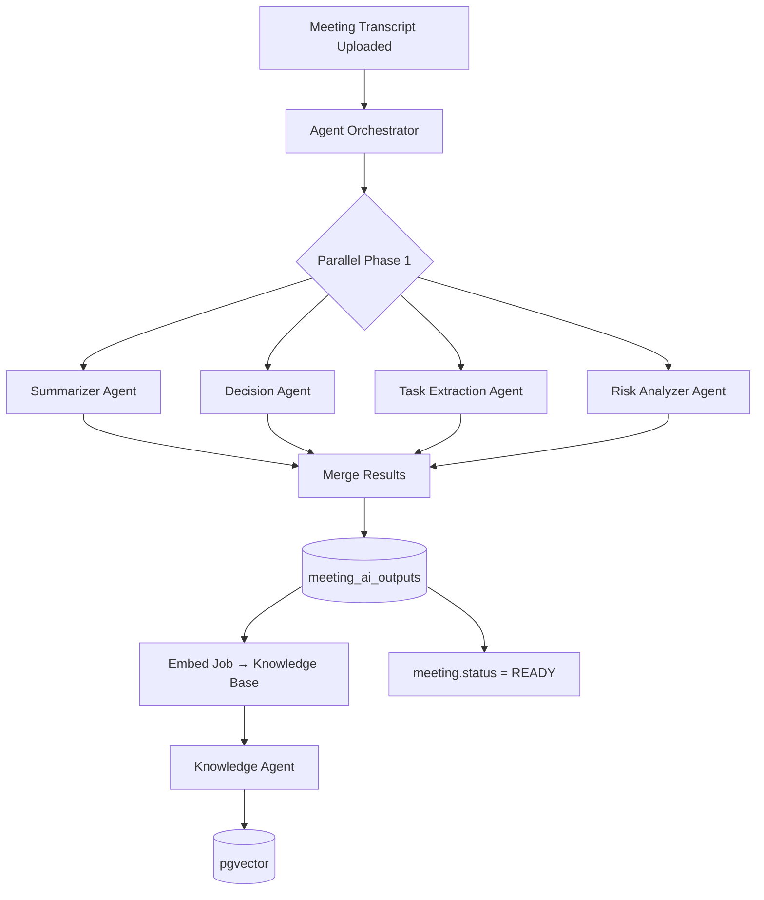
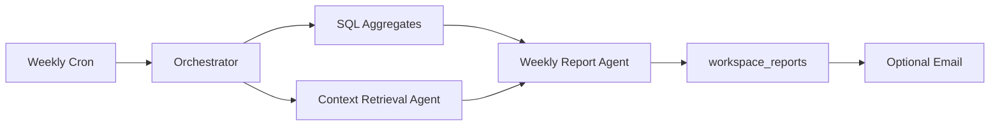
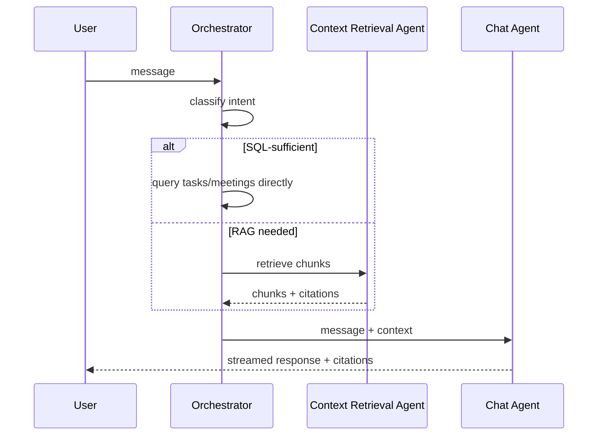

# Multi-Agent Requirements — MeetingMind AI

**Product:** MeetingMind AI  
**Version:** 1.0  
**Status:** Requirements — Documentation Only  
**Baseline:** Monolithic `process-meeting` job (v0.2); BullMQ worker; OpenAI structured JSON  
**Related:** [llm-requirements.md](./llm-requirements.md) · [rag-requirements.md](./rag-requirements.md) · [ai-chat-requirements.md](./ai-chat-requirements.md)

---

## 1. Purpose

Replace the monolithic meeting processing prompt with **specialized agents** that collaborate through an orchestrator — improving extraction quality, enabling independent retries, and supporting future agent extensibility without breaking existing `meeting_ai_outputs` schema.

### Preservation Guarantee

**FR-AGENT-000:** Legacy monolithic mode (`AI_PIPELINE_MODE=monolithic`) remains default until multi-agent validated; output schema unchanged.

---

## 2. Agent Registry

| Agent ID | Name | Phase | Replaces |
|--------|------|-------|----------|
| `summarizer` | Summarizer Agent | 1 | Summary section of monolithic prompt |
| `task-extractor` | Task Extraction Agent | 1 | actionItems section |
| `decision` | Decision Agent | 1 | decisions section |
| `risk-analyzer` | Risk Analyzer Agent | 1 | risks section |
| `context-retrieval` | Context Retrieval Agent | 2 | N/A (new) |
| `chat` | Chat Agent | 3 | Direct LLM in chat |
| `knowledge` | Knowledge Agent | 5 | N/A (new) |
| `weekly-report` | Weekly Report Agent | 6 | N/A (new) |

---

## 3. Agent Specifications

### 3.1 Summarizer Agent

| Attribute | Detail |
|-----------|--------|
| **Purpose** | Generate meeting overview, topics discussed, and outcomes |
| **Inputs** | Transcript (or chunk), meeting metadata, agenda, attendee names |
| **Outputs** | `{ summary: string, topics: string[] }` |
| **Responsibilities** | Neutral tone; factual; no action items or decisions |
| **Dependencies** | LLM abstraction layer; prompt template `summarizer-v1` |
| **Default Model** | `gpt-4o` |
| **Failure** | Retry 2x; partial pipeline continues; summary = "Generation failed" |
| **Metrics** | `agent.summarizer.latency`, `agent.summarizer.tokens`, `agent.summarizer.success_rate` |

**FR-AGENT-SUM-001:** Output max 2000 tokens  
**FR-AGENT-SUM-002:** Include `topics[]` with 3–8 items

---

### 3.2 Task Extraction Agent

| Attribute | Detail |
|-----------|--------|
| **Purpose** | Extract actionable follow-up items with ownership hints |
| **Inputs** | Transcript, workspace member display names, summary (optional context) |
| **Outputs** | `{ actionItems: [{ title, description, suggestedAssignee, suggestedDueDate }] }` |
| **Responsibilities** | Distinguish commitments from suggestions; match assignee names |
| **Dependencies** | Summarizer output (optional); fuzzy-match post-processor |
| **Default Model** | `gpt-4o` |
| **Failure** | Retry 2x; empty actionItems on failure |
| **Metrics** | `agent.task_extractor.items_count`, `agent.task_extractor.assignee_match_rate` |

**FR-AGENT-TASK-001:** Max 20 action items per meeting  
**FR-AGENT-TASK-002:** Post-process `suggestedAssignee` via fuzzy match to member IDs (existing logic preserved)

---

### 3.3 Decision Agent

| Attribute | Detail |
|-----------|--------|
| **Purpose** | Extract explicit decisions and agreements |
| **Inputs** | Transcript, summary (optional) |
| **Outputs** | `{ decisions: [{ text, context, owner? }] }` |
| **Responsibilities** | Only explicit decisions; include context snippet |
| **Dependencies** | None (can run parallel with Summarizer) |
| **Default Model** | `gpt-4o` / `claude-3-5-sonnet` |
| **Failure** | Retry 2x; empty decisions array |
| **Metrics** | `agent.decision.count`, `agent.decision.precision` (eval set) |

**FR-AGENT-DEC-001:** Each decision must include `context` quoting or paraphrasing source  
**FR-AGENT-DEC-002:** Max 15 decisions per meeting

---

### 3.4 Risk Analyzer Agent

| Attribute | Detail |
|-----------|--------|
| **Purpose** | Identify risks, blockers, and concerns |
| **Inputs** | Transcript, tags, prior risks from RAG (v2) |
| **Outputs** | `{ risks: [{ text, severity, context }] }` |
| **Responsibilities** | Classify severity; avoid false positives on casual concerns |
| **Dependencies** | Context Retrieval Agent (v2 for historical risks) |
| **Default Model** | `claude-3-5-sonnet` (reasoning) |
| **Failure** | Retry 2x; empty risks array |
| **Metrics** | `agent.risk.count`, `agent.risk.severity_distribution` |

**FR-AGENT-RISK-001:** Severity enum: `low | medium | high`  
**FR-AGENT-RISK-002:** Max 10 risks per meeting

---

### 3.5 Context Retrieval Agent

| Attribute | Detail |
|-----------|--------|
| **Purpose** | Retrieve relevant workspace context for other agents and chat |
| **Inputs** | Query, workspaceId, filters, token budget |
| **Outputs** | `{ chunks: Chunk[], citations: Citation[] }` |
| **Responsibilities** | Hybrid search; re-ranking; token budgeting; citation formatting |
| **Dependencies** | pgvector, PostgreSQL FTS, RAG service |
| **Default Model** | Embedding model only (no completion) |
| **Failure** | Return empty chunks; log degraded mode |
| **Metrics** | `agent.retrieval.latency`, `agent.retrieval.chunks_count`, `agent.retrieval.avg_similarity` |

**FR-AGENT-CTX-001:** Not a completion agent — retrieval only  
**FR-AGENT-CTX-002:** Used by Chat Agent, Weekly Report Agent, Knowledge Agent

---

### 3.6 Chat Agent

| Attribute | Detail |
|-----------|--------|
| **Purpose** | Generate conversational responses with citations |
| **Inputs** | User message, conversation history, retrieved chunks, workspace context |
| **Outputs** | Streamed text + `citations[]` |
| **Responsibilities** | Grounded answers; refuse when no context; cite sources |
| **Dependencies** | Context Retrieval Agent; LLM streaming |
| **Default Model** | `gpt-4o-mini` |
| **Failure** | Fallback message; partial stream saved |
| **Metrics** | `agent.chat.latency_first_token`, `agent.chat.citation_count`, `agent.chat.feedback_score` |

**FR-AGENT-CHAT-001:** Must not answer factual workspace questions without retrieval  
**FR-AGENT-CHAT-002:** Stream via SSE

---

### 3.7 Knowledge Agent

| Attribute | Detail |
|-----------|--------|
| **Purpose** | Extract durable knowledge entities from meetings |
| **Inputs** | Transcript, decisions, summary |
| **Outputs** | `{ entries: [{ type, title, content, sourceRef }] }` |
| **Responsibilities** | Identify definitions, processes, technical agreements, recurring topics |
| **Dependencies** | Summarizer + Decision Agent outputs |
| **Default Model** | `gpt-4o` |
| **Failure** | Skip knowledge extraction; non-blocking |
| **Metrics** | `agent.knowledge.entries_count` |

**Knowledge types:** `definition | process | agreement | technical | people | other`

**FR-AGENT-KNOW-001:** Store in `knowledge_entries` table  
**FR-AGENT-KNOW-002:** Embed knowledge entries for RAG

---

### 3.8 Weekly Report Agent

| Attribute | Detail |
|-----------|--------|
| **Purpose** | Synthesize weekly workspace activity report |
| **Inputs** | SQL aggregates, RAG top chunks, task stats, meeting list |
| **Outputs** | `{ title, sections: [{ heading, content, citations }] }` |
| **Responsibilities** | Executive summary style; link all claims to sources |
| **Dependencies** | Context Retrieval Agent; SQL dashboard queries |
| **Default Model** | `gpt-4o` |
| **Failure** | Retry once; notify Owner of failure |
| **Metrics** | `agent.weekly_report.generation_time`, `agent.weekly_report.open_rate` |

**FR-AGENT-WR-001:** Cron-triggered Monday 8am workspace timezone  
**FR-AGENT-WR-002:** Store markdown + structured JSON

---

## 4. Agent Orchestration

### 4.1 Meeting Processing Pipeline



### 4.2 Orchestrator Responsibilities

- **FR-ORCH-001:** Load transcript and workspace context once; share across agents
- **FR-ORCH-002:** Execute Phase 1 agents in parallel (Promise.all / BullMQ child jobs)
- **FR-ORCH-003:** Merge agent outputs into canonical `meeting_ai_outputs` schema
- **FR-ORCH-004:** Track per-agent status in `agent_executions` table
- **FR-ORCH-005:** Continue pipeline if non-critical agent fails (Knowledge Agent)
- **FR-ORCH-006:** Fail meeting if ALL extraction agents fail
- **FR-ORCH-007:** Emit observability events per agent (see observability-requirements.md)

### 4.3 Parallel vs Sequential

| Phase | Agents | Execution |
|-------|--------|-----------|
| 1 | Summarizer, Decision, Task, Risk | **Parallel** |
| 2 | Merge + persist | Sequential |
| 3 | Embed job | Async queue |
| 4 | Knowledge Agent | Sequential (after merge) |

**Task Extraction Agent** may optionally receive Summarizer output as context (sequential dependency) — configurable via `AGENT_TASK_USE_SUMMARY=true`.

### 4.4 Weekly Report Pipeline



### 4.5 Chat Pipeline



---

## 5. Communication Flow

### 5.1 Inter-Agent Message Format

```json
{
  "correlationId": "job-uuid",
  "workspaceId": "uuid",
  "meetingId": "uuid",
  "agentId": "decision",
  "input": { "transcript": "...", "metadata": {} },
  "output": { "decisions": [] },
  "status": "COMPLETED",
  "model": "gpt-4o",
  "tokenUsage": { "prompt": 5000, "completion": 800 },
  "latencyMs": 4200,
  "promptVersion": "decision-v1"
}
```

### 5.2 Shared Context Object

```json
{
  "workspaceId": "uuid",
  "meetingId": "uuid",
  "transcript": "string",
  "metadata": {
    "title": "...",
    "date": "...",
    "tags": [],
    "attendees": [],
    "memberNames": ["Alex", "Jordan"]
  },
  "priorContext": {
    "summary": "optional from Summarizer",
    "relatedMeetings": "optional from RAG"
  }
}
```

**FR-ORCH-008:** Shared context immutable per job execution  
**FR-ORCH-009:** Agents receive only fields they need (principle of least context)

---

## 6. Escalation Rules

| Condition | Action |
|-----------|--------|
| Agent fails after max retries | Log error; continue with empty section |
| All Phase 1 agents fail | `meeting.status = FAILED` |
| Token budget exceeded mid-pipeline | Truncate transcript; warn in output metadata |
| Provider outage | Switch fallback provider per agent |
| Partial merge validation failure | JSON repair attempt (1x) |
| Knowledge Agent fails | Non-blocking; meeting still READY |
| Weekly Report fails | Retry next hour; alert Owner after 3 failures |

**FR-ORCH-010:** Escalation events emit alerts (see observability-requirements.md)

---

## 7. Agent Execution Tracking

### `agent_executions` Table (Documentation)

| Column | Type | Description |
|--------|------|-------------|
| id | UUID | PK |
| job_id | UUID | FK → ai_processing_jobs |
| agent_id | VARCHAR | Agent identifier |
| status | job_status | PENDING/PROCESSING/COMPLETED/FAILED |
| input_tokens | INT | |
| output_tokens | INT | |
| latency_ms | INT | |
| model | VARCHAR | |
| error_message | TEXT | |
| created_at | TIMESTAMPTZ | |

---

## 8. Failure Scenarios

| Scenario | Impact | Recovery |
|----------|--------|----------|
| Summarizer fails | No summary | Reprocess meeting |
| Decision fails | Empty decisions | User can add manually; reprocess |
| Task extractor fails | No action items | Manual task creation |
| Risk analyzer fails | Empty risks | Non-critical |
| All parallel agents timeout | Meeting FAILED | User retry |
| Merge validation fails | Meeting FAILED | JSON repair retry |
| Orchestrator crash mid-pipeline | Job stuck PROCESSING | BullMQ stall detection; resume |
| Model returns wrong schema | Validation error | Repair prompt retry |

---

## 9. Metrics (Per Agent)

| Metric | Type | Alert Threshold |
|--------|------|-----------------|
| `agent.{id}.success_rate` | Gauge | < 90% |
| `agent.{id}.latency_p95` | Histogram | > 60s |
| `agent.{id}.tokens_avg` | Gauge | > 20k |
| `agent.{id}.error_rate` | Counter | > 5% |
| `orchestrator.pipeline_duration` | Histogram | > 120s |
| `orchestrator.partial_success_count` | Counter | Trending up |

---

## 10. Future Extensibility

| Future Agent | Purpose |
|--------------|---------|
| `sentiment` | Meeting tone and engagement analysis |
| `participant` | Per-speaker contribution summary (with diarization) |
| `compliance` | PII/regulated content flagging |
| `translator` | Multi-language transcript processing |
| `facilitator` | Suggest agenda for next meeting |
| `conflict-detector` | Cross-meeting decision conflicts |

**FR-AGENT-EXT-001:** New agents register in `agent-registry.ts` with input/output schemas  
**FR-AGENT-EXT-002:** Feature flags enable/disable agents per workspace  
**FR-AGENT-EXT-003:** Agent plugin interface matches `Agent` type:

```
interface Agent {
  id: string;
  execute(context: AgentContext): Promise<AgentResult>;
  validate(output: unknown): boolean;
}
```

---

## Document History

| Version | Date | Changes |
|---------|------|---------|
| 1.0 | 2026-06-18 | Initial multi-agent requirements |
