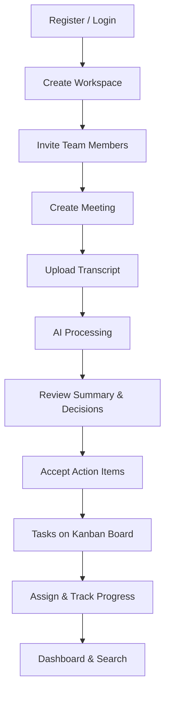

# MVP Definition

**Product:** AI Meeting Notes & Task Manager  
**Version:** 1.1  
**Target Launch:** Week 16–18

> **Review updates:** Meeting status enum standardized to `DRAFT | PROCESSING | READY | FAILED`. Concurrent transcript upload returns 409. Action-item → task creation is idempotent.

---

## 1. MVP Vision

Deliver a functional SaaS product where a team can:

1. **Sign up** and create a shared workspace
2. **Upload a meeting transcript** and receive AI-generated insights
3. **Review and accept action items** as trackable tasks
4. **Manage tasks** on a Kanban board with assignment and comments
5. **Monitor progress** via a dashboard with search

The MVP proves the core value proposition: **meetings → AI insights → accountable follow-through** in a single tool.

---

## 2. Must Have (MVP Launch)

These features are **required** for launch. No release without them.

### Authentication & User Management

- [ ] Email/password registration
- [ ] Login with JWT access token + refresh token (httpOnly cookie)
- [ ] Logout with server-side token revocation
- [ ] Password reset via email
- [ ] Protected routes (redirect to login if unauthenticated)
- [ ] Token refresh on 401 (transparent to user)

### Workspace Management

- [ ] Create workspace (name, description)
- [ ] List user's workspaces
- [ ] Invite members by email
- [ ] Accept invitation (existing and new users)
- [ ] Member list with roles (Owner, Member)
- [ ] Remove members (Owner only)
- [ ] Workspace switcher in app navigation
- [ ] Edit workspace settings (Owner only)

### Meeting Management

- [ ] Create meeting (title, date, attendees, tags)
- [ ] Edit meeting metadata
- [ ] Delete meeting (soft delete)
- [ ] Upload transcript (paste text or file: .txt, .md, .vtt, .srt)
- [ ] Transcript validation (min 100 chars, max 5 MB)
- [ ] Meeting list with pagination
- [ ] Filter meetings by date range and status
- [ ] Meeting detail page
- [ ] Processing status indicator (DRAFT, PROCESSING, READY, FAILED)

### AI Processing

- [ ] Async AI job on transcript upload
- [ ] AI-generated meeting summary
- [ ] Extracted key decisions (list)
- [ ] Extracted risks/blockers with severity (display only)
- [ ] Extracted action items with suggested assignee and due date
- [ ] Fuzzy-match suggested assignees to workspace members
- [ ] User can edit AI output (summary, decisions, risks)
- [ ] Action item review: accept or reject individually
- [ ] Bulk accept action items
- [ ] Error handling for failed AI jobs with retry option
- [ ] Reject concurrent transcript upload while PROCESSING (409)
- [ ] Idempotent task creation from action items (no duplicates on retry)
- [ ] BullMQ + Redis for AI jobs (not in-process queue)

### Task Management

- [ ] Auto-create tasks from accepted action items
- [ ] Link tasks to source meeting
- [ ] Manual task creation (without meeting)
- [ ] Task fields: title, description, assignee, due date, priority
- [ ] Kanban board with 3 columns: To Do, In Progress, Done
- [ ] Update task status (click or drag)
- [ ] Task detail view
- [ ] Flat comment thread on tasks
- [ ] @mention in comments triggers notification

### Notifications

- [ ] In-app notification on task assignment
- [ ] In-app notification on @mention
- [ ] Notification bell with unread count
- [ ] Mark notification as read
- [ ] Mark all as read

### Dashboard & Search

- [ ] Dashboard stat cards: total meetings, open tasks, overdue tasks, completed this week
- [ ] Recent activity feed (last 30 days)
- [ ] Search meetings by title
- [ ] Search tasks by title
- [ ] Results scoped to current workspace

### Infrastructure & Quality

- [ ] Responsive UI (desktop-first, usable on mobile)
- [ ] Docker Compose for local development
- [ ] Production deploy: Vercel (FE) + Railway/Render (BE) + Neon (DB)
- [ ] Health check endpoint
- [ ] Basic error tracking (Sentry)
- [ ] HTTPS everywhere

---

## 3. Should Have (MVP+1)

High-priority features targeted for **1–4 weeks post-launch**. Not blocking initial release.

| Feature | Value | Effort |
|---------|-------|--------|
| AI risk → task conversion | Close loop on risks | Low |
| AI chat assistant per meeting | Deep Q&A on transcript | Medium |
| Full-text search on summaries/decisions | Find past agreements | Medium |
| Email notifications (due date reminders) | Reduce missed deadlines | Medium |
| Meeting tags and advanced filters | Better organization | Low |
| Productivity charts on dashboard | Team insights | Medium |
| Re-run AI processing | Fix bad outputs | Low |
| Drag-and-drop Kanban with optimistic UI | Better UX | Medium |
| Profile avatar upload | Team identification | Low |
| Transfer workspace ownership | Admin continuity | Low |

---

## 4. Nice To Have (v2+)

Valuable but deferred to future releases.

| Feature | Category |
|---------|----------|
| Calendar integrations (Google/Outlook) | Integrations |
| Native transcription (Whisper) | AI |
| Zoom/Teams meeting bot | Integrations |
| Custom Kanban columns | Tasks |
| Organization-level admin | Enterprise |
| SSO (SAML/OIDC) | Enterprise |
| Vector/semantic search | Search |
| Export to PDF/Notion/Slack | Integrations |
| Billing/subscriptions (Stripe) | Monetization |
| Audit logs | Compliance |
| Real-time collaboration (WebSockets) | Collaboration |
| Mobile native apps | Platform |
| Multi-language transcripts | AI |
| Speaker diarization | AI |
| Webhook API | Automation |
| GDPR export/delete | Compliance |

---

## 5. MVP User Journey



### Happy Path Demo Script (5 minutes)

1. **Register** as `demo@team.com`
2. **Create workspace** "Engineering Team"
3. **Invite** `colleague@team.com`
4. **Create meeting** "Sprint Planning — June 15"
5. **Paste transcript** from sample file
6. **Wait** for AI processing (~30–60 seconds)
7. **Review** summary, 3 decisions, 2 risks, 5 action items
8. **Accept** 4 action items, reject 1
9. **View Kanban** — 4 new tasks in To Do
10. **Assign** tasks to team members
11. **Move** a task to In Progress, add a comment
12. **Check dashboard** — stats updated, activity logged

---

## 6. MVP Non-Goals

Explicitly **not** part of MVP:

- Billing or payment processing
- Public API or webhooks
- Mobile apps
- Offline support
- Real-time collaborative editing
- Video/audio upload or playback
- Custom AI model fine-tuning
- White-labeling
- Multi-region deployment

---

## 7. Acceptance Criteria for Launch

### Functional

| # | Criterion | Verification |
|---|-----------|--------------|
| 1 | New user can register and log in | Manual test |
| 2 | User can create workspace and invite member | Manual test |
| 3 | Transcript upload triggers AI processing | Integration test |
| 4 | AI returns summary, decisions, risks, action items | Integration test |
| 5 | Accepted action items create linked tasks | Integration test |
| 6 | Kanban board reflects task status changes | Manual test |
| 7 | Assignee receives in-app notification | Manual test |
| 8 | Dashboard shows accurate counts | Integration test |
| 9 | Search returns relevant results | Manual test |
| 10 | Password reset flow works end-to-end | Manual test |

### Non-Functional

| # | Criterion | Target |
|---|-----------|--------|
| 1 | API response time (excl. AI) | p95 < 300ms |
| 2 | AI processing time | p95 < 60 seconds |
| 3 | Page load time | < 2s on 4G |
| 4 | Uptime during soft launch | ≥ 99% |
| 5 | No critical security vulnerabilities | Security review |
| 6 | WCAG 2.1 AA on core flows | Accessibility audit |
| 7 | Workspace data isolation | Integration tests |

---

## 8. Launch Checklist

### Pre-Launch (T-1 week)

- [ ] All must-have features complete
- [ ] Production environment configured
- [ ] Database migrations applied
- [ ] Environment variables set (all platforms)
- [ ] Sentry configured and receiving events
- [ ] Health check monitored
- [ ] Sample data seeded (demo workspace)
- [ ] Core flows tested on staging
- [ ] Rollback procedure documented

### Launch Day

- [ ] Deploy to production
- [ ] Verify health check
- [ ] Run happy path demo on production
- [ ] Monitor error rates (first 24 hours)
- [ ] Invite 3–5 beta users

### Post-Launch (Week 1)

- [ ] Collect user feedback
- [ ] Fix P0/P1 bugs within 48 hours
- [ ] Monitor AI success rate and costs
- [ ] Plan MVP+1 sprint from should-have list

---

## 9. Feature Priority Matrix

```
                    HIGH VALUE
                        │
         AI Chat        │    Action Items → Tasks
         Full-text      │    Kanban Board
         Search         │    AI Summary
                        │
    LOW EFFORT ─────────┼───────── HIGH EFFORT
                        │
         Tags/Filters    │    Zoom Integration
         Re-run AI       │    SSO / Enterprise
         Avatar Upload   │    Mobile Apps
                        │
                    LOW VALUE
```

**MVP focus:** Upper-right quadrant (high value, manageable effort)

---

## 10. Versioning Strategy

| Version | Scope | Timeline |
|---------|-------|----------|
| v0.1 | Internal alpha (Phases 1–3) | Week 8 |
| v0.5 | Private beta (Phases 1–5) | Week 14 |
| v1.0 | Public MVP launch (All phases) | Week 16–18 |
| v1.1 | MVP+1 should-haves | Week 20–22 |
| v2.0 | Enterprise + integrations | Q3+ |

---

## 11. Related Documents

- [project-scope.md](./project-scope.md) — Boundaries and assumptions
- [development-roadmap.md](./development-roadmap.md) — Phased delivery plan
- [user-stories.md](./user-stories.md) — Detailed stories with priorities
- [requirements.md](./requirements.md) — Functional requirements
