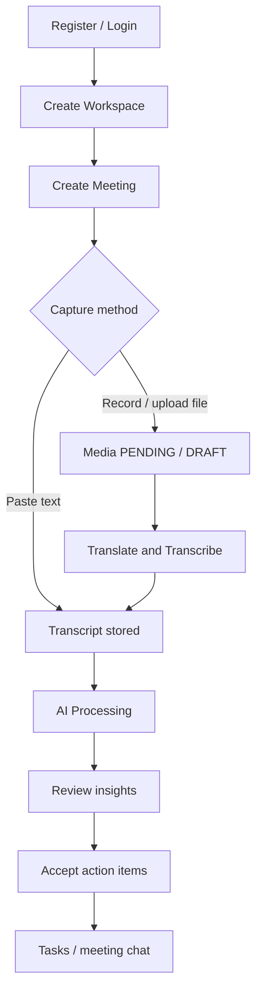

# MVP Definition

**Product:** MeetingMind AI  
**Version:** 1.2  
**Original target:** Week 16–18 · **Current product:** v0.7.0 (2026-07)

> **Status model:** `DRAFT | TRANSCRIBING | PROCESSING | READY | FAILED`.  
> Recording upload alone stays `DRAFT`. **Translate & Transcribe** starts Whisper → AI. Paste transcript still goes `DRAFT → PROCESSING`. Concurrent busy jobs return 409.

---

## 1. Product Vision

Deliver a SaaS product where a team can:

1. **Sign up** (email or Google) and create a shared workspace
2. **Capture a meeting** — record/upload audio/video **or** paste a transcript
3. **Translate & Transcribe** (for recordings) → English transcript → AI insights
4. **Review and accept action items** as trackable tasks
5. **Manage tasks** and follow up via meeting chat / insights

Core value: **meetings → capture → English transcript → AI insights → accountable follow-through**.

---

## 2. Must Have (shipped baseline)

### Authentication & workspaces

- Email/password registration + JWT refresh
- Google Sign-In (optional mock for local/CI)
- Workspace create, invite, roles, switcher

### Meeting capture

- Create / edit / soft-delete meetings
- **Paste or text-file transcript** (`.txt`, `.md`, `.vtt`, `.srt`)
- **Recording upload** (audio + video) — store only (`PENDING` / `DRAFT`)
- **Translate & Transcribe** user action → Whisper translate (default) → AI
- In-app **screen/tab recorder** (WebM → same upload path)
- Status banners + polling while busy
- Replace recording without auto-running AI
- Needing-transcript list for calendar drafts

### AI processing

- Async (or inline mock) AI job after transcript exists
- Summary, decisions, risks, action items
- Accept / reject action items → tasks
- Retry after `FAILED`
- BullMQ when Redis configured; `AI_USE_MOCK` for local

### Collaboration & navigation

- Meeting detail as primary hub (transcript document, insights, meeting chat)
- Tasks / dashboard surfaces available (may soft-redirect in minimal nav builds)

---

## 3. Should Have (near-term)

| Feature                          | Notes                                           |
| -------------------------------- | ----------------------------------------------- |
| Live Zoom / Meet / Teams imports | Adapters scaffolded; real provider APIs pending |
| Playwright E2E                   | Capture + Google mock auth                      |
| Email delivery                   | Invitations / password reset                    |
| Deepgram provider                | Stub today                                      |
| Speaker diarization              | Off until provider supports segments            |

---

## 4. Nice To Have (later)

| Feature                    | Category     |
| -------------------------- | ------------ |
| Live meeting bots          | Integrations |
| Custom Kanban columns      | Tasks        |
| SSO (SAML/OIDC)            | Enterprise   |
| Export to PDF/Notion/Slack | Integrations |
| Billing (Stripe)           | Monetization |
| Mobile native apps         | Platform     |

**Already shipped (moved out of “nice to have”):** native Whisper path, Google Calendar/Meet sync + create Meet, semantic/hybrid search, multi-agent / RAG chat (product-dependent nav).

---

## 5. Current user journey

```mermaid
flowchart TD
    A[Register / Login] --> B[Create Workspace]
    B --> C[Create Meeting]
    C --> D{Capture method}
    D -->|Paste text| E[Transcript stored]
    D -->|Record / upload file| F[Media PENDING / DRAFT]
    F --> G[Translate and Transcribe]
    G --> E
    E --> H[AI Processing]
    H --> I[Review insights]
    I --> J[Accept action items]
    J --> K[Tasks / meeting chat]
```

### Happy path demo (mock, ~5 minutes)

1. Log in → open workspace → **Meetings**
2. Create meeting (or use Calendar + Meet)
3. **Either** paste [`docs/demo/portfolio-demo-transcript.txt`](./demo/portfolio-demo-transcript.txt)  
   **or** upload / screen-record → click **Translate & Transcribe**
4. Wait for `READY` (mock is near-instant)
5. Review summary / decisions / risks / action items
6. Open meeting chat; ask a grounded question
7. Accept 1–2 action items

Or: `npm run seed:portfolio-demo`

---

## 6. Explicit non-goals (still)

- Billing / white-label
- Silent background recording without user gesture
- Auto-start Whisper on every upload (by design: user clicks Translate & Transcribe)
- Full live bot attendance in meetings (stubs only)

---

## 7. Acceptance criteria (current)

| #   | Criterion                                                   | Verification                      |
| --- | ----------------------------------------------------------- | --------------------------------- |
| 1   | Upload recording alone does not create transcript / READY   | Integration: `transcription.test` |
| 2   | Translate & Transcribe reaches READY with mock English text | Integration                       |
| 3   | Replace recording stays DRAFT until start again             | Integration                       |
| 4   | 409 while TRANSCRIBING / PROCESSING                         | Integration                       |
| 5   | Paste transcript still triggers AI                          | Existing meeting AI tests         |
| 6   | Screen recorder uses same upload API                        | Manual + docs/screen-recorder.md  |

See also [transcription-flow.md](./transcription-flow.md) and [docs/README.md](./README.md).
