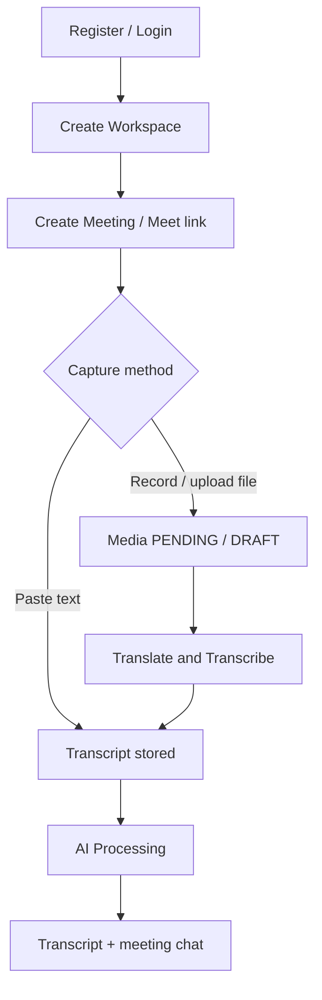

# MVP Definition

**Product:** MeetingMind AI  
**Version:** 1.3  
**Original target:** Week 16–18 · **Current product:** v0.7.2 (2026-07)

> **Status model:** `DRAFT | TRANSCRIBING | PROCESSING | READY | FAILED`.  
> Recording upload alone stays `DRAFT`. **Translate & Transcribe** starts Whisper → AI. Paste transcript still goes `DRAFT → PROCESSING`. Concurrent busy jobs return 409.

> **UI scope:** Primary nav is **Meetings** + **Settings** only. Tasks, dashboard, insights, reports, knowledge, workspace chat, and search remain as APIs and soft-redirect to Meetings.

---

## 1. Product Vision

Deliver a SaaS product where a team can:

1. **Sign up** (email or Google) and create a shared workspace
2. **Create a meeting** — optionally with Google Calendar + Meet link
3. **Capture** — screen/tab record (mic + tab mix) / upload audio or video **or** paste a transcript
4. **Translate & Transcribe** (for recordings) → **Bengali / mixed speech → English transcript** → optional AI pipeline
5. **Read / download** the transcript and **ask meeting chat** grounded questions

Core value: **meetings → capture → English transcript (incl. Bengali→English) → grounded chat** (with AI structured outputs still produced in the background for later surfaces).

---

## 2. Must Have (shipped baseline)

### Authentication & workspaces

- Email/password registration + JWT refresh
- Google Sign-In (optional mock for local/CI)
- Workspace create, invite, roles, switcher
- Settings: Connect Google Calendar / Meet

### Meeting capture

- Create / edit / soft-delete meetings
- Google Calendar event + Meet link on create (when connected)
- **Paste or text-file transcript** (`.txt`, `.md`, `.vtt`, `.srt`)
- **Recording upload** (audio + video) — store only (`PENDING` / `DRAFT`)
- **Translate & Transcribe** user action → Whisper translate (default) → AI
- In-app **screen/tab recorder** with **mic + tab/system audio mix** (WebM → same upload path)
- Transcript document view + download; local recording download before upload
- Status banners + polling while busy
- Replace recording without auto-running AI
- Needing-transcript list for calendar drafts

### Meeting intelligence (in meeting detail)

- Async (or inline mock) AI job after transcript exists
- Meeting detail tabs: Record & upload | Transcript | Chat | Details
- Meeting-scoped RAG chat with citations / corpus fallback for summarize-style questions
- Retry after `FAILED`
- BullMQ when Redis configured; `AI_USE_MOCK` for local

### Soft-hidden (backend kept)

- Tasks / accept action items, dashboard, insights, reports, knowledge, workspace chat, search — APIs remain; UI soft-redirects to Meetings

---

## 3. Should Have (near-term)

| Feature                          | Notes                                           |
| -------------------------------- | ----------------------------------------------- |
| Live Zoom / Meet / Teams imports | Adapters scaffolded; real provider APIs pending |
| Playwright E2E                   | Capture + Google mock auth + meeting chat       |
| Email delivery                   | Invitations / password reset                    |
| Deepgram provider                | Stub today                                      |
| Speaker diarization              | Off until provider supports segments            |

---

## 4. Nice To Have (later)

| Feature                    | Category     |
| -------------------------- | ------------ |
| Re-surface Tasks / Search  | Product      |
| Live meeting bots          | Integrations |
| Custom Kanban columns      | Tasks        |
| SSO (SAML/OIDC)            | Enterprise   |
| Export to PDF/Notion/Slack | Integrations |
| Billing (Stripe)           | Monetization |
| Mobile native apps         | Platform     |

**Already shipped:** Whisper Translate & Transcribe path, Google Calendar/Meet, mic-mixed screen recorder, semantic/hybrid search APIs, multi-agent / RAG meeting chat.

---

## 5. Current user journey

```mermaid
flowchart TD
    A[Register / Login] --> B[Create Workspace]
    B --> C[Create Meeting / Meet link]
    C --> D{Capture method}
    D -->|Paste text| E[Transcript stored]
    D -->|Record / upload file| F[Media PENDING / DRAFT]
    F --> G[Translate and Transcribe]
    G --> E
    E --> H[AI Processing]
    H --> I[Transcript + meeting chat]
```

### Happy path demo (mock, ~5 minutes)

1. Log in → open workspace → **Meetings**
2. Create meeting (or use Calendar + Meet from Settings)
3. **Either** paste [`docs/demo/portfolio-demo-transcript.txt`](./demo/portfolio-demo-transcript.txt)  
   **or** upload / screen-record (share tab + check mic) → click **Translate & Transcribe**
4. Wait for `READY` (mock is near-instant)
5. Open **Transcript** tab; download if needed
6. Open **Chat**; ask a grounded question (e.g. summarize)

Or: `npm run seed:portfolio-demo`

---

## 6. Explicit non-goals (still)

- Billing / white-label
- Silent background recording without user gesture
- Auto-start Whisper on every upload (by design: user clicks Translate & Transcribe)
- Full live bot attendance in meetings (stubs only)
- Primary-nav Tasks / Dashboard / Insights in the simplified UI (backend kept)

---

## 7. Acceptance criteria (current)

| #   | Criterion                                                   | Verification                      |
| --- | ----------------------------------------------------------- | --------------------------------- |
| 1   | Upload recording alone does not create transcript / READY   | Integration: `transcription.test` |
| 2   | Translate & Transcribe reaches READY with mock English text | Integration                       |
| 3   | Replace recording stays DRAFT until start again             | Integration                       |
| 4   | 409 while TRANSCRIBING / PROCESSING                         | Integration                       |
| 5   | Paste transcript still triggers AI                          | Existing meeting AI tests         |
| 6   | Screen recorder uses same upload API (+ mic mix)            | Manual + docs/screen-recorder.md  |
| 7   | Nav shows Meetings + Settings only                          | Manual / frontend nav-items       |

See also [transcription-flow.md](./transcription-flow.md), [screen-recorder.md](./screen-recorder.md), and [docs/README.md](./README.md).
