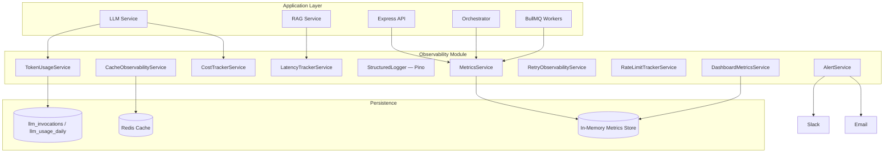

# Observability Design — MeetingMind AI

**Version:** 1.0  
**Status:** Implemented in `backend/src/modules/observability/`  
**Requirements:** [observability-requirements.md](./observability-requirements.md)

---

## 1. Architecture



---

## 2. Module Layout

```
observability/
├── metrics/           # Counters, histograms, Prometheus export
├── cost-tracking/     # Provider pricing, cost reports, leaderboards
├── token-monitoring/  # TokenUsageService, budget enforcement, reports
├── latency/           # P50/P95/P99, slow-request detection
├── logging/           # Pino structured logs, AsyncLocalStorage context
├── cache/             # Unified hit/miss tracking across cache layers
├── retry/             # Retry events, provider outage tracking
├── rate-limit/        # Violation tracking, abuse detection
├── dashboards/        # Dashboard snapshot aggregator
├── alerts/            # Threshold evaluation, Slack/email delivery
└── tests/             # Unit, failure, load simulation tests
```

---

## 3. Metrics Catalog

| Metric | Type | Labels |
|--------|------|--------|
| `http.request.count` | Counter | workspace, user, route |
| `llm.embedding.duration` | Histogram | provider, model, workspace |
| `rag.retrieval.duration` | Histogram | workspace, mode |
| `agent.execution.duration` | Histogram | agent, workflow |
| `orchestrator.graph.duration` | Histogram | workflow |
| `cache.hit` / `cache.miss` | Counter | namespace, workspace |
| `llm.retries.count` | Counter | provider, workspace |
| `ratelimit.exceeded` | Counter | user, workspace, provider |
| `provider.outage` | Counter | provider |
| `context.tokens` | Gauge | model, workspace |

---

## 4. Endpoints

| Endpoint | Description |
|----------|-------------|
| `GET /observability/metrics` | Prometheus text export |
| `GET /observability/metrics/json` | JSON metrics snapshot |
| `GET /observability/dashboard` | Aggregated dashboard data |
| `GET /observability/optimization` | Performance recommendations |
| `POST /observability/alerts/evaluate` | Run alert threshold evaluation |

---

## 5. Correlated Logging

- `requestId` — propagated via `X-Request-Id` header (AsyncLocalStorage)
- `correlationId` — links agent pipeline / graph execution spans
- `workspaceId`, `userId` — tenant and user attribution
- Secrets, transcripts, and API keys are **never** logged (Pino redact paths)

---

## 6. Integration Points

| Component | Observability Hook |
|-----------|-------------------|
| `LLMService` | TokenUsageService, logLLMInvocation, retry observability |
| `RAGObservabilityService` | LatencyTracker, MetricsService |
| `EmbeddingObservabilityService` | LatencyTracker, MetricsService |
| `OrchestratorObservability` | Graph/agent latency, retry events |
| `RagCacheObservabilityService` | Delegates to CacheObservabilityService |

---

## Related Documents

- [cost-analysis.md](./cost-analysis.md)
- [cache-strategy.md](./cache-strategy.md)
- [retry-strategy.md](./retry-strategy.md)
- [performance-optimization.md](./performance-optimization.md)
