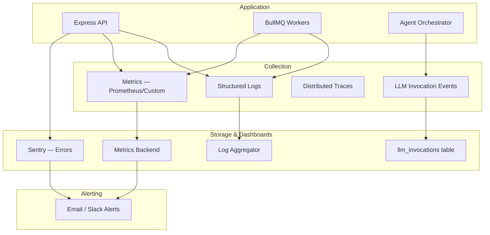

# Observability Requirements — MeetingMind AI

**Product:** MeetingMind AI  
**Version:** 1.0  
**Status:** Requirements — Documentation Only  
**Baseline:** Sentry (FE+BE), structured JSON logging, `ai_processing_jobs` token fields (FR-AI-015)  
**Related:** [llm-requirements.md](./llm-requirements.md) · [multi-agent-requirements.md](./multi-agent-requirements.md) · [non-functional-requirements.md](./non-functional-requirements.md)

---

## 1. Purpose

MeetingMind AI introduces LLM calls, RAG retrieval, multi-agent pipelines, and streaming chat — requiring **production-grade observability** for token costs, latency, quality, and failures across providers and agents.

This extends existing Sentry + health check observability without replacing it.

---

## 2. Observability Architecture



---

## 3. Token Usage Monitoring

### 3.1 Per-Invocation Tracking

Every LLM call records:

```json
{
  "id": "uuid",
  "workspaceId": "uuid",
  "userId": "uuid|null",
  "correlationId": "request-or-job-id",
  "workflow": "process-meeting|chat|embed|weekly-report",
  "agentId": "summarizer|null",
  "provider": "openai",
  "model": "gpt-4o",
  "promptTokens": 5200,
  "completionTokens": 890,
  "totalTokens": 6090,
  "estimatedCostUsd": 0.042,
  "latencyMs": 4500,
  "status": "SUCCESS",
  "createdAt": "..."
}
```

**FR-OBS-TOK-001:** Store in `llm_invocations` table  
**FR-OBS-TOK-002:** Aggregate daily per workspace in `llm_usage_daily`  
**FR-OBS-TOK-003:** Include embedding token counts separately (`workflow: embed`)  
**FR-OBS-TOK-004:** Cost estimation using published per-model pricing (configurable)  
**FR-OBS-TOK-005:** Dashboard for Owners: daily/weekly/monthly token + cost charts

### 3.2 Alerts

| Alert | Threshold | Action |
|-------|-----------|--------|
| Workspace daily tokens | > 80% of limit | Email Owner |
| Workspace daily tokens | > 100% of limit | Throttle LLM calls |
| Platform hourly tokens | > 3σ above baseline | Ops alert |
| Single meeting tokens | > 100k | Log warning |

---

## 4. Latency Tracking

### 4.1 Metrics

| Metric | Labels | Target p95 |
|--------|--------|------------|
| `http.request.duration` | route, method, status | 300ms (excl. AI) |
| `llm.completion.duration` | provider, model, workflow, agent | 45s |
| `llm.embedding.duration` | provider, model | 5s |
| `rag.retrieval.duration` | workspaceId | 300ms |
| `agent.execution.duration` | agentId | 60s |
| `orchestrator.pipeline.duration` | workflow | 90s |
| `chat.first_token.duration` | model | 2s |
| `chat.full_response.duration` | model | 15s |
| `bullmq.job.duration` | queue, jobType | varies |

**FR-OBS-LAT-001:** Histogram metrics with buckets: 50ms, 100ms, 250ms, 500ms, 1s, 5s, 30s, 60s, 120s  
**FR-OBS-LAT-002:** Trace span per LLM call with parent job span  
**FR-OBS-LAT-003:** SLO dashboard: 99% of API requests < 500ms (non-AI)

---

## 5. Cost Tracking

| Dimension | Granularity | Storage |
|-----------|-------------|---------|
| Per invocation | Each LLM call | `llm_invocations` |
| Per workspace | Daily rollup | `llm_usage_daily` |
| Per agent | Daily rollup | `llm_usage_by_agent` |
| Per workflow | Daily rollup | `llm_usage_by_workflow` |
| Platform total | Daily | Metrics + admin dashboard |

**FR-OBS-COST-001:** `estimated_cost_usd` calculated at invocation time  
**FR-OBS-COST-002:** Admin view: top 10 workspaces by cost (platform admin, v2)  
**FR-OBS-COST-003:** Monthly cost report export CSV (Owner, v2)

---

## 6. Logging

### 6.1 Structured Log Format

```json
{
  "timestamp": "2026-06-18T10:00:00.000Z",
  "level": "info",
  "requestId": "req_abc123",
  "correlationId": "job_xyz789",
  "userId": "uuid",
  "workspaceId": "uuid",
  "service": "api|worker",
  "component": "agent-orchestrator",
  "action": "agent.summarizer.completed",
  "durationMs": 4200,
  "metadata": {
    "agentId": "summarizer",
    "model": "gpt-4o",
    "tokens": 6090
  }
}
```

### 6.2 Log Levels

| Level | Usage |
|-------|-------|
| `error` | Failures requiring attention |
| `warn` | Degraded mode, retries, threshold approaching |
| `info` | Job start/complete, agent execution, auth events |
| `debug` | Retrieval details, prompt versions (dev/staging only) |

### 6.3 Requirements

- **FR-OBS-LOG-001:** JSON logs in production (pino or winston)
- **FR-OBS-LOG-002:** `requestId` propagated FE → BE via `X-Request-Id`
- **FR-OBS-LOG-003:** `correlationId` links all agent executions in one pipeline
- **FR-OBS-LOG-004:** NEVER log: passwords, tokens, full transcripts, API keys
- **FR-OBS-LOG-005:** Log transcript hash + meeting ID instead of content
- **FR-OBS-LOG-006:** Retention: 30 days hot; 90 days archive

---

## 7. Distributed Tracing

### 7.1 Trace Hierarchy

```
HTTP POST /transcript
└── enqueue process-meeting
    └── Agent Orchestrator
        ├── Summarizer Agent
        │   └── LLM complete (openai/gpt-4o)
        ├── Decision Agent
        │   └── LLM complete
        ├── Task Extraction Agent
        │   └── LLM complete
        └── Risk Analyzer Agent
            └── LLM complete
    └── embed-meeting job
        └── Embedding API batch
```

**FR-OBS-TRACE-001:** OpenTelemetry SDK (MVP+2) or custom span logging (MVP)  
**FR-OBS-TRACE-002:** Trace ID in all logs and `llm_invocations`  
**FR-OBS-TRACE-003:** Chat request trace includes retrieval + LLM spans

---

## 8. Metrics Catalog

### 8.1 Business Metrics

| Metric | Description |
|--------|-------------|
| `meetings.processed.count` | Meetings reaching READY |
| `meetings.failed.count` | Meetings FAILED |
| `action_items.acceptance_rate` | Accepted / total suggestions |
| `chat.messages.count` | Chat messages per day |
| `chat.feedback.positive_rate` | Thumbs up rate |
| `search.queries.count` | Search queries per day |
| `search.zero_results_rate` | Queries with no results |
| `weekly_reports.generated` | Reports per week |

### 8.2 System Metrics

| Metric | Description |
|--------|-------------|
| `bullmq.queue.depth` | Pending jobs per queue |
| `bullmq.job.failed` | Failed jobs |
| `db.connections.active` | Pool usage |
| `redis.memory.usage` | Cache + queue memory |
| `pgvector.index.size` | Vector storage size |

---

## 9. Retries

| Component | Max Retries | Backoff | Logged |
|-----------|-------------|---------|--------|
| LLM completion | 3 | 2s, 4s, 8s | Yes, with attempt number |
| Embedding batch | 3 | 2s, 4s, 8s | Yes |
| BullMQ job | 3 | Exponential | Job record |
| RAG retrieval | 1 | 1s | Degraded mode |
| Provider fallback | 1 per provider | Immediate | Provider switch logged |

**FR-OBS-RETRY-001:** Retry events increment `llm.retries.count` metric  
**FR-OBS-RETRY-002:** After max retries, mark agent/job FAILED with error details

---

## 10. Rate Limits (Observability)

Track rate limit hits as metrics:

| Metric | Description |
|--------|-------------|
| `ratelimit.exceeded` | Counter by endpoint + IP/user |
| `ratelimit.workspace_llm_throttle` | Workspace token budget exceeded |

**FR-OBS-RL-001:** Log rate limit events at `warn` level  
**FR-OBS-RL-002:** Dashboard: rate limit hits per hour

---

## 11. Caching Observability

| Metric | Description |
|--------|-------------|
| `cache.hit` | Cache hits by key pattern |
| `cache.miss` | Cache misses |
| `cache.hit_rate` | Derived ratio |

**FR-OBS-CACHE-001:** Track LLM response cache hits separately  
**FR-OBS-CACHE-002:** Track RAG retrieval cache hits  
**FR-OBS-CACHE-003:** Alert if cache hit rate drops below 20% (misconfiguration)

---

## 12. Error Handling & Alerting

### 12.1 Error Categories

| Category | Sentry | Alert |
|----------|--------|-------|
| Unhandled exception | Yes | Immediate |
| LLM provider 5xx | Yes | If > 5% in 15min |
| Agent validation failure | Yes | If > 10% in 1hr |
| Job FAILED | Log + metric | If > 10% in 1hr |
| pgvector timeout | Log + metric | If > 5% in 15min |
| Token budget exceeded | Log | Daily digest |

### 12.2 Alert Channels

| Severity | Channel | Response Time |
|----------|---------|---------------|
| Critical | Email + Slack (ops) | < 1 hour |
| High | Email | < 4 hours |
| Medium | Dashboard only | Next business day |
| Low | Log only | — |

**FR-OBS-ALERT-001:** Sentry configured for API + worker + frontend  
**FR-OBS-ALERT-002:** Health check monitoring on `/health` (existing)  
**FR-OBS-ALERT-003:** Uptime robot or equivalent on production API

---

## 13. Dashboards

### 13.1 Operations Dashboard

- API request rate, latency, error rate
- Queue depth and job failure rate
- LLM provider success rate by provider
- DB connection pool usage

### 13.2 AI Dashboard

- Token usage (platform + per workspace top 10)
- Cost trend (daily)
- Agent success rate and latency
- Meeting processing success rate
- Chat first-token latency

### 13.3 Product Dashboard

- Meetings processed / day
- Action item acceptance rate
- Search queries and zero-result rate
- Chat feedback scores
- Weekly report open rate

**FR-OBS-DASH-001:** Admin AI dashboard (platform team)  
**FR-OBS-DASH-002:** Workspace AI usage dashboard (Owner role)

---

## 14. New Data Entities (Documentation)

| Table | Purpose |
|-------|---------|
| `llm_invocations` | Per-call token, cost, latency, status |
| `llm_usage_daily` | Workspace daily aggregates |
| `rag_queries` | Retrieval audit log |
| `agent_executions` | Per-agent job tracking |

---

## Document History

| Version | Date | Changes |
|---------|------|---------|
| 1.0 | 2026-06-18 | Initial observability requirements |
