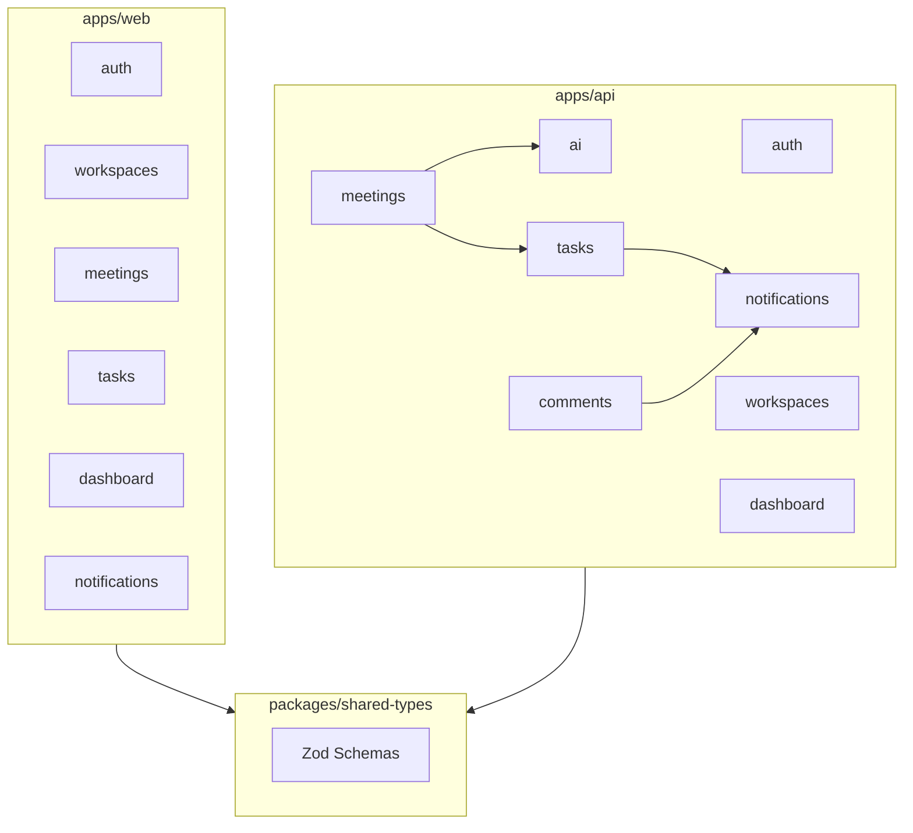

# Project Structure

**Product:** AI Meeting Notes & Task Manager  
**Version:** 1.0  
**Pattern:** Monorepo with feature-based architecture

---

## 1. Repository Layout

```
ai-meeting-notes-manager/
├── .github/
│   └── workflows/
│       ├── ci.yml                 # Lint, typecheck, test on PR
│       ├── deploy-api.yml         # Deploy API to Railway
│       └── deploy-web.yml         # Deploy frontend to Vercel
├── apps/
│   ├── web/                       # React frontend
│   └── api/                         # Express backend
├── packages/
│   ├── shared-types/                # Shared Zod schemas + TS types
│   ├── eslint-config/               # Shared ESLint config
│   └── tsconfig/                    # Shared TypeScript configs
├── docker/
│   ├── docker-compose.yml           # Local dev: API, PG, Redis
│   ├── docker-compose.test.yml      # Integration test environment
│   └── api.Dockerfile               # Production API image
├── docs/                            # Documentation
├── scripts/
│   ├── seed.sh                      # Dev database seed
│   └── migrate.sh                   # Run Prisma migrations
├── .env.example
├── package.json                     # npm workspaces root
├── turbo.json                       # Turborepo pipeline config
└── README.md
```

---

## 2. Frontend (`apps/web`)

**Stack:** React 18, TypeScript, Vite, Tailwind CSS, Shadcn UI, React Query, React Router

```
apps/web/
├── public/
│   ├── favicon.ico
│   └── robots.txt
├── src/
│   ├── app/
│   │   ├── App.tsx                  # Root component
│   │   ├── router.tsx               # Route definitions + guards
│   │   └── providers.tsx            # QueryClient, Theme, Auth providers
│   ├── components/
│   │   ├── ui/                      # Shadcn primitives (button, input, dialog...)
│   │   └── common/
│   │       ├── AppLayout.tsx        # Sidebar + header shell
│   │       ├── Sidebar.tsx
│   │       ├── Header.tsx
│   │       ├── ErrorBoundary.tsx
│   │       ├── LoadingSpinner.tsx
│   │       └── EmptyState.tsx
│   ├── features/
│   │   ├── auth/
│   │   │   ├── api/
│   │   │   │   └── auth-api.ts
│   │   │   ├── components/
│   │   │   │   ├── LoginForm.tsx
│   │   │   │   ├── RegisterForm.tsx
│   │   │   │   └── ForgotPasswordForm.tsx
│   │   │   ├── hooks/
│   │   │   │   ├── useAuth.ts
│   │   │   │   └── useLogin.ts
│   │   │   ├── pages/
│   │   │   │   ├── LoginPage.tsx
│   │   │   │   ├── RegisterPage.tsx
│   │   │   │   └── ResetPasswordPage.tsx
│   │   │   └── context/
│   │   │       └── AuthProvider.tsx
│   │   ├── workspaces/
│   │   │   ├── api/
│   │   │   ├── components/
│   │   │   │   ├── WorkspaceSwitcher.tsx
│   │   │   │   ├── WorkspaceCard.tsx
│   │   │   │   ├── InviteMemberForm.tsx
│   │   │   │   └── MemberList.tsx
│   │   │   ├── hooks/
│   │   │   └── pages/
│   │   │       ├── WorkspaceListPage.tsx
│   │   │       └── WorkspaceSettingsPage.tsx
│   │   ├── meetings/
│   │   │   ├── api/
│   │   │   ├── components/
│   │   │   │   ├── MeetingCard.tsx
│   │   │   │   ├── MeetingForm.tsx
│   │   │   │   ├── TranscriptUpload.tsx
│   │   │   │   ├── AIOutputPanel.tsx
│   │   │   │   ├── ActionItemReview.tsx
│   │   │   │   └── ProcessingStatusBadge.tsx
│   │   │   ├── hooks/
│   │   │   │   └── useMeetingPolling.ts
│   │   │   └── pages/
│   │   │       ├── MeetingListPage.tsx
│   │   │       └── MeetingDetailPage.tsx
│   │   ├── tasks/
│   │   │   ├── api/
│   │   │   ├── components/
│   │   │   │   ├── KanbanBoard.tsx
│   │   │   │   ├── KanbanColumn.tsx
│   │   │   │   ├── TaskCard.tsx
│   │   │   │   ├── TaskDetailDrawer.tsx
│   │   │   │   ├── TaskForm.tsx
│   │   │   │   └── CommentThread.tsx
│   │   │   ├── hooks/
│   │   │   └── pages/
│   │   │       └── TaskBoardPage.tsx
│   │   ├── dashboard/
│   │   │   ├── api/
│   │   │   ├── components/
│   │   │   │   ├── StatCards.tsx
│   │   │   │   ├── ActivityFeed.tsx
│   │   │   │   └── ProductivityChart.tsx
│   │   │   └── pages/
│   │   │       └── DashboardPage.tsx
│   │   ├── notifications/
│   │   │   ├── api/
│   │   │   ├── components/
│   │   │   │   ├── NotificationBell.tsx
│   │   │   │   └── NotificationDropdown.tsx
│   │   │   └── hooks/
│   │   └── search/
│   │       ├── api/
│   │       ├── components/
│   │       │   ├── SearchBar.tsx
│   │       │   └── SearchResults.tsx
│   │       └── pages/
│   │           └── SearchPage.tsx
│   ├── hooks/
│   │   ├── useDebounce.ts
│   │   └── useWorkspace.ts
│   ├── lib/
│   │   ├── api-client.ts            # Axios instance + interceptors
│   │   ├── query-client.ts          # React Query config
│   │   ├── utils.ts                 # cn(), formatDate(), etc.
│   │   └── constants.ts
│   ├── types/
│   │   └── index.ts                 # Re-export from shared-types
│   ├── main.tsx
│   └── index.css                    # Tailwind imports
├── index.html
├── components.json                  # Shadcn config
├── tailwind.config.ts
├── tsconfig.json
├── tsconfig.app.json
├── vite.config.ts
├── postcss.config.js
└── package.json
```

### Frontend Conventions

| Rule | Detail |
|------|--------|
| Feature colocation | API calls, hooks, components, pages in same feature folder |
| Pages are thin | Compose feature components; minimal logic |
| Server state | React Query only; no Redux |
| Auth token | Memory via AuthProvider ref; never localStorage |
| Forms | React Hook Form + Zod resolver from shared-types |
| Imports | `@/` alias → `src/`; `@shared/` → `packages/shared-types` |

---

## 3. Backend (`apps/api`)

**Stack:** Node.js, Express, TypeScript, Prisma, Zod, BullMQ

```
apps/api/
├── prisma/
│   ├── schema.prisma
│   ├── migrations/
│   └── seed.ts
├── src/
│   ├── index.ts                     # Entry point
│   ├── app.ts                       # Express app setup
│   ├── server.ts                    # HTTP server + graceful shutdown
│   ├── config/
│   │   ├── env.ts                   # Zod-validated env vars
│   │   ├── database.ts              # Prisma client singleton
│   │   └── cors.ts
│   ├── middleware/
│   │   ├── authenticate.ts          # JWT validation
│   │   ├── require-workspace-member.ts
│   │   ├── require-role.ts
│   │   ├── validate.ts              # Zod request validation
│   │   ├── rate-limit.ts
│   │   ├── request-id.ts            # X-Request-Id
│   │   ├── error-handler.ts
│   │   └── not-found.ts
│   ├── modules/
│   │   ├── auth/
│   │   │   ├── auth.routes.ts
│   │   │   ├── auth.controller.ts
│   │   │   ├── auth.service.ts
│   │   │   ├── auth.schema.ts
│   │   │   └── auth.test.ts
│   │   ├── users/
│   │   │   ├── users.routes.ts
│   │   │   ├── users.controller.ts
│   │   │   ├── users.service.ts
│   │   │   └── users.schema.ts
│   │   ├── workspaces/
│   │   │   ├── workspaces.routes.ts
│   │   │   ├── workspaces.controller.ts
│   │   │   ├── workspaces.service.ts
│   │   │   └── workspaces.schema.ts
│   │   ├── meetings/
│   │   │   ├── meetings.routes.ts
│   │   │   ├── meetings.controller.ts
│   │   │   ├── meetings.service.ts
│   │   │   └── meetings.schema.ts
│   │   ├── ai/
│   │   │   ├── ai.routes.ts
│   │   │   ├── ai.controller.ts
│   │   │   ├── ai.service.ts
│   │   │   ├── ai.prompts.ts
│   │   │   └── ai.schema.ts
│   │   ├── tasks/
│   │   │   ├── tasks.routes.ts
│   │   │   ├── tasks.controller.ts
│   │   │   ├── tasks.service.ts
│   │   │   └── tasks.schema.ts
│   │   ├── comments/
│   │   │   ├── comments.routes.ts
│   │   │   ├── comments.controller.ts
│   │   │   ├── comments.service.ts
│   │   │   └── comments.schema.ts
│   │   ├── notifications/
│   │   │   ├── notifications.routes.ts
│   │   │   ├── notifications.controller.ts
│   │   │   ├── notifications.service.ts
│   │   │   └── notifications.schema.ts
│   │   ├── dashboard/
│   │   │   ├── dashboard.routes.ts
│   │   │   ├── dashboard.controller.ts
│   │   │   └── dashboard.service.ts
│   │   └── search/
│   │       ├── search.routes.ts
│   │       ├── search.controller.ts
│   │       └── search.service.ts
│   ├── jobs/
│   │   ├── queue.ts                 # BullMQ setup
│   │   ├── worker.ts                # Worker entry point
│   │   ├── process-meeting.job.ts
│   │   └── cleanup-tokens.job.ts
│   ├── lib/
│   │   ├── jwt.ts
│   │   ├── bcrypt.ts
│   │   ├── openai.ts
│   │   ├── email.ts
│   │   ├── fuzzy-match.ts           # Assignee name matching
│   │   └── mention-parser.ts
│   ├── repositories/                # Optional: Prisma query abstraction
│   │   ├── base.repository.ts       # Workspace-scoped query helper
│   │   ├── meeting.repository.ts
│   │   └── task.repository.ts
│   ├── types/
│   │   └── express.d.ts             # Augment Request with user, workspace
│   └── utils/
│       ├── errors.ts                # AppError class
│       ├── pagination.ts
│       └── slug.ts
├── tests/
│   ├── setup.ts
│   ├── helpers/
│   │   ├── factory.ts               # Test data factories
│   │   └── auth-helper.ts
│   ├── unit/
│   │   ├── auth.service.test.ts
│   │   ├── ai.service.test.ts
│   │   └── fuzzy-match.test.ts
│   └── integration/
│       ├── auth.test.ts
│       ├── workspaces.test.ts
│       ├── meetings.test.ts
│       ├── tasks.test.ts
│       └── tenant-isolation.test.ts
├── tsconfig.json
├── vitest.config.ts
└── package.json
```

### Backend Conventions

| Rule | Detail |
|------|--------|
| Thin controllers | Parse request → call service → format response |
| Fat services | Business logic, authorization, transactions |
| One module per domain | routes + controller + service + schema |
| Validation | Zod schemas in `.schema.ts`; shared with frontend via `packages/shared-types` |
| Errors | Throw `AppError` with code; caught by error handler |
| Transactions | `prisma.$transaction` for multi-table mutations |
| Workspace scope | Every service method receives `workspaceId` |

---

## 4. Shared Package (`packages/shared-types`)

```
packages/shared-types/
├── src/
│   ├── auth.ts                      # LoginSchema, RegisterSchema
│   ├── workspace.ts
│   ├── meeting.ts
│   ├── task.ts
│   ├── notification.ts
│   ├── pagination.ts
│   └── index.ts
├── package.json
└── tsconfig.json
```

Purpose: Single source of truth for Zod validation schemas and TypeScript types used by both frontend and backend.

---

## 5. Module Dependency Graph



---

## 6. Environment Files

```
.env.example          # Template (committed)
.env                  # Local dev (gitignored)
.env.test             # Test environment (gitignored)
```

### Required Variables

```bash
# Database
DATABASE_URL=
DATABASE_URL_DIRECT=        # Non-pooled for migrations

# Auth
JWT_ACCESS_SECRET=
JWT_REFRESH_SECRET=

# OpenAI
OPENAI_API_KEY=

# Email
EMAIL_API_KEY=
EMAIL_FROM=

# Redis
REDIS_URL=

# App
NODE_ENV=development
API_PORT=3001
FRONTEND_URL=http://localhost:5173
CORS_ORIGIN=http://localhost:5173
```

---

## 7. Testing Strategy

| Layer | Tool | Location |
|-------|------|----------|
| Unit (BE) | Vitest | `apps/api/tests/unit/` |
| Integration (BE) | Vitest + Supertest | `apps/api/tests/integration/` |
| Tenant isolation | Integration | `tenant-isolation.test.ts` |
| Unit (FE) | Vitest + Testing Library | Co-located `*.test.tsx` |
| E2E | Playwright (MVP+1) | `apps/web/e2e/` |

---

## Related Documents

- [system-architecture.md](./system-architecture.md)
- [development-roadmap.md](./development-roadmap.md)
