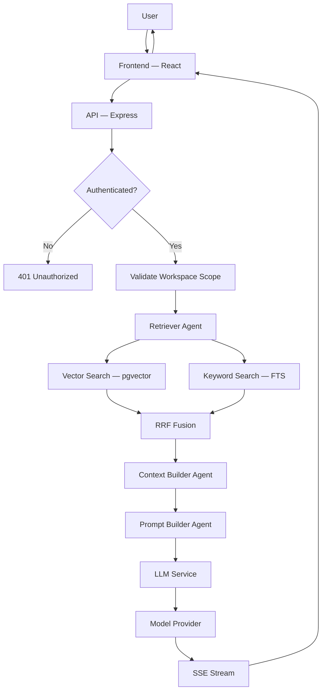
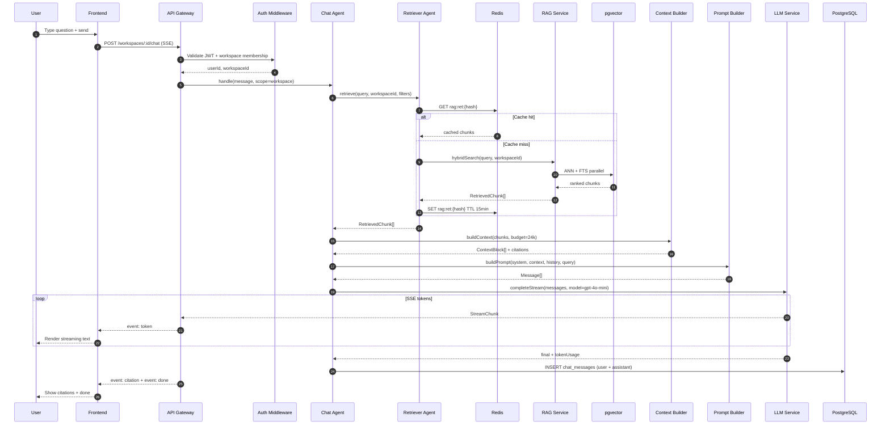
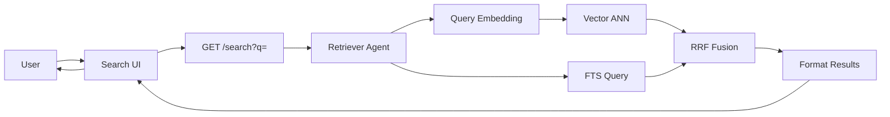
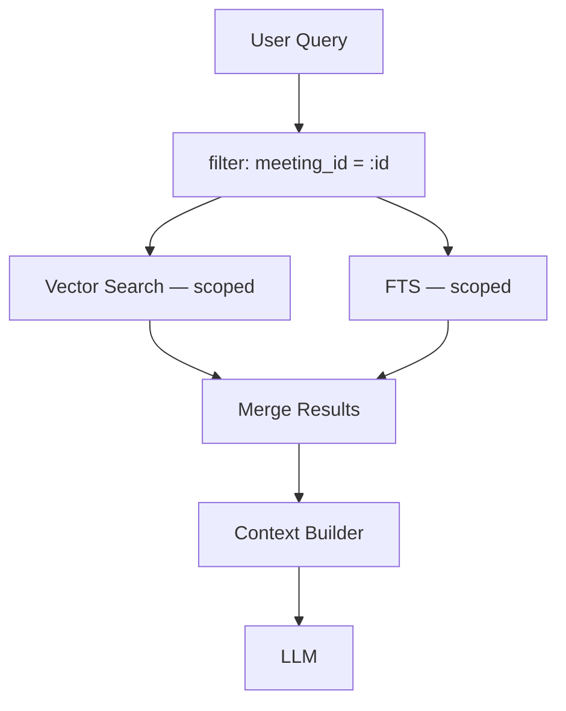
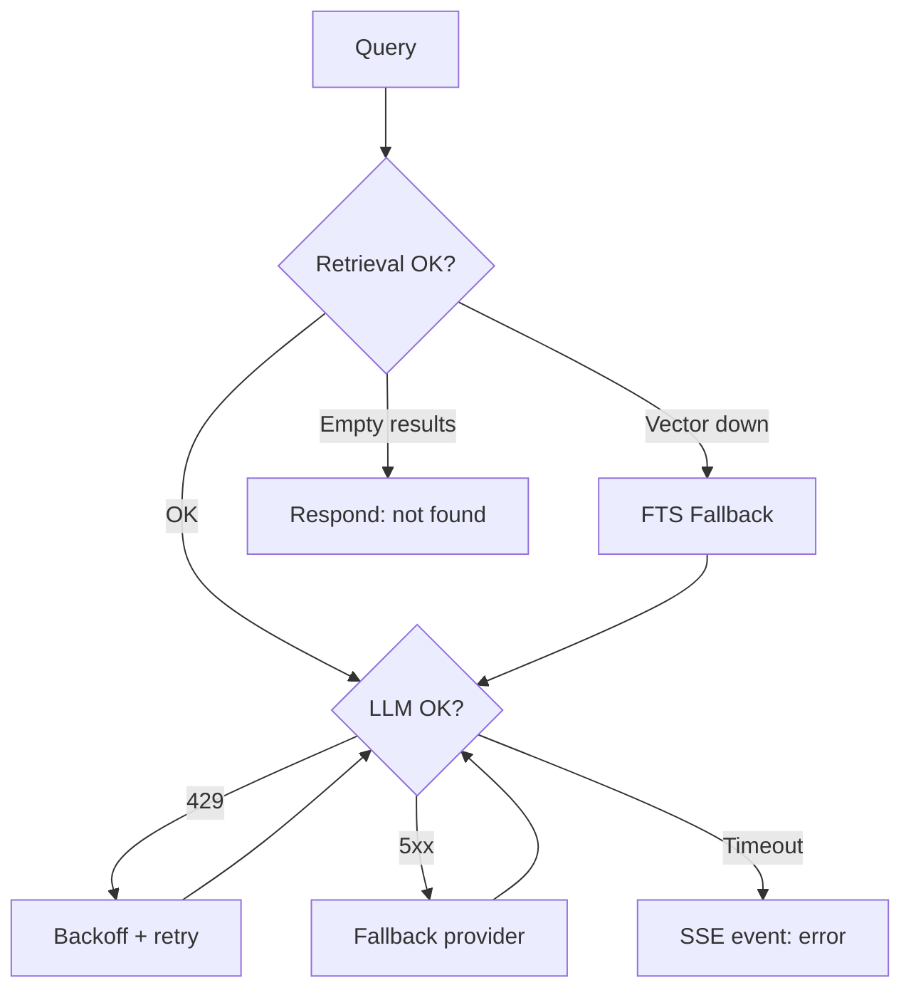
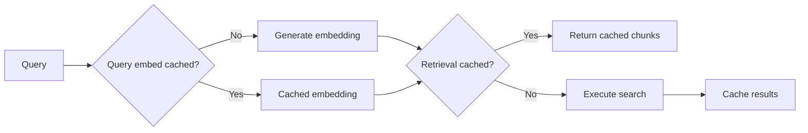

# Query Flow — MeetingMind AI

**Product:** MeetingMind AI  
**Version:** 1.0  
**Status:** Architecture — Documentation Only  
**Scope:** End-to-end path from user question to grounded AI response

---

## 1. High-Level Query Flow

---

## 2. Query Types

| Type | Endpoint | Scope | LLM Required |
|------|----------|-------|--------------|
| Workspace chat | `POST /workspaces/:id/chat` | All workspace meetings | ✅ |
| Meeting chat | `POST /meetings/:id/chat` | Single meeting | ✅ |
| Semantic search | `GET /workspaces/:id/search?q=` | All workspace meetings | ❌ |
| Hybrid search | `GET /workspaces/:id/search?mode=hybrid` | All workspace meetings | ❌ |

---

## 3. Workspace Chat — Sequence Diagram

---

## 4. Semantic Search — Flow (No LLM)

**Response shape:** `{ results: [{ chunkId, meetingId, title, excerpt, similarity, sourceType }] }`

No LLM call — latency target p95 < 200ms.

---

## 5. Detailed Stage Explanations

### Stage 1: Frontend

- React Query manages chat history and optimistic UI
- SSE client (`EventSource` or `fetch` + `ReadableStream`) handles token stream
- Citation chips rendered from `event: citation` payloads
- Abort button sends `DELETE` or closes stream → `AbortController` on server

### Stage 2: API Gateway

- JWT validation via existing auth middleware
- Workspace membership check (`workspace_members` table)
- Rate limit: 30 messages/min per user
- Assign `correlationId` for tracing

### Stage 3: Retriever Agent

- Normalize query (trim, lowercase for cache key only)
- Check Redis retrieval cache
- Execute hybrid search via RAG Service
- Apply scope filters (workspace vs meeting)
- Return top-K chunks (default K=10)

### Stage 4: Vector Search

- Embed query via LLM Service (`text-embedding-3-small`)
- ANN query with `workspace_id` pre-filter
- Cosine similarity threshold ≥ 0.70
- Parallel FTS query on `search_vector` column

### Stage 5: Context Builder

- Deduplicate chunks from same `source_id`
- Sort by relevance score, then chronologically
- Fit within 24,000 token budget
- Assign `[CITATION-1]` through `[CITATION-N]` labels

### Stage 6: LLM Generation

- Model: `gpt-4o-mini` for chat (cost-optimized)
- Stream tokens via SSE
- Parse citations from response
- Log to `llm_invocations`

### Stage 7: Response Persistence

- Save user message + assistant message to `chat_messages`
- Store `citations` JSON on assistant message
- Update `chat_sessions.updated_at`

---

## 6. Meeting-Scoped Query Variant

Meeting chat adds `meeting_id` filter — prevents cross-meeting leakage even within same workspace.

---

## 7. Error Flows

| Error | User Experience | HTTP/SSE |
|-------|-----------------|----------|
| No results | "I couldn't find relevant information in your meetings." | 200 + message |
| Rate limited | "Please wait before sending another message." | 429 |
| Provider down | "AI is temporarily unavailable." | 503 |
| Token budget | "Workspace AI limit reached." | 429 |

---

## 8. Caching Strategy

| Cache | Key | TTL | Invalidation |
|-------|-----|-----|--------------|
| Query embedding | `rag:emb:{hash(q)}` | 1h | None |
| Retrieval | `rag:ret:{ws}:{hash(q+filters)}` | 15min | Meeting update |

---

## 9. Performance Targets

| Stage | p50 | p95 |
|-------|-----|-----|
| Auth + validation | 5ms | 20ms |
| Retrieval (cached) | 10ms | 30ms |
| Retrieval (uncached) | 80ms | 200ms |
| Context build | 5ms | 20ms |
| LLM first token | 500ms | 2s |
| Full response | 3s | 10s |

---

## 10. Security Considerations

- Workspace isolation at every stage
- Meeting chat cannot bypass `meeting_id` filter
- Chat history scoped to `chat_session_id` owned by user
- No transcript content in logs — only chunk IDs
- SSE connection requires valid JWT (no query param tokens)

---

## 11. Cost per Query

| Component | Est. Cost |
|-----------|-----------|
| Query embedding | $0.00002 |
| Retrieval | $0 (compute only) |
| Chat completion (mini) | $0.001–0.01 |
| **Total per message** | **~$0.01** |

24h retrieval cache reduces repeat query cost by ~40%.

---

## Related Documents

- [retrieval-flow.md](./retrieval-flow.md)
- [rag-architecture.md](./rag-architecture.md)
- [ai-chat-requirements.md](./ai-chat-requirements.md)
- [system-sequence-diagrams.md](./system-sequence-diagrams.md)

---

## Document History

| Version | Date | Changes |
|---------|------|---------|
| 1.0 | 2026-06-18 | Initial query flow |
