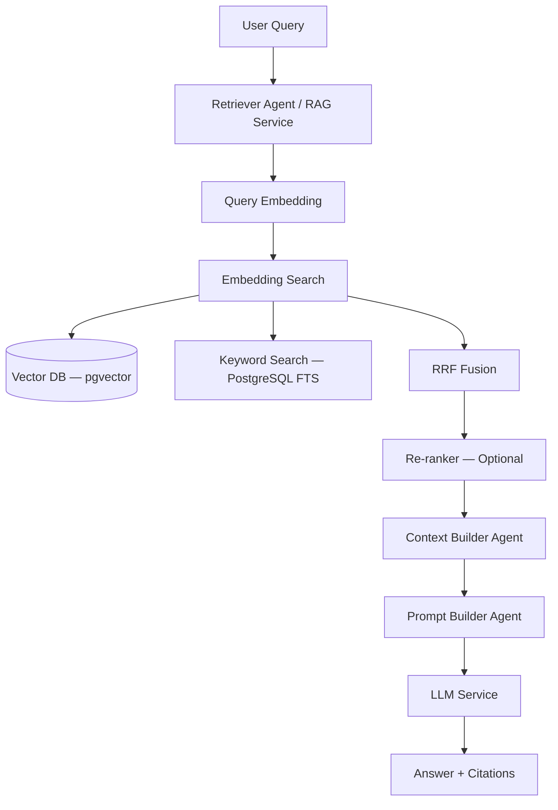
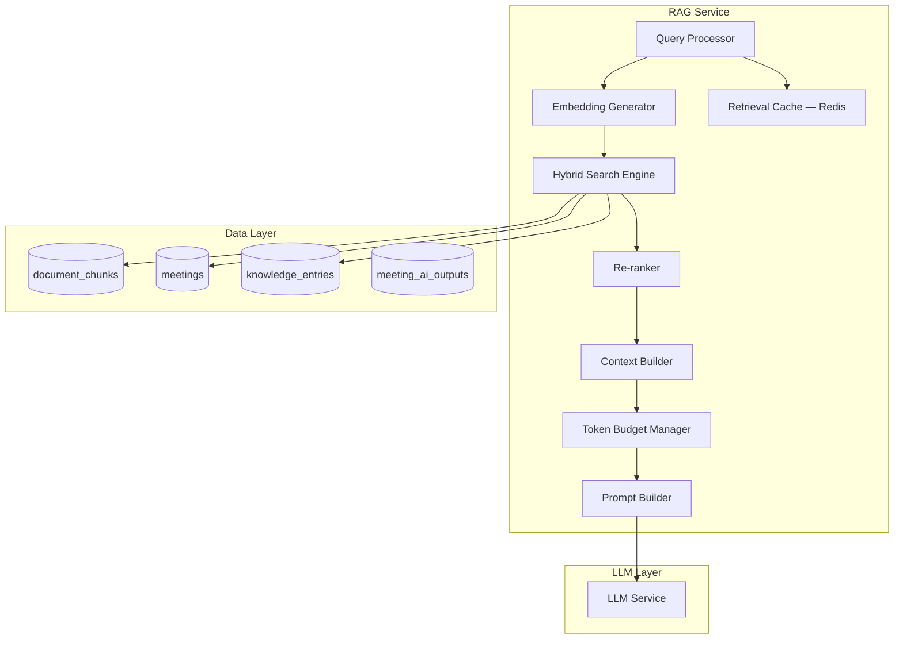
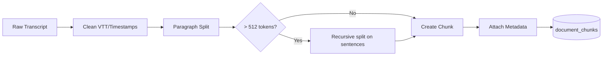
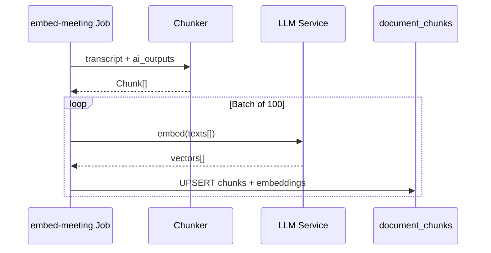
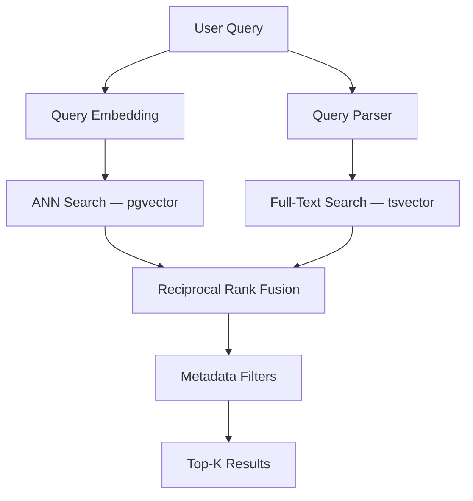
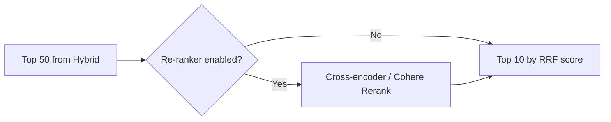
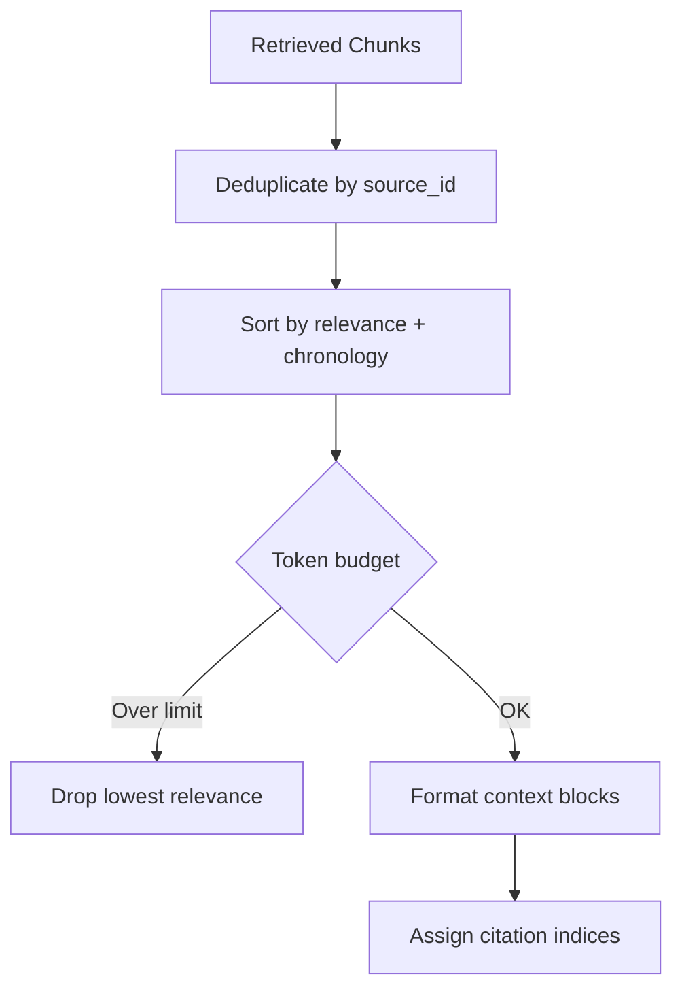
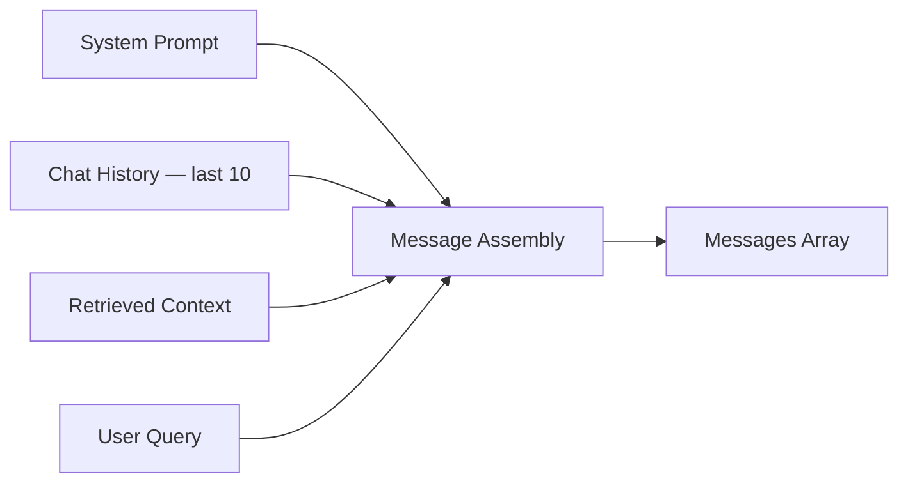
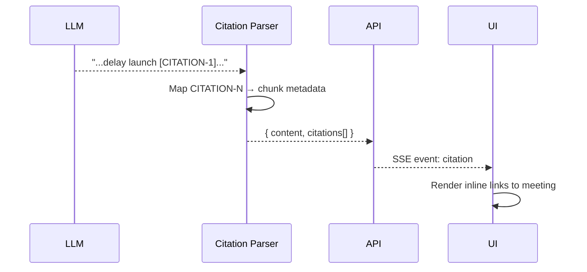
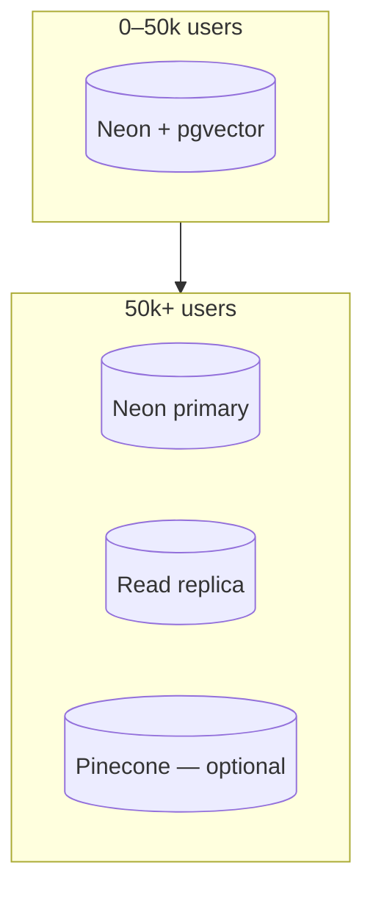

# RAG Architecture — MeetingMind AI

**Product:** MeetingMind AI  
**Version:** 1.0  
**Status:** Architecture — Documentation Only  
**Requirements:** [rag-requirements.md](./rag-requirements.md) · [semantic-search-requirements.md](./semantic-search-requirements.md) · [ai-chat-requirements.md](./ai-chat-requirements.md)

---

## 1. RAG Pipeline Overview



### Design Principles

1. **Single retrieval path** — Chat, semantic search, and weekly reports share `RAGService`
2. **Workspace isolation** — Every query scoped by `workspace_id`
3. **Grounded generation** — Chat never receives full corpus; only retrieved chunks
4. **Citations mandatory** — Every factual claim links to `document_chunks.id`
5. **Graceful degradation** — FTS-only fallback if vector index unavailable

---

## 2. Component Architecture



---

## 3. Chunking Strategy

### 3.1 Chunk Types

| Source Type | Strategy | Target Size | Overlap |
|-------------|----------|-------------|---------|
| `transcript` | Semantic paragraph boundaries | 512 tokens | 64 tokens |
| `summary` | Single chunk per section | Full section | 0 |
| `decision` | One chunk per decision | Variable | 0 |
| `action_item` | One chunk per item | Variable | 0 |
| `knowledge` | Entity + context | 256 tokens | 32 tokens |

### 3.2 Chunking Flow



### 3.3 Chunk Metadata Schema

| Field | Type | Purpose |
|-------|------|---------|
| `id` | UUID | Citation reference |
| `workspace_id` | UUID | Tenant isolation |
| `source_type` | enum | transcript, summary, decision, action_item, knowledge |
| `source_id` | UUID | meeting_id or knowledge_entry_id |
| `meeting_id` | UUID? | Nullable for workspace-level knowledge |
| `chunk_index` | int | Ordering within source |
| `content` | text | Chunk text |
| `token_count` | int | Budget calculation |
| `speaker` | string? | Transcript speaker |
| `timestamp_start` | string? | VTT timestamp |
| `embedding_model` | string | Re-embed tracking |
| `created_at` | timestamp | Freshness |

---

## 4. Embeddings



| Parameter | Value |
|-----------|-------|
| Default model | `text-embedding-3-small` (1536 dims) |
| Batch size | 100 chunks |
| Dimensions | 1536 (configurable via `EMBEDDING_DIMENSIONS`) |
| Normalization | L2 normalize before storage |
| Re-embed trigger | Model change, transcript edit |

---

## 5. Hybrid Search



### 5.1 Search Modes

| Mode | Vector | FTS | Use Case |
|------|--------|-----|----------|
| `semantic` | ✅ | ❌ | Conceptual questions |
| `keyword` | ❌ | ✅ | Exact terms, names |
| `hybrid` | ✅ | ✅ | Default for chat + search |

### 5.2 RRF Formula

```
score(d) = Σ 1 / (k + rank_i(d))   where k = 60
```

### 5.3 Metadata Filters

| Filter | Example |
|--------|---------|
| `workspace_id` | Required — always applied |
| `meeting_id` | Per-meeting chat scope |
| `source_type` | `transcript` only for raw quotes |
| `date_range` | Last 30 days for weekly report |
| `member_id` | Meetings attended by member |

---

## 6. Re-ranking



| Phase | Re-ranker | Top-K In → Out |
|-------|-----------|----------------|
| MVP (Phase 2) | None | 20 → 10 |
| v2 (Phase 6) | Cohere Rerank v3 | 50 → 10 |

---

## 7. Context Builder



### Context Block Format

```
[CITATION-1] Meeting: Q2 Planning (2026-03-15)
Speaker: Alice | Time: 00:12:34
"...we agreed to delay the launch until April..."

[CITATION-2] Decision: Launch delayed to April
Meeting: Q2 Planning (2026-03-15)
```

---

## 8. Prompt Builder



**Anti-hallucination system instructions:**
- Answer only from provided context
- If context insufficient, state "I don't have information about that in your meetings"
- Cite sources using [CITATION-N] format
- Never invent meeting dates, decisions, or assignees

---

## 9. Token Budgeting

| Component | Budget | Priority |
|-----------|--------|----------|
| System prompt | 500 tokens | Fixed |
| User query | 500 tokens | Fixed |
| Chat history | 4,000 tokens | Medium |
| Retrieved context | 24,000 tokens | High |
| Completion reserve | 4,000 tokens | Fixed |
| **Total** | **~32,000 tokens** | |

**Overflow strategy:** Drop oldest chat history first, then lowest-relevance chunks.

---

## 10. Source Citations



| Citation Field | Source |
|----------------|--------|
| `index` | CITATION-N index |
| `chunkId` | `document_chunks.id` |
| `meetingId` | `document_chunks.meeting_id` |
| `meetingTitle` | `meetings.title` |
| `excerpt` | First 200 chars of chunk |
| `timestamp` | VTT timestamp if available |

---

## 11. Caching

| Cache | Key | TTL |
|-------|-----|-----|
| Query embedding | `rag:emb:{hash(query)}` | 1h |
| Retrieval results | `rag:ret:{workspaceId}:{hash(query+filters)}` | 15min |
| Context block | `rag:ctx:{hash(chunks+query)}` | 5min |

**Invalidation:** Meeting update/delete → invalidate workspace retrieval cache prefix.

---

## 12. Context Windows by Use Case

| Use Case | Context Strategy | Max Tokens |
|----------|------------------|------------|
| Workspace chat | Hybrid retrieve top 10 | 32k |
| Meeting chat | Retrieve within meeting only | 16k |
| Semantic search | No LLM; return chunks | N/A |
| Weekly report | Retrieve last 7 days summaries | 64k |
| Task extraction | Full transcript (chunked merge) | 120k |

---

## 13. Scalability



| Scale | Strategy |
|-------|----------|
| < 1M chunks | pgvector HNSW on Neon |
| 1M–10M chunks | Tune HNSW `ef_search`; read replica |
| > 10M chunks | Migrate vectors to Pinecone; metadata in PG |
| High QPS search | Redis retrieval cache; dedicated search worker |

---

## 14. Security

- `workspace_id` filter applied at SQL level — not application-only
- Chat scope validation: meeting chat cannot retrieve other meetings
- No cross-workspace cache keys
- Retrieved content never logged in full (PII)
- Rate limit retrieval: 60 queries/min per user

---

## 15. Cost Considerations

| Operation | Cost Driver | Optimization |
|-----------|-------------|--------------|
| Embed on upload | $0.02/1M tokens | Batch; skip re-embed if unchanged |
| Query embed | $0.0001/query | Cache query embeddings |
| Chat completion | $0.01–0.10/msg | mini model; small context |
| Re-ranker | $0.001/query | Feature-flag; top-50 only |

---

## Related Documents

- [vector-db-design.md](./vector-db-design.md)
- [retrieval-flow.md](./retrieval-flow.md)
- [embedding-flow.md](./embedding-flow.md)
- [query-flow.md](./query-flow.md)
- [agent-architecture.md](./agent-architecture.md)

---

## Document History

| Version | Date | Changes |
|---------|------|---------|
| 1.0 | 2026-06-18 | Initial RAG architecture |
| 1.1 | 2026-06-20 | Implementation status — provider registry, chunking strategies, score reranker, observability |

---

## 16. Implementation Status (v1.1)

### Module Layout

```
backend/src/modules/
├── embeddings/     # Provider registry, batch embed, reindex, observability
├── chunking/       # Strategy registry (fixed, recursive, sliding, semantic)
├── vector/         # pgvector + FTS, filter validation
├── retrievers/     # Ranking, threshold filtering, RAG facade
└── rag/            # Hybrid retriever, context builder, citations, cache
```

### Chunking Strategies

| Strategy | Source Types | Module |
|----------|--------------|--------|
| `recursive` | transcript (default) | `chunking/strategies/chunking-strategies.ts` |
| `fixed` | configurable | same |
| `sliding` | long documents | same |
| `semantic` | knowledge (default) | same |
| `single` | decision, risk, action_item, summary | `transcript.strategy.ts` |
| LangChain bridge | transcript alternative | `chunking/langchain/recursive-splitter.ts` |

### Embedding Providers

| Provider ID | Status | Config |
|-------------|--------|--------|
| `openai` | ✅ Default | `EMBEDDING_PROVIDER=openai` |
| `local` | ✅ | `LOCAL_LLM_BASE_URL` |
| `voyage` | Stub | `VOYAGE_API_KEY` (future) |

### Re-ranking (MVP)

Rule-based `ScoreBoostReranker` applies:
- +10% for decision/risk chunks on intent-matching queries
- +5% recency boost for meetings within 14 days

Enable full rerank pipeline: `RERANKER_ENABLED=true`

### Observability Events

| Event | Fields |
|-------|--------|
| `embedding.generated` | provider, tokens, cacheHitRatio, latencyMs, cost |
| `rag.retrieval` | queryHash, chunkCount, avgSimilarity, retrievalMode |
| `rag.context_built` | chunkCount, contextTokens, useCase |

### Background Jobs

| Queue | Processor | Trigger |
|-------|-----------|---------|
| `embed-meeting` | `MeetingEmbeddingService` | After `process-meeting` |
| `reindex-workspace` | `ReindexService` | Admin / model upgrade |
