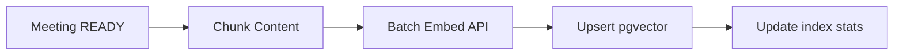
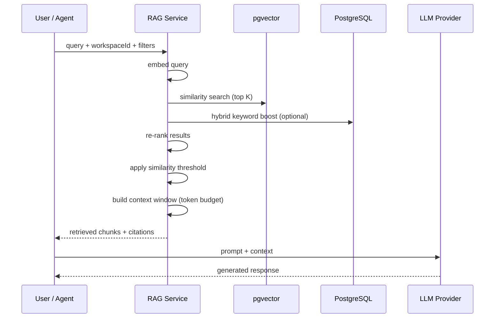
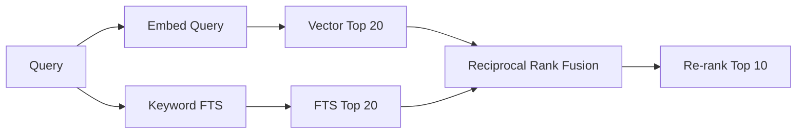

# RAG Requirements — MeetingMind AI

**Product:** MeetingMind AI  
**Version:** 1.0  
**Status:** Requirements — Documentation Only  
**Baseline:** PostgreSQL FTS (MVP+1); OpenAI embeddings via abstraction layer  
**Related:** [vector-db-requirements.md](./vector-db-requirements.md) · [semantic-search-requirements.md](./semantic-search-requirements.md) · [llm-requirements.md](./llm-requirements.md)

---

## 1. Purpose

Retrieval-Augmented Generation (RAG) enables MeetingMind AI to answer questions and generate insights using **workspace-scoped historical context** without sending entire meeting corpora to the LLM on every request.

RAG extends — does not replace — existing structured outputs (`meeting_ai_outputs`, `tasks`) or PostgreSQL keyword search.

---

## 2. Scope

### In Scope

| Corpus | Indexed Content |
|--------|----------------|
| Meeting transcripts | Chunked text with metadata |
| AI summaries | Full summary + topics |
| Decisions | Per-decision chunks |
| Action items | Title + description (accepted and pending) |
| Risks | Text + severity |
| Tasks | Title + description + comments |
| Knowledge entries | Extracted knowledge (Phase 5+) |

### Out of Scope (v1 RAG)

- External documents (PDF, Notion) — v3
- Cross-workspace retrieval — never
- Real-time meeting audio — Phase 7

---

## 3. Chunking Strategy

### 3.1 Principles

- **FR-RAG-CHUNK-001:** Chunks must be semantically coherent (not mid-sentence splits)
- **FR-RAG-CHUNK-002:** Overlap between adjacent chunks to preserve context
- **FR-RAG-CHUNK-003:** Chunk metadata must enable filtering and citation
- **FR-RAG-CHUNK-004:** Re-chunk on transcript edit; delete stale embeddings

### 3.2 Chunk Parameters

| Content Type | Target Size | Overlap | Splitter |
|--------------|-------------|---------|----------|
| Transcript | 512 tokens | 64 tokens | Recursive: `\n\n`, `\n`, `. ` |
| Summary | 256 tokens | 0 | Whole summary if < 512 tokens |
| Decision | 128 tokens | 0 | One decision per chunk |
| Risk | 128 tokens | 0 | One risk per chunk |
| Action item | 128 tokens | 0 | One item per chunk |
| Task + comments | 256 tokens | 32 tokens | Title+desc first; comments appended |

### 3.3 Chunk Identity

Each chunk record includes:

```json
{
  "id": "uuid",
  "workspaceId": "uuid",
  "sourceType": "transcript|summary|decision|risk|action_item|task|knowledge",
  "sourceId": "uuid",
  "meetingId": "uuid|null",
  "chunkIndex": 0,
  "content": "string",
  "contentHash": "sha256",
  "tokenCount": 120,
  "metadata": {
    "meetingTitle": "Sprint Planning",
    "meetingDate": "2026-06-15",
    "tags": ["sprint"],
    "speaker": "optional",
    "severity": "high"
  }
}
```

---

## 4. Embedding Generation

### 4.1 Requirements

- **FR-RAG-EMB-001:** Generate embeddings async via `embed-meeting` / `embed-entity` BullMQ jobs
- **FR-RAG-EMB-002:** Default model: `text-embedding-3-small` (1536 dimensions)
- **FR-RAG-EMB-003:** Batch embeddings: up to 100 chunks per API call
- **FR-RAG-EMB-004:** Store embedding model version with each vector for re-embedding migrations
- **FR-RAG-EMB-005:** Skip embedding if `contentHash` unchanged
- **FR-RAG-EMB-006:** Trigger embed job after `process-meeting` completes successfully

### 4.2 Embedding Pipeline



---

## 5. Retrieval Flow

### 5.1 Standard RAG Query Pipeline



### 5.2 Retrieval Parameters

| Parameter | Default | Configurable |
|-----------|---------|--------------|
| `topK` | 10 | 5–30 |
| `similarityThreshold` | 0.72 (cosine) | Per workspace |
| `maxContextTokens` | 8000 | Per workflow |
| `sourceTypes` | all | Filter array |
| `dateFrom` / `dateTo` | null | ISO dates |
| `meetingId` | null | Single meeting scope |
| `tags` | [] | Tag filter |

**FR-RAG-RET-001:** All retrieval scoped by `workspace_id` — mandatory filter  
**FR-RAG-RET-002:** Return empty set (not error) when no chunks exceed threshold  
**FR-RAG-RET-003:** Log retrieval latency, chunk count, avg similarity

---

## 6. Context Construction

### 6.1 Assembly Rules

- **FR-RAG-CTX-001:** Order chunks by relevance score (post re-rank)
- **FR-RAG-CTX-002:** Deduplicate overlapping chunks from same source
- **FR-RAG-CTX-003:** Prefix each chunk with citation marker: `[Source: Meeting "Title", 2026-06-15, chunk 3]`
- **FR-RAG-CTX-004:** Truncate lowest-scoring chunks when exceeding token budget
- **FR-RAG-CTX-005:** Reserve 20% of context window for conversation history (chat)

### 6.2 Context Template

```
You are MeetingMind AI assistant for workspace "{workspaceName}".
Use ONLY the following retrieved context to answer. Cite sources using [n] notation.
If context is insufficient, say so explicitly.

--- RETRIEVED CONTEXT ---
[1] Meeting: Sprint Planning (2026-06-15)
{chunk content}

[2] Decision from Retro (2026-06-08)
{chunk content}
--- END CONTEXT ---

User question: {query}
```

---

## 7. Prompt Construction

| Workflow | System Prompt Focus | Context Source |
|----------|---------------------|----------------|
| Workspace chat | Q&A, citations required | RAG retrieval |
| Per-meeting chat | Meeting-specific | Meeting transcript + AI output + RAG within meeting |
| Weekly report | Synthesis, structured | SQL aggregates + RAG top chunks |
| Cross-meeting analysis | Comparison | RAG multi-query |
| Agent extraction | Structured JSON | Full transcript (not RAG) |

**FR-RAG-PRM-001:** Chat prompts MUST instruct model to cite sources  
**FR-RAG-PRM-002:** Extraction agents use full transcript (existing behavior) — RAG not used for initial extraction

---

## 8. Source Citations

### 8.1 Citation Object

```json
{
  "index": 1,
  "sourceType": "transcript",
  "meetingId": "uuid",
  "meetingTitle": "Sprint Planning",
  "meetingDate": "2026-06-15",
  "chunkId": "uuid",
  "excerpt": "We agreed to ship auth by July 1...",
  "similarityScore": 0.89
}
```

### 8.2 Requirements

- **FR-RAG-CITE-001:** Chat responses include `citations[]` array
- **FR-RAG-CITE-002:** UI renders clickable links to meeting detail + highlight excerpt
- **FR-RAG-CITE-003:** Minimum 1 citation when answer derives from retrieved context
- **FR-RAG-CITE-004:** If no retrieval results, response states "no relevant meetings found"

---

## 9. Hybrid Search

Combine vector similarity with PostgreSQL keyword search for improved recall.

### 9.1 Fusion Strategy

```
final_score = (0.7 × cosine_similarity) + (0.3 × ts_rank_normalized)
```

**FR-RAG-HYB-001:** Hybrid search default for workspace chat and semantic search  
**FR-RAG-HYB-002:** Pure vector search available via `searchMode=semantic`  
**FR-RAG-HYB-003:** Pure keyword via existing `FR-SRCH-*` endpoints (preserved)

### 9.2 Hybrid Flow



---

## 10. Metadata Filters

| Filter | Field | Example |
|--------|-------|---------|
| Date range | `meetingDate` | Last 7 days |
| Tags | `tags[]` | `authentication` |
| Source type | `sourceType` | `decision` |
| Meeting | `meetingId` | Single meeting chat |
| Assignee | `assigneeId` | Tasks for Sarah |
| Severity | `severity` | `high` risks |
| Status | `taskStatus` | `TODO` |

**FR-RAG-FILT-001:** Filters applied pre-retrieval in SQL WHERE clause  
**FR-RAG-FILT-002:** Invalid filter combinations return 400

---

## 11. Re-ranking

### 11.1 Stage 1: Vector + Hybrid Fusion (top 20)

### 11.2 Stage 2: Re-ranker (top 10)

| Phase | Re-ranker | Detail |
|-------|-----------|--------|
| MVP RAG | Score boost rules | Recency + decision/risk type boost |
| RAG v2 | Cross-encoder model | `bge-reranker` or Cohere rerank API |

**FR-RAG-RERANK-001:** Boost decisions and risks by 10% for "what did we decide" queries  
**FR-RAG-RERANK-002:** Boost recency: meetings in last 14 days +5%  
**FR-RAG-RERANK-003:** Re-ranking adds < 200ms p95

---

## 12. Context Windows & Token Budgeting

| Workflow | Max Input Tokens | Allocation |
|----------|------------------|------------|
| Workspace chat | 32,000 | System 500 + history 4000 + RAG 8000 + query 200 |
| Per-meeting chat | 16,000 | System 500 + meeting full 10000 + RAG 3000 + history 2000 |
| Weekly report | 200,000 | Aggregates 2000 + RAG 50000 + instructions 1000 |
| Agent extraction | 120,000 | Transcript chunks (existing) |

**FR-RAG-BUDGET-001:** Token counter uses `tiktoken` or provider tokenizer  
**FR-RAG-BUDGET-002:** Exceeding budget truncates lowest-relevance chunks first  
**FR-RAG-BUDGET-003:** Log token budget utilization per request

---

## 13. Caching

| Cache | Key | TTL |
|-------|-----|-----|
| Query embedding | `rag:qemb:{hash(query)}` | 1h |
| Retrieval results | `rag:ret:{workspaceId}:{hash(query+filters)}` | 15min |
| Chunk set | `rag:chunks:{meetingId}:{contentHash}` | Until content change |

**FR-RAG-CACHE-001:** Invalidate retrieval cache on new meeting processed in workspace  
**FR-RAG-CACHE-002:** Cache bypass for Owner reprocess operations

---

## 14. Failure Handling

| Failure | Behavior |
|---------|----------|
| Embedding API down | Queue retry; search falls back to keyword-only |
| pgvector query timeout | Retry once; return keyword results |
| Empty retrieval | Chat responds with "no relevant context found" |
| Partial retrieval (< 3 chunks) | Proceed with warning in metadata |
| Re-embedding migration | Background job; dual-read during transition |

**FR-RAG-FAIL-001:** RAG failures must not block meeting extraction (independent pipelines)  
**FR-RAG-FAIL-002:** Degraded mode flag in API response: `retrievalMode: "keyword_only"`

---

## 15. Scalability Requirements

| Metric | Target |
|--------|--------|
| Chunks per workspace | 500,000 (≈ 5,000 meetings) |
| Embedding ingestion | 1,000 chunks/minute |
| Concurrent retrievals | 100/sec per workspace |
| Index rebuild | < 4 hours for 1M chunks (background) |
| Storage per 1k meetings | < 500 MB vectors (1536-dim float32) |

**FR-RAG-SCALE-001:** HNSW index parameters tuned for recall/latency tradeoff (see vector-db-requirements.md)  
**FR-RAG-SCALE-002:** Partition `document_chunks` by `workspace_id` hash (v2, > 10M chunks)

---

## 16. Future Extensibility

- Multi-vector representations (ColBERT-style) for improved precision
- Graph RAG: link decisions → tasks → meetings as knowledge graph
- User-uploaded document ingestion (PDF, markdown)
- Feedback loop: thumbs up/down adjusts retrieval boosting
- Per-workspace embedding model selection
- Real-time incremental indexing on comment create

---

## 17. New Data Entities (Documentation Only)

| Table | Purpose |
|-------|---------|
| `document_chunks` | Chunk text + metadata + vector |
| `embedding_jobs` | Async embed job tracking |
| `rag_queries` | Audit log of retrievals (observability) |

Schema details: [vector-db-requirements.md](./vector-db-requirements.md)

---

## Document History

| Version | Date | Changes |
|---------|------|---------|
| 1.0 | 2026-06-18 | Initial RAG requirements |
