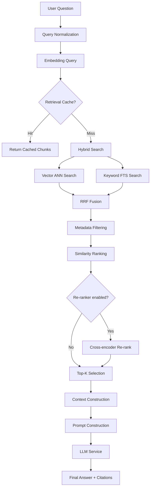
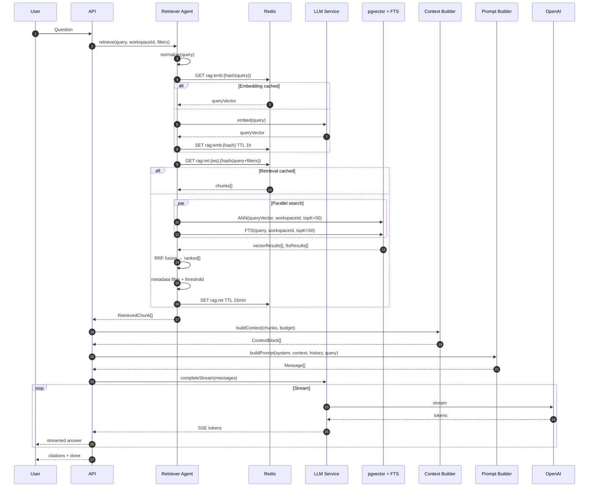
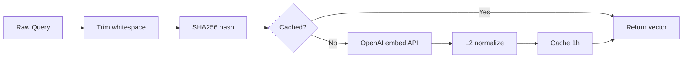
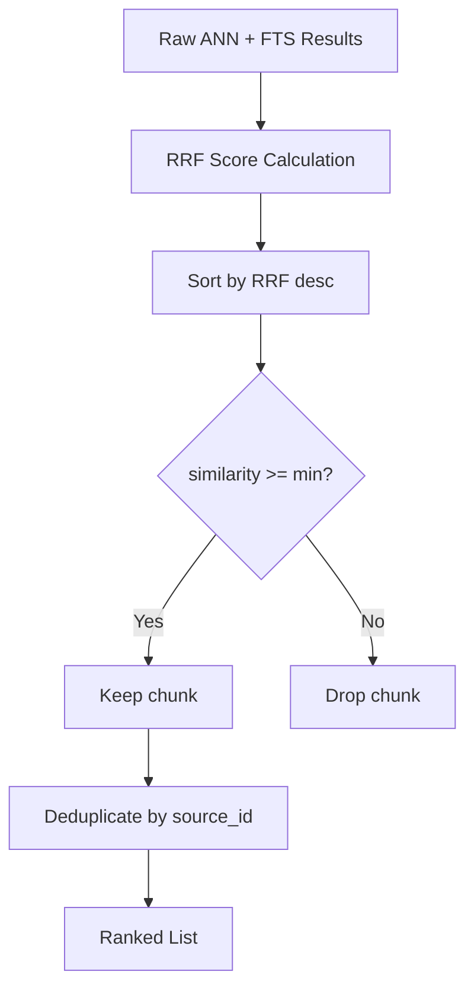
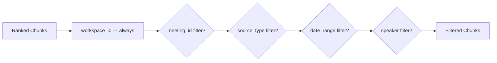
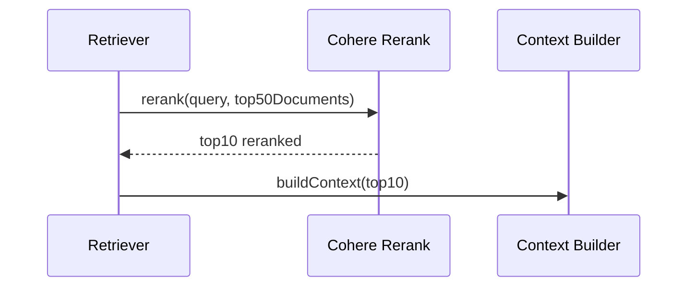
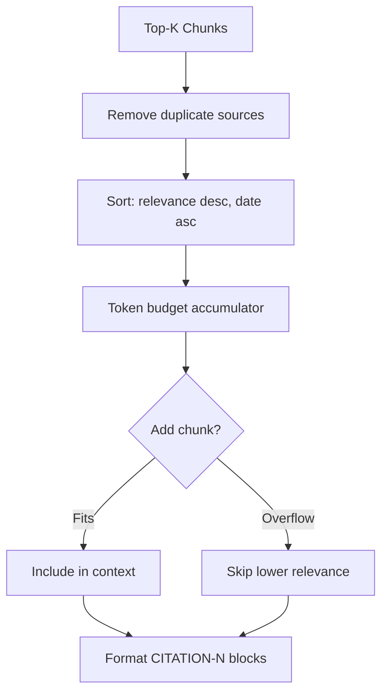
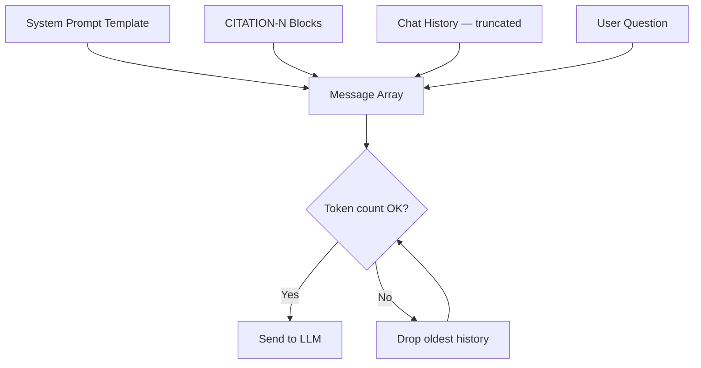
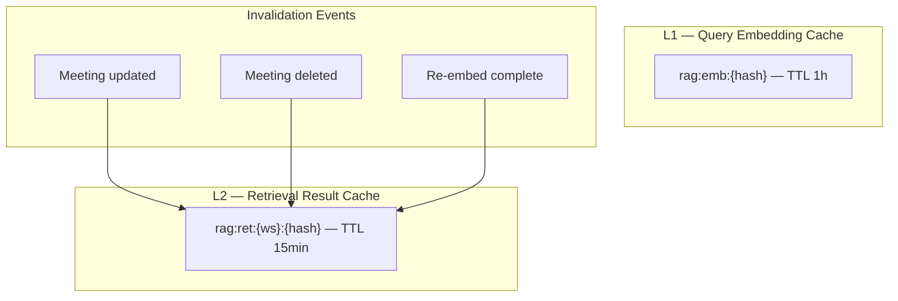
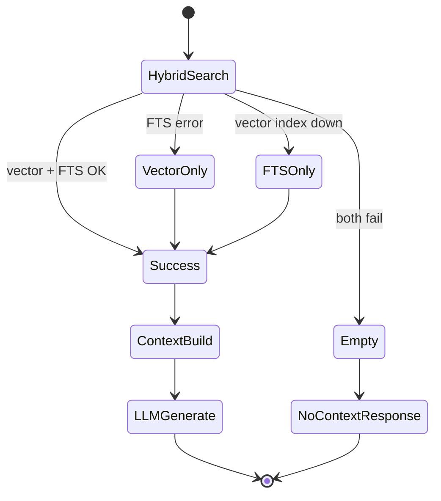

# Retrieval Flow — MeetingMind AI

**Product:** MeetingMind AI  
**Version:** 1.0  
**Status:** Architecture — Documentation Only  
**Scope:** User question through grounded answer — retrieval-focused detail

---

## 1. End-to-End Retrieval Pipeline



---

## 2. Detailed Sequence Diagram



---

## 3. Query Embedding



| Parameter | Value |
|-----------|-------|
| Model | `text-embedding-3-small` |
| Dimensions | 1536 |
| Cache TTL | 1 hour |
| Cache key | `rag:emb:{sha256(normalized_query)}` |

---

## 4. Vector Search

```sql
-- Conceptual ANN query
SELECT id, content, meeting_id, source_type, metadata,
       1 - (embedding <=> $1::vector) AS similarity
FROM document_chunks
WHERE workspace_id = $2
  AND embedding IS NOT NULL
  AND ($3::uuid IS NULL OR meeting_id = $3)
ORDER BY embedding <=> $1::vector
LIMIT 50;
```

| Parameter | Default | Chat | Search |
|-----------|---------|------|--------|
| Top-K (ANN) | 50 | 50 | 20 |
| Min similarity | 0.65 | 0.70 | 0.65 |
| `ef_search` | 40 | 40 | 40 |

---

## 5. Similarity Ranking



### RRF Scoring

```
For each document d:
  rrf_score(d) = Σ 1/(60 + rank_in_list_i(d))
```

| List | Weight |
|------|--------|
| Vector ANN | 1.0 |
| FTS | 1.0 |
| Future: BM25 sparse | 0.5 |

---

## 6. Metadata Filtering



| Filter | Required | Applied At |
|--------|----------|------------|
| `workspace_id` | ✅ Always | SQL WHERE |
| `meeting_id` | Meeting chat only | SQL WHERE |
| `source_type` | Optional | SQL WHERE |
| `date_range` | Weekly report | JOIN meetings |
| `speaker` | Optional | JSONB filter |

---

## 7. Re-ranking (Phase 6+)



| Phase | Re-ranker | Latency Added |
|-------|-----------|---------------|
| MVP | None (RRF only) | 0ms |
| v2 | Cohere Rerank v3 | +100–300ms |

---

## 8. Context Construction



**Token budget allocation:**
- Retrieved context: 24,000 tokens max
- Reserve per chunk header: 50 tokens
- Minimum chunks included: 1 (if any pass threshold)

---

## 9. Prompt Construction



---

## 10. Caching Architecture



| Cache Layer | Hit Rate Target | Savings |
|-------------|-----------------|---------|
| Query embedding | 30% | Embedding API cost |
| Retrieval results | 20% | DB query load |
| Combined | — | ~25% latency reduction on repeats |

---

## 11. Fallback Strategy



| Failure | Fallback | User Impact |
|---------|----------|-------------|
| pgvector extension error | FTS-only | Reduced semantic quality |
| Embedding API down | FTS-only | Keyword matching only |
| Zero results | Skip LLM; canned response | "Not found" message |
| LLM down | Return raw search results | Search-only mode |

---

## 12. Error Handling

| Stage | Error | Handling |
|-------|-------|----------|
| Embed query | 429/5xx | Retry 3x; FTS fallback |
| ANN search | Timeout | Retry once; reduce ef_search |
| FTS search | Error | Vector-only results |
| Re-ranker | Error | Skip; use RRF order |
| Context build | Zero chunks | Return "not found" |
| LLM | Error | SSE error event; partial save |

All errors logged with `correlationId`, `workspaceId`, `queryHash` (not raw query in prod logs).

---

## 13. Performance Targets

| Stage | p50 | p95 |
|-------|-----|-----|
| Query embed (uncached) | 100ms | 300ms |
| ANN search | 30ms | 100ms |
| FTS search | 10ms | 50ms |
| RRF + filter | 5ms | 20ms |
| Re-rank (v2) | 150ms | 400ms |
| Context build | 5ms | 15ms |
| **Total retrieval** | **150ms** | **500ms** |

---

## 14. Security

- Mandatory `workspace_id` in all SQL queries
- Meeting scope enforced before search execution
- Retrieval cache keys include workspace ID — no cross-tenant cache pollution
- Query content not stored in logs (hash only)
- Rate limit: 60 retrievals/min per user

---

## Related Documents

- [query-flow.md](./query-flow.md)
- [rag-architecture.md](./rag-architecture.md)
- [vector-db-design.md](./vector-db-design.md)
- [agent-architecture.md](./agent-architecture.md)

---

## Document History

| Version | Date | Changes |
|---------|------|---------|
| 1.0 | 2026-06-18 | Initial retrieval flow |
