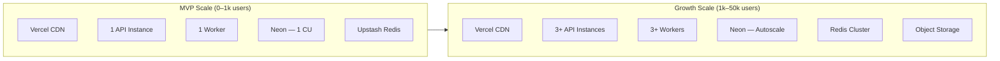
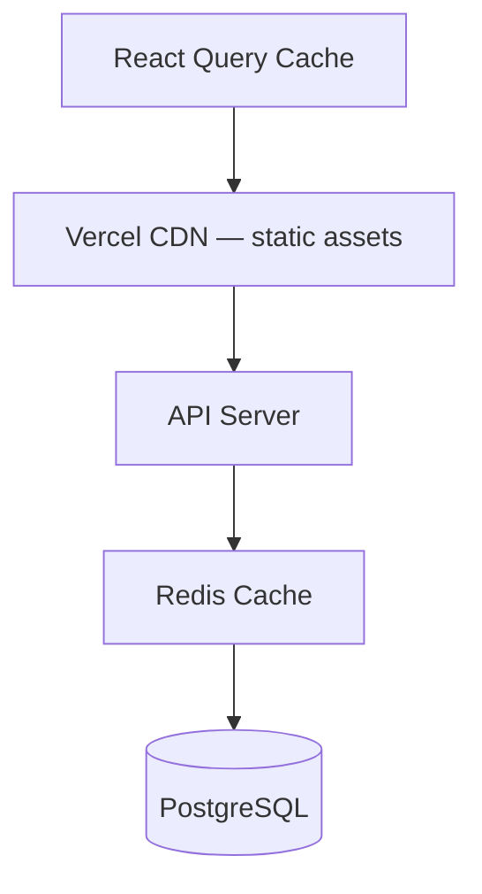
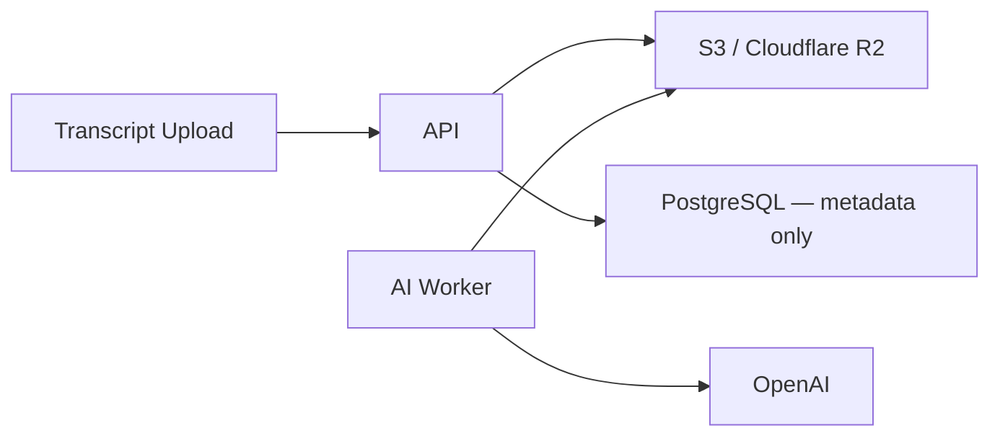

# Scalability Design

**Product:** AI Meeting Notes & Task Manager  
**Version:** 1.0

---

## 1. Current Architecture Assessment



### Current Design Strengths
- Stateless API (horizontal scaling ready)
- Async AI processing (decoupled from request path)
- Workspace-scoped multi-tenancy
- Connection pooling via Neon

### Current Design Risks

| Risk | Trigger | Impact |
|------|---------|--------|
| Single worker bottleneck | > 50 concurrent AI jobs | Processing backlog |
| Transcript in PostgreSQL | > 10k meetings | DB size, slow backups |
| In-memory rate limiting | > 1 API instance | Inconsistent limits |
| Full Kanban load | > 500 tasks/workspace | Slow UI |
| Dashboard full-scan | > 1000 meetings/workspace | Slow dashboard |
| Polling for AI status | > 100 concurrent users | Unnecessary API load |

---

## 2. Horizontal Scaling Opportunities

### 2.1 API Layer

| Component | Scale Method |
|-----------|--------------|
| Express API | Add Railway instances behind load balancer |
| Session state | None (stateless JWT) |
| Rate limiting | Redis-backed (required for multi-instance) |
| File uploads | Stream to object storage (v2) |

### 2.2 Worker Layer

| Component | Scale Method |
|-----------|--------------|
| AI workers | Add worker processes; BullMQ distributes jobs |
| Concurrency | Configure per-worker concurrency (default: 3) |
| Priority queues | High-priority re-process jobs (v2) |

### 2.3 Database Layer

| Component | Scale Method |
|-----------|--------------|
| Read queries | Neon read replicas (when available) |
| Write queries | Vertical scaling (Neon autoscale) |
| Connection pool | PgBouncer via Neon pooler; 20 conn/instance |
| Large tables | Partition activity_logs by month (v2) |

---

## 3. Caching Strategy

### 3.1 Cache Layers



### 3.2 What to Cache

| Data | Cache Location | TTL | Invalidation |
|------|---------------|-----|--------------|
| Static assets | Vercel CDN | Long (hash in filename) | Deploy |
| User profile | React Query | 5 min | On PATCH |
| Workspace list | React Query | 2 min | On create/join |
| Meeting list | React Query | 30 sec | On mutation |
| Dashboard stats | Redis | 60 sec | On task/meeting change |
| Workspace members | Redis | 5 min | On member change |
| AI output (completed) | React Query | 10 min | On reprocess |

### 3.3 What NOT to Cache

- Auth tokens
- Notifications (real-time feel needed)
- Task board during active editing
- Search results (stale risk)

### 3.4 Redis Usage (Upstash)

| Purpose | Key Pattern | TTL |
|---------|-------------|-----|
| Rate limiting | `rl:{ip}:{endpoint}` | Window-based |
| Dashboard stats | `dash:{workspaceId}` | 60s |
| Member list | `members:{workspaceId}` | 300s |
| Idempotency | `idem:{key}` | 24h |

---

## 4. Queue Architecture

### 4.1 MVP Production

```
API Server → BullMQ Producer → Upstash Redis → Worker Process(es) → OpenAI
```

| Setting | Value |
|---------|-------|
| Queue name | `ai-processing` |
| Concurrency per worker | 3 |
| Max retries | 3 |
| Backoff | Exponential (2s, 4s, 8s) |
| Job timeout | 120 seconds |
| Dead letter | `ai-processing-failed` queue |

### 4.2 Job Lifecycle

```
PENDING → PROCESSING → COMPLETED
                    ↘ FAILED (after max retries)
```

### 4.3 Future Queues (v2)

| Queue | Purpose |
|-------|---------|
| `email` | Async email dispatch |
| `notifications` | Push notification delivery |
| `search-index` | Update search vectors |
| `storage-migration` | Move transcripts to S3 |

---

## 5. Background Jobs

| Job | Trigger | Frequency | Priority |
|-----|---------|-----------|----------|
| `process-meeting` | Transcript upload | On demand | High |
| `send-email` | Password reset, invite | On demand | High |
| `due-date-reminder` | Cron | Daily 8am UTC | Medium |
| `cleanup-expired-tokens` | Cron | Hourly | Low |
| `cleanup-old-jobs` | Cron | Daily | Low |
| `migrate-transcript-storage` | Manual | On demand | Low |

### Cron Implementation

- **MVP:** `node-cron` in worker process
- **Scale:** Dedicated scheduler or Railway cron service

---

## 6. File Storage

### 6.1 MVP: Database TEXT

- Transcripts ≤ 5 MB stored in `meeting_transcripts.content`
- Simple; no additional infrastructure
- Acceptable up to ~10k meetings

### 6.2 v2: Object Storage



| Field | Purpose |
|-------|---------|
| `storage_key` | S3 object key |
| `content` | NULL after migration |
| `char_count` | Retained for stats |

### 6.3 Benefits of Object Storage

- Reduced DB size and backup time
- Cheaper per GB
- CDN-friendly for large file download (v2 export)

---

## 7. Monitoring

### 7.1 Metrics to Track

| Metric | Alert Threshold |
|--------|-----------------|
| API request latency p95 | > 500ms |
| API error rate | > 1% |
| AI job success rate | < 90% |
| AI job duration p95 | > 90s |
| Queue depth | > 100 pending |
| DB connection pool usage | > 80% |
| Redis memory usage | > 80% |
| OpenAI API errors | > 5% |

### 7.2 Tools

| Tool | Purpose |
|------|---------|
| Sentry | Error tracking (FE + BE) |
| Railway metrics | CPU, memory, deploy status |
| Neon dashboard | DB connections, storage, query perf |
| Upstash dashboard | Redis memory, commands/sec |
| Custom `/metrics` | Prometheus-compatible (v2) |

### 7.3 Dashboards

- **Operations:** API health, error rate, queue depth
- **Product:** AI success rate, meetings processed/day, task completion rate
- **Cost:** OpenAI token usage, Neon storage, Railway compute

---

## 8. Logging

### 8.1 Structured JSON Logs

```json
{
  "timestamp": "2026-06-15T10:00:00.000Z",
  "level": "info",
  "requestId": "req_abc123",
  "userId": "uuid",
  "workspaceId": "uuid",
  "method": "POST",
  "path": "/api/v1/workspaces/.../meetings",
  "statusCode": 201,
  "durationMs": 45
}
```

### 8.2 Log Aggregation

| Phase | Tool |
|-------|------|
| MVP | Railway log drain |
| Scale | Axiom, Datadog, or Logtail |

### 8.3 Log Retention

- Application logs: 30 days
- Audit logs (DB): 1 year
- AI job logs: 90 days

---

## 9. Future Growth Roadmap

| Users | Architecture Changes |
|-------|---------------------|
| 0–1k | Single API + worker; in-memory rate limit OK for dev |
| 1k–10k | Redis rate limiting; 2 API instances; object storage migration |
| 10k–50k | Read replicas; dedicated worker fleet; CDN for API (v2) |
| 50k+ | Multi-region; event-driven architecture; microservices extract |

---

## 10. Cost Optimization

| Resource | Optimization |
|----------|--------------|
| OpenAI | Chunk long transcripts; cache identical re-processes; use gpt-4o-mini for simple meetings |
| Neon | Right-size compute; use pooler; archive old meetings |
| Railway | Scale to zero on staging; right-size production |
| Vercel | Static SPA — minimal cost |
| Redis | Upstash pay-per-request suitable for MVP |

---

## Related Documents

- [system-architecture.md](./system-architecture.md)
- [database-architecture.md](./database-architecture.md)
- [security-architecture.md](./security-architecture.md)
- [risk-assessment.md](./risk-assessment.md)
