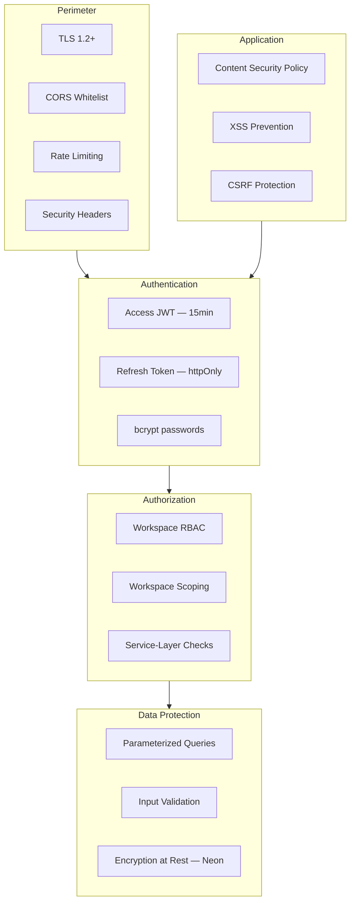

# Security Architecture

**Product:** AI Meeting Notes & Task Manager  
**Version:** 1.0  
**Classification:** Internal — Engineering

---

## 1. Security Overview



---

## 2. Authentication

### 2.1 Password Storage

| Aspect | Implementation |
|--------|----------------|
| Algorithm | bcrypt |
| Cost factor | 12 (adjustable via env) |
| Salt | Per-password (bcrypt built-in) |
| Policy | Min 8 chars, 1 letter, 1 number |
| Reset | Single-use token, 1-hour expiry, hashed in DB |

### 2.2 JWT Strategy

**Access Token:**
```json
{
  "sub": "user-uuid",
  "email": "user@example.com",
  "jti": "token-uuid",
  "iat": 1718450000,
  "exp": 1718450900
}
```

| Property | Value |
|----------|-------|
| Algorithm | HS256 (MVP) → RS256 (v2 multi-service) |
| Secret | `JWT_ACCESS_SECRET` env var (≥ 256 bits) |
| Lifetime | 15 minutes |
| Storage (client) | **Memory only** — React state/ref, never localStorage |

**Refresh Token:**
| Property | Value |
|----------|-------|
| Format | Opaque random 256-bit, stored as SHA-256 hash |
| Delivery | httpOnly, Secure, SameSite=Strict cookie |
| Path | `/api/v1/auth/refresh` |
| Lifetime | 7 days |
| Rotation | New refresh issued on every refresh; old revoked |

### 2.3 Token Revocation

- Logout: revoke current refresh token
- Password change: revoke all refresh tokens for user
- Token reuse detection: if revoked refresh used → revoke entire token family

### 2.4 Session Security

- No "remember me" extending beyond 7 days (MVP)
- Concurrent sessions allowed (multiple devices)
- Future: session list + remote revoke (v2)

---

## 3. Authorization

### 3.1 Defense in Depth

```
Layer 1: Route middleware — authenticate JWT
Layer 2: Route middleware — requireWorkspaceMember
Layer 3: Route middleware — requireRole(['OWNER'])
Layer 4: Service layer — resource ownership check
Layer 5: Database — workspace_id on every query
```

### 3.2 Workspace Isolation

Every query for tenant data MUST include:
```sql
WHERE workspace_id = $1 AND deleted_at IS NULL
```

Plus membership verification:
```sql
EXISTS (SELECT 1 FROM workspace_members WHERE workspace_id = $1 AND user_id = $2)
```

### 3.3 IDOR Prevention

- Never trust `workspaceId` from request body — use URL param + membership check
- Return 404 (not 403) for unauthorized resource access
- Validate assignee is workspace member before task assignment

---

## 4. Input Validation

| Layer | Tool | Scope |
|-------|------|-------|
| Request body | Zod schemas | All POST/PATCH/PUT |
| Query params | Zod schemas | Pagination, filters |
| File upload | Size + extension check | Transcript files |
| String fields | Max length enforcement | All text inputs |
| JSONB | Schema validation before save | AI output edits |

### Payload Limits

| Limit | Value |
|-------|-------|
| Max JSON body | 10 MB |
| Max transcript | 5 MB |
| Max comment | 5,000 chars |
| Max chat message | 4,000 chars |

---

## 5. SQL Injection Prevention

- **Prisma ORM** — all queries parameterized by default
- **No raw SQL** unless absolutely necessary; use `$queryRaw` with tagged templates
- **No string concatenation** for query building

---

## 6. XSS Protection

| Vector | Mitigation |
|--------|------------|
| Stored XSS (comments) | React auto-escapes; no `dangerouslySetInnerHTML` |
| Reflected XSS | Input validation; output encoding |
| DOM XSS | Avoid `eval`, `innerHTML` |
| Token theft | Access token in memory only; httpOnly refresh cookie |

### Content Security Policy (Production)

```
Content-Security-Policy:
  default-src 'self';
  script-src 'self';
  style-src 'self' 'unsafe-inline';
  img-src 'self' data: https:;
  connect-src 'self' https://api.example.com;
  frame-ancestors 'none';
```

---

## 7. CSRF Protection

### Risk

Refresh token in cookie could be exploited via cross-site requests.

### Mitigations

| Control | Implementation |
|---------|----------------|
| SameSite cookie | `SameSite=Strict` on refresh token |
| Origin validation | Check `Origin` header matches allowed origins on `/auth/refresh` |
| CORS | Whitelist frontend origin only; no credentials for unknown origins |
| Access token | In Authorization header (not cookie) — immune to CSRF |

### Double-Submit (MVP+1 optional)

For cookie-based auth endpoints, require `X-CSRF-Token` header matching cookie value.

---

## 8. Rate Limiting

See [api-architecture-review.md](./api-architecture-review.md) for limits.

Additional security rate limits:
- Account lockout: 5 failed logins per 15 min → temporary block
- Invitation brute force: 10 accept attempts per IP per min
- Password reset: 3 per email per hour

---

## 9. Secrets Management

| Secret | Storage | Rotation |
|--------|---------|----------|
| `JWT_ACCESS_SECRET` | Railway/Vercel env | Quarterly |
| `JWT_REFRESH_SECRET` | Railway env | Quarterly |
| `DATABASE_URL` | Railway env | On compromise |
| `OPENAI_API_KEY` | Railway env | Quarterly |
| `EMAIL_API_KEY` | Railway env | Quarterly |

### Rules

- Never commit secrets to git
- `.env.example` with placeholder values only
- Different secrets per environment (dev/staging/prod)
- CI uses GitHub Secrets for deploy

---

## 10. Transport Security

- TLS 1.2+ enforced (Vercel, Railway default)
- HSTS header: `Strict-Transport-Security: max-age=31536000; includeSubDomains`
- No mixed content
- Secure cookie flag in production

---

## 11. Security Headers (Helmet.js)

```
X-Content-Type-Options: nosniff
X-Frame-Options: DENY
X-XSS-Protection: 0 (disabled per modern best practice)
Referrer-Policy: strict-origin-when-cross-origin
Permissions-Policy: camera=(), microphone=(), geolocation=()
```

---

## 12. AI Data Security

| Concern | Mitigation |
|---------|------------|
| Transcript sent to OpenAI | Document in privacy policy; user consent on upload |
| PII in transcripts | Warn users; minimize data in prompts |
| API key exposure | Server-side only; never in frontend |
| Prompt injection | System prompt hardening; output schema validation |
| Data retention (OpenAI) | Use API with zero data retention option if available |

---

## 13. Dependency Security

- `npm audit` in CI on every PR
- Dependabot enabled for security updates
- Pin major versions; review updates
- No packages with known critical CVEs

---

## 14. Logging & Audit

### What to Log
- Authentication events (login, logout, failed attempts)
- Authorization failures
- AI job start/complete/fail
- Member add/remove
- Password changes

### What NOT to Log
- Passwords or tokens
- Full transcripts
- Refresh token values

### Log Format
```json
{
  "level": "info",
  "requestId": "req_abc",
  "userId": "uuid",
  "workspaceId": "uuid",
  "action": "auth.login.success",
  "timestamp": "2026-06-15T10:00:00.000Z"
}
```

---

## 15. Incident Response

| Severity | Response Time | Action |
|----------|---------------|--------|
| Critical (data breach) | < 1 hour | Revoke tokens, rotate secrets, notify |
| High (auth bypass) | < 4 hours | Patch, deploy, audit logs |
| Medium (rate limit bypass) | < 24 hours | Fix, monitor |
| Low (info disclosure) | < 1 week | Fix in next release |

---

## 16. Production Checklist

- [ ] All secrets in env vars (not code)
- [ ] HTTPS enforced
- [ ] CORS whitelist configured
- [ ] Rate limiting enabled (Redis-backed)
- [ ] Helmet security headers active
- [ ] bcrypt cost factor ≥ 12
- [ ] Refresh token rotation implemented
- [ ] Access token in memory only (frontend)
- [ ] Workspace isolation integration tests passing
- [ ] npm audit clean
- [ ] Sentry error tracking configured
- [ ] No stack traces in production responses

---

## Related Documents

- [api-architecture-review.md](./api-architecture-review.md)
- [non-functional-requirements.md](./non-functional-requirements.md)
- [risk-assessment.md](./risk-assessment.md)
