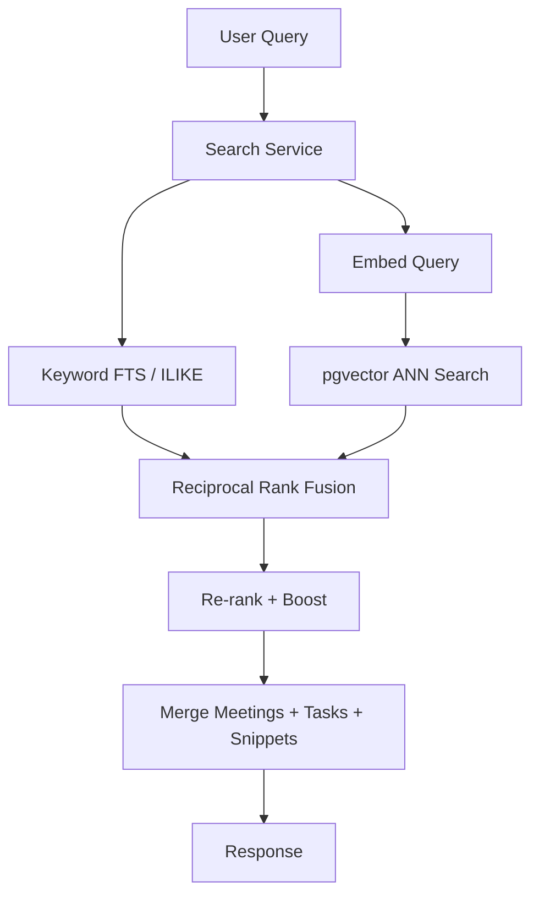

# Semantic Search Requirements — MeetingMind AI

**Product:** MeetingMind AI  
**Version:** 1.0  
**Status:** Requirements — Documentation Only  
**Baseline:** `FR-SRCH-001 – FR-SRCH-005`; existing `/workspaces/:id/search` (keyword); platform v0.3.0  
**Related:** [rag-requirements.md](./rag-requirements.md) · [vector-db-requirements.md](./vector-db-requirements.md)

---

## 1. Purpose

Semantic search enables users to find meetings, tasks, and AI-generated content by **meaning** rather than exact keywords — e.g., "Docker deployment" matches "container orchestration on Kubernetes."

This **extends** the existing search endpoint; keyword search remains available as fallback and hybrid component.

---

## 2. Searchable Entities

| Entity | Indexed Fields | Source Table | Priority |
|--------|---------------|--------------|----------|
| **Meetings** | title, tags, attendees | `meetings` | P0 |
| **Transcripts** | full text (chunked) | `meeting_transcripts` | P0 |
| **Summaries** | summary, topics | `meeting_ai_outputs` | P0 |
| **Decisions** | decision text, context | `meeting_ai_outputs.decisions` | P1 |
| **Action items** | title, description | `action_item_suggestions` | P1 |
| **Risks** | text, severity, context | `meeting_ai_outputs.risks` | P1 |
| **Tasks** | title, description, comments | `tasks`, `task_comments` | P0 |
| **Knowledge** | entity content | `knowledge_entries` (Phase 5) | P2 |

---

## 3. Use Cases

| Query | Expected Results |
|-------|------------------|
| "Find meetings about Docker" | Meetings discussing containers, K8s, deployment |
| "Find conversations regarding authentication" | Transcript chunks + decisions mentioning auth, login, OAuth |
| "What did we decide about the API redesign?" | Decision chunks ranked highest |
| "Show high severity risks from Q2" | Risk chunks filtered by severity + date |
| "Tasks related to onboarding" | Task records semantically similar |
| "Meetings with Sarah about performance" | Transcript + attendee filter |

---

## 4. Search Modes

### 4.1 Mode Matrix

| Mode | Parameter | Behavior |
|------|-----------|----------|
| **Keyword** | `mode=keyword` | Existing PostgreSQL ILIKE + FTS (preserved) |
| **Semantic** | `mode=semantic` | Vector similarity only |
| **Hybrid** (default) | `mode=hybrid` | RRF fusion vector + keyword |

**FR-SRCH-SEM-001:** Default mode transitions to `hybrid` when embeddings available  
**FR-SRCH-SEM-002:** Fall back to `keyword` when vector index unavailable (degraded banner in UI)  
**FR-SRCH-SEM-003:** Preserve existing API response shape; add `searchMode` and `snippets[]`

---

## 5. API Design (Extension)

### `GET /workspaces/:workspaceId/search`

**Existing params preserved:** `q`, `type`, `page`, `limit`

**New params:**

| Param | Type | Description |
|-------|------|-------------|
| `mode` | `keyword\|semantic\|hybrid` | Search mode (default: `hybrid`) |
| `similarityMin` | float 0–1 | Minimum cosine similarity (default: 0.72) |
| `dateFrom` | ISO date | Filter meetings after date |
| `dateTo` | ISO date | Filter meetings before date |
| `tags` | string[] | Tag filter |
| `assigneeId` | uuid | Task assignee filter |
| `severity` | low\|medium\|high | Risk filter |
| `sourceTypes` | string[] | Limit chunk types |
| `meetingId` | uuid | Scope to single meeting |

### Response Extension

```json
{
  "searchMode": "hybrid",
  "query": "authentication",
  "meetings": [
    {
      "id": "uuid",
      "title": "Sprint Planning",
      "meetingDate": "2026-06-15",
      "relevanceScore": 0.91,
      "matchType": "semantic"
    }
  ],
  "tasks": [],
  "snippets": [
    {
      "sourceType": "decision",
      "meetingId": "uuid",
      "meetingTitle": "Architecture Review",
      "excerpt": "We will use OAuth 2.0 for authentication...",
      "similarityScore": 0.89,
      "highlight": "OAuth 2.0 for <em>authentication</em>"
    }
  ],
  "meta": { "page": 1, "limit": 20, "total": 15, "searchDurationMs": 145 }
}
```

---

## 6. Similarity Thresholds

| Content Type | Default Min Similarity | Rationale |
|--------------|------------------------|-----------|
| Transcript chunks | 0.70 | Noisy text; lower threshold |
| Decisions | 0.75 | Shorter, precise text |
| Summaries | 0.72 | Medium length |
| Risks | 0.75 | Important precision |
| Tasks | 0.78 | Avoid irrelevant task matches |
| Action items | 0.75 | — |

**FR-SRCH-SEM-004:** Return no results below threshold (don't pad with weak matches)  
**FR-SRCH-SEM-005:** Workspace Owners can adjust default threshold (0.65–0.90) in settings (v2)

---

## 7. Ranking

### 7.1 Score Composition (Hybrid)

```
final_score = (0.6 × semantic_score) + (0.25 × keyword_score) + (0.15 × recency_boost)
```

### 7.2 Recency Boost

| Age | Boost |
|-----|-------|
| Last 7 days | +0.15 |
| Last 30 days | +0.08 |
| Last 90 days | +0.03 |
| Older | 0 |

### 7.3 Type Boost (Query-Dependent)

| Query Pattern | Boost Type |
|---------------|------------|
| "decide", "agreed", "decision" | decisions +0.10 |
| "risk", "blocker", "concern" | risks +0.10 |
| "task", "action", "assigned" | tasks +0.10 |
| "meeting about" | transcripts +0.05 |

**FR-SRCH-SEM-006:** Results sorted by `final_score` DESC  
**FR-SRCH-SEM-007:** Deduplicate: max 3 snippets per meeting in results

---

## 8. Hybrid Search Architecture



**FR-SRCH-SEM-008:** Parallel execution of vector and keyword queries  
**FR-SRCH-SEM-009:** RRF constant k=60  
**FR-SRCH-SEM-010:** Total retrieval time < 300ms p95

---

## 9. Metadata Filtering

Filters applied as SQL WHERE before vector search (pre-filtering):

```sql
WHERE workspace_id = $1
  AND (meeting_date BETWEEN $2 AND $3 OR $2 IS NULL)
  AND (tags && $4 OR $4 IS NULL)
  AND source_type = ANY($5)
```

**FR-SRCH-SEM-011:** Filters reduce candidate set before ANN search (not post-filter)  
**FR-SRCH-SEM-012:** Invalid UUID filters return 400

---

## 10. Performance Expectations

| Metric | Target |
|--------|--------|
| p50 latency | < 100ms |
| p95 latency | < 300ms |
| p99 latency | < 500ms |
| Results per query | Default 20, max 50 |
| Index size per 10k meetings | < 2 GB |
| Concurrent searches | 50/sec per workspace |

### 10.1 Degradation

| Condition | Behavior |
|-----------|------------|
| pgvector slow (> 500ms) | Timeout; return keyword-only |
| Embedding API down | Keyword-only mode |
| Empty vector index | Keyword-only + banner "Indexing in progress" |

---

## 11. UI Requirements

- **FR-SRCH-UI-001:** Global search bar supports semantic queries (existing component extended)
- **FR-SRCH-UI-002:** Show `matchType` badge: Semantic / Keyword / Both
- **FR-SRCH-UI-003:** Snippet cards with meeting title, date, excerpt, relevance score
- **FR-SRCH-UI-004:** Filter panel: date range, type, tags (existing filters preserved)
- **FR-SRCH-UI-005:** "No results" suggests broadening query or keyword mode
- **FR-SRCH-UI-006:** Mobile search (existing) supports semantic mode transparently

---

## 12. Indexing Requirements

- **FR-SRCH-IDX-001:** Auto-index on meeting `READY` status (via `embed-meeting` job)
- **FR-SRCH-IDX-002:** Re-index on transcript edit or AI output edit
- **FR-SRCH-IDX-003:** Index tasks on create/update/delete
- **FR-SRCH-IDX-004:** Bulk re-index admin endpoint for workspace (Owner only)
- **FR-SRCH-IDX-005:** Index status visible: `indexed | pending | stale`

---

## 13. User Stories

| ID | Story | Priority |
|----|-------|----------|
| SRCH-SEM-01 | As a **user**, I want to **search by meaning not just keywords**, so that **I find relevant meetings even with different wording** | P0 |
| SRCH-SEM-02 | As a **PM**, I want to **filter semantic results by date and tags**, so that **I narrow to relevant periods** | P1 |
| SRCH-SEM-03 | As a **user**, I want to **see why a result matched**, so that **I trust search results** | P0 |
| SRCH-SEM-04 | As a **user**, I want **keyword search to still work**, so that **exact title matches are fast** | P0 |

---

## 14. Success Metrics

| Metric | Target |
|--------|--------|
| Search success rate (click on result) | ≥ 60% |
| Zero-result rate | < 20% |
| Semantic vs keyword satisfaction | Semantic ≥ keyword NPS |
| p95 latency | < 300ms |
| Index coverage | ≥ 95% of READY meetings indexed within 5 min |

---

## Document History

| Version | Date | Changes |
|---------|------|---------|
| 1.0 | 2026-06-18 | Initial semantic search requirements |
