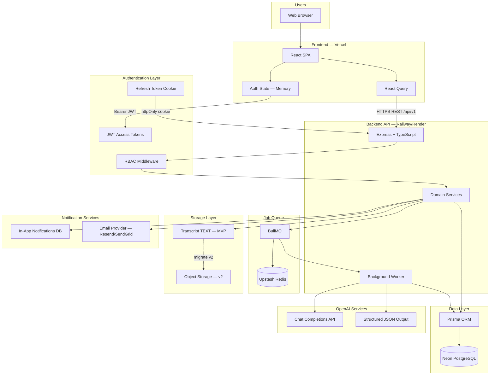
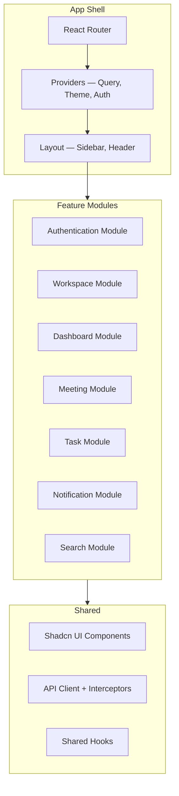
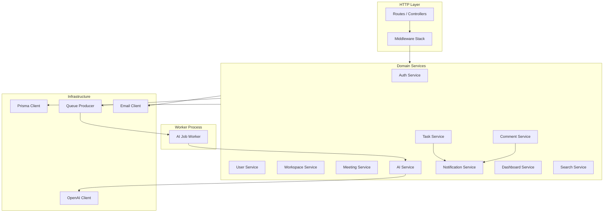
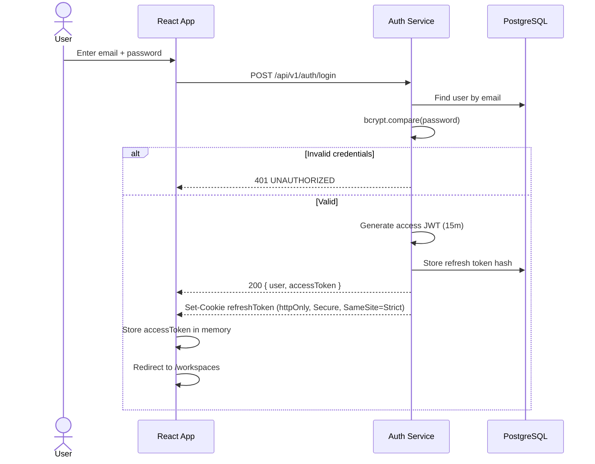
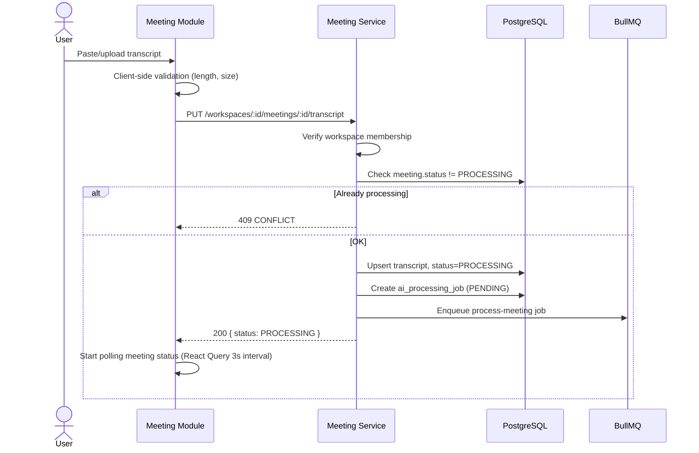
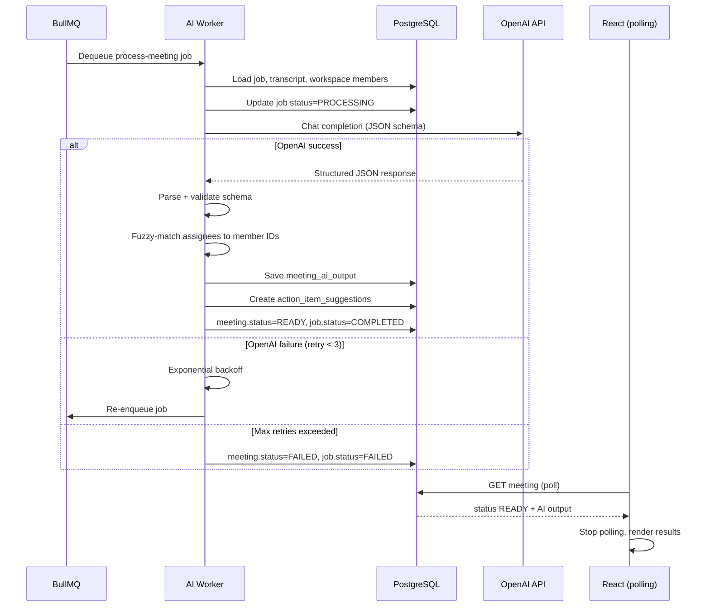
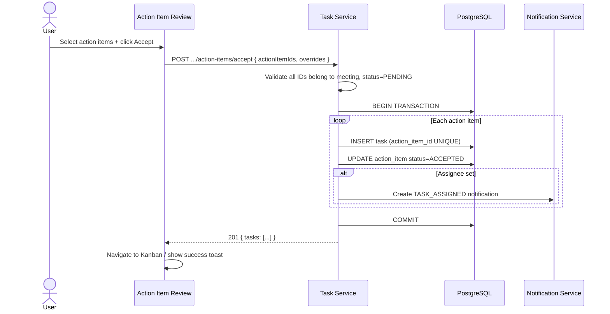
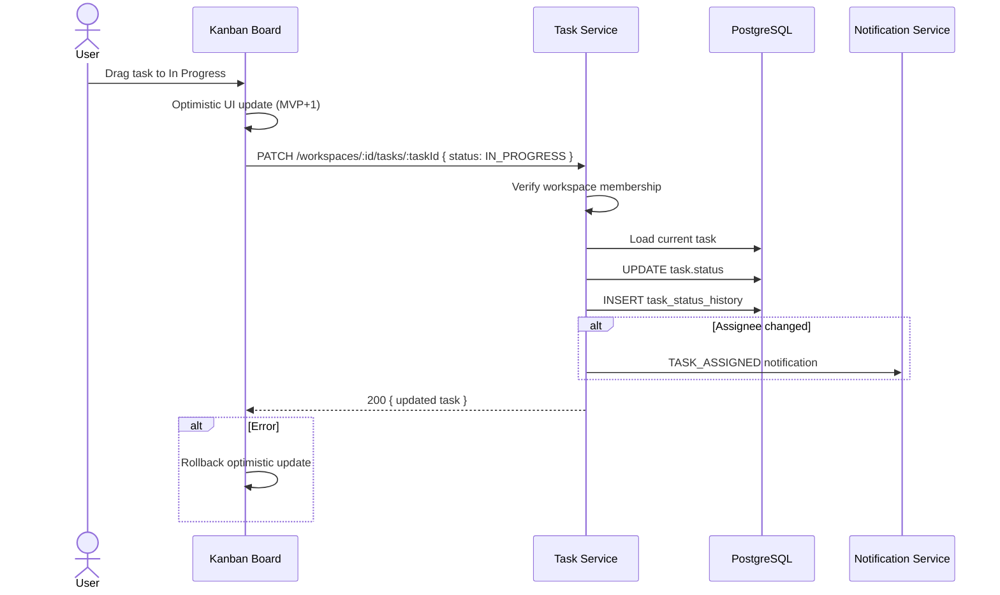

# System Architecture

**Product:** AI Meeting Notes & Task Manager  
**Version:** 1.0  
**Status:** Canonical Architecture Reference  
**Supersedes:** [architecture.md](./architecture.md) (retained for historical reference)

---

## 1. High-Level Architecture

### Architecture Explanation

The system follows a **classic three-tier SaaS pattern** with async AI processing:

1. **Frontend (React SPA)** — Deployed on Vercel as static assets. Handles UI, routing, client-side state, and API communication via React Query. Access tokens live in memory only; refresh tokens in httpOnly cookies.

2. **Authentication Layer** — Stateless JWT access tokens (15 min) validated on every request. Refresh tokens (7 days) stored hashed in PostgreSQL, delivered via httpOnly `SameSite=Strict` cookies. RBAC middleware enforces workspace membership and roles.

3. **Backend API (Express)** — Thin controllers delegate to domain services. All business logic, authorization, and validation live in services. Stateless and horizontally scalable.

4. **Job Queue (BullMQ + Redis)** — AI processing is never synchronous in the request path. Transcript upload enqueues a job; worker processes OpenAI calls independently. Enables retries, horizontal scaling, and deploy safety.

5. **Database (Neon PostgreSQL)** — Single source of truth. Prisma ORM with workspace-scoped queries. Connection pooling via Neon pooler endpoint.

6. **OpenAI Services** — GPT-4o (or equivalent) with structured JSON schema output. Worker sends transcript + member names; receives summary, decisions, risks, action items.

7. **Notification Services** — In-app notifications persisted in DB (MVP). Email via transactional provider for password reset, invitations, and optional task reminders (MVP+1).

8. **Storage Layer** — MVP stores transcripts as PostgreSQL TEXT (≤ 5 MB). v2 migrates to S3/R2 with `storage_key` reference for cost and backup efficiency.

---

## 2. Component Architecture

### 2.1 Frontend Components

| Module | Responsibility | Key Pages / Components |
|--------|----------------|------------------------|
| **Authentication** | Login, register, password reset, session management | `LoginPage`, `RegisterPage`, `AuthProvider`, `ProtectedRoute` |
| **Workspace** | CRUD workspaces, invitations, member management, switcher | `WorkspaceList`, `WorkspaceSettings`, `InviteMemberForm`, `WorkspaceSwitcher` |
| **Dashboard** | Stats cards, activity feed, productivity charts | `DashboardPage`, `StatCards`, `ActivityFeed`, `ProductivityChart` |
| **Meeting** | Meeting CRUD, transcript upload, AI output display, action item review | `MeetingList`, `MeetingDetail`, `TranscriptUpload`, `AIOutputPanel`, `ActionItemReview` |
| **Task** | Kanban board, task CRUD, comments, assignment | `KanbanBoard`, `TaskCard`, `TaskDetailDrawer`, `CommentThread` |
| **Notification** | Bell icon, notification list, read state | `NotificationBell`, `NotificationDropdown`, `NotificationItem` |
| **Search** | Global search bar, results page | `SearchBar`, `SearchResults` |

### 2.2 Backend Components

| Service | Responsibility |
|---------|----------------|
| **Auth Service** | Register, login, logout, refresh rotation, password reset, token revocation |
| **User Service** | Profile CRUD, notification preferences |
| **Workspace Service** | Workspace CRUD, slug generation, soft delete |
| **Meeting Service** | Meeting CRUD, transcript storage, status transitions, enqueue AI jobs |
| **AI Service** | OpenAI prompt construction, response parsing, assignee matching, output persistence |
| **Task Service** | Task CRUD, status transitions, history logging, action-item conversion |
| **Comment Service** | Comment CRUD, @mention parsing, mention notifications |
| **Notification Service** | Create, list, mark read notifications; email dispatch (MVP+1) |
| **Dashboard Service** | Aggregate stats, activity feed queries |
| **Search Service** | Full-text and filtered search across meetings/tasks |

---

## 3. Request Flow Diagrams

### 3.1 User Login Flow

**Explanation:** Password verified with bcrypt. Access token returned in JSON body and held in React memory (never localStorage). Refresh token set as httpOnly cookie for silent renewal.

---

### 3.2 Meeting Upload Flow

**Explanation:** Transcript upload is atomic. Concurrent uploads rejected. Job record created before enqueue for durability.

---

### 3.3 AI Processing Flow

**Explanation:** Worker is idempotent — checks job status before processing. Retries transient OpenAI errors. Frontend polls until terminal state.

---

### 3.4 Task Generation Flow

**Explanation:** Transaction ensures atomicity. `action_item_id` unique constraint prevents duplicate tasks on retry. Notifications created inside transaction or via outbox (MVP: inline).

---

### 3.5 Task Update Flow

**Explanation:** Every status change logged in history. Assignee changes trigger notifications. Kanban uses PATCH for MVP; optimistic UI in MVP+1.

---

## 4. Deployment View

| Environment | Frontend | API | Worker | DB | Redis |
|-------------|----------|-----|--------|-----|-------|
| Local | Vite dev :5173 | :3001 | Same process | Docker PG | Docker Redis |
| Staging | Vercel preview | Railway staging | Railway worker | Neon branch | Upstash |
| Production | Vercel prod | Railway prod | Railway worker | Neon prod | Upstash |

---

## 5. Related Documents

- [security-architecture.md](./security-architecture.md)
- [database-architecture.md](./database-architecture.md)
- [scalability-design.md](./scalability-design.md)
- [api-architecture-review.md](./api-architecture-review.md)
- [project-structure.md](./project-structure.md)
