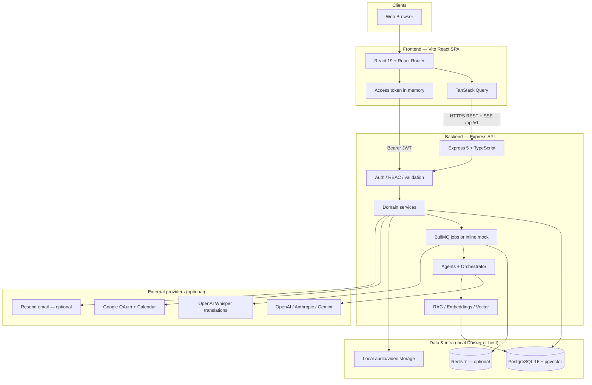
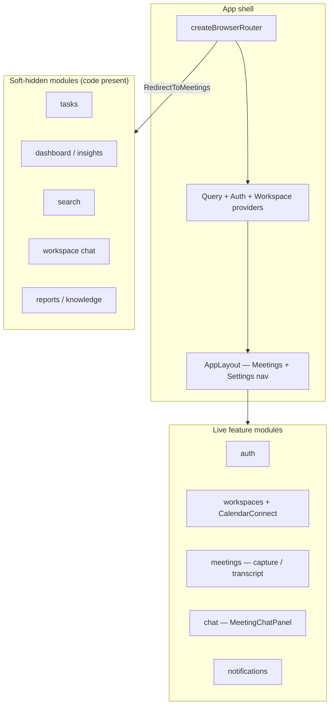
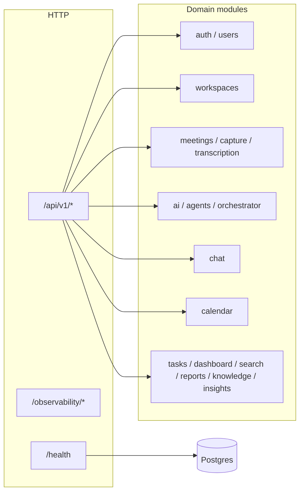
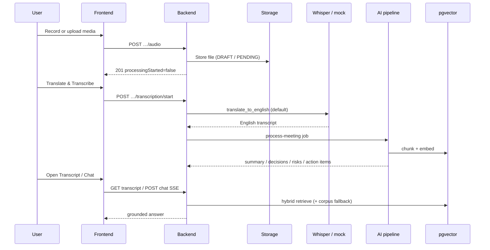
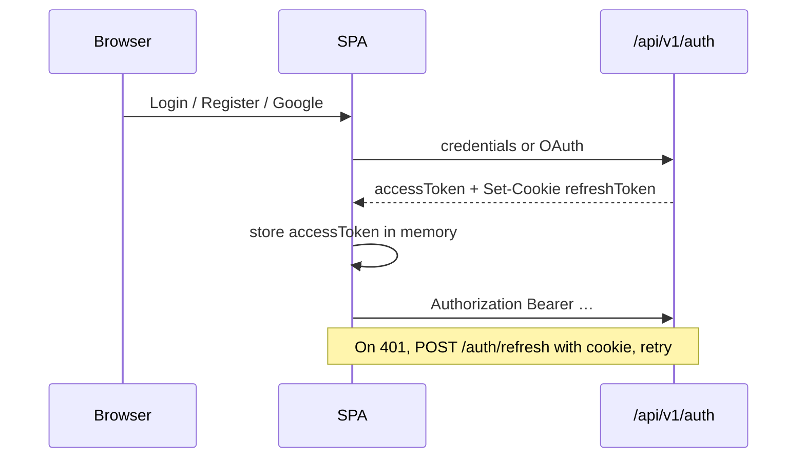
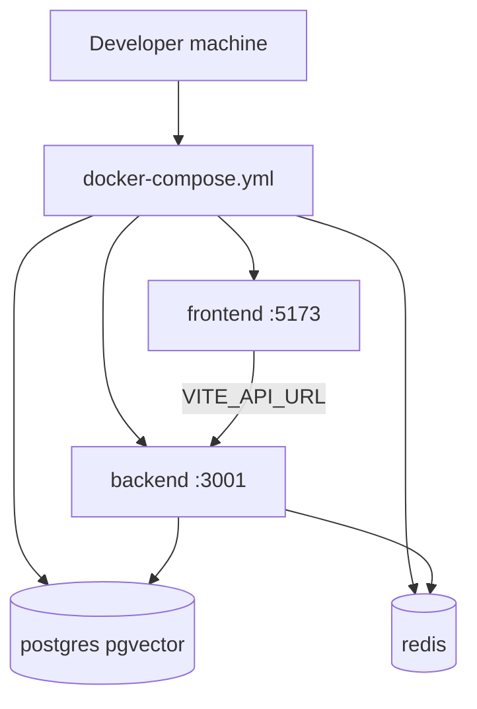

# System Architecture — MeetingMind AI

**Product:** MeetingMind AI  
**Version:** 0.7.2  
**Status:** Canonical — synced to implementation (2026-07-29)  
**Source of truth:** Code under `frontend/`, `backend/`, `docker-compose.yml`

---

## 1. Product surface (current)

**Primary UX loop:** Sign in → workspace → create meeting (optional Google Meet) → record/upload → Translate & Transcribe → read/download English transcript → meeting chat.

**Primary nav:** Meetings + Settings only (`frontend/src/layouts/nav-items.ts`).

**Soft-hidden:** Tasks, dashboard, insights, search, workspace chat, reports, knowledge — backend APIs + frontend modules exist; routes redirect to Meetings (`RedirectToMeetings`).

---

## 2. High-level architecture

```mermaid
flowchart TB
    subgraph Clients["Clients"]
        Browser[Web Browser]
    end

    subgraph Frontend["Frontend — Vite React SPA"]
        React[React 19 + React Router]
        RQ[TanStack Query]
        AuthMem[Access token in memory]
    end

    subgraph Backend["Backend — Express API"]
        Express[Express 5 + TypeScript]
        MW[Auth / RBAC / validation]
        Services[Domain services]
        Agents[Agents + Orchestrator]
        RAG[RAG / Embeddings / Vector]
        Jobs[BullMQ jobs or inline mock]
    end

    subgraph Data["Data & infra (local Docker or host)"]
        PG[(PostgreSQL 16 + pgvector)]
        Redis[(Redis 7 — optional)]
        AudioFS[Local audio/video storage]
    end

    subgraph External["External providers (optional)"]
        LLM[OpenAI / Anthropic / Gemini]
        Whisper[OpenAI Whisper translations]
        Google[Google OAuth + Calendar]
        Email[Resend email — optional]
    end

    Browser --> React
    React --> RQ
    RQ -->|HTTPS REST + SSE /api/v1| Express
    React --> AuthMem
    AuthMem -->|Bearer JWT| MW
    Express --> MW --> Services
    Services --> PG
    Services --> Jobs
    Jobs --> Redis
    Jobs --> Agents
    Jobs --> Whisper
    Agents --> LLM
    Agents --> RAG
    RAG --> PG
    Services --> AudioFS
    Services --> Google
    Services --> Email
```

### Runtime notes

| Concern          | Implementation                                                                                            |
| ---------------- | --------------------------------------------------------------------------------------------------------- |
| Local stack      | `docker compose` → postgres, redis, backend, frontend — or host `npm run dev` + compose for DB/Redis only |
| AI without keys  | `AI_USE_MOCK=true` → mock LLM + inline jobs (Redis optional)                                              |
| Pipeline mode    | `AI_PIPELINE_MODE=monolithic` (default) or `multi-agent` (LangGraph)                                      |
| Transcription    | Upload stores media; `POST …/transcription/start` runs Whisper translate (default) then AI                |
| Production hosts | **Not configured in-repo** (no Vercel/Railway workflows). Treat cloud deploy as future work.              |

---

## 3. Frontend architecture

```mermaid
flowchart TB
    subgraph Shell["App shell"]
        Router[createBrowserRouter]
        Providers[Query + Auth + Workspace providers]
        Layout[AppLayout — Meetings + Settings nav]
    end

    subgraph Live["Live feature modules"]
        Auth[auth]
        WS[workspaces + CalendarConnect]
        Meetings[meetings — capture / transcript]
        MeetChat[chat — MeetingChatPanel]
        Notif[notifications]
    end

    subgraph Soft["Soft-hidden modules (code present)"]
        Tasks[tasks]
        Dash[dashboard / insights]
        Search[search]
        WChat[workspace chat]
        Reports[reports / knowledge]
    end

    Router --> Providers --> Layout
    Layout --> Live
    Router -->|RedirectToMeetings| Soft
```

| Area                | Path                                                                   |
| ------------------- | ---------------------------------------------------------------------- |
| Routes              | `frontend/src/routes/index.tsx`                                        |
| Nav                 | `frontend/src/layouts/nav-items.ts`                                    |
| Meeting detail tabs | Record & upload · Transcript · Chat · Details                          |
| State               | TanStack Query + Auth/Workspace React context (no active global store) |

---

## 4. Backend architecture

```mermaid
flowchart LR
    subgraph HTTP["HTTP"]
        Health["/health"]
        Obs["/observability/*"]
        API["/api/v1/*"]
    end

    subgraph Domains["Domain modules"]
        AuthM[auth / users]
        WSM[workspaces]
        MeetM[meetings / capture / transcription]
        AIM[ai / agents / orchestrator]
        ChatM[chat]
        CalM[calendar]
        SoftM[tasks / dashboard / search / reports / knowledge / insights]
    end

    API --> AuthM
    API --> WSM
    API --> MeetM
    API --> AIM
    API --> ChatM
    API --> CalM
    API --> SoftM
    Health --> PG[(Postgres)]
```

Mount map: `backend/src/app.ts` + `backend/src/routes/index.ts`. Workspace-scoped resources nest under `/api/v1/workspaces/:workspaceId/…` in `workspace.routes.ts`.

---

## 5. Capture → transcript → AI → chat

```mermaid
sequenceDiagram
    participant U as User
    participant FE as Frontend
    participant API as Backend
    participant ST as Storage
    participant W as Whisper / mock
    participant AI as AI pipeline
    participant V as pgvector

    U->>FE: Record or upload media
    FE->>API: POST …/audio
    API->>ST: Store file (DRAFT / PENDING)
    API-->>FE: 201 processingStarted=false
    U->>FE: Translate & Transcribe
    FE->>API: POST …/transcription/start
    API->>W: translate_to_english (default)
    W-->>API: English transcript
    API->>AI: process-meeting job
    AI->>V: chunk + embed
    AI-->>API: summary / decisions / risks / action items
    U->>FE: Open Transcript / Chat
    FE->>API: GET transcript / POST chat SSE
    API->>V: hybrid retrieve (+ corpus fallback)
    API-->>FE: grounded answer
```

Details: [transcription-flow.md](./transcription-flow.md), [screen-recorder.md](./screen-recorder.md), [rag-architecture.md](./rag-architecture.md), [agent-flow.md](./agent-flow.md).

---

## 6. Authentication flow

```mermaid
sequenceDiagram
    participant B as Browser
    participant FE as SPA
    participant API as /api/v1/auth

    B->>FE: Login / Register / Google
    FE->>API: credentials or OAuth
    API-->>FE: accessToken + Set-Cookie refreshToken
    FE->>FE: store accessToken in memory
    FE->>API: Authorization Bearer …
    Note over FE,API: On 401, POST /auth/refresh with cookie, retry
```

---

## 7. Data layer

- **ORM:** Prisma (`backend/prisma/schema.prisma`)
- **DB:** PostgreSQL 16 + pgvector (`DocumentChunk.embedding`)
- **Migrations:** 14 under `backend/prisma/migrations/`
- **Audio:** filesystem under `AUDIO_STORAGE_PATH` (default `./storage/audio`)
- **See:** [database-design.md](./database-design.md), [erd.md](./erd.md), [database-architecture.md](./database-architecture.md)

---

## 8. Multi-agent & RAG (backend)

| Mode          | Behavior                                                                      |
| ------------- | ----------------------------------------------------------------------------- |
| `monolithic`  | Single structured analysis of transcript                                      |
| `multi-agent` | LangGraph parallel summarizer / task / decision / risk (+ optional knowledge) |

Chat uses hybrid retrieval (vector + FTS + RRF), context builder, citations; meeting-scoped summarize/overview may use corpus fallback when retrieval is empty.

Prompts: `backend/prompts/*.prompt.md`.

---

## 9. Observability

| Endpoint                              | Purpose                         |
| ------------------------------------- | ------------------------------- |
| `GET /health`                         | Liveness + DB ping              |
| `GET /observability/metrics`          | Prometheus text                 |
| `GET /observability/metrics/json`     | JSON snapshot (may require key) |
| `GET /observability/dashboard`        | Admin metrics                   |
| `POST /observability/alerts/evaluate` | Alert evaluation                |

Persisted: `LlmInvocation`, `LlmUsageDaily`, `AgentExecution`. Alert Slack/email channels are largely log stubs unless configured.

---

## 10. Deployment architecture (as implemented)

```mermaid
flowchart TB
    Dev[Developer machine]
    Compose[docker-compose.yml]
    PG[(postgres pgvector)]
    RD[(redis)]
    BE[backend :3001]
    FE[frontend :5173]

    Dev --> Compose
    Compose --> PG
    Compose --> RD
    Compose --> BE
    Compose --> FE
    FE -->|VITE_API_URL| BE
    BE --> PG
    BE --> RD
```

There is **no** in-repo GitHub Actions deploy to Vercel/Railway. Production packaging exists as multi-stage Dockerfiles (`backend/Dockerfile`, `frontend/Dockerfile` + nginx) for future use.

---

## 11. Related docs

- [feature-inventory.md](./feature-inventory.md)
- [project-structure.md](./project-structure.md)
- [api-design.md](./api-design.md)
- [security-architecture.md](./security-architecture.md)
