# System Sequence Diagrams — MeetingMind AI

**Product:** MeetingMind AI  
**Version:** 1.0  
**Status:** Architecture — Documentation Only  
**Scope:** End-to-end system sequences across platform and AI subsystems

---

## 1. Login Flow

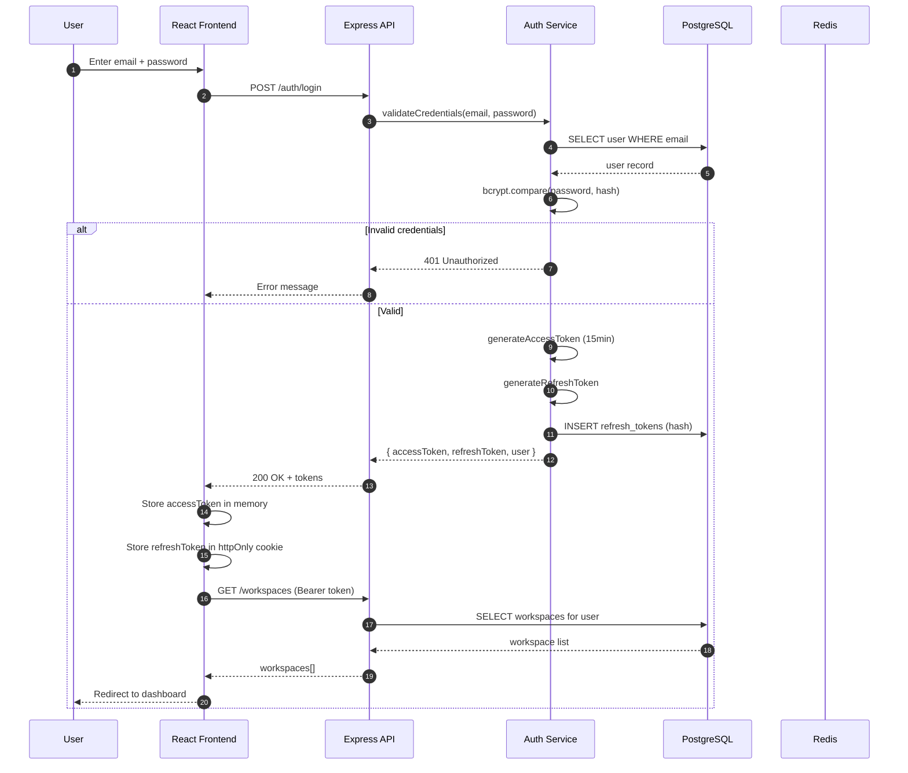

---

## 2. Meeting Upload Flow

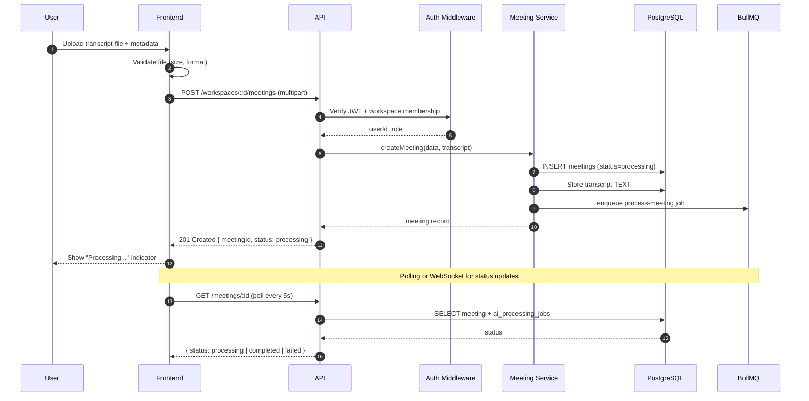

---

## 3. Transcript Processing Flow

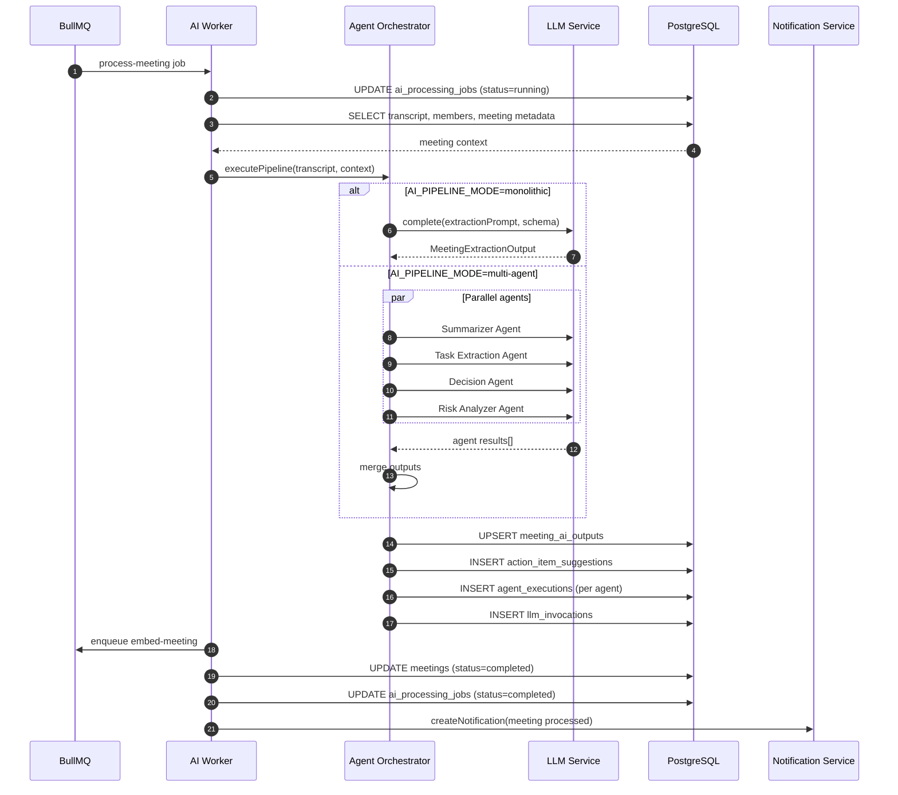

---

## 4. Embedding Generation Flow

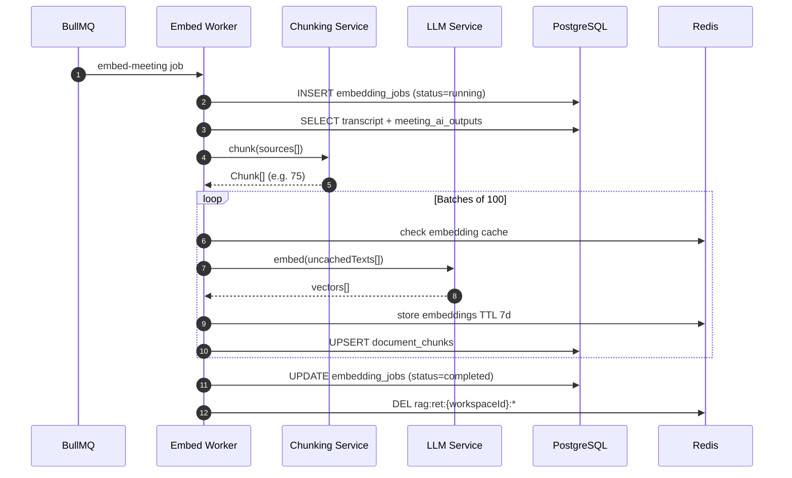

---

## 5. AI Chat Flow

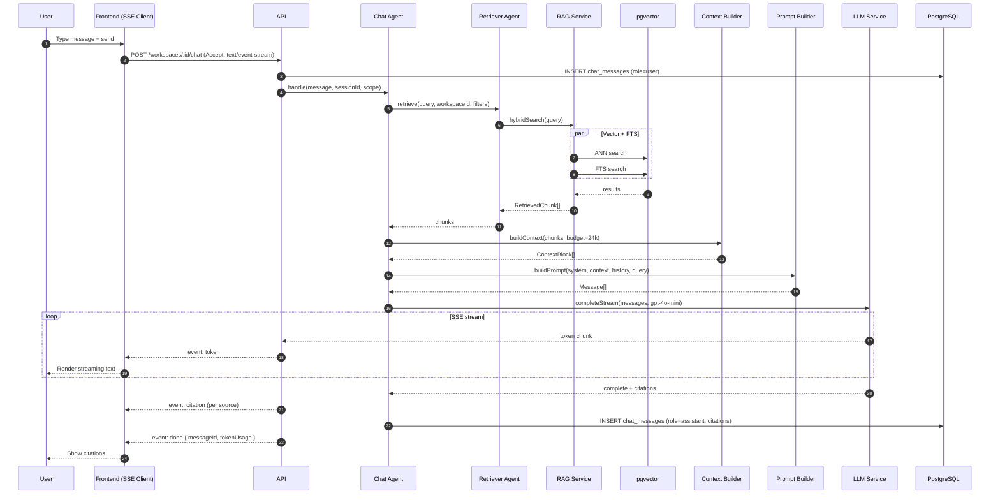

---

## 6. Task Extraction Flow

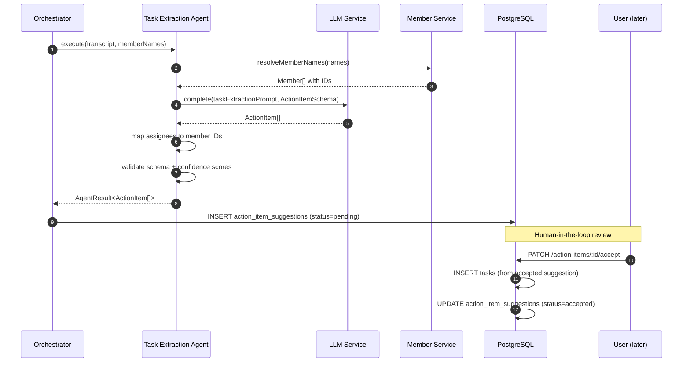

---

## 7. Weekly Report Flow

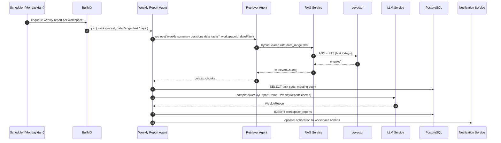

---

## 8. Knowledge Retrieval Flow

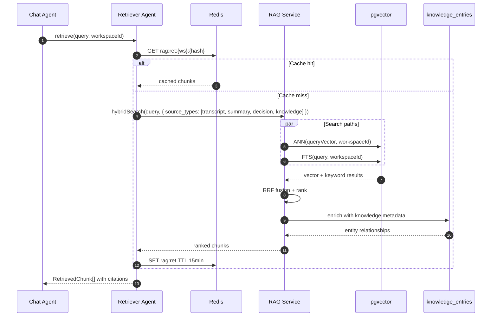

---

## 9. Semantic Search Flow

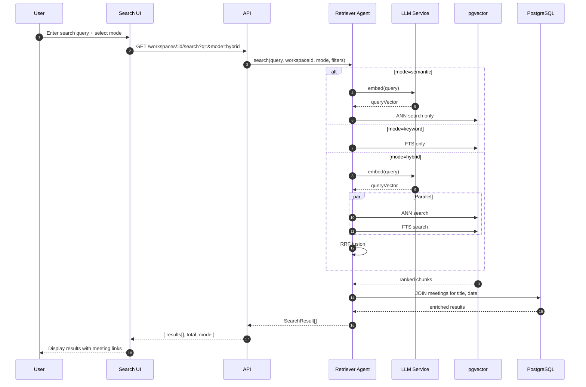

---

## 10. System Context — All Flows

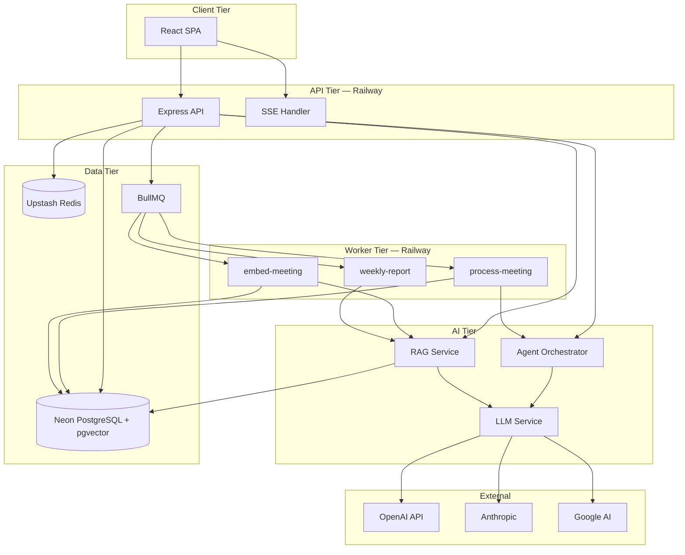

---

## 11. Cross-Cutting Concerns

### Correlation ID Propagation

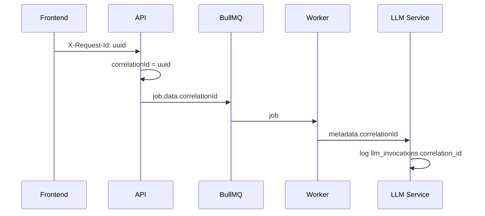

### Authentication on All Flows

Every sequence includes:
1. JWT validation (access token in `Authorization` header)
2. Workspace membership check
3. Role-based authorization (admin for reindex, member for chat)

---

## Related Documents

- [query-flow.md](./query-flow.md)
- [agent-flow.md](./agent-flow.md)
- [embedding-flow.md](./embedding-flow.md)
- [retrieval-flow.md](./retrieval-flow.md)
- [system-architecture.md](./system-architecture.md)

---

## Document History

| Version | Date | Changes |
|---------|------|---------|
| 1.0 | 2026-06-18 | Initial system sequence diagrams — 9 flows |
