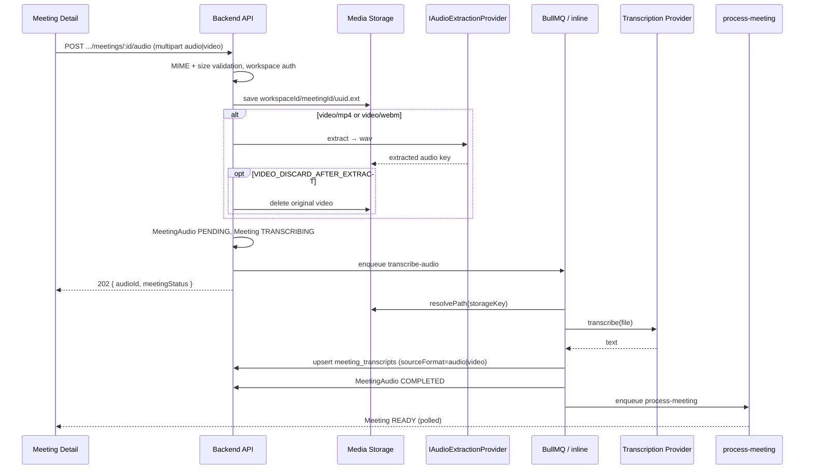

# Transcription Flow — MeetingMind AI (Phase A)

**Status:** Implemented (audio + video)  
**Related:** [capture-architecture.md](./capture-architecture.md) · [future-roadmap.md](./future-roadmap.md) Phase 7 · [api-design.md](./api-design.md)

## Goal

Replace “paste transcript only” friction with:

**Upload meeting audio or video → (extract audio if video) → transcribe → save transcript → existing AI pipeline.**

Out of scope: Zoom/Meet/Teams live bots, rewriting agents/RAG.

---

## Happy path

Status UX: **uploading → TRANSCRIBING → PROCESSING → READY | FAILED**

---

## Accepted formats

| Kind | Extensions | MIME | Max size env |
|------|------------|------|--------------|
| Audio | `.mp3`, `.m4a`, `.wav` | `audio/*` variants | `AUDIO_MAX_BYTES` (100MB) |
| Video | `.mp4`, `.webm` | `video/mp4`, `video/webm` | `VIDEO_MAX_BYTES` (500MB) |

Multipart field name remains **`audio`** (API compatibility).

---

## API

| Method | Path | Description |
|--------|------|-------------|
| `POST` | `/api/v1/workspaces/:workspaceId/meetings/:meetingId/audio` | Upload recording (audio or video) |
| `GET` | `/api/v1/workspaces/:workspaceId/meetings/:meetingId/transcription` | Status (no raw media / full transcript) |
| `POST` | `/api/v1/workspaces/:workspaceId/meetings/:meetingId/transcription/retry` | Retry after `FAILED` |

**Conflicts (409):** upload while `TRANSCRIBING` / `PROCESSING` only.

**Replace-on-upload:** Re-uploading a recording (file or screen capture) deletes the previous `MeetingAudio` + media files and re-runs transcription → AI. Pasted transcripts are overwritten when the new transcription completes.

**Paste transcript** (`PUT .../transcript`) unchanged.

---

## Providers

### Transcription (`ITranscriptionProvider`)

| Provider | When |
|----------|------|
| `mock` | `AI_USE_MOCK=true` or `TRANSCRIPTION_PROVIDER=mock` |
| `openai` | Whisper (`OPENAI_WHISPER_MODEL`) |
| `deepgram` | Stub (501) |

### Audio extraction (`IAudioExtractionProvider`)

| Provider | When |
|----------|------|
| `mock` | `AI_USE_MOCK=true` or `AUDIO_EXTRACT_PROVIDER=mock` — no ffmpeg required |
| `ffmpeg` | Production — `FFMPEG_PATH` (default `ffmpeg`) extracts mono 16kHz WAV |

Domain code never shells to ffmpeg directly.

---

## Storage

- Keys: `{workspaceId}/{meetingId}/{uuid}.ext`
- Video: optional discard of original after extract (`VIDEO_DISCARD_AFTER_EXTRACT=true` default)
- `MeetingAudio.storageKey` always points at the **file Whisper reads** (extracted WAV for video)

Never log secrets, raw media bytes, or full transcript content.

---

## Environment

| Variable | Description |
|----------|-------------|
| `TRANSCRIPTION_PROVIDER` | `mock` \| `openai` \| `deepgram` |
| `AUDIO_EXTRACT_PROVIDER` | `mock` \| `ffmpeg` |
| `FFMPEG_PATH` | ffmpeg binary (default `ffmpeg`) |
| `AUDIO_STORAGE_PATH` | Local storage root |
| `AUDIO_MAX_BYTES` | Max audio upload (default 100MB) |
| `VIDEO_MAX_BYTES` | Max video upload (default 500MB) |
| `VIDEO_DISCARD_AFTER_EXTRACT` | Delete original video after extract (default `true`) |
| `AI_USE_MOCK` | Mock transcription + mock extract + inline jobs |

---

## Observability

- `transcription.duration`, `transcription.audio.bytes`
- `capture.audio_extract.duration` (provider label: mock|ffmpeg)
- Logs: sizes, ids, providers — **not** media contents
