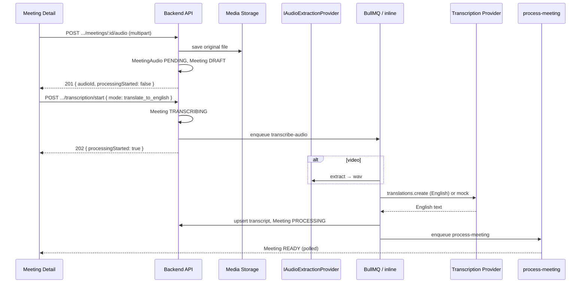

# Transcription Flow — MeetingMind AI (Phase A)

**Status:** Implemented (audio + video) · Translate & Transcribe is **user-triggered** (not auto on upload)  
**Related:** [capture-architecture.md](./capture-architecture.md) · [screen-recorder.md](./screen-recorder.md) · [api-design.md](./api-design.md)

## Goal

**Upload recording → user clicks Translate & Transcribe → (extract if video) → English transcript → AI pipeline.**

Designed for Bangladesh users: Bengali + English speech → **English transcript** (Whisper `translations`). English segments stay English.

Out of scope: Zoom/Meet/Teams live bots, rewriting agents/RAG.

---

## Status model (choice)

| Stage                      | Meeting        | MeetingAudio                |
| -------------------------- | -------------- | --------------------------- |
| Uploaded, waiting          | `DRAFT`        | `PENDING`                   |
| Translating & transcribing | `TRANSCRIBING` | `TRANSCRIBING`              |
| Generating insights        | `PROCESSING`   | `COMPLETED` (after Whisper) |
| Done                       | `READY`        | `COMPLETED`                 |
| Failed                     | `FAILED`       | `FAILED`                    |

Upload **does not** enqueue Whisper/AI. Only `POST …/transcription/start` does.

---

## Happy path



UI: **Uploaded → Translate & Transcribe → banners → Ready**

---

## API

| Method | Path                                   | Description                                                                 |
| ------ | -------------------------------------- | --------------------------------------------------------------------------- |
| `POST` | `.../meetings/:id/audio`               | Store recording only (`201`, `processingStarted: false`)                    |
| `POST` | `.../meetings/:id/transcription/start` | Start Translate & Transcribe (`{ "mode": "translate_to_english" }` default) |
| `GET`  | `.../meetings/:id/transcription`       | Status                                                                      |
| `POST` | `.../meetings/:id/transcription/retry` | After `FAILED` (same as start)                                              |

**Modes**

| mode                             | OpenAI API                    | Product use                   |
| -------------------------------- | ----------------------------- | ----------------------------- |
| `translate_to_english` (default) | `audio.translations.create`   | Bengali→English; English kept |
| `transcribe_original`            | `audio.transcriptions.create` | Optional keep-source-language |

**Conflicts (409):** upload or start while `TRANSCRIBING` / `PROCESSING`.

**Replace-on-upload:** Replaces media only; resets meeting toward `DRAFT`; does **not** auto-run AI. User must click Translate & Transcribe again.

**Paste transcript** (`PUT .../transcript`) unchanged.

---

## Providers

| Provider   | When                                                | Behavior                                         |
| ---------- | --------------------------------------------------- | ------------------------------------------------ |
| `mock`     | `AI_USE_MOCK=true` or `TRANSCRIPTION_PROVIDER=mock` | English mock transcript (≥100 chars)             |
| `openai`   | Real                                                | Whisper translations (default) or transcriptions |
| `deepgram` | Stub                                                | 501                                              |

Extraction: `mock` \| `ffmpeg` as before — runs on **start/job**, not on upload.

---

## How to test

### Mock (no OpenAI key)

```bash
AI_USE_MOCK=true
TRANSCRIPTION_PROVIDER=mock
AUDIO_EXTRACT_PROVIDER=mock
```

1. Upload video/audio → still `DRAFT`, no transcript
2. Click **Translate & Transcribe** → banners → `READY` with mock English transcript + insights
3. Replace file → must click button again

### Real API

```bash
AI_USE_MOCK=false
TRANSCRIPTION_PROVIDER=openai
OPENAI_API_KEY=sk-...
AUDIO_EXTRACT_PROVIDER=ffmpeg
REDIS_URL=...   # + worker process
```

Same UX; waits longer. Polling every 3s while busy.

---

## Environment

| Variable                      | Description                             |
| ----------------------------- | --------------------------------------- |
| `TRANSCRIPTION_PROVIDER`      | `mock` \| `openai` \| `deepgram`        |
| `OPENAI_WHISPER_MODEL`        | Default `whisper-1`                     |
| `AUDIO_EXTRACT_PROVIDER`      | `mock` \| `ffmpeg`                      |
| `VIDEO_DISCARD_AFTER_EXTRACT` | After extract on start (default `true`) |
| `AI_USE_MOCK`                 | Mock + inline jobs                      |

---

## Observability

- `transcription.duration`, `transcription.audio.bytes`
- `capture.audio_extract.duration`
- Never log secrets, raw media, or full transcripts
