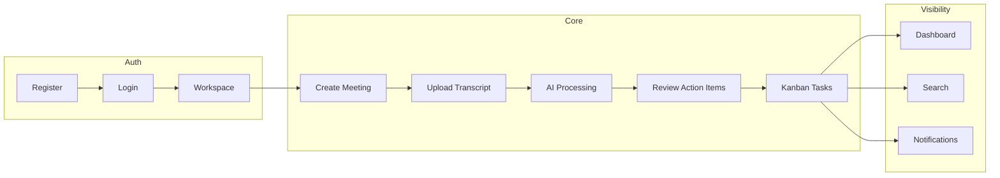

# User Stories

**Product:** AI Meeting Notes & Task Manager  
**Version:** 1.1

This document contains user stories organized by feature area. Each story follows the format:

> As a **[role]**, I want **[goal]**, so that **[benefit]**.

Priority legend: **P0** = MVP, **P1** = MVP+1, **P2** = v2+

---

## Authentication

| ID | Priority | Story |
|----|----------|-------|
| AUTH-01 | P0 | As a **new user**, I want to **register with email and password**, so that **I can create an account and access the app**. |
| AUTH-02 | P0 | As a **registered user**, I want to **log in securely**, so that **I can access my workspaces**. |
| AUTH-03 | P0 | As a **logged-in user**, I want to **log out**, so that **my session is terminated on shared devices**. |
| AUTH-04 | P0 | As a **user**, I want **JWT-based session handling with refresh tokens**, so that **I stay signed in safely without frequent re-login**. |
| AUTH-05 | P0 | As a **user who forgot my password**, I want to **request a password reset email**, so that **I can regain access**. |
| AUTH-06 | P0 | As a **user**, I want to **reset my password via a secure link**, so that **I can set a new password**. |
| AUTH-07 | P1 | As a **user**, I want to **view and edit my profile** (name, avatar), so that **teammates can identify me on tasks**. |

### Acceptance Criteria — AUTH-01 (Register)

- User can submit email, password, and display name
- Password validated (≥ 8 chars, letter + number)
- Duplicate email returns generic error
- On success, user is logged in with access + refresh tokens
- User record created in database with hashed password

### Acceptance Criteria — AUTH-04 (JWT Refresh)

- Access token expires after 15 minutes
- Refresh token stored in httpOnly cookie (7-day expiry)
- `/auth/refresh` returns new access token when refresh valid
- Expired/revoked refresh token returns 401 and redirects to login

---

## Workspace Management

| ID | Priority | Story |
|----|----------|-------|
| WS-01 | P0 | As a **user**, I want to **create a workspace**, so that **my team has a shared space for meetings and tasks**. |
| WS-02 | P0 | As a **workspace owner**, I want to **invite members by email**, so that **they can join my workspace**. |
| WS-03 | P0 | As an **invited user**, I want to **accept a workspace invitation**, so that **I can collaborate with the team**. |
| WS-04 | P0 | As a **workspace owner**, I want to **assign roles (Owner, Member)**, so that **permissions are appropriate**. |
| WS-05 | P0 | As a **workspace owner**, I want to **remove members**, so that **former employees lose access**. |
| WS-06 | P0 | As a **member**, I want to **view all workspaces I belong to**, so that **I can switch contexts easily**. |
| WS-07 | P0 | As a **workspace owner**, I want to **edit workspace name and settings**, so that **the workspace reflects our team**. |

### Acceptance Criteria — WS-02 (Invite Members)

- Owner enters email and optional role (default: Member)
- System generates unique invitation token (7-day expiry)
- Invitation email sent (or link logged in dev)
- Pending invitations visible in workspace settings
- Duplicate pending invite for same email is prevented

---

## Meeting Management

| ID | Priority | Story |
|----|----------|-------|
| MTG-01 | P0 | As a **team member**, I want to **create a meeting record** (title, date, attendees), so that **transcripts are organized**. |
| MTG-02 | P0 | As a **meeting creator**, I want to **upload or paste a transcript**, so that **AI can process it**. |
| MTG-03 | P0 | As a **user**, I want to **edit meeting metadata**, so that **details stay accurate**. |
| MTG-04 | P0 | As a **meeting creator or workspace owner**, I want to **delete a meeting**, so that **obsolete or erroneous records are removed**. |
| MTG-05 | P0 | As a **user**, I want to **view meeting history** in my workspace, so that **I can find past discussions**. |
| MTG-06 | P0 | As a **user**, I want to **see processing status** (pending, processing, complete, failed), so that **I know when AI output is ready**. |
| MTG-07 | P1 | As a **user**, I want to **attach optional context** (agenda, project tags), so that **AI output is more relevant**. |

### Acceptance Criteria — MTG-02 (Upload Transcript)

- User can paste text or upload `.txt`, `.md`, `.vtt`, `.srt` (≤ 5 MB)
- Minimum 100 characters required
- Transcript stored and AI job enqueued
- Meeting status changes to `PROCESSING`
- User sees processing indicator on meeting detail page

### Acceptance Criteria — MTG-05 (Meeting History)

- Paginated list sorted by meeting date (newest first)
- Filter by date range, tag, and processing status
- Each row shows title, date, status, and task count
- Click navigates to meeting detail

---

## AI Processing

| ID | Priority | Story |
|----|----------|-------|
| AI-01 | P0 | As a **user**, I want an **AI-generated meeting summary**, so that **I can quickly understand what happened**. |
| AI-02 | P0 | As a **user**, I want **key decisions extracted**, so that **decisions are documented explicitly**. |
| AI-03 | P0 | As a **user**, I want **action items extracted with suggested assignees and due dates**, so that **follow-up is automatic**. |
| AI-04 | P0 | As a **PM**, I want **risks and blockers detected**, so that **I can escalate early**. |
| AI-05 | P1 | As a **user**, I want to **chat with an AI assistant about a meeting**, so that **I can ask follow-up questions without re-reading the transcript**. |
| AI-06 | P0 | As a **user**, I want to **edit AI-generated content before publishing**, so that **output matches reality**. |
| AI-07 | P1 | As a **user**, I want to **re-run AI processing**, so that **I can improve results with updated prompts or transcript fixes**. |

### Acceptance Criteria — AI-03 (Action Item Extraction)

- AI returns list of action items with title, description, suggested assignee, due date
- Assignee names fuzzy-matched to workspace members
- User can accept, reject, or edit each suggestion individually
- Bulk accept creates linked tasks in workspace
- Rejected items marked and excluded from task creation

---

## Task Management

| ID | Priority | Story |
|----|----------|-------|
| TASK-01 | P0 | As a **user**, I want **tasks auto-created from accepted action items**, so that **I don't manually re-enter work**. |
| TASK-02 | P0 | As a **team lead**, I want to **assign tasks to members**, so that **ownership is clear**. |
| TASK-03 | P0 | As a **user**, I want a **Kanban board** (To Do, In Progress, Done), so that **I can visualize workflow**. |
| TASK-04 | P0 | As an **assignee**, I want to **update task status**, so that **the team sees progress**. |
| TASK-05 | P0 | As a **user**, I want to **add comments on tasks**, so that **we can discuss implementation details**. |
| TASK-06 | P0 | As a **user**, I want to **set due dates and priorities**, so that **work is prioritized**. |
| TASK-07 | P0 | As a **user**, I want to **link tasks back to source meetings**, so that **context is preserved**. |
| TASK-08 | P0 | As a **user**, I want to **create manual tasks** not tied to meetings, so that **ad-hoc work is tracked**. |

### Acceptance Criteria — TASK-03 (Kanban Board)

- Three columns: To Do, In Progress, Done
- Tasks display title, assignee avatar, due date, priority badge
- Drag-and-drop between columns updates status (P1: optimistic UI)
- Board loads all workspace tasks grouped by status
- Filter by assignee (optional P1)

---

## Notifications

| ID | Priority | Story |
|----|----------|-------|
| NOTIF-01 | P0 | As an **assignee**, I want **in-app notification when assigned a task**, so that **I know immediately**. |
| NOTIF-02 | P0 | As a **user**, I want **notification when mentioned in a comment**, so that **I can respond**. |
| NOTIF-03 | P1 | As a **user**, I want **email notification for task due soon/overdue**, so that **I don't miss deadlines**. |
| NOTIF-04 | P0 | As a **user**, I want to **mark notifications as read**, so that **my inbox stays manageable**. |
| NOTIF-05 | P1 | As a **user**, I want to **configure notification preferences**, so that **I control noise**. |

---

## Search

| ID | Priority | Story |
|----|----------|-------|
| SRCH-01 | P0 | As a **user**, I want to **search meetings by title, date, or attendee**, so that **I find records quickly**. |
| SRCH-02 | P0 | As a **user**, I want to **search tasks by title, assignee, or status**, so that **I locate work items**. |
| SRCH-03 | P1 | As a **user**, I want to **full-text search summaries and decisions**, so that **I find past agreements**. |
| SRCH-04 | P0 | As a **user**, I want **filtered search results** scoped to my workspace, so that **I only see authorized data**. |

---

## Analytics

| ID | Priority | Story |
|----|----------|-------|
| ANLYT-01 | P0 | As a **team lead**, I want a **dashboard with open/overdue/completed tasks**, so that **I see team health**. |
| ANLYT-02 | P1 | As a **PM**, I want **meeting volume and AI processing stats**, so that **I understand adoption**. |
| ANLYT-03 | P0 | As a **user**, I want **recent activity feed**, so that **I stay aware of workspace changes**. |
| ANLYT-04 | P1 | As a **workspace owner**, I want **productivity metrics** (tasks completed per week, avg time to complete), so that **I can improve process**. |

---

## Administration

| ID | Priority | Story |
|----|----------|-------|
| ADMIN-01 | P2 | As a **company admin**, I want to **manage users across the organization**, so that **access is governed centrally**. |
| ADMIN-02 | P1 | As a **workspace owner**, I want to **transfer workspace ownership**, so that **continuity is maintained**. |
| ADMIN-03 | P2 | As an **admin**, I want to **view audit logs** for sensitive actions, so that **compliance needs are met**. |
| ADMIN-04 | P2 | As a **workspace owner**, I want to **configure data retention** for meetings, so that **old data is purged per policy**. |

---

## Story Map Summary

---

## Traceability

| Epic | Story IDs | Functional Requirements |
|------|-----------|-------------------------|
| Authentication | AUTH-01 – AUTH-07 | FR-AUTH-001 – FR-AUTH-017 |
| Workspaces | WS-01 – WS-07 | FR-WS-001 – FR-WS-009 |
| Meetings | MTG-01 – MTG-07 | FR-MTG-001 – FR-MTG-013 |
| AI | AI-01 – AI-07 | FR-AI-001 – FR-AI-012 |
| Tasks | TASK-01 – TASK-08 | FR-TASK-001 – FR-TASK-011 |
| Dashboard | ANLYT-01 – ANLYT-04 | FR-DASH-001 – FR-DASH-004 |
| Search | SRCH-01 – SRCH-04 | FR-SRCH-001 – FR-SRCH-004 |
| Notifications | NOTIF-01 – NOTIF-05 | FR-NOTIF-001 – FR-NOTIF-006 |
| Activity | — | FR-ACT-001 – FR-ACT-003 |
