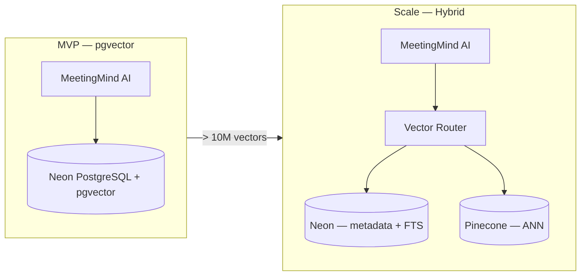
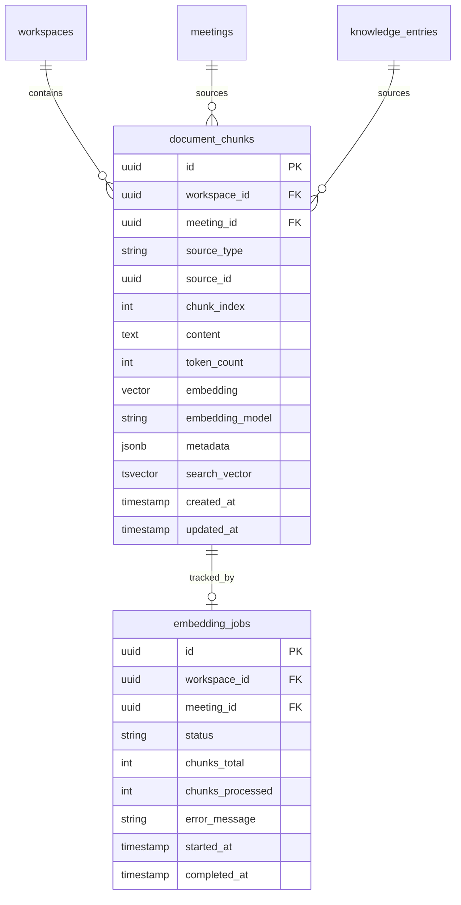
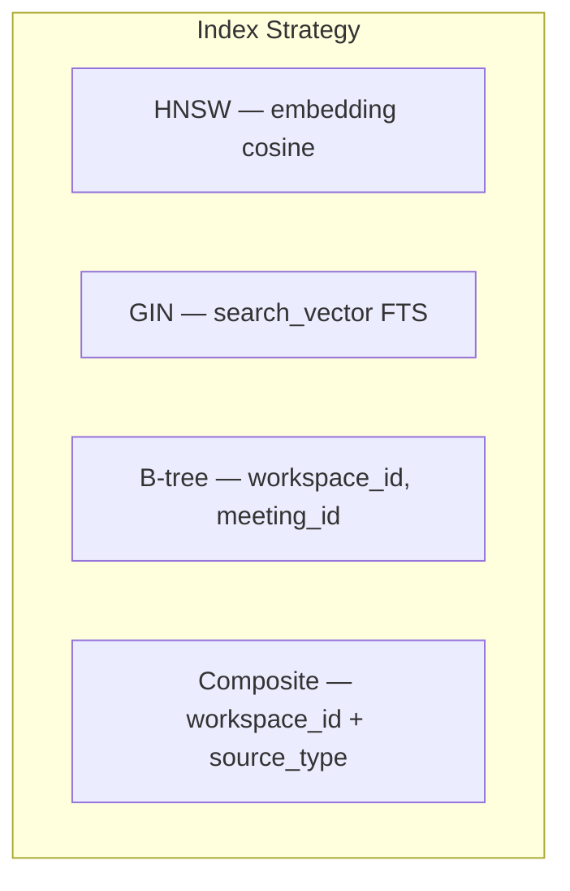
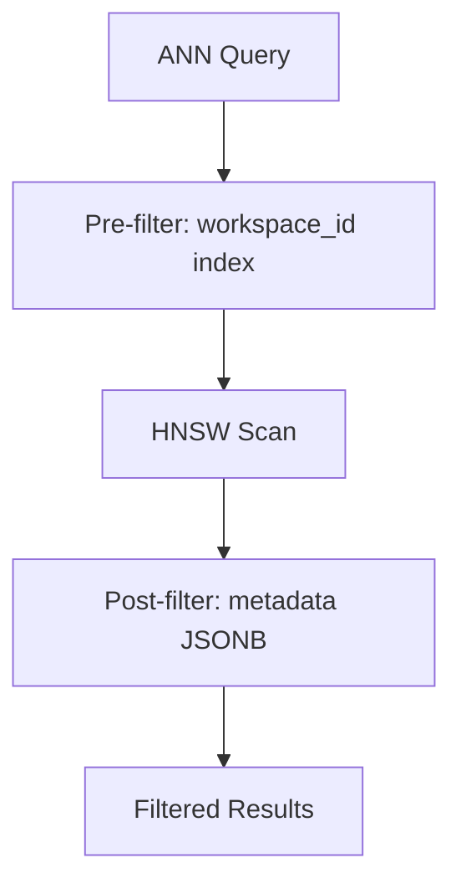
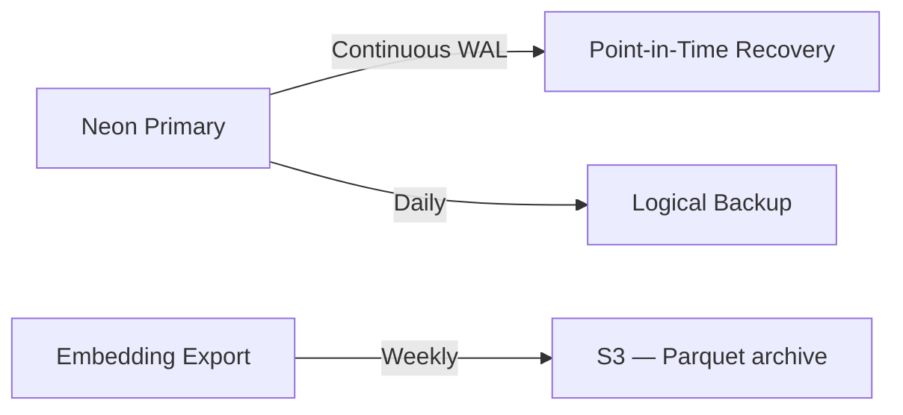
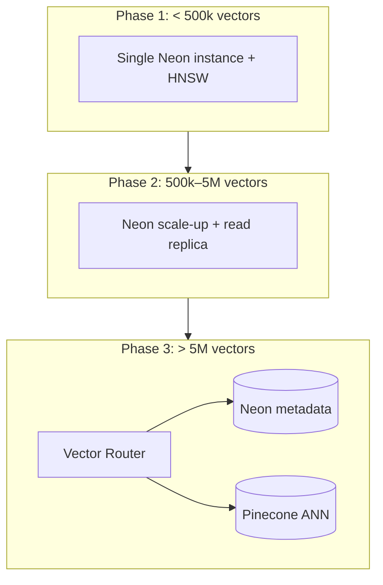

# Vector Database Design — MeetingMind AI

**Product:** MeetingMind AI  
**Version:** 1.0  
**Status:** Architecture — Documentation Only  
**Requirements:** [vector-db-requirements.md](./vector-db-requirements.md) · [rag-requirements.md](./rag-requirements.md)

---

## 1. Technology Evaluation

### 1.1 Comparison Matrix

| Criterion | pgvector (Neon) | Pinecone | Weaviate | Chroma |
|-----------|-----------------|----------|----------|--------|
| **Operational complexity** | ✅ Low (existing PG) | Medium | High | Medium |
| **ACID + metadata joins** | ✅ Native SQL | ❌ Separate store | Partial | ❌ |
| **Workspace isolation** | ✅ Row-level + RLS | Namespace per tenant | Multi-tenancy | Collection per tenant |
| **Hybrid search (FTS)** | ✅ Same DB | Requires sparse vectors | ✅ Built-in | Limited |
| **Cost at MVP** | ✅ Included in Neon | $70+/mo minimum | Self-host or cloud | Self-host |
| **Scale ceiling** | ~10M vectors | ✅ Billions | ✅ Large | ~1M practical |
| **Latency p95** | 50–200ms | 20–50ms | 30–80ms | 50–150ms |
| **Backup** | ✅ Neon PITR | Managed | Varies | Manual |
| **Team familiarity** | ✅ Prisma + SQL | New SDK | New stack | New stack |
| **Migration path** | N/A (baseline) | Export embeddings | Export | Export |

### 1.2 Decision

**Primary: pgvector on Neon PostgreSQL**

**Justification:**
1. Platform already runs on Neon + Prisma — zero new infrastructure for MVP
2. Hybrid search (vector + FTS) in single query with transactional consistency
3. `document_chunks` joins `meetings`, `workspaces` without sync lag
4. Neon supports pgvector extension; PITR backups included
5. Cost-effective for 0–50k users (< 5M vectors expected)

**Escape hatch: Pinecone** when vector count exceeds 10M or p95 ANN latency exceeds 200ms sustained.



---

## 2. Schema Design

### 2.1 Entity Relationship



### 2.2 `document_chunks` Table

```sql
-- Conceptual DDL (implementation reference only)
CREATE TABLE document_chunks (
  id              UUID PRIMARY KEY DEFAULT gen_random_uuid(),
  workspace_id    UUID NOT NULL REFERENCES workspaces(id) ON DELETE CASCADE,
  meeting_id      UUID REFERENCES meetings(id) ON DELETE CASCADE,
  source_type     VARCHAR(50) NOT NULL,  -- transcript, summary, decision, action_item, knowledge
  source_id       UUID NOT NULL,
  chunk_index     INT NOT NULL DEFAULT 0,
  content         TEXT NOT NULL,
  token_count     INT NOT NULL,
  embedding       vector(1536),
  embedding_model VARCHAR(100) NOT NULL DEFAULT 'text-embedding-3-small',
  metadata        JSONB DEFAULT '{}',
  search_vector   tsvector GENERATED ALWAYS AS (to_tsvector('english', content)) STORED,
  created_at      TIMESTAMPTZ NOT NULL DEFAULT NOW(),
  updated_at      TIMESTAMPTZ NOT NULL DEFAULT NOW()
);
```

### 2.3 Metadata JSONB Structure

```json
{
  "speaker": "Alice Chen",
  "timestamp_start": "00:12:34",
  "timestamp_end": "00:13:01",
  "section": "budget_discussion",
  "meeting_title": "Q2 Planning",
  "meeting_date": "2026-03-15",
  "confidence": 0.95
}
```

---

## 3. Indexes



### 3.1 Index Definitions

| Index | Type | Columns | Purpose |
|-------|------|---------|---------|
| `idx_chunks_embedding_hnsw` | HNSW | `embedding vector_cosine_ops` | ANN similarity search |
| `idx_chunks_search_vector` | GIN | `search_vector` | Keyword search |
| `idx_chunks_workspace` | B-tree | `workspace_id` | Tenant filter |
| `idx_chunks_meeting` | B-tree | `meeting_id` | Meeting-scoped retrieval |
| `idx_chunks_source` | B-tree | `source_type, source_id` | Dedup / re-embed |
| `idx_chunks_workspace_source` | Composite | `workspace_id, source_type` | Filtered ANN |

### 3.2 HNSW Parameters

| Parameter | MVP Value | Tuned Value |
|-----------|-----------|-------------|
| `m` | 16 | 32 at > 1M vectors |
| `ef_construction` | 64 | 128 at > 1M vectors |
| `ef_search` | 40 | 100 for higher recall |

---

## 4. Similarity Search

### 4.1 Query Pattern

```sql
-- Conceptual query (implementation reference only)
SELECT
  id, content, meeting_id, source_type, metadata,
  1 - (embedding <=> $query_vector) AS similarity
FROM document_chunks
WHERE workspace_id = $workspace_id
  AND ($meeting_id IS NULL OR meeting_id = $meeting_id)
  AND ($source_types IS NULL OR source_type = ANY($source_types))
ORDER BY embedding <=> $query_vector
LIMIT $top_k;
```

### 4.2 Distance Metric

| Metric | Operator | Use |
|--------|----------|-----|
| Cosine similarity | `<=>` (cosine distance) | Default — normalized embeddings |
| L2 distance | `<->` | Fallback if not normalized |
| Inner product | `<#>` | Alternative for specific models |

### 4.3 Similarity Thresholds

| Use Case | Min Similarity | Top-K |
|----------|----------------|-------|
| Chat retrieval | 0.70 | 10 |
| Semantic search | 0.65 | 20 |
| Knowledge dedup | 0.92 | 5 |
| Weekly report | 0.60 | 30 |

---

## 5. Filtering Architecture



| Filter | Implementation | Performance |
|--------|----------------|-------------|
| `workspace_id` | WHERE clause (B-tree) | ✅ Fast |
| `meeting_id` | WHERE clause (B-tree) | ✅ Fast |
| `source_type` | WHERE IN | ✅ Fast |
| `date_range` | JOIN meetings ON date | Medium |
| `metadata.speaker` | JSONB `@>` | Medium |
| `metadata.section` | JSONB path | Medium |

**Rule:** Always filter `workspace_id` first — mandatory for security and index efficiency.

---

## 6. Backup Strategy



| Strategy | Frequency | RPO | RTO |
|----------|-----------|-----|-----|
| Neon PITR | Continuous | < 1 min | < 1 hour |
| Logical dump | Daily | 24h | 2 hours |
| Embedding export | Weekly | 7 days | 4 hours (re-import) |
| Re-embed from source | On demand | N/A | 24h (full workspace) |

**Disaster recovery:** Re-embed from `meetings.transcript` + `meeting_ai_outputs` if vector data lost.

---

## 7. Performance Optimization

| Optimization | Impact | When |
|--------------|--------|------|
| HNSW index | 100x vs sequential scan | Always |
| Partial index on `embedding IS NOT NULL` | Smaller index | Pending embeds exist |
| Connection pooling (PgBouncer) | Reduce connection overhead | > 100 concurrent |
| Read replica for search | Offload ANN from primary | > 50 QPS search |
| Batch embed (100 chunks) | 50% fewer API calls | Ingestion |
| `ef_search` tuning | Recall vs latency tradeoff | After 500k vectors |
| Vacuum + analyze | Index health | Weekly cron |

### Latency Targets

| Operation | p50 | p95 |
|-----------|-----|-----|
| ANN query (filtered) | 30ms | 100ms |
| FTS query | 10ms | 50ms |
| Hybrid (parallel) | 50ms | 150ms |
| Embed batch (100) | 500ms | 2s |

---

## 8. Scalability Path



| Milestone | Vectors | Action |
|-----------|---------|--------|
| Launch | 0 | Enable pgvector extension |
| 100k meetings | ~500k | Monitor p95; tune HNSW |
| 500k meetings | ~2.5M | Read replica; increase `ef_search` |
| 2M meetings | ~10M | Evaluate Pinecone migration |
| Enterprise | 50M+ | Pinecone + dedicated embed fleet |

---

## 9. Update / Reindex / Deletion

| Event | Action |
|-------|--------|
| New meeting processed | INSERT chunks + embeddings |
| Transcript edited | DELETE old chunks → re-chunk → re-embed |
| Meeting deleted | CASCADE DELETE chunks |
| Model upgrade | Background re-embed job per workspace |
| AI output updated | UPSERT summary/decision chunks only |

See [embedding-flow.md](./embedding-flow.md) for detailed flows.

---

## 10. Security

| Control | Implementation |
|---------|----------------|
| Tenant isolation | `workspace_id` on every row; enforced in service layer + optional RLS |
| Row-level security | `CREATE POLICY workspace_isolation ON document_chunks` |
| No raw vector in API | Return chunk content + metadata only |
| Encryption at rest | Neon default AES-256 |
| Access audit | Log all bulk export operations |

---

## 11. Cost Model

| Component | MVP Cost | At Scale |
|-----------|----------|----------|
| Neon storage (5GB vectors) | ~$5/mo included | ~$50/mo at 50GB |
| Embedding API | ~$0.02/1M tokens | ~$200/mo at 10M chunks |
| Compute (ANN queries) | Included in Neon | Read replica ~$30/mo |
| Pinecone (if migrated) | N/A | ~$70–500/mo |

**pgvector MVP saves ~$840/year** vs minimum Pinecone tier for early stage.

---

## Related Documents

- [rag-architecture.md](./rag-architecture.md)
- [embedding-flow.md](./embedding-flow.md)
- [retrieval-flow.md](./retrieval-flow.md)
- [database-architecture.md](./database-architecture.md)

---

## Document History

| Version | Date | Changes |
|---------|------|---------|
| 1.0 | 2026-06-18 | Initial vector DB design; pgvector selected |
| 1.1 | 2026-06-20 | Added `RISK` source type; filter validation; reindex job |

---

## 12. Implementation Notes (v1.1)

### Source Types (Prisma `DocumentSourceType`)

`TRANSCRIPT`, `SUMMARY`, `DECISION`, `RISK`, `ACTION_ITEM`, `KNOWLEDGE`

Risk chunks are indexed with `source_type = RISK` (previously misclassified as `SUMMARY`).

### Security Controls (Implemented)

- `FilterValidatorService` — validates workspaceId, source types, date ranges
- Meeting-scope assertion prevents cross-meeting retrieval in scoped chat
- All ANN queries include mandatory `workspace_id` WHERE clause

### Reindex

`POST` enqueue via `enqueueReindexWorkspace({ workspaceId })` — BullMQ `reindex-workspace` queue processes meetings in batches of 50.
