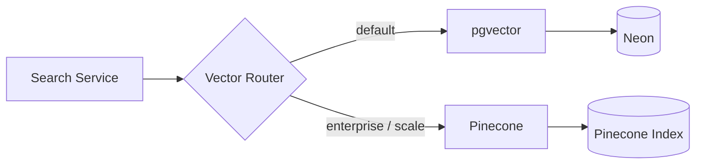

# Vector Database Requirements — MeetingMind AI

**Product:** MeetingMind AI  
**Version:** 1.0  
**Status:** Requirements — Documentation Only  
**Baseline:** Neon PostgreSQL 16; Prisma ORM; existing `meeting_transcripts.search_vector` (FTS)  
**Related:** [rag-requirements.md](./rag-requirements.md) · [database-architecture.md](./database-architecture.md)

---

## 1. Purpose

Define vector storage requirements for semantic search, RAG retrieval, and cross-meeting intelligence while minimizing operational complexity and preserving workspace data isolation.

---

## 2. Technology Evaluation

### 2.1 Candidates

| Solution | Type | Pros | Cons | Score |
|----------|------|------|------|-------|
| **pgvector** (PostgreSQL) | Extension in Neon | Same DB as app data; ACID; workspace isolation in SQL; no new infra; Prisma support; backup with PG | Scale limits ~5M vectors; ANN tuning needed | ⭐ **Recommended** |
| **Pinecone** | Managed SaaS | Excellent scale; low ops; fast ANN | Separate system; data sync; cost; tenancy complexity; egress latency | Good at 10M+ vectors |
| **Weaviate** | Self-hosted / cloud | Hybrid search built-in; GraphQL | New infrastructure; ops burden; overkill for MVP | Medium |
| **Chroma** | Embedded / server | Simple dev experience; Python-native | Not production-grade for multi-tenant SaaS; persistence concerns | Dev only |

### 2.2 Decision: **pgvector on Neon PostgreSQL**

**Justification:**

1. **Preserves existing stack** — No new infrastructure for MVP RAG; aligns with "extend, don't redesign"
2. **Tenant isolation** — `workspace_id` filter in same query as vector search; no cross-tenant leakage risk from separate index
3. **Transactional consistency** — Embed chunks in same transaction as meeting data
4. **Operational simplicity** — One backup, one connection pool, one migration tool (Prisma)
5. **Scale sufficient** — 500k chunks/workspace × 100 workspaces = 50M vectors is pgvector limit territory; migration path to Pinecone documented for enterprise scale
6. **Cost** — No additional SaaS fee; embeddings stored alongside metadata
7. **Hybrid search** — Combine pgvector + existing FTS in single SQL query

### 2.3 Migration Trigger to Pinecone

Migrate when ANY of:
- Total vectors > 10 million
- p95 ANN query > 500ms after HNSW tuning
- Enterprise customer requires dedicated vector isolation
- Multi-region vector replication required

---

## 3. Schema Design

### 3.1 `document_chunks` Table

| Column | Type | Constraints |
|--------|------|-------------|
| id | UUID | PK |
| workspace_id | UUID | NOT NULL, FK → workspaces |
| source_type | VARCHAR(30) | NOT NULL |
| source_id | UUID | NOT NULL |
| meeting_id | UUID | NULL, FK → meetings |
| chunk_index | INT | NOT NULL DEFAULT 0 |
| content | TEXT | NOT NULL |
| content_hash | VARCHAR(64) | NOT NULL |
| token_count | INT | NOT NULL |
| embedding | vector(1536) | NULL until embedded |
| embedding_model | VARCHAR(50) | NULL |
| metadata | JSONB | NOT NULL DEFAULT '{}' |
| created_at | TIMESTAMPTZ | NOT NULL |
| updated_at | TIMESTAMPTZ | NOT NULL |

**UNIQUE:** `(source_type, source_id, chunk_index)`

### 3.2 `embedding_jobs` Table

| Column | Type | Constraints |
|--------|------|-------------|
| id | UUID | PK |
| workspace_id | UUID | NOT NULL |
| entity_type | VARCHAR(30) | NOT NULL |
| entity_id | UUID | NOT NULL |
| status | job_status | NOT NULL |
| chunk_count | INT | DEFAULT 0 |
| error_message | TEXT | NULL |
| created_at | TIMESTAMPTZ | NOT NULL |
| completed_at | TIMESTAMPTZ | NULL |

### 3.3 Prisma Extension

```prisma
// Requires prisma-pgvector extension or Unsupported type
embedding Unsupported("vector(1536)")?
```

**FR-VDB-001:** Enable `pgvector` extension on Neon: `CREATE EXTENSION vector`  
**FR-VDB-002:** Migration adds tables without breaking existing schema

---

## 4. Embedding Storage

| Attribute | Specification |
|-----------|---------------|
| Dimensions | 1536 (OpenAI `text-embedding-3-small`) |
| Precision | float32 (default pgvector) |
| Nullability | NULL until embedding job completes |
| Model tracking | `embedding_model` column per chunk |
| Re-embedding | Background job when model version changes |

**FR-VDB-EMB-001:** Store raw float32 vectors; no quantization in MVP  
**FR-VDB-EMB-002:** Support `vector(3072)` migration path for `text-embedding-3-large` (v2)  
**FR-VDB-EMB-003:** Delete vectors when source entity soft-deleted

---

## 5. Metadata Storage

Metadata in JSONB `metadata` column (indexed with GIN where needed):

```json
{
  "meetingTitle": "Sprint Planning",
  "meetingDate": "2026-06-15T10:00:00Z",
  "tags": ["sprint", "auth"],
  "severity": "high",
  "assigneeId": "uuid",
  "taskStatus": "TODO",
  "speaker": "Jordan"
}
```

**FR-VDB-META-001:** Metadata duplicated from source for filter-without-join performance  
**FR-VDB-META-002:** Sync metadata on source entity update  
**FR-VDB-META-003:** GIN index on `metadata` for `tags` and `severity` filters

---

## 6. Indexing Strategy

### 6.1 HNSW Index (Primary ANN)

```sql
CREATE INDEX idx_chunks_embedding_hnsw
ON document_chunks
USING hnsw (embedding vector_cosine_ops)
WITH (m = 16, ef_construction = 64);
```

| Parameter | Value | Rationale |
|-----------|-------|-----------|
| `m` | 16 | Balanced recall/memory |
| `ef_construction` | 64 | Build quality |
| `ef_search` | 40 (session) | Query-time recall (set per query) |

### 6.2 Supporting Indexes

```sql
-- Workspace scoping (mandatory pre-filter)
CREATE INDEX idx_chunks_workspace ON document_chunks(workspace_id);

-- Source lookup for re-index
CREATE INDEX idx_chunks_source ON document_chunks(source_type, source_id);

-- Meeting scope
CREATE INDEX idx_chunks_meeting ON document_chunks(meeting_id) WHERE meeting_id IS NOT NULL;

-- Pending embedding
CREATE INDEX idx_chunks_no_embedding ON document_chunks(workspace_id) WHERE embedding IS NULL;
```

**FR-VDB-IDX-001:** HNSW index created after initial bulk embed (not on empty table)  
**FR-VDB-IDX-002:** `REINDEX` procedure documented for index corruption recovery  
**FR-VDB-IDX-003:** Per-workspace partial indexes considered at > 1M chunks (v2)

---

## 7. Similarity Search

### 7.1 Query Pattern

```sql
SELECT id, content, metadata,
       1 - (embedding <=> $1::vector) AS similarity
FROM document_chunks
WHERE workspace_id = $2
  AND embedding IS NOT NULL
  AND 1 - (embedding <=> $1::vector) >= $3  -- similarity threshold
  AND ($4::text[] IS NULL OR source_type = ANY($4))
ORDER BY embedding <=> $1::vector
LIMIT $5;
```

### 7.2 Distance Metric

- **Primary:** Cosine distance (`<=>` operator)
- **FR-VDB-SIM-001:** Similarity score = `1 - cosine_distance` (0–1 range)
- **FR-VDB-SIM-002:** Normalize query embedding before search

### 7.3 Performance Targets

| Vectors in Workspace | p95 Query Time |
|---------------------|--------------|
| < 100k | < 50ms |
| 100k – 1M | < 150ms |
| 1M – 5M | < 300ms |

---

## 8. Scalability

### 8.1 Growth Projections

| Scale | Meetings | Chunks | Vector Storage |
|-------|----------|--------|----------------|
| Small workspace | 100 | 5,000 | ~30 MB |
| Medium workspace | 2,000 | 100,000 | ~600 MB |
| Large workspace | 10,000 | 500,000 | ~3 GB |
| Platform total (1000 ws) | 2M | 200M | Migrate to Pinecone |

### 8.2 Scaling Strategies

| Strategy | When |
|----------|------|
| HNSW parameter tuning | p95 > 200ms |
| Read replica for search | API search load high |
| Partition by workspace_id | > 10M total chunks |
| Pinecone migration | > 10M vectors or enterprise |
| Embedding quantization (int8) | Storage cost > budget |

**FR-VDB-SCALE-001:** Monitor index size weekly  
**FR-VDB-SCALE-002:** Archive chunks for soft-deleted meetings (retain 30 days, then purge)

---

## 9. Backup Strategy

| Component | Method | Frequency |
|-----------|--------|-----------|
| PostgreSQL (includes vectors) | Neon PITR | Continuous |
| HNSW index | Rebuilt from embeddings on restore | After restore |
| Embedding model version | Tracked in `document_chunks.embedding_model` | — |

**FR-VDB-BAK-001:** Vectors included in standard Neon backups (no separate backup)  
**FR-VDB-BAK-002:** After restore, verify HNSW index integrity; rebuild if needed  
**FR-VDB-BAK-003:** Re-embed procedure if embedding model deprecated

---

## 10. Performance Goals

| Operation | Target |
|-----------|--------|
| Single ANN query (top 10) | < 100ms p95 |
| Batch insert 100 chunks | < 2s |
| Full workspace re-index (1000 meetings) | < 30 min background |
| Index rebuild (100k vectors) | < 10 min |
| Embedding NULL → embedded (per chunk) | < 500ms |

---

## 11. Security & Isolation

- **FR-VDB-SEC-001:** Every vector query includes `workspace_id` in WHERE — no exceptions
- **FR-VDB-SEC-002:** No global vector search across workspaces
- **FR-VDB-SEC-003:** Embedding API calls do not log chunk content in production info logs
- **FR-VDB-SEC-004:** Soft-deleted workspace: vectors inaccessible; purged on hard delete

---

## 12. Pinecone Fallback Architecture (Future)



Namespace per workspace: `ws_{workspaceId}`

---

## Document History

| Version | Date | Changes |
|---------|------|---------|
| 1.0 | 2026-06-18 | Initial vector DB requirements; pgvector selected |
